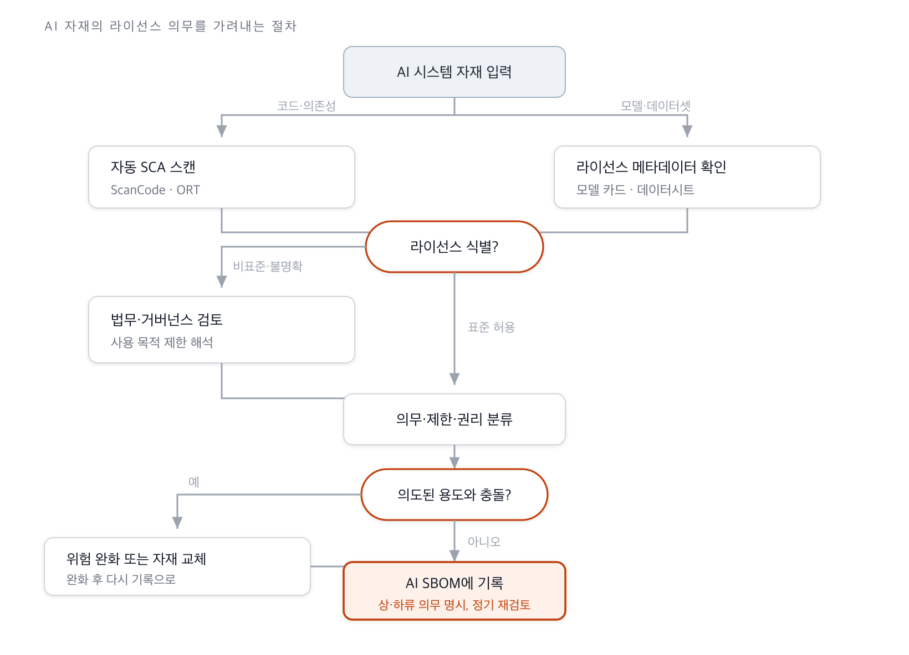

{}
This clause is built during **Phase 2 — AI Extension Processes**.
[View the full implementation roadmap](../../#phased-implementation-roadmap)
{}

## 1. Clause Overview

License obligations are where the AI SBOM Guide expands most on ISO/IEC 5230. Where traditional
open source compliance reviewed the licenses of code, AI expands the review to four fronts: an AI
system's code, model weights, datasets (including training, testing, and validation datasets),
and the license of the AI system itself. It is common for a model to be derived from several
other models, so each parent model sitting in the Model Tree can carry its own distinct license.

3.5 requires a procedure for reviewing these licenses to determine, in light of the AI system's
intended use, the obligations, restrictions, and rights each license grants. The review covers
both obligations inherited from upstream and obligations passed downstream.

## 2. Activities to Perform

- Establish a procedure for identifying the licenses of code, weights, datasets, and the AI
  system itself.
- Track the license of each parent model in the model tree, and document the obligations,
  restrictions, and rights of each license.
- Perform an initial identification pass on source code and dependencies with automated scanning
  tools. *([Guide Recommendation])*
- Route model weights, datasets, and non-standard licenses to legal or governance review.
  *([Guide Recommendation])*
- Set up an intake procedure that requires license metadata to accompany any model or dataset
  brought in from outside. *([Guide Recommendation])*
- Record the review results (obligations, restrictions, rights) in the AI SBOM for tracking.

## 3. Requirement and Verification Material

| Clause | Requirement | Verification Material |
|-----------|--------------|---------|
| 3.5 | A procedure shall exist for reviewing the licenses of an AI system's code, weights, datasets, and the AI system itself to determine, taking the intended use into account, the obligations, restrictions, and rights each license grants. Note that parent models in the model tree may each carry their own distinct license. | **3.5.1** A documented procedure for properly reviewing and documenting the upstream and downstream obligations, restrictions, and rights granted by each identified license |

<details><summary>View original English text</summary>

> **3.5 License obligations**
> A process shall exist for reviewing the relevant identified licenses for an AI system's code,
> weights, and datasets (including but not limited to training, testing, and verification datasets)
> as well as the license for the AI system itself to determine the obligations, restrictions, and
> rights granted by each license, taking into account the intended use of the AI system. Note that
> it's often the case that an AI system is trained on multiple other AI systems that may be
> identified in the AI system Model Tree for example; each of these may have their own licenses.
>
> **Verification material(s):**
> - A documented procedure to review and document upstream and downstream obligations,
>   restrictions, and rights granted by each identified license, as appropriate.

</details>

## 4. How to Comply with Each Verification Material, with Samples

### 3.5.1 License Obligation Review and Documentation Procedure

**How to Comply**

Design the review procedure around the premise that the level of automation differs by material
type. Source code and dependency licenses can be identified to a large degree with automated
scanning tools such as FOSSology, ScanCode, and the OSS Review Toolkit. But the licensing of
model weights and datasets, and the derivation relationships in the model tree, fall outside the
reach of these tools or are identified with low accuracy. The usage-purpose restrictions of
non-standard licenses require human interpretation. A realistic division of labor is therefore to
do an initial identification pass with automated scanning, and route models, datasets, and
non-standard licenses to legal or governance review.

The figure below shows the decision flow for determining license obligations as materials come
in.



**Figure 1.** Decision flow for license obligation review

**Considerations**

- **Enforce metadata at the intake gate**: The largest cause of missed license obligations is
  license drift — the loss of provenance and license information as a model propagates
  downstream. One study reports that a substantial share of restriction clauses disappear in the
  transition from model to application ([arXiv:2509.09873](https://arxiv.org/abs/2509.09873)).
  Rather than trying to reconstruct this downstream, it is more effective to block the intake of
  materials lacking license metadata at the internal model/dataset registry.
  *([Guide Recommendation])*
- **Decide non-standard licenses through policy in advance**: The behavioral use restrictions of
  the Llama Community License or the OpenRAIL family are hard to track automatically for
  compliance after the fact. Decide them at intake time using the allowed/prohibited lists in
  [3.1 Policy](../../1-program-foundation/1-policy/). *([Guide Recommendation])*
- **Trace the model tree**: Check the model card to see which parent model an incoming model was
  derived from, and review whether the parent model's license obligations propagate downstream.
- **Check dataset usage restrictions**: Check whether a non-commercial-licensed dataset such as
  CC-BY-NC was used to train a commercial product. Dataset license omissions and misstatements
  are common, so cross-check against the original text.
- **Recognize the limits of automation**: Do not treat automated scan results as the final
  judgment. Tools help with identification; people handle the interpretation of obligations and
  conflict determination.

**Sample**

Below is a sample of the core part of a license obligation review procedure document. This
procedure document becomes verification material 3.5.1.

```
## AI License Obligation Review Procedure

### 1. Scope of Review
- AI system code and dependencies
- Model weights (imported models, fine-tuned models)
- Datasets (training, testing, validation)
- Licenses of parent models in the model tree

### 2. Review Steps
1) Automated identification: scan code and dependencies for licenses using an SCA tool.
2) Metadata collection: collect licenses for models and datasets from model cards and
   datasheets. Hold intake if metadata is missing.
3) Classification: check identified licenses against the policy's allowed/conditional/
   prohibited lists.
4) Legal review: route non-standard or unclear licenses to legal/governance review to
   interpret the obligations.
5) Recording: record upstream and downstream obligations, restrictions, and rights in
   the AI SBOM.

### 3. Responsibility and Frequency
- Initial identification: development staff
- Interpreting obligations: legal / AI governance lead
- Re-review: when a model or dataset is replaced, and at least once a quarter
```

## 5. References

- Policy for allowed/prohibited license lists: [3.1 Policy](../../1-program-foundation/1-policy/)
- AI SBOM for recording review results: [3.9 AI SBOM](../3-ai-sbom/)
- Automated scanning tools: [Tools — FOSSology](https://openchain-project.github.io/OpenChain-KWG/guide/tools/1-fossology/), [SCANOSS](https://openchain-project.github.io/OpenChain-KWG/guide/tools/9-scanoss/)
- AI model/dataset licensing strategy: [Enterprise Open Source Management Guide — AI Compliance](https://openchain-project.github.io/OpenChain-KWG/guide/opensource_for_enterprise/7-ai-compliance/)
