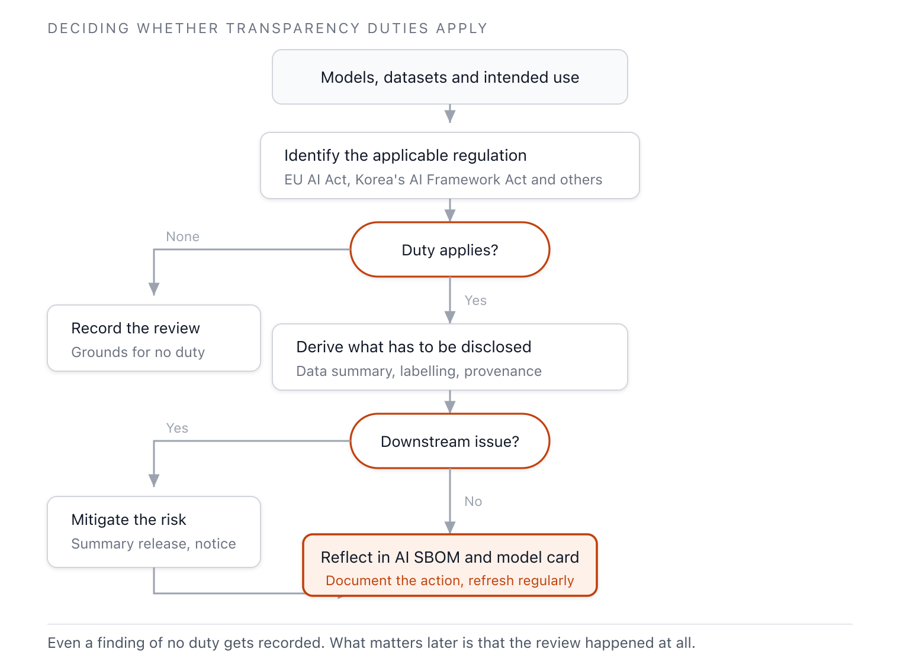

{}
This clause is established during **Phase 2 — AI Extension Process**.
[View the full implementation roadmap](../../#phased-implementation-roadmap)
{}

## 1. Clause Overview

If license obligations (3.5) ask "do we have the right to use this material," transparency
obligations ask "what must we disclose about this material." The two obligations come from
different sources. License obligations are imposed by the rights holder through a contract;
transparency obligations are imposed by regulation through law.

3.6 requires having a procedure to review whether there are transparency obligations imposed by
regulation. The scope of review includes training, testing, and verification datasets, taking into
account the model's intended use. If the use case for the training data creates a transparency
issue (e.g., a disclosure obligation to downstream recipients), appropriate risk mitigation measures
must be taken. As the EU Artificial Intelligence Act begins full enforcement of transparency
obligations from August 2026, the practical weight of this clause is growing.

## 2. Required Activities

- Maintain a procedure to identify the transparency regulations that apply to AI systems being
  adopted or developed.
- Review whether training, testing, and verification datasets carry disclosure obligations, based
  on their intended use.
- Determine risk mitigation measures where a disclosure obligation to downstream recipients exists.
- Document the transparency measures taken.
- Regularly update and reflect the latest transparency obligations set by regulators. *([Recommendation of this guide])*

## 3. Requirements and Verification Material

| Clause | Requirement (EN) | Verification Material |
|-----------|--------------|---------|
| 3.6 | A process shall exist for reviewing if there are any transparency obligations from regulations including but not limited to training, testing, and verification datasets, taking into account the intended use of the model. If the use case for the training data creates a relevant issue (e.g., disclosure obligations to downstream recipients) in the context of transparency, then appropriate risk mitigation measures should be undertaken. | **3.6.1** A documented procedure to review and document the transparency measures undertaken |

<details><summary>View original English text</summary>

> **3.6 Transparency obligations**
> A process shall exist for reviewing if there are any transparency obligations from regulations
> including but not limited to training, testing, and verification datasets, taking into account the
> intended use of the model. If the use case for the training data creates a relevant issue (e.g.,
> disclosure obligations to downstream recipients) in the context of transparency, then appropriate
> risk mitigation measures should be undertaken.
>
> **Verification material(s):**
> - A documented procedure to review and document the transparency measures undertaken.

</details>

## 4. Compliance Methods and Samples by Verification Material

### 3.6.1 Procedure to review and document transparency obligations

**Compliance Method**

Transparency obligations differ by regulation, so first identify which regulations apply. Once the
applicable regulations are determined, derive the disclosure items each one requires and reflect
those items in the AI SBOM or model card. Unlike license obligations, transparency obligations
center on "disclosure," so the output must be organized in a form that can be delivered externally.

The table below lists the main transparency obligations that intersect with the AI SBOM. The
regulatory timeline and broader context are managed together in the regulatory matrix in
[3.10 Governance](../../4-governance/1-governance/).

**Table 1.** Transparency obligations that intersect with the AI SBOM (as of June 2026)

| Source | Transparency Obligation | Reflected in AI SBOM / Model Card |
|---|---|---|
| EU Artificial Intelligence Act Article 53 (GPAI) | Public summary of training data, honoring copyright opt-outs | Dataset provenance and license, opt-out handling records |
| EU Artificial Intelligence Act Article 50 | Labeling AI-generated content, notice of AI interaction | Output labeling policy |
| Korea's AI Basic Act | Labeling obligation for high-impact and generative AI, disclosure of training data provenance | Model card labeling and provenance fields |
| License-derived notices | Notices such as "Built with Llama," naming of derivative models | Tracked together with license obligations (3.5) |

The figure below shows the review flow that derives transparency obligations from a material's
intended use.



**Figure 1.** Transparency obligation review flow

**Considerations**

- **Dataset provenance is central**: Most transparency obligations attach to training data. A
  dataset's provenance and license must be recorded in the AI SBOM to fulfill disclosure
  obligations. This connects directly to the AI SBOM (3.9).
- **Intended use is the criterion**: The same model can carry different transparency obligations
  depending on the use case. High-risk uses or services aimed at the general public carry heavier
  obligations.
- **Downstream disclosure obligations**: When supplying a model or system externally, review what
  information the recipient must be told. Risk mitigation can be fulfilled through a public summary
  of training data or contractual notice.
- **Reflect regulatory change**: Since the EU Artificial Intelligence Act applies transparency
  obligations from August 2026, update the procedure to match the timeline. Responsibility for the
  update is managed by governance (3.10).

**Sample (Transparency Obligation Review Procedure)**

Below is a sample of the core part of a transparency obligation review procedure document. This
procedure document becomes verification material 3.6.1.

```
## Transparency Obligation Review Procedure

### 1. Identify Applicable Regulations
Identify applicable regulations based on the AI system's intended use and deployment
region.
(e.g., EU market deployment → EU Artificial Intelligence Act; domestic high-impact AI →
Korea's AI Basic Act)

### 2. Derive Disclosure Items
Organize each regulation's transparency obligations into disclosure items.
- Training data summary (EU Artificial Intelligence Act Article 53)
- AI-generated / interaction labeling (EU Artificial Intelligence Act Article 50, Korea's
  AI Basic Act)
- Data provenance disclosure (Korea's AI Basic Act)

### 3. Downstream Review
Review the information to be conveyed to recipients on external supply, and determine the
necessary risk mitigation measures.

### 4. Reflection and Documentation
Reflect the derived disclosure items in the AI SBOM and model card, and record the
measures taken.

### 5. Responsibility and Cycle
- Review: Legal and AI governance lead
- Update: On changes to regulatory enforcement timelines, and at least semiannually
```

## 5. See Also

- Distinction from license obligations: [3.5 License Obligations](../1-license-obligations/)
- AI SBOM to hold disclosure items: [3.9 AI SBOM](../3-ai-sbom/)
- Regulatory timeline and governance: [3.10 Governance](../../4-governance/1-governance/)
- AI model licenses and labeling obligations: [Enterprise Open Source Management Guide — AI Compliance](https://openchain-project.github.io/OpenChain-KWG/guide/opensource_for_enterprise/7-ai-compliance/)
