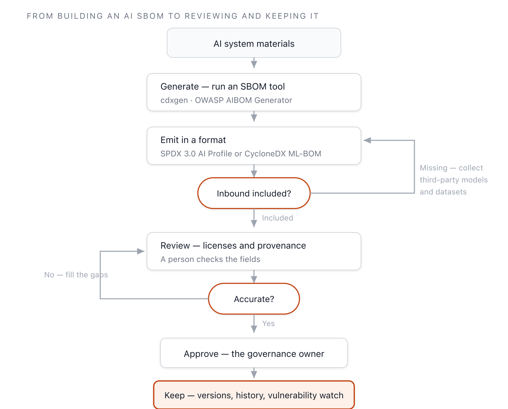

{}
This clause is built during **Phase 2 — AI Extension Processes**.
[View the full implementation roadmap](../../#phased-implementation-roadmap)
{}

## 1. Clause Overview

An AI SBOM (AI System Bill of Materials) is a list capturing the elements that make up an AI
system and the information about them. Where a traditional SBOM records software components, an
AI SBOM adds models, weights, datasets, and hyperparameters on top. 3.9 requires a procedure for
generating and managing the AI SBOM.

The format is left open. The specification states that SPDX, CycloneDX, or any other format is
acceptable. There is, however, one obligation: the AI SBOM shall account for inbound materials
from third parties. If pre-trained models and datasets brought in from outside are left out, the
basis for tracking license obligations ([3.5](../1-license-obligations/)) and transparency
obligations disappears.

The AI SBOM area is where the line "generation is automated by tools, but accuracy and compliance
judgment are filled by people" is sharpest. This page walks through the procedure along that
line.

## 2. Activities to Perform

- Establish a procedure for identifying, tracking, reviewing, approving, and archiving the
  components of an AI system (models, datasets, etc.).
- Decide on an AI SBOM format (SPDX 3.0 AI Profile or CycloneDX ML-BOM recommended).
  *([Guide Recommendation])*
- Ensure models and datasets brought in from third parties are always included in the AI SBOM.
- Wire a generation tool into CI/CD to regenerate the AI SBOM repeatedly. *([Guide Recommendation])*
- Have a person review whether the license and provenance fields of the generated AI SBOM are
  accurate. *([Guide Recommendation])*
- Retain records (generation history, approval history) demonstrating that the procedure was
  followed.

## 3. Requirement and Verification Material

| Clause | Requirement | Verification Material |
|-----------|--------------|---------|
| 3.9 | A procedure shall exist for generating and managing an AI SBOM. Any format — SPDX, CycloneDX, or another — is acceptable. The AI SBOM shall account for inbound materials from third parties. | **3.9.1** A documented procedure for identifying, tracking, reviewing, approving, and archiving information about the components of an AI system (models, datasets, etc.)<br>**3.9.2** Records demonstrating the procedure was properly followed for the supplied system |

<details><summary>View original English text</summary>

> **3.9 AI System Bill of Materials**
> A process shall exist for creating and managing an AI SBOM, this can be in any format e.g. SPDX,
> CycloneDX, or another format. The AI SBOM shall account for inbound materials from third-parties.
>
> **Verification material(s):**
> - A documented procedure for identifying, tracking, reviewing, approving, and archiving
>   information related to the components of an AI system (e.g., model, datasets, etc).
> - Records for the supplied system that demonstrates the documented procedure was properly followed.

</details>

## 4. How to Comply with Each Verification Material, with Samples

### 3.9.1 AI SBOM Management Procedure (Identification, Tracking, Review, Approval, Archiving)

**How to Comply**

Design the AI SBOM procedure around four stages: generation, review, approval, and archiving.
Automate the generation stage with tools, and leave the review and approval stages to people.
Even when a tool copies a license field straight from a model card, it cannot judge whether that
license actually fits the use case, or whether something is missing or misstated.

The figure below shows the flow from AI SBOM generation to archiving.



**Figure 1.** Procedure from AI SBOM generation to archiving

**Tool Mapping**

Below are open source tools usable at each stage. "Automation level" indicates how far a tool
handles that task on its own.

| Stage | Task | Automation Level | Representative Tool |
|------|------|------------|-----------|
| Generation | Code/dependency BOM | Mature | cdxgen, Syft |
| Generation | Model/metadata AIBOM | Tools emerging | OWASP AIBOM Generator, cdxgen `aibom` |
| Analysis | Static inspection of model binaries | Tools emerging | Lab700x AI SBOM Scanner |
| Management | SBOM storage, vulnerability monitoring | Mature | Dependency-Track, SW360 |
| Review | License/provenance accuracy judgment | People/policy | Tool support still developing |

Installation, usage, and execution screens for each tool are covered in detail in the
[Tools](../../5-tools/) section ([OWASP AIBOM
Generator](../../5-tools/1-aibom-generator/), [cdxgen](../../5-tools/2-cdxgen/),
[Model/Container Scanners](../../5-tools/3-scanners/)).

The command to generate an AI BOM with cdxgen is as follows. You can pass a Hugging Face model
URL and purl, a Modelfile, or a GGUF artifact directly ([cdxgen AI-BOM
docs](https://github.com/cdxgen/cdxgen/blob/master/docs/AI_BOM.md)).

```bash
# Generate an AI BOM from the AI project directory
cdxgen -t ai -o aibom.json .

# Generate including AI/ML metadata (formulation)
cdxgen -t ai --include-formulation -o aibom.json .
```

The OWASP AIBOM Generator takes a Hugging Face model as input, builds a CycloneDX-format AIBOM,
and scores its completeness. It is maintained by the OWASP Gen AI Security Project and is also
available as a Hugging Face Space ([OWASP AIBOM
Generator](https://genai.owasp.org/resource/owasp-aibom-generator/)).

**Hands-On — Generating with cdxgen**

This is the result of actually running cdxgen against a summarization app (depending on
`transformers` and `torch`) that loads a pre-trained model (`facebook/bart-large-cnn`). The tool
automatically identifies 5 dependencies and produces a CycloneDX 1.7-format BOM.

```text
$ cdxgen -t python --include-formulation -o aibom.json .
CycloneDX Generator 12.5.1 (Node.js)

Generated components — 5 items (CycloneDX 1.7):
  transformers     4.44.2    pkg:pypi/transformers@4.44.2      license: empty
  torch            2.4.0     pkg:pypi/torch@2.4.0             license: empty
  numpy            1.26.4    pkg:pypi/numpy@1.26.4            license: empty
  tokenizers       0.19.1    pkg:pypi/tokenizers@0.19.1       license: empty
  huggingface-hub  0.24.6    pkg:pypi/huggingface-hub@0.24.6   license: empty
```

One component from the generated BOM looks like this. The identification evidence is filled in,
but the `licenses` field is empty.

```json
{
  "name": "transformers",
  "version": "4.44.2",
  "purl": "pkg:pypi/transformers@4.44.2",
  "type": "library",
  "evidence": {
    "identity": [
      { "field": "purl", "confidence": 0.5,
        "methods": [{ "technique": "manifest-analysis", "value": "requirements.txt" }] }
    ]
  }
}
```

**Figure 2.** cdxgen 12.5.1 execution output *(run on 2026-06-13, `-t python --include-formulation`)*

{}
- The tool automatically identified 5 dependencies from `requirements.txt` and built a BOM.
  Generation is automated.
- But the `licenses` field of every component is empty. License accuracy has to be checked and
  filled in by a person.
- The pre-trained model `facebook/bart-large-cnn` the app loads was not captured in the BOM by
  code scanning alone. It has to be collected separately as an inbound material and added (see
  Considerations below).

The boundary this clause states — "generation by tool, accuracy and completeness by people" —
shows up directly in the actual tool output here.
{}

**Format Sample (CycloneDX ML-BOM)**

Below is a shortened example of the model component structure in a CycloneDX 1.6 ML-BOM. The key
structure follows the `machine-learning-model` component and `modelCard` in the [official
CycloneDX spec](https://cyclonedx.org/capabilities/mlbom/). If the license is non-standard (has
no SPDX ID), state it with `name`.

```json
{
  "bomFormat": "CycloneDX",
  "specVersion": "1.6",
  "components": [
    {
      "bom-ref": "model-llama31-8b",
      "type": "machine-learning-model",
      "group": "meta-llama",
      "name": "Llama-3.1-8B",
      "version": "1.0",
      "licenses": [
        { "license": { "name": "Llama 3.1 Community License" } }
      ],
      "modelCard": {
        "modelParameters": {
          "task": "text-generation",
          "architectureFamily": "llama",
          "datasets": [
            { "type": "dataset", "name": "Public pretraining corpus", "classification": "public" }
          ]
        },
        "considerations": {
          "useCases": ["Internal document summarization"],
          "technicalLimitations": ["Potential for hallucination", "Performance variance in Korean"]
        }
      }
    }
  ]
}
```

If you use SPDX 3.0, the AI Profile and Dataset Profile express the same information ([SPDX 3.0 AI
Profile](https://spdx.github.io/spdx-spec/v3.0.1/model/AI/AI/)). The concrete fields of each
format and the technical details of generation tools are covered in the [ISO/IEC 42001 Guide — AI
SBOM](https://openchain-project.github.io/OpenChain-KWG/guide/iso42001_guide/4-operation/2-ai-sbom/).

**Considerations**

- **Reflect inbound materials (specification obligation)**: Set up a procedure that generates an
  SBOM entry at intake time so that models and datasets brought in from outside are never missing
  from the AI SBOM. This is a `shall`-level obligation.
- **Generation by tool, review by people**: Generation tools copy the license written on the
  model card as-is. Because model cards themselves commonly have missing or incorrect license
  information, have a person check the license and provenance fields of the generated AI SBOM
  against the original source.
- **Format consistency**: Pick either SPDX or CycloneDX as the organization's default format and
  operate tools and repositories around it consistently. Both formats treat models and datasets
  as first-class components.
- **CI/CD integration**: The AI SBOM is not a one-time deliverable. Wire it into the pipeline so
  it is regenerated whenever a model or dataset changes.

### 3.9.2 Records Demonstrating Procedure Compliance

**How to Comply**

Verification material 3.9.2 is the record showing the procedure was actually followed. Alongside
the AI SBOM file itself, keep a history of who generated, reviewed, and approved it and when. If
it is generated automatically in CI/CD, the build logs and the generated SBOM artifact become the
record, and the upload history to a management tool such as Dependency-Track also serves as
evidence.

**Considerations**

- **Retain generation history**: Keep the AI SBOM from each point in time for every version of
  the supplied AI system to maintain traceability.
- **Approval record**: Record who reviewed and approved it. This connects to the lifecycle review
  in [Governance (3.10)](../../4-governance/1-governance/).

## 5. References

- License obligation review procedure: [3.5 License Obligations](../1-license-obligations/)
- Technical details of AI SBOM formats and generation tools: [ISO/IEC 42001 Guide — AI SBOM](https://openchain-project.github.io/OpenChain-KWG/guide/iso42001_guide/4-operation/2-ai-sbom/)
- SBOM management tools: [Dependency-Track](https://openchain-project.github.io/OpenChain-KWG/guide/tools/7-dependency-track/), [cdxgen + Dependency-Track integration](https://openchain-project.github.io/OpenChain-KWG/guide/tools/8-cdxgen-dt/)
- Governance and lifecycle review: [3.10 Governance](../../4-governance/1-governance/)
