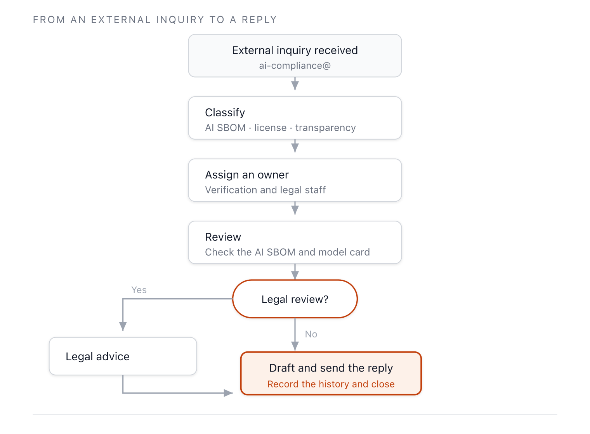

{}
This clause is established during **Phase 3 — Operations**.
[View the full implementation roadmap](../../#phased-implementation-roadmap)
{}

## 1. Clause Overview

Organizations that exchange AI systems in the supply chain need to verify each other's compliance.
That requires a publicly available channel for external inquiries, and readiness on the
organization's side to respond to them. Access secures both directions.

3.7 requires two things: publicly identifying a means by which a third party can make an AI SBOM
compliance inquiry, and maintaining an internal procedure to respond effectively to that inquiry.
In AI, AI-specific information — model and dataset licenses, training data provenance, model cards —
is added to the subject matter of such inquiries.

## 2. Required Activities

- Publicly identify a means (e.g., a public email address) by which a third party can make an AI
  SBOM compliance inquiry.
- Post the public means somewhere externally discoverable, such as a product notice or website.
- Document the internal procedure for receiving, classifying, and responding to external inquiries.
- Define the responsible party and the response deadline.
- Record the history of inquiries and responses.

## 3. Requirements and Verification Material

| Clause | Requirement (EN) | Verification Material |
|-----------|--------------|---------|
| 3.7 | Maintain a process to effectively respond to external AI SBOM Compliance inquiries. Publicly identify a means by which a third party can make an AI SBOM Compliance inquiry. | **3.7.1** Publicly visible method that allows any interested parties to make an AI SBOM Compliance inquiry (e.g., via a published contact email address)<br>**3.7.2** An internal documented procedure for responding to third-party AI SBOM Compliance inquiries |

<details><summary>View original English text</summary>

> **3.7 Access**
> Maintain a process to effectively respond to external AI SBOM Compliance inquiries. Publicly
> identify a means by which a third party can make an AI SBOM Compliance inquiry.
>
> **Verification material(s):**
> - Publicly visible method that allows any interested parties to make an AI SBOM Compliance inquiry
>   (e.g., via a published contact email address).
> - An internal documented procedure for responding to third-party AI SBOM Compliance inquiries.

</details>

## 4. Compliance Methods and Samples by Verification Material

### 3.7.1 Publicly identified means of external inquiry

**Compliance Method**

Identify a public contact means that anyone can find. A role-based email address (a job function
address, not an individual) is stable. Post it in locations such as the product notice, the open
source/AI policy page on the company website, or the contact field of the model card. Stating a
response deadline alongside it builds trust.

**Sample**

```
AI Compliance Inquiries: ai-compliance@company.com

We accept inquiries regarding the components of the AI systems we provide, model and
dataset licenses, and AI SBOMs. We send an initial reply within 14 business days of
receipt.

(Posted at: product notice, company website AI policy page, model card contact field)
```

---

### 3.7.2 Internal inquiry response procedure

**Compliance Method**

Document the internal procedure from receiving an external inquiry to answering it. Define the
stages of intake, classification, assignment, review, reply, and recording, with a deadline for
each stage. Because AI SBOM inquiries need to reference model cards or license review records, the
AI SBOM verification lead and the license review lead respond together.

The figure below shows the external inquiry response flow.



**Figure 1.** External AI SBOM compliance inquiry response flow

**Considerations**

- **Set deadlines**: Define both an initial reply deadline (e.g., 14 days) and a final answer
  deadline (e.g., 60 days).
- **Protect AI-specific information**: Set a standard for how far to disclose sensitive information
  such as model weights or training data when answering inquiries. Define the boundary between
  trade secrets and transparency obligations (3.6). *([Recommendation of this guide])*
- **Retain history**: Record the inquiry content, the reply, and the processing time as verification
  material.

**Sample (Response Procedure Outline)**

```
## AI SBOM Compliance Inquiry Response Procedure

1. Intake: Register inquiries received at ai-compliance@.
2. Classification: Classify as AI SBOM request / license inquiry / transparency
   obligation inquiry.
3. Assignment: Assign to the AI SBOM verification lead or the license review lead based
   on classification.
4. Review and Reply: Reply after checking the relevant AI SBOM and model card. Follow the
   disclosure standard for sensitive information. Involve legal review if needed.
5. Record: Retain the inquiry, reply, and processing time.

Deadlines: 14 days for the initial reply, 60 days for the final answer.
```

## 5. See Also

- Role and resources of the response lead: [3.8 Effective Resource Allocation](../2-resourced/)
- AI SBOM used in replies: [3.9 AI SBOM](../../2-ai-extension/3-ai-sbom/)
- Disclosure scope and transparency obligations: [3.6 Transparency Obligations](../../2-ai-extension/2-transparency-obligations/)
- ISO/IEC 5230 external inquiry example: [ISO/IEC 5230 Compliance Guide — 3.2.1 Responding to External Inquiries](https://openchain-project.github.io/OpenChain-KWG/guide/iso5230_guide/2-relevant-tasks/1-access/)
