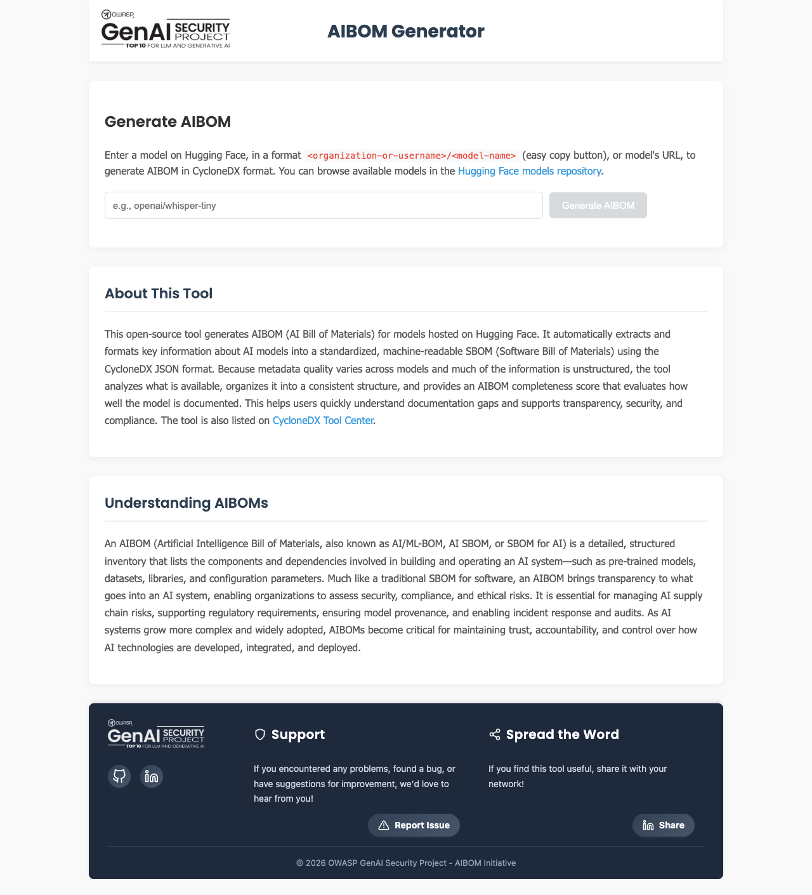
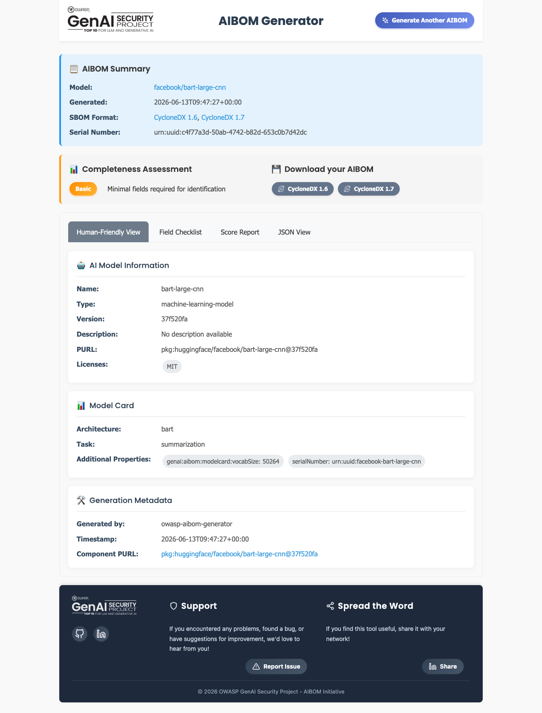

## Overview

OWASP AIBOM Generator is an open source tool that takes a Hugging Face model ID as input, fetches
model card metadata, and generates an AI SBOM in CycloneDX format. It is maintained by the OWASP
Gen AI Security Project, and its distinguishing feature is scoring how complete the generated BOM is.

Where cdxgen identifies dependencies quickly but leaves the license fields empty, this tool fills in
the license, author, and external references recorded in the model card. It works well as a
starting point for the license review required by
[3.5 License Obligations](../../2-ai-extension/1-license-obligations/).

## Key Features

- Fetches metadata from Hugging Face models and generates an AIBOM in both CycloneDX 1.6 and 1.7
  format.
- Evaluates the completeness of the generated BOM with a score (0–100) and a profile, broken down
  section by section.
- Displays model information, the model card, license, and external references in a human-readable
  view.
- Available both as a web UI and a command-line interface (CLI).

## Usage A — Web UI

The simplest approach: just enter a model ID in the browser. Use the Hugging Face Space provided by
the OWASP Gen AI Security Project, or clone the repository and run it locally.

First, enter a Hugging Face model ID (e.g., `facebook/bart-large-cnn`) on the input screen and click
generate.



**Figure 1.** OWASP AIBOM Generator input screen *(GenAI Security Project, captured 2026-06-13)*

Once generation finishes, the result screen shows an AIBOM summary, the completeness assessment,
download buttons (CycloneDX 1.6 and 1.7), AI model information, and the model card. The completeness
assessment at the top of the screen shows at a glance whether the BOM has the minimum fields needed
for identification.



**Figure 2.** Generation result screen — model information, license (MIT), completeness assessment
(Basic) *(captured 2026-06-13)*

The result screen offers a Human-Friendly View along with a field checklist, a score report, and a
JSON view tab. Check the items needed for license obligation review and AI SBOM retention directly
on screen, and download the CycloneDX file.

## Usage B — Command Line (CLI)

The CLI is convenient for embedding in CI/CD or batch-processing multiple models. After
installation, pass the model ID as an argument.

```bash
# Install (a Python virtual environment is recommended)
pip install "git+https://github.com/GenAI-Security-Project/aibom-generator"

# Generate an AIBOM from a model ID
aibom facebook/bart-large-cnn -o aibom.json
```

Below is the actual execution result. It generates CycloneDX 1.6 and 1.7, passes schema
validation, and shows the completeness score broken down by section.

```text
$ aibom facebook/bart-large-cnn -o aibom.json

✅ Successfully generated CycloneDX 1.6 SBOM — Schema Validation (1.6): Valid
✅ Successfully generated CycloneDX 1.7 SBOM — Schema Validation (1.7): Valid

📊 Completeness Score: 58.7/100   Profile: Basic
   - Required Fields:        20/20
   - Metadata:                8/20
   - Component Basic:        17.1/20
   - Component Model Card:    6.7/30
   - External References:    10/10
```

**Figure 3.** CLI execution output *(aibom CLI, model facebook/bart-large-cnn, run 2026-06-13)*

The model component in the generated BOM has its license and model card filled in. Unlike cdxgen's
output, the `licenses` field is not empty.

```json
{
  "type": "machine-learning-model",
  "name": "bart-large-cnn",
  "purl": "pkg:huggingface/facebook/bart-large-cnn",
  "licenses": [{ "license": { "id": "MIT" } }],
  "authors": [{ "name": "facebook" }],
  "modelCard": { "modelParameters": { }, "considerations": { } }
}
```

## What the Execution Result Shows

{}
In the actual run, the completeness score was 58.7/100 (Basic). Required Fields and External
References scored full marks, but the model card score was low at 6.7/30. This is not a limitation
of the tool but a result of the model provider not filling in enough information in the Hugging
Face model card. The tool faithfully fetches whatever metadata exists, but it cannot invent
information that isn't there. When the model card is sparse, a human must verify the source and
supplement it.
{}

## See Also

- AI SBOM generation and management procedure: [3.9 AI SBOM](../../2-ai-extension/3-ai-sbom/)
- License obligation review: [3.5 License Obligations](../../2-ai-extension/1-license-obligations/)
- Another generation tool: [cdxgen](../2-cdxgen/)
- Official: [OWASP AIBOM Generator](https://genai.owasp.org/resource/owasp-aibom-generator/)
