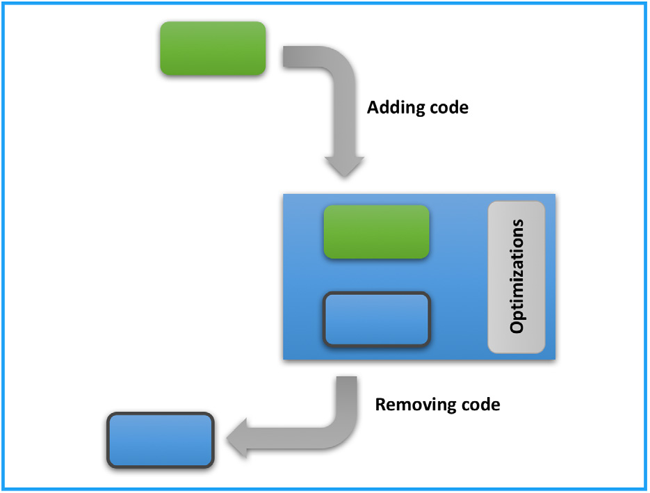

Before diving into the open source due diligence process, it helps to understand the various paths through which open source software enters the target company's development process. This applies whether the company put open source software into its codebase knowingly or unknowingly. As with a traffic ticket, not knowing about an obligation is no excuse. It is therefore wise to understand the various ways in which software from multiple sources is used. The most common usage scenarios for open source software are incorporation, linking, and modification.

Modifying an open source component, or injecting open source code into a proprietary or third-party component, can affect how an audit service provider detects and reports that code. When working with an open source audit provider, it often helps to understand how their detection methods capture open source code.

## 2.1 Incorporation

A developer may use a complete open source component, or copy a portion of a component (sometimes called a snippet) into their software product. This situation can be permissible, and depending on the license of the incorporated open source code and the license of the software component it is copied into, there may be no license risk at all. In other cases, however, incorporation causes problems when the license of the copied open source code is incompatible with the license of the proprietary codebase (Figure 1).

Open source licenses carry various obligations that can affect a company's legal liability and the proprietary nature of its own code. All incorporation therefore needs to be tracked, disclosed, and approved internally, following the same process used to track and approve third-party licensed software.

**Figure 1.** Incorporation: putting open source code (green) inside a different body of code (blue) *(source: Linux Foundation, 2018)*

Source code audits are designed to find open source that has been incorporated into a codebase without being disclosed, to prevent unpleasant surprises after an acquisition. Undisclosed incorporation becomes more likely when the target company has not received sufficient open source compliance training, or has relied on outsourced staff or interns who leave no long-term records.

Incorporation scenarios often go unnoticed when a person looks through the source code directly, but a source code scanning tool with the ability to find and match snippets can readily surface them.

## 2.2 Linking

Linking is a common scenario that arises, for example, when using an open source library. In this scenario, a developer links an open source software component with their own software component (Figure 2). Various terms refer to this scenario: static/dynamic linking, combining, packaging, and creating interdependencies. Libraries are usually included at the top of a file, and linked code tends to reside in a separately named directory or file, which makes linking relatively easy to detect when scanning source code visually.

**Figure 2.** Linking: connecting open source code (green) to a different body of code (blue) while keeping them separate *(source: Linux Foundation, 2018)*

Linking differs from incorporation in that the source code is kept separate rather than being copied into a single combined form. The linking interaction occurs when the code is compiled into a single executable binary (static linking), or when the main program runs and calls the linked program (dynamic linking).

## 2.3 Modification

Modification is the scenario in which a developer changes an open source software component (Figure 3). The following actions fall into this category.

- Adding or injecting new code into an open source software component.
- Modifying, optimizing, or changing an open source software component.
- Deleting or removing code.

**Figure 3.** Modification: a developer adding, changing, or deleting code in open source code (green) *(source: Linux Foundation, 2018)*

## 2.4 A Note on Development Tools

It is important to know that some development tools can perform some of these actions without the user noticing. For example, a developer may use a tool that automates a specific part of the development process. Examples include graphics frameworks that provide user interface templates, game development platforms that provide physics engines, and software development kits (SDKs) that provide cloud service connectors. To deliver these services, a tool usually injects part of its own code into the developer's output when the code is built. The license of code injected by a development tool in this way must always be verified, especially because the resulting output is often statically linked.
