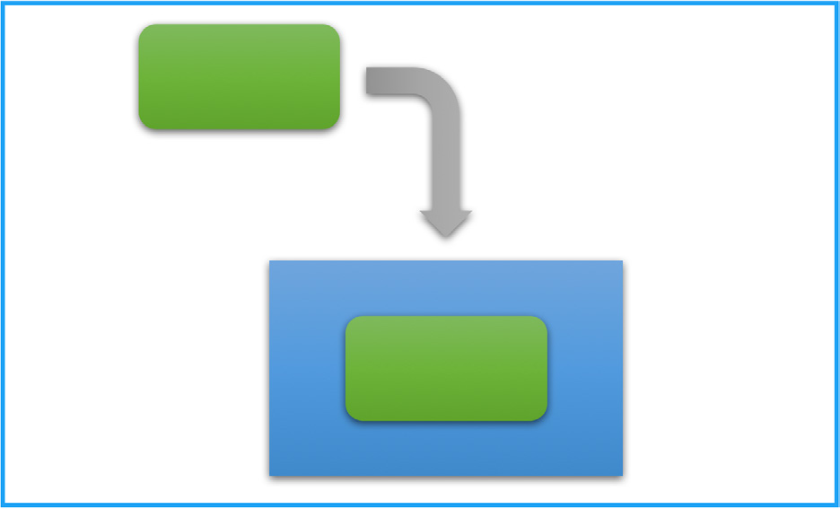
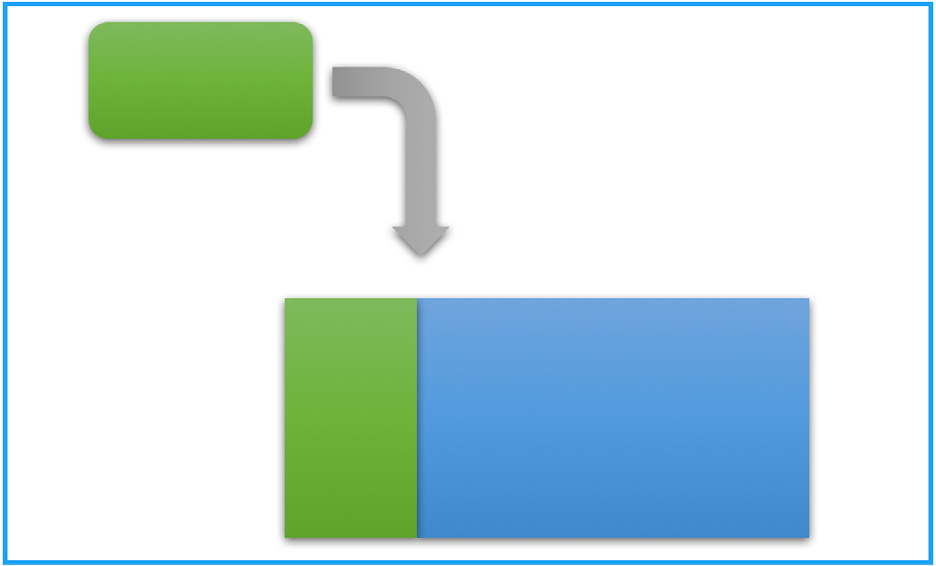
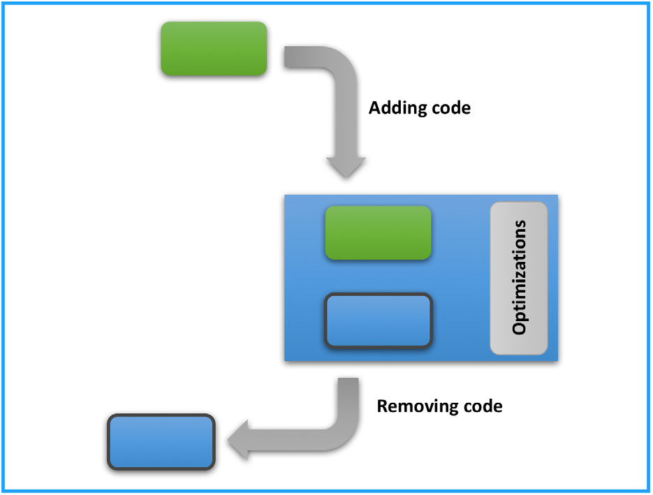

오픈소스 실사(due diligence) 프로세스를 본격적으로 다루기 전에, 오픈소스 소프트웨어가 인수 대상 기업의 개발 과정에 들어오는 다양한 경로를 이해하는 것이 도움이 됩니다. 이는 기업이 자사 코드베이스에 오픈소스 소프트웨어를 알고서 넣었든 모르고 넣었든 모두 해당됩니다. 교통 위반 딱지와 마찬가지로, 의무사항을 몰랐다는 사실은 변명이 되지 않습니다. 그러므로 여러 출처에서 온 소프트웨어가 사용되는 다양한 방식을 이해해 두는 것이 현명합니다. 오픈소스 소프트웨어의 가장 흔한 사용 시나리오는 결합(incorporation), 링크(linking), 수정(modification)입니다.

오픈소스 컴포넌트를 변경하거나, 독점 컴포넌트 또는 제3자 컴포넌트에 오픈소스 코드를 주입하면, 감사 서비스 제공업체가 그러한 코드를 발견하고 보고하는 방식에 영향을 줄 수 있습니다. 오픈소스 감사(open source audit) 제공업체와 협업할 때는 그들의 탐지 방식이 오픈소스 코드를 어떻게 포착하는지 이해하면 도움이 되는 경우가 많습니다.

## 2.1 결합 (Incorporation)

개발자는 완전한 오픈소스 컴포넌트를 사용하거나, 컴포넌트의 일부분(스니펫(snippet)이라고 부르기도 합니다)을 복사해 자사 소프트웨어 제품에 넣을 수 있습니다. 이러한 상황은 허용될 수 있으며, 결합된 오픈소스 코드의 라이선스와 그 코드가 복사되어 들어간 소프트웨어 컴포넌트의 라이선스에 따라 라이선스 위험이 없을 수도 있습니다. 그러나 복사한 오픈소스 코드의 라이선스가 독점 코드베이스의 라이선스와 호환되지 않으면, 결합이 문제를 일으키는 경우도 있습니다(그림 1).

오픈소스 라이선스에는 기업의 법적 책임과 자사 코드의 독점적 성격에 영향을 줄 수 있는 다양한 의무사항이 따라옵니다. 따라서 모든 결합은 제3자 라이선스 소프트웨어를 추적하고 승인할 때 사용하는 것과 동일한 프로세스에 따라 사내에서 추적하고, 신고하고, 승인해야 합니다.

**그림 1.** 결합(incorporation): 오픈소스 코드(초록색)를 다른 코드 본체(파란색) 안에 넣는 방식 *(출처: Linux Foundation, 2018)*

소스 코드 감사는 오픈소스가 코드베이스에 신고되지 않은 채 결합된 것을 찾아내, 인수 이후 불쾌한 일이 생기는 것을 막기 위해 설계됩니다. 인수 대상 기업이 오픈소스 컴플라이언스 교육을 충분히 받지 못했거나, 장기 기록을 남기지 않는 외주 인력 또는 인턴에게 의존한 경우, 신고되지 않은 결합이 발생할 가능성이 높아집니다.

결합 시나리오는 사람이 직접 소스 코드를 들여다볼 때는 잘 드러나지 않는 경우가 많지만, 스니펫을 발견하고 대조하는 능력을 갖춘 소스 코드 스캐닝 도구를 쓰면 이러한 결합을 쉽게 찾아낼 수 있습니다.

## 2.2 링크 (Linking)

링크는 예를 들어 오픈소스 라이브러리를 사용할 때 흔히 나타나는 시나리오입니다. 이 시나리오에서 개발자는 오픈소스 소프트웨어 컴포넌트를 자사 소프트웨어 컴포넌트와 링크할 수 있습니다(그림 2). 정적/동적 링크, 결합(combining), 패키징, 상호 의존성 생성 등 이러한 시나리오를 가리키는 용어는 여러 가지입니다. 라이브러리는 보통 파일 첫머리에 포함되고 링크된 코드는 별도로 이름 붙은 디렉터리나 파일에 들어가는 경향이 있어, 소스 코드를 눈으로 훑어볼 때 링크를 탐지하기가 비교적 쉬운 편입니다.

**그림 2.** 링크(linking): 오픈소스 코드(초록색)를 다른 코드 본체(파란색)와 별도로 유지한 채 연결하는 방식 *(출처: Linux Foundation, 2018)*

링크는 소스 코드를 하나의 결합된 형태로 복사하지 않고 별도로 유지하므로 결합과 다릅니다. 링크 상호작용은 코드가 하나의 실행 가능한 바이너리로 컴파일될 때(정적 링크), 또는 메인 프로그램이 실행되어 링크된 프로그램을 호출할 때(동적 링크) 일어납니다.

## 2.3 수정 (Modification)

수정은 개발자가 오픈소스 소프트웨어 컴포넌트를 변경하는 시나리오입니다(그림 3). 다음과 같은 작업이 여기에 해당합니다.

- 오픈소스 소프트웨어 컴포넌트에 새 코드를 추가하거나 주입하기.
- 오픈소스 소프트웨어 컴포넌트를 수정하거나, 최적화하거나, 변경하기.
- 코드를 삭제하거나 제거하기.

**그림 3.** 수정(modification): 개발자가 오픈소스 코드(초록색)에 코드를 추가하거나 변경하거나 삭제하는 방식 *(출처: Linux Foundation, 2018)*

## 2.4 개발 도구에 관한 참고

일부 개발 도구가 이러한 작업 중 일부를 사용자가 눈치채지 못하는 사이에 수행할 수 있다는 점을 알아 두는 것이 중요합니다. 예를 들어 개발자가 개발 과정의 특정 부분을 자동화하는 도구를 사용할 수 있습니다. 사용자 인터페이스 템플릿을 제공하는 그래픽 프레임워크, 물리 엔진을 제공하는 게임 개발 플랫폼, 클라우드 서비스 커넥터를 제공하는 소프트웨어 개발 키트(Software Development Kit, SDK) 등이 그 예입니다. 이러한 서비스를 제공하기 위해 도구는 코드가 빌드될 때 보통 자기 코드의 일부를 개발자의 결과물에 주입합니다. 개발 도구가 이렇게 주입한 코드의 라이선스는 반드시 검증해야 합니다. 그 결과물이 정적으로 링크되는 경우가 많기 때문에 특히 그렇습니다.
