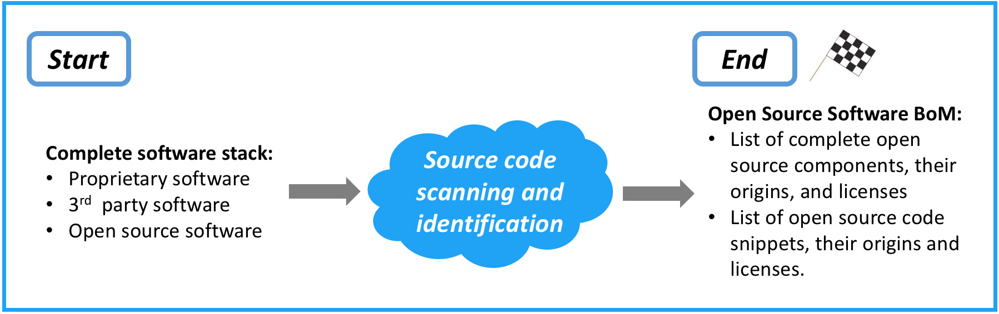

인수합병(M&A) 거래는 저마다 다르지만, 오픈소스 의무사항을 인수했을 때의 영향을 검증할 필요는 어느 거래에서나 변하지 않습니다. 오픈소스 감사(open source audit)는 오픈소스 소프트웨어를 얼마나 깊이 사용하고 의존하는지 파악하기 위해 수행합니다. 또한 컴플라이언스(compliance) 문제에 관한 통찰을 제공하며, 나아가 인수 대상 기업(타깃)의 엔지니어링 관행까지 들여다볼 수 있게 해 줍니다.

## 3.1 오픈소스 감사를 왜 수행할까요?

오픈소스 라이선스는 소프트웨어를 재배포하는 방식에 제약을 부과할 수 있습니다. 이런 제약은 인수 기업의 사업과 양립하지 못할 수 있으므로 일찍 밝혀내야 합니다. 오픈소스 소프트웨어가 인수 자산에 영향을 미치는 사례로는 다음과 같은 것이 있습니다.

- 오픈소스 라이선스는 대개 코드를 배포할 때 이행해야 하는 의무를 부과합니다. 한 예가 GNU 일반 공중 라이선스(GNU General Public License, GNU GPL)로, 파생물이나 결합물도 동일한 라이선스로 제공할 것을 요구합니다. 다른 라이선스는 문서에 특정 고지를 넣을 것을 요구하거나, 제품 홍보 방식에 제약을 두기도 합니다.

- 오픈소스 라이선스 의무를 충족하지 못하면 소송, 비용이 많이 드는 재설계, 제품 리콜, 평판 손상으로 이어질 수 있습니다.

## 3.2 오픈소스 감사를 발주해야 할까요?

흔히 나오는 질문 하나는 오픈소스 감사가 과연 필요한가입니다. 그 답은 기업, 인수 목적, 소스 코드 규모에 따라 다릅니다. 예를 들어 규모가 작은 인수라면 일부 기업은 타깃이 제공한 오픈소스 자재 명세서(bill of materials, BoM)만 검토하고(제공된다는 전제 하에) 그들의 엔지니어링 리더와 오픈소스 관행에 관해 논의하는 편을 택하기도 합니다. 인수 목적이 인재 확보(talent)에 있더라도, 이미 출시된 제품의 과거 라이선스 의무에서 비롯된 미공개 책임이 있는지를 감사로 밝혀낼 수 있습니다.

## 3.3 입력과 출력

감사 절차에는 하나의 주된 입력과 하나의 주된 출력이 있습니다(그림 4). 절차의 입력은 진행 중인 인수합병(M&A) 거래의 대상이 되는 전체 소프트웨어 스택입니다. 여기에는 독점 소프트웨어(proprietary software), 오픈소스, 제3자(3rd party) 소프트웨어가 포함됩니다. 절차의 마지막에 나오는 주된 출력은 상세한 오픈소스 소프트웨어 자재 명세서로, 다음을 열거합니다.

- 구성요소로 사용된 모든 오픈소스 소프트웨어와 그 출처, 확인된 라이선스
- 독점 소프트웨어나 제3자 소프트웨어에 사용된 모든 오픈소스 스니펫(snippet)과 그 출처 구성요소, 확인된 라이선스

**그림 4.** 실사(due diligence) 절차의 입력과 출력. 독점 소프트웨어, 제3자 소프트웨어, 오픈소스 소프트웨어로 이루어진 전체 소프트웨어 스택을 입력으로 받아, 소스 코드 스캔과 식별을 거쳐 오픈소스 소프트웨어 명세(BoM)를 산출합니다 *(출처: Linux Foundation, 2018)*
