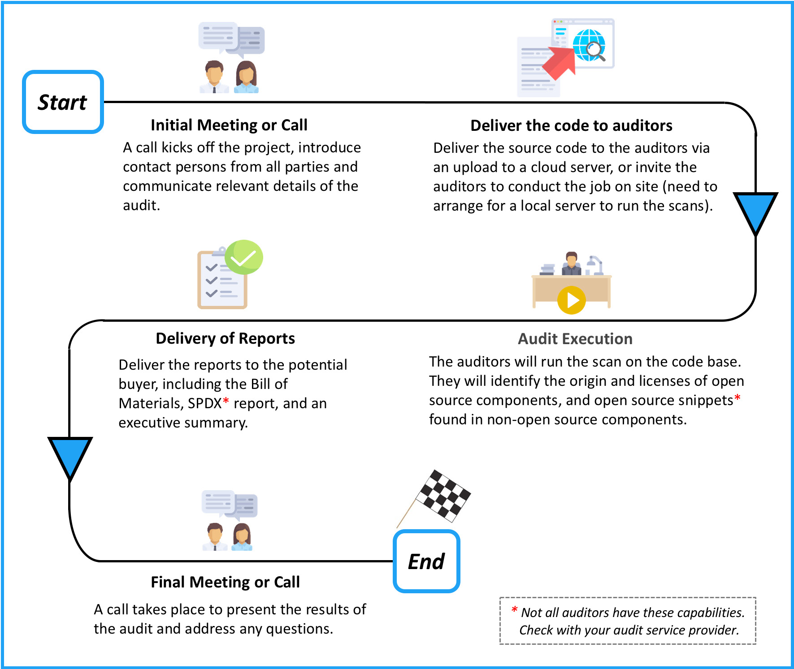
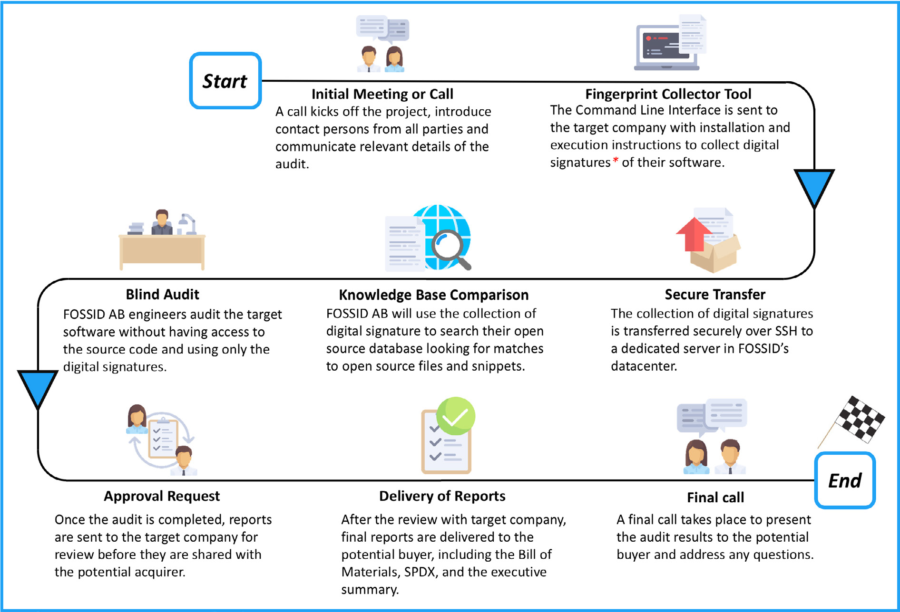
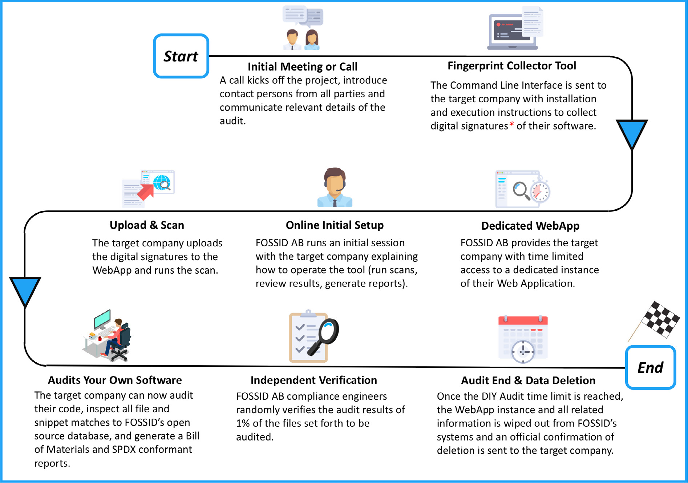

오픈소스 감사(open source audit)를 수행할 때, 도구가 갖춘 특정 기능은 인수 기업에 실질적인 가치를 제공합니다. 가장 중요한 기능 하나는 타깃 기업의 독점 코드(proprietary code)에 섞여 들어간 오픈소스 코드 스니펫(snippet)을 찾아내는 능력이며, 그 반대 방향도 마찬가지입니다. 또 다른 기능은 감사 결과에서 오탐(false positive)을 자동으로 걸러내어 수작업으로 처리해야 할 노동량을 최소화하는 능력입니다.

감사 방법(audit methods)에는 세 가지가 있습니다.

1. 전통적 감사. 감사자가 모든 코드에 완전히 접근하여 원격 또는 현장에서 감사를 수행합니다.
2. 블라인드 감사. 감사자가 소스 코드를 전혀 보지 않고 원격으로 작업을 수행합니다.
3. 자체 수행(Do It Yourself) 감사. 타깃 기업이나 인수 기업이 도구를 사용해 실제 감사 작업 대부분을 직접 수행하며, 감사 회사가 결과를 무작위로 검증하는 선택지를 둡니다.

## 5.1 전통적 감사 방법

이 방법을 전통적이라고 부르는 이유는, 오픈소스 컴플라이언스(compliance)를 위한 소스 코드 스캔의 원조 방식이기 때문입니다. 전통적 감사는 제3자 감사 회사의 컴플라이언스 감사자가 클라우드 시스템을 통해 원격으로, 또는 현장을 직접 방문하여 소스에 접근한 뒤 소스 코드 스캔을 수행하는 방식입니다.

**그림 5.** 인수합병(M&A) 거래에서의 전통적 감사 절차 *(출처: Linux Foundation, 2018)*

그림 5는 전통적 감사 방법에 따른 감사 절차를 보여 줍니다. 이 절차는 서비스 제공자마다 조금씩 다를 수 있다는 점에 유의하시기 바랍니다. 일반적인 전통적 감사 절차는 다음 단계를 따릅니다.

- 감사자가 인수 기업에 질문을 보내 작업을 더 잘 이해합니다.
- 인수 기업이 답변하여, 감사 회사가 범위와 감사 매개변수를 더 잘 파악하도록 합니다.
- 감사자가 답변을 근거로 견적을 제시합니다.
- 견적에 합의합니다. 다음으로 서비스 계약, 작업 기술서(statement of work), 비밀유지계약(non-disclosure agreement) 등에 서명합니다. (그림 5, 6, 7의 "Start"는 모든 계약이 서명된 시점, 즉 감사 절차가 실제로 시작되는 시점을 전제로 합니다.)
- 감사자가 안전한 클라우드 업로드를 통해, 또는 현장 감사를 위한 회사 방문을 통해 타깃의 코드에 접근할 권한을 받습니다.
- 감사자가 타깃의 소스 코드를 스캔하고, 오탐을 정리한 뒤 결과를 평가합니다.
- 감사자가 보고서를 생성하여 고객에게 전달합니다.
- 통화 또는 대면 미팅으로 감사자와 함께 결과를 검토하고 질의에 답합니다.

이 방법은 대부분의 감사 서비스 제공자가 공통으로 채택합니다. 동일한 감사 작업에 대해 여러 입찰을 받아 자신의 요구사항에 가장 잘 맞는 입찰을 고를 수 있습니다. 이 모델을 따르려면 타깃 기업이 감사자에게 코드를 이전하거나, 감사자가 사무실을 방문해 현장에서 작업을 완료하도록 허용해야 합니다.

## 5.2 블라인드 감사

블라인드 감사 방법은 스톡홀름에 본사를 둔 FOSSID AB가 인수합병(M&A) 거래의 기밀유지 요구사항을 다루기 위해 개척했습니다. (여기서 FOSSID AB는 회사를, FOSSID는 도구 자체를 가리킵니다.)

이 회사는 자사의 독점 기술을 사용하여 소스 코드를 보지 않고도 감사를 수행하고 보고서를 생성할 수 있습니다. 그림 6은 FOSSID AB가 사용하는 블라인드 감사 절차를 보여 주며, 이 절차는 인수합병(M&A) 거래에서 소스 코드의 기밀을 유지하도록 설계되었습니다. 블라인드 감사의 주요 장점 하나는, 감사자가 소스 코드에 접근하지 않고도 검토를 완료할 수 있다는 점입니다. 또한 인수 기업이 충분히 주의를 기울이면, 감사자가 타깃의 정체를 알지 못하게 하여 높은 수준의 기밀성을 제공할 수도 있습니다. 저자가 아는 한, 이러한 감사 방법은 오픈소스 컴플라이언스 서비스를 제공하는 다른 어떤 회사도 제공하지 않습니다.

**그림 6.** FOSSID를 사용한 블라인드 감사 절차. 타깃 기업이 핑거프린트 수집 도구로 소프트웨어의 디지털 서명(digital signature)만 수집해 전송하면, FOSSID AB가 소스 코드에 접근하지 않고 그 서명을 오픈소스 데이터베이스와 대조해 감사합니다 *(출처: Linux Foundation, 2018)*

## 5.3 DIY 감사

자체 수행(Do-It-Yourself, DIY) 감사는 인수 기업이나 타깃 기업에 컴플라이언스 클라우드 도구에 대한 기간 한정 접근 권한을 제공하여, 스스로 스캔을 실행할 수 있게 합니다. 그러면 지식 베이스와 모든 보고 기능에 완전히 접근하여 내부에서 감사를 수행할 수 있습니다. 이 방식은 스캔 결과를 해석하고 개선 조치(remediation) 절차를 제안할 만큼 충분한 경험을 갖춘 사내 직원을 보유한 기업에 특히 매력적입니다. 한 해에 여러 차례 인수합병(M&A) 절차를 거치는 기업이라면 금세 더 비용 효율적인 방식이 될 수 있습니다. 감사 도구 서비스 제공자가 독립 인증(independent certification)을 수행하여 결과를 검증함으로써 감사의 무결성을 한층 더 확보할 수 있습니다.

그림 7은 FOSSID AB의 도구를 사용한 이 감사 방법을 보여 줍니다. 이 방식에는 여러 장점이 있습니다. 내부 자원을 사용하고 제3자 감사자의 가용 여부에 의존하지 않으므로 필요할 때 즉시 감사를 시작할 수 있습니다. 이 방식은 일정을 단축하고 외부 비용 요인을 줄일 수 있습니다. 코드에 직접 접근하는 사람이 감사를 수행하므로 모든 컴플라이언스 문제를 즉시 처리하고 수정을 곧바로 적용할 수 있습니다. 끝으로, 감사 도구 제공자가 감사를 검증하여 정확성과 완전성을 보장할 수 있습니다. FOSSID AB는 DIY 서비스의 일부로, 타깃 기업이 감사하기로 정한 파일 중 X 퍼센트(X는 견적 합의의 일부로 정해집니다)를 무작위로 검증해 줍니다.

**그림 7.** FOSSID를 사용한 자체 수행(DIY) 감사 절차. 타깃 기업이 전용 웹앱의 기간 한정 인스턴스에서 직접 스캔과 감사를 수행하고, FOSSID AB는 감사 대상 파일의 일부를 독립 검증한 뒤 기간이 끝나면 모든 데이터를 삭제합니다 *(출처: Linux Foundation, 2018)*
