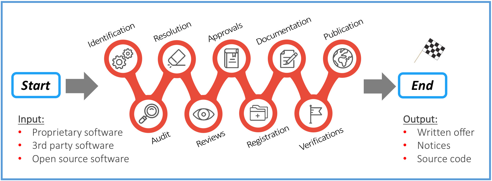

오픈소스 컴플라이언스(compliance) 감사를 통과하는 일은 준비만 되어 있다면 어렵지 않습니다. 그러나 인수 기업이 관심을 보인 다음에야 준비를 시작한다면 통과하기 어렵습니다. 이러한 활동은 일상적인 사업 및 개발 활동과 함께 진행되어야 합니다. 목표는 회사가 사용하는 모든 오픈소스 컴포넌트를 추적하고, 오픈소스 컴포넌트 사용에서 발생하는 오픈소스 라이선스 의무사항을 존중하도록 하는 것입니다. 이와 동일한 조치는 회사가 기업 거래의 대상이 되었을 때도 큰 도움이 됩니다. 예기치 못한 문제의 위험을 줄여 주기 때문입니다.

## 9.1 코드 안에 무엇이 있는지 파악하라

코드 안에 무엇이 있는지 파악하는 것은 컴플라이언스의 황금률입니다. 출처와 라이선스 정보를 포함해, 모든 소프트웨어 컴포넌트에 대한 완전한 소프트웨어 인벤토리(inventory)를 유지해야 합니다. 여기에는 조직이 자체적으로 만든 소프트웨어 컴포넌트, 오픈소스 컴포넌트, 제3자에서 유래한 컴포넌트가 모두 포함됩니다. 가장 중요한 점은 오픈소스 컴포넌트를 식별하고 추적하는 프로세스를 갖추는 것입니다. 항상 복잡한 컴플라이언스 프로그램이 필요한 것은 아니지만, 정책(policy), 프로세스, 인력, 교육, 도구라는 다섯 가지 기본 요소는 갖추어야 합니다.

### 9.1.1 정책과 프로세스

오픈소스 컴플라이언스 정책은 오픈소스 소프트웨어의 관리(사용과 기여 모두)를 규율하는 규칙의 집합입니다. 프로세스는 회사가 이러한 규칙을 일상적으로 어떻게 구현할지에 관한 세부 명세입니다. 컴플라이언스 정책과 프로세스는 오픈소스 소프트웨어의 사용, 기여, 감사, 배포 등 다양한 측면을 규율합니다.

**그림 8.** 종단 간 오픈소스 컴플라이언스 프로세스 예시. 식별, 감사, 해결, 검토, 승인, 등록, 문서화, 검증, 공개의 단계를 거칩니다 *(출처: Linux Foundation, 2018)*

그림 8은 컴플라이언스 프로세스의 예시를 보여 줍니다. 제품이나 소프트웨어 스택을 구축하는 과정에서 실사(due diligence)의 일부로 각 소프트웨어 컴포넌트가 거치게 되는 여러 단계를 나타냅니다.

1. 유입되는 모든 소스 코드를 식별합니다.
2. 소스 코드를 감사합니다.
3. 감사에서 발견된 문제를 해결합니다.
4. 적절한 검토를 완료합니다.
5. 오픈소스 사용에 대한 승인을 받습니다.
6. 소프트웨어 인벤토리에 오픈소스를 등록합니다.
7. 오픈소스 사용을 반영하도록 제품 문서를 갱신합니다.
8. 배포 이전의 모든 단계에 대해 검증을 수행합니다.
9. 소스 코드를 배포하고 배포와 관련된 최종 검증을 수행합니다.

이 프로세스의 산출물은 오픈소스 명세(Bill of Materials, BOM)입니다. 명세에 포함된 컴포넌트의 법적 의무사항을 이행하는 서면 제공(written offer)과 각종 저작권, 라이선스, 출처 표시 고지와 함께 이 명세를 공개할 수 있습니다. 오픈소스 컴플라이언스 프로세스에 대한 자세한 논의는 Linux Foundation이 발행한 무료 전자책 *Open Source Compliance in the Enterprise*를 내려받아 참고하시기 바랍니다.

### 9.1.2 인력

대기업에서 오픈소스 컴플라이언스 팀은 오픈소스 컴플라이언스 보장을 임무로 하는 여러 구성원으로 이루어진 다학제 그룹입니다. 흔히 오픈소스 검토 위원회(Open Source Review Board, OSRB)라고 불리는 핵심 팀은 엔지니어링 및 제품 팀 대표, 한 명 이상의 법률 자문, 컴플라이언스 책임자로 구성됩니다. 확장 팀은 문서화, 공급망, 기업 개발, IT, 현지화 등 여러 부서에 걸쳐 컴플라이언스 노력에 지속적으로 기여하는 다양한 구성원으로 이루어집니다. 다만 소규모 회사나 스타트업에서는 법률 자문의 지원을 받는 엔지니어링 매니저 한 명 정도로 단순할 수도 있습니다. 모든 회사는 저마다 다릅니다.

### 9.1.3 교육

교육은 컴플라이언스 프로그램의 필수 구성 요소로서, 직원이 오픈소스 소프트웨어 사용을 규율하는 정책을 잘 이해하도록 돕습니다. 오픈소스 및 컴플라이언스 교육을 제공하는 목표는 오픈소스 정책과 전략에 대한 인식을 높이고, 오픈소스 라이선싱의 쟁점과 사실에 대한 공통된 이해를 구축하는 것입니다. 또한 제품이나 소프트웨어 포트폴리오에 오픈소스 소프트웨어를 포함할 때 발생하는 사업적, 법적 위험도 다루어야 합니다.

공식적인 교육 방법과 비공식적인 교육 방법을 모두 활용할 수 있습니다. 공식적인 방법으로는 직원이 과정을 이수하기 위해 지식 시험을 통과해야 하는 강사 주도 교육 과정이 있습니다. 비공식적인 방법으로는 웨비나, 브라운백 세미나, 신입 사원 오리엔테이션 세션의 일부로 진행하는 발표 등이 있습니다.

### 9.1.4 도구

오픈소스 컴플라이언스 팀은 소스 코드 감사를 자동화하고, 오픈소스 코드를 발견하며, 그 라이선스를 식별하기 위해 도구를 자주 사용합니다. 이러한 도구로는 컴플라이언스 프로젝트 관리 도구, 소프트웨어 인벤토리 도구, 소스 코드 및 라이선스 식별 도구가 있습니다.

## 9.2 컴플라이언스를 준수하라

의도했든 아니든 오픈소스 소프트웨어가 포함된 제품을 출하했다면, 그 소프트웨어 컴포넌트를 규율하는 여러 라이선스를 준수해야 합니다. 그래서 코드 안에 무엇이 있는지 파악하는 일이 중요합니다. 완전한 명세가 있으면 컴플라이언스가 훨씬 쉬워지기 때문입니다.

컴플라이언스 준수는 단순한 작업이 아니며, 라이선스와 코드 구조에 따라 제품마다 다릅니다. 큰 틀에서 컴플라이언스를 준수한다는 것은 다음을 의미합니다.

1. 오픈소스 소프트웨어의 모든 사용을 추적합니다.
2. 제품 출하 이미지에 포함된 모든 소프트웨어에 대해 최종 확정된 오픈소스 명세를 작성합니다.
3. 오픈소스 라이선스의 의무사항을 이행합니다.
4. 소프트웨어 업데이트를 배포할 때마다 이 프로세스를 반복합니다.
5. 컴플라이언스 문의에 신속하고 진지하게 대응합니다.

## 9.3 보안을 위해 최신 릴리스를 사용하라

종합적인 컴플라이언스 프로그램의 이점 중 하나는 안전하지 않은 버전의 오픈소스 컴포넌트가 포함된 제품을 더 쉽게 찾아 교체할 수 있다는 점입니다. 대부분의 소스 코드 스캐닝 도구는 이제 오래된 소프트웨어 컴포넌트에서 공개된 보안 취약점을 표시하는 기능을 제공합니다. 오픈소스 컴포넌트를 업그레이드할 때 중요한 고려 사항 하나는, 해당 컴포넌트가 이전 버전과 동일한 라이선스를 유지하는지 항상 확인하는 것입니다. 오픈소스 프로젝트가 메이저 릴리스에서 라이선스를 변경한 사례가 간혹 있기 때문입니다.

기업은 보안 취약점이 있는 버전을 사용하는 상황을 피하기 위해 오픈소스 프로젝트 커뮤니티에 참여하는 것이 좋습니다. 사용하는 모든 오픈소스 프로젝트에 활발히 참여하는 것은 합리적이지도 실현 가능하지도 않으므로, 가장 중요한 컴포넌트를 식별하기 위한 일정 수준의 우선순위 설정이 필요합니다. 참여 수준은 메일링 리스트 가입과 기술 토론 참여부터 버그 수정 및 소규모 기능 기여, 나아가 주요 기여에 이르기까지 다양합니다. 최소한 특정 오픈소스 프로젝트에서 작업하는 기업 개발자는 보안 취약점 및 사용 가능한 수정과 관련된 보고를 받기 위해 해당 메일링 리스트를 구독하고 모니터링하는 것이 유익합니다.

## 9.4 컴플라이언스 노력을 측정하라

규모를 막론하고 모든 조직이 취할 수 있는 가장 쉽고 효과적인 첫 단계는 오픈체인 프로젝트(OpenChain Project)에 참여하여 "오픈체인 적합(OpenChain Conformant)" 상태를 획득하는 것입니다. 이는 일련의 질문에 온라인으로 또는 수동으로 답변함으로써 이루어집니다. 오픈체인 적합성에 사용되는 질문은 조직이 오픈소스 소프트웨어 컴플라이언스를 위한 프로세스나 정책을 마련했는지 확인하는 데 도움을 줍니다. 오픈체인은 ISO 9001과 유사한 산업 표준입니다. 정밀한 프로세스와 정책 구현은 개별 조직에 맡기고 "큰 그림"에 초점을 맞춥니다. 오픈체인 적합성은 오픈소스 컴플라이언스 프로세스나 정책이 존재하며, 공급업체나 고객이 요청할 때 추가 세부 사항을 공유할 수 있음을 보여 줍니다. 오픈체인은 전 세계 공급망 전반에서 조직 간 신뢰를 구축하도록 설계되었습니다.

Linux Foundation의 자가 평가 체크리스트(Self-Assessment Checklist)는 컴플라이언스 모범 사례에 더해, 컴플라이언스 프로그램이 성공하기 위해 갖추어야 할 요소까지 담은 광범위한 체크리스트입니다. 기업은 이 내부용 자가 점검 체크리스트를 활용하여 자사의 컴플라이언스를 컴플라이언스 모범 사례와 비교 평가할 수 있습니다.
