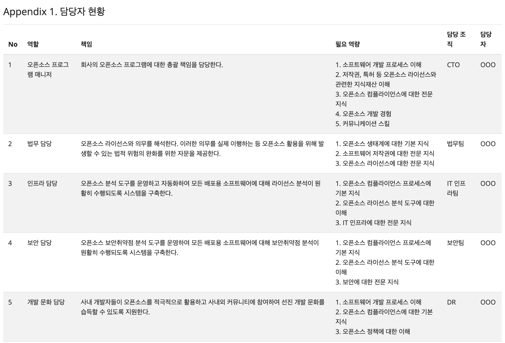
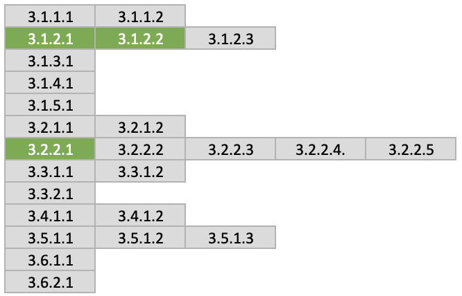

## Defining Roles and Responsibilities

To build a company's open source governance system, a responsible person who takes charge of and carries out this task is needed first. This person may be called an Open Source Program Manager, Open Source Compliance Officer, or similar title, and is responsible for the company's overall open source compliance.

A person with the following competencies is well suited for this role.

- Understanding of the open source ecosystem and development experience
- Broad understanding of the company's business
- Passion and communication skills to spread effective open source use among the company's members

It is best to ensure that the Open Source Program Manager can perform this role full-time whenever possible.

Global ICT companies are working to hire excellent Open Source Program Managers like this, and various job postings can be found at the following site: [https://github.com/todogroup/job-descriptions](https://github.com/todogroup/job-descriptions)

To build an open source governance system, a company must define the necessity of each role and determine what responsibilities should be assigned. In the case of a small company, it is possible for the Open Source Program Manager alone to perform all roles. Depending on the size of the company, an infrastructure officer to operate open source tools may also be needed, and a legal officer role to provide professional legal advice may be required.

In general, the following roles are needed to build a company's open source governance system.

- Legal officer
- Infrastructure officer
- Development culture officer
- Security officer



<i>Individuals and teams involved in ensuring open source compliance : https://www.linuxfoundation.org/wp-content/uploads/OpenSourceComplianceHandbook_2018_2ndEdition_DigitalEdition.pdf</i>



By doing this, a company can prepare the following evidence materials required by ISO/IEC 5230.

{}

* <b>3.1.2.1 Documentation that lists the roles of the various participants in the Program, and the responsibilities associated with each Program role</b>

{}

| Self Certification 1.c  | Have you identified the roles and the corresponding responsibilities that affect the performance and effectiveness of the Program? |
|---|:---|
|  | Have you identified the roles and the corresponding responsibilities that affect the performance and effectiveness of the Program? |

## Defining Required Competencies

Once each role and its responsibilities have been defined, the required competencies that personnel performing that role must have need to be identified. This is because the person in charge of each role must be assessed for whether they have the competency to perform that role, and training must be provided if needed.

By doing this, a company can prepare the following evidence materials required by ISO/IEC 5230.

{}

* <b>3.1.2.2 Documentation describing the competency needed for each role</b>

{}

| Self Certification 1.d  | Have you identified and documented the competencies required for each role? |
|---|:---|
|  | Have you identified and documented the competencies required for each role? |

## Assigning Personnel

The Open Source Program Manager consults with the relevant departments to assign personnel for each role and documents this. Of course, to do this, the goals and direction for building the open source compliance system must be reported to top decision-makers such as the CEO in order to receive the necessary support.

The open source-related organization and personnel do not necessarily need to participate in open source work full-time. It is fine to form a virtual organization in the form of an OSRB (Open Source Review Board) to perform the necessary roles.

SK telecom has formed an OSRB to create open source policies and processes within the company and to prepare response measures when issues arise.



<i>https://sktelecom.github.io/about/osrb/</i>



By doing this, a company can prepare the following evidence materials required by ISO/IEC 5230.

{}

* <b>3.2.2.1 Documentation naming the person, group, or function responsible for each role within the Program</b>

{}

| Self Certification 2.d  | Have you documented the persons, group or function supporting the Program role(s) identified? |
|---|:---|
|  | Have you documented the persons, group or function supporting the Program role(s) identified? |

The table below is a sample personnel roster specifying the roles of the open source-related organization and personnel, along with the required competencies. A company can refer to this to organize and document its open source organization.

This content can also be found on the following page. : [https://haksungjang.github.io/docs/openchain/#appendix-1-담당자-현황](https://haksungjang.github.io/docs/openchain/#appendix-1-%EB%8B%B4%EB%8B%B9%EC%9E%90-%ED%98%84%ED%99%A9)

Organizing in this way satisfies the following three requirements of ISO/IEC 5230.

