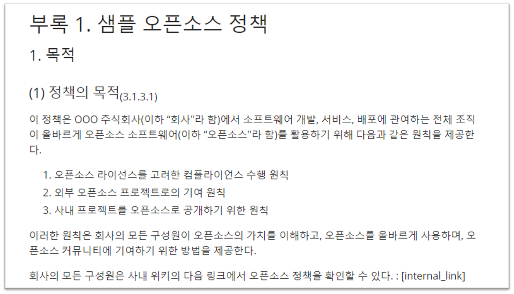
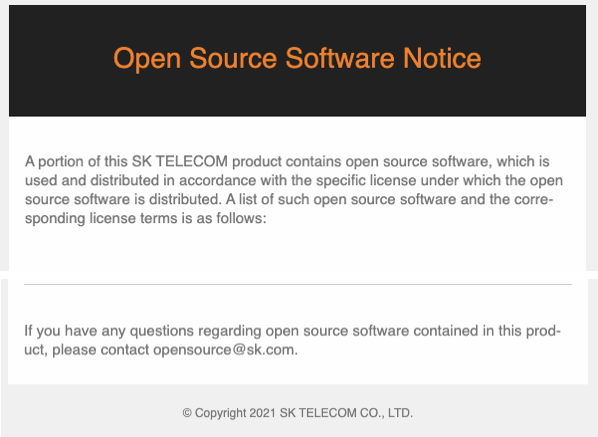
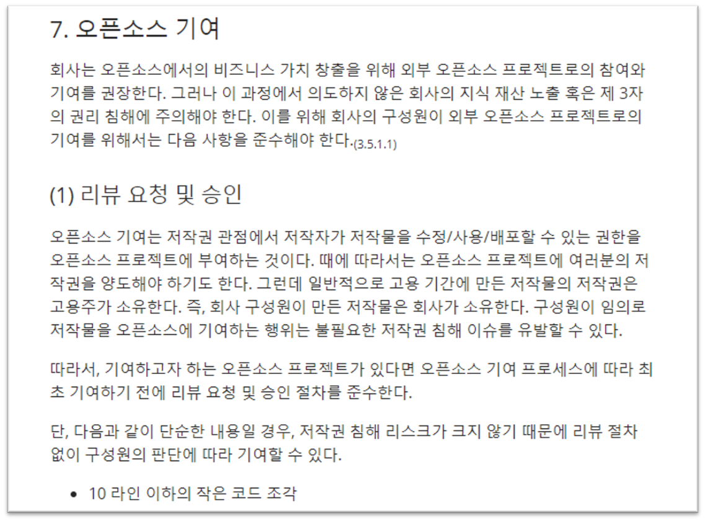
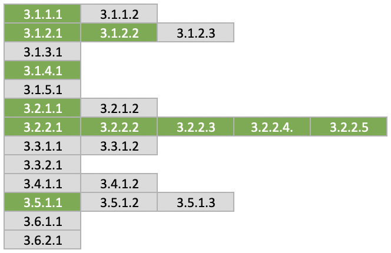

## Documenting the Open Source Policy

A company must establish and document an open source policy consisting of principles for the correct use of open source by every organization involved in software development, service delivery, and distribution, and must disseminate it throughout the organization.

A typical open source policy includes the following.

- Principles for building and distributing software products and services using open source
- Principles for contributing to external open source communities
- Principles for releasing the company's software as open source

The following page provides a sample open source policy document that satisfies the ISO/IEC 5230 requirements: "[Appendix 1. Sample Open Source Policy](https://haksungjang.github.io/docs/openchain/#%EB%B6%80%EB%A1%9D-1-%EC%83%98%ED%94%8C-%EC%98%A4%ED%94%88%EC%86%8C%EC%8A%A4-%EC%A0%95%EC%B1%85)"



Each company can modify this sample policy to fit its own business strategy and environment.

Doing so allows a company to prepare the following evidence required by ISO/IEC 5230.

{}

* <b>3.1.1.1 Documented open source policy</b>

{}

| Self Certification 1.a  | Does a documented policy exist that governs open source license compliance of the Supplied Software distribution? |
|---|:---|
|  | Do you have a documented policy that governs open source license compliance of the Supplied Software distribution? |


## Defining the Scope

A single open source policy (program) does not necessarily have to apply to the entire organization. The scope of application can vary depending on the characteristics of each organization and product within the company. Different open source programs can be applied by organization or by product. Likewise, an organization that does not distribute software at all can be excluded from the scope of the open source program. A company should clearly define the scope and limits of its open source program based on the characteristics of its organizations and products, and specify this in its open source policy.

As a company's organizations, products, and services change to fit its business environment, situations may arise where the scope of the program needs to be determined or revised. A company should have a procedure in place to respond to this, such as the following example.

1. When starting a new project, the open source program manager determines whether the project falls within the scope of the program.
2. If it is determined not to fall within scope, a proposal to bring the project into the scope of the program is submitted to the OSRB.
3. If the OSRB accepts the proposal, the scope of the program is revised accordingly.
4. In addition, if the open source program manager determines that a review of the program's scope is needed, they can initiate a review of the program's scope through the same process.

The following example content can be included in an open source policy.

```
2. Scope
This policy applies to the following three areas.

1) It applies to all products the company provides or distributes externally.
   However, using open source solely for internal purposes is not
   within the scope of this policy.
2) It applies when a member contributes to an external open source project.
3) It applies when releasing internal code as open source.

The scope can be changed to fit the company's business environment,
and the procedure for doing so is as follows.

1) If the open source program manager determines that a change in the
   policy's scope is needed due to changes in the company's business
   environment, such as new business or organizational restructuring,
   they submit a proposal for this to the OSRB.
2) The OSRB approves an appropriate level of change to the scope.
3) The OSRB revises the open source policy to change the policy's scope.
```

Doing so allows a company to prepare the following evidence required by ISO/IEC 5230.

{}

* <b>3.1.4.1 Documented statement that clearly defines the scope and limits of the program</b>

{}

| Self Certification 1.g  | Does a process exist to determine the scope of the Program? |
|---|:---|
|  | Do you have a process for determining the scope of your Program? |


| Self Certification 1.h  | Does a documented statement exist that clearly defines the scope and limits of the Program? |
|---|:---|
|  | Do you have a written statement clearly defining the scope and limits of the Program? |

## Designating a Point of Contact for External Inquiries / Publishing Contact Information

Customers and open source copyright holders sometimes raise open source-related inquiries, requests, or claims to a company regarding products or services developed using open source. The main content of such external inquiries and requests includes the following.

- Inquiries about whether open source was used in a specific product or service
- Requests for the source code provided under a Written Offer for GPL or LGPL licensed code
- Requests for an explanation or the release of source code for open source found in a product that was not disclosed in the open source notice
- Requests for missing files or build instructions for source code released to satisfy GPL, LGPL, or similar obligations
- Requests for copyright attribution

A company must designate a person responsible for handling these external inquiries. This is typically the open source program manager.

Also, external open source developers sometimes want to contact a company's point of contact to discuss an open source compliance issue but cannot find a way to reach them, and end up filing a legal claim directly. To prevent this, a company must always publicly disclose a way for third parties to make open source-related inquiries and requests to the company.

The ways in which external parties can make open source-related inquiries to a company are (1) publishing the email address of the company's open source program manager, or (2) using the Linux Foundation's [Open Compliance Directory](https://compliance.linuxfoundation.org/references/open-compliance-directory/).

It is also good practice to publish the representative email address of the company's open source program office in the open source notice that accompanies its products and services.




This content can be reflected in the open source policy as shown in the example below.

```
1. Responding to External Inquiries
(1) Responsibility for Responding to External Inquiries
The open source program manager is responsible for responding to
inquiries and requests about open source compliance from outside
the company.

The open source program manager can assign all or part of the
handling of an inquiry to an appropriate person within [Company].
If necessary, the legal team is consulted for handling.
Anyone who receives an external inquiry about open source
compliance should notify the open source program manager so that
a prompt response can be made.

(2) Publishing Contact Information
The open source program manager publicly provides the contact
information of the responsible person so that external parties
can make open source-related inquiries and requests.

* Provide contact email address information in the open source notice.
* Register contact information in the Linux Foundation's Open
  Compliance Directory.

(3) Procedure for Responding to External Inquiries
Responding quickly and accurately to external open source
compliance inquiries can greatly reduce the risk of escalation
to litigation. To this end, the company complies with the
external inquiry response procedure defined in the open source
compliance process to respond to external open source compliance
inquiries.
```

Doing so allows a company to prepare the following evidence required by ISO/IEC 5230.

{}

* <b>3.2.1.1 A published method by which third parties can make inquiries about open source license compliance (such as the responsible person's email address, or use of the Linux Foundation's Open Compliance Directory)</b>

{}

| Self Certification 2.a  | Has a person been assigned to receive external open source compliance inquiries (the Open Source Liaison)? |
|---|:---|
|  | Have you assigned individual(s) responsible for receiving external open source compliance inquiries ("Open Source Liaison")? |


| Self Certification 2.b  | Is the Open Source Liaison's information publicly available (for example, an email address, or a listing in the Linux Foundation's Open Compliance Directory)? |
|---|:---|
|  | Is the Open Source Liaison function publicly identified (e.g. via an email address and/or the Linux Foundation's Open Compliance Directory)? |

## Providing Staffing, Budget, and Other Support

A company must provide sufficient resources so that its open source program can function smoothly. It must appropriately staff each role within the program and ensure adequate budget and working hours. If it cannot, it must have a procedure in place to compensate for this. The following example wording can be added to the open source policy document.

```
4. Roles, Responsibilities, and Competencies

The head of the organization responsible for each role designates
a person in charge within the organization and allocates
appropriate time and budget so that person can carry out the role
faithfully. If a person responsible for a role feels they are not
receiving adequate support in carrying it out, they must raise the
issue with the open source program manager. The open source
program manager discusses resolving the issue with the relevant
head of organization. If it is not resolved appropriately, the
open source program manager can ask the OSRB to help resolve the
issue. The OSRB shares the issue with the head of the higher-level
organization and requests a resolution.
```

Doing so allows a company to prepare the following evidence required by ISO/IEC 5230.

{}

* <b>3.2.2.2 Personnel assigned to each role in the program must be properly staffed and adequately funded</b>

{}

| Self Certification 2.e  | Are the roles within the Program appropriately staffed and adequately funded? |
|---|:---|
|  | Have the identified Program roles been properly staffed and has adequate funding provided? |

## Providing Legal Counsel

A company must provide a way for the person responsible for each role to seek legal counsel when a legal review is needed to resolve an open source compliance issue. This should first be provided through the company's in-house legal team, and for particularly sensitive issues, an outside law firm with open source-specialized attorneys can be used. An example of an open source policy for this is as follows.

```
4. Roles, Responsibilities, and Competencies

(2) Open Source Program Manager
* The open source program manager provides a way for members to
  obtain open source-related legal counsel.
* The open source program manager decides whether to engage an
  outside law firm. The effectiveness and appropriateness of
  outside legal counsel is evaluated and reviewed annually by the
  open source program manager.
```

Doing so allows a company to prepare the following evidence required by ISO/IEC 5230.

{}

* <b>3.2.2.3 A method for using internal or external expert legal counsel to resolve open source license compliance issues</b>

{}

| Self Certification 2.f  | Is there a method to obtain internal or external open source legal expertise to resolve open source compliance issues? |
|---|:---|
|  | Is legal expertise pertaining to internal and external open source compliance identified? |


For reference, through its partner program, the OpenChain project provides a list of global law firms that offer open source-related legal counsel: [https://www.openchainproject.org/partners](https://www.openchainproject.org/partners)

Law firms registered as OpenChain partners meet the requirements set by the OpenChain project, and Bae, Kim & Lee LLC is currently the only law firm registered from Korea.

## Procedure for Assigning Internal Responsibility

There must be a procedure for assigning internal responsibility for open source compliance. This is the role of the open source program manager. The open source program manager must identify issues and appropriately assign them to the person responsible for each role. To this end, a company can describe this content in its open source policy document as follows.

```
4. Roles, Responsibilities, and Competencies

(2) Open Source Program Manager

The open source program manager is overall responsible for the
company's open source program. To ensure open source compliance
for products and services that use open source, they are
responsible for the following.

* Define the roles needed for open source compliance and
designate the responsible organization and person for each role.
Consult with the OSRB as needed.
```

Doing so allows a company to prepare the following evidence required by ISO/IEC 5230.

{}

* <b>3.2.2.4 A documented procedure for assigning internal responsibility for open source compliance</b>

{}

| Self Certification 2.g  | Does a documented procedure exist to assign internal responsibility for open source compliance? |
|---|:---|
|  | Do you have a documented procedure assigning internal responsibilities for Open Source compliance? |


## Handling Non-Compliant Cases

A company must document a procedure for promptly reviewing and responding to non-compliant cases. The following example can be included in an open source policy for reference.

```
1. Open Source Use

(5) Compliance Issue Remediation Procedure
When a compliance issue is raised, the open source program manager
performs the following procedure to respond promptly.

1. Acknowledge receipt of the inquiry and specify an appropriate
   resolution time.
2. Confirm whether the issue content points to an actual problem.
   (If not, inform the person who raised the issue that it is not
   a problem.)
3. If it is an actual problem, determine priority and decide on an
   appropriate response.
4. Carry out the response, and if necessary, appropriately update
   the open source compliance process.
5. Retain the above content using the Jira Tracker.
```

Doing so allows a company to prepare the following evidence required by ISO/IEC 5230.

{}

* <b>3.2.2.5 A documented procedure for reviewing and remediating non-compliant cases</b>

{}

| Self Certification 2.h  | Does a documented procedure exist to review and remediate instances of non-compliance? |
|---|:---|
|  | Do you have a documented procedure for handling review and remediation of non-compliant cases? |

## Open Source Contribution Policy

Global software companies value not only using open source to build products and provide services, but also the strategic value they can create by contributing to open source projects. However, approaching this without a sufficient understanding of and strategy for how open source project ecosystems and communities operate can unexpectedly damage a company's reputation and create legal risk. It is therefore important for a company to create a strategy and policy for participating in and contributing to open source projects.

For this open source contribution policy, you can refer to [7. Open Source Contribution](https://haksungjang.github.io/docs/openchain/#7-%EC%98%A4%ED%94%88%EC%86%8C%EC%8A%A4-%EA%B8%B0%EC%97%AC) in the NIPA OpenChain Guide's [Appendix 1. Sample Open Source Policy](https://haksungjang.github.io/docs/openchain/#%EB%B6%80%EB%A1%9D-1-%EC%83%98%ED%94%8C-%EC%98%A4%ED%94%88%EC%86%8C%EC%8A%A4-%EC%A0%95%EC%B1%85).




Doing so allows a company to prepare the following evidence required by ISO/IEC 5230.

{}

* <b>3.5.1.1 Documented open source contribution policy</b>

{}

| Self Certification 5.a  | Does a policy exist that governs contributions to open source projects on behalf of the organization? |
|---|:---|
|  | Do you have a policy that governs contributions to open source projects on behalf of the organization? |

Once a company establishes an open source policy that includes the content above, it satisfies the following ISO/IEC 5230 requirements.


