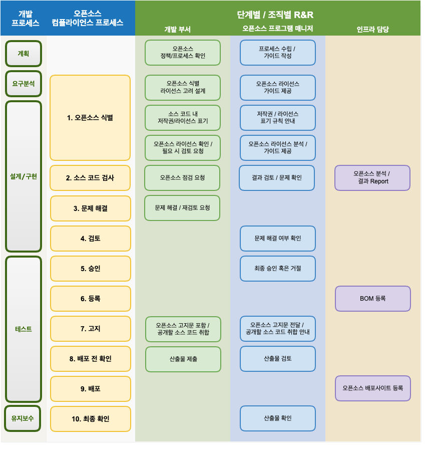
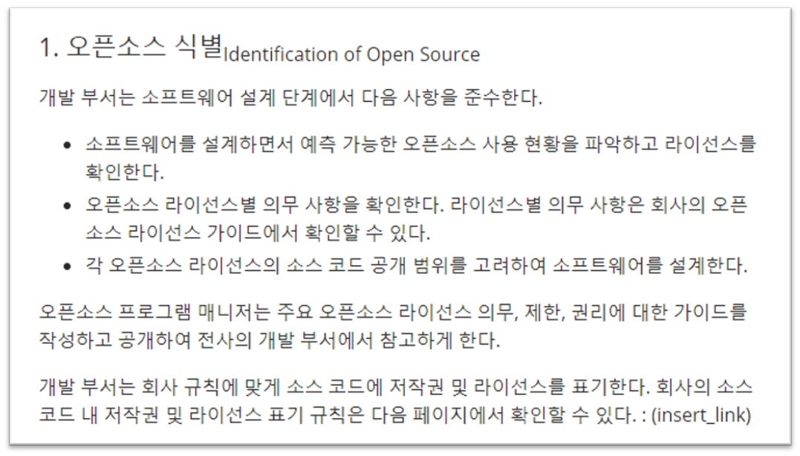
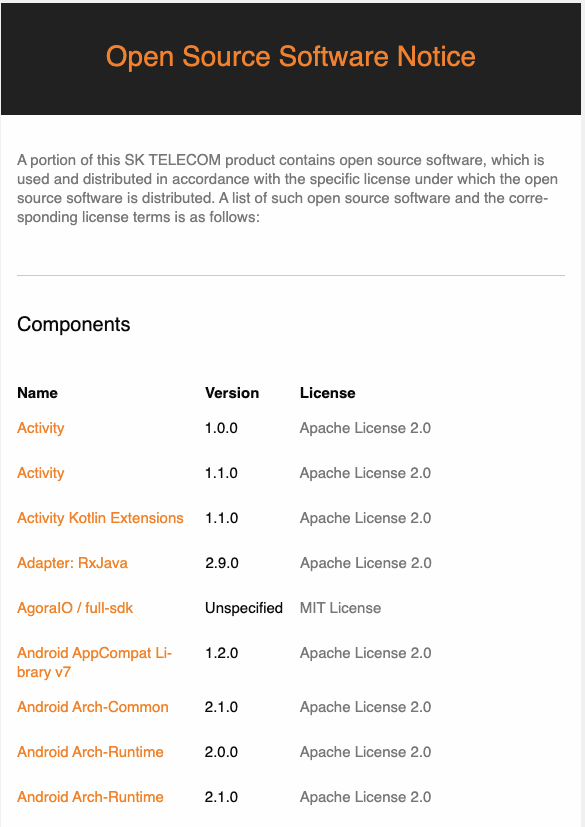
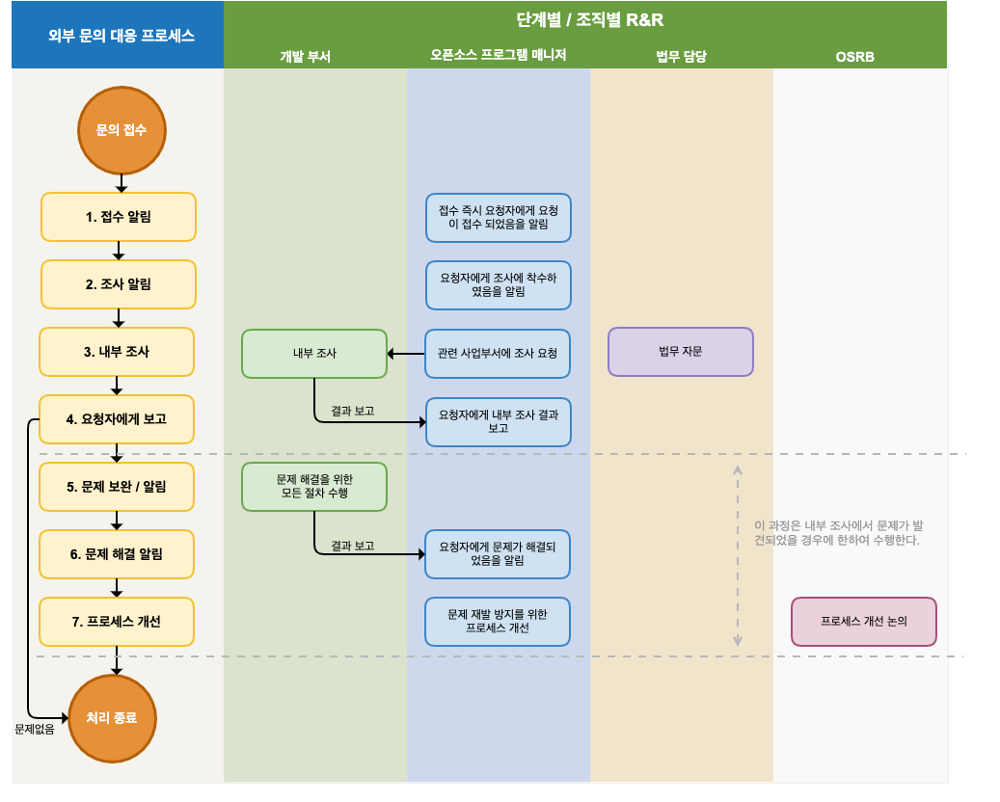
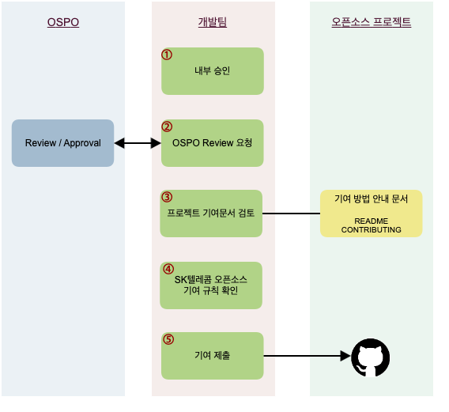
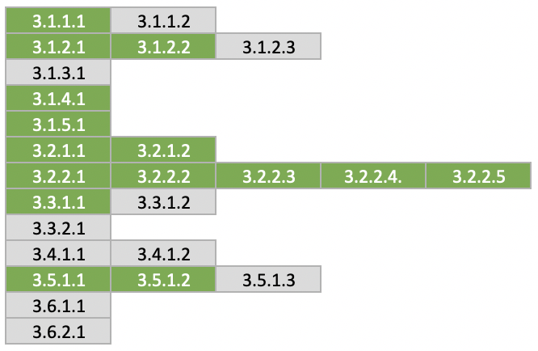

Process is the actionable procedure that enables a company to comply with its open source policy during software development and deployment. Simply put, the open source compliance process consists of activities to comply with the conditions required by each license for the open source used while developing and distributing software, and it produces artifacts such as open source notices and source code to be disclosed.



<center><i>Simplified view of the compliance end-to-end process : https://www.linuxfoundation.org/wp-content/uploads/OpenSourceComplianceHandbook_2018_2ndEdition_DigitalEdition.pdf</i></center>



Breaking down the open source compliance process into more detail gives the diagram below.



<center><i>End-to-end compliance process : https://www.linuxfoundation.org/wp-content/uploads/OpenSourceComplianceHandbook_2018_2ndEdition_DigitalEdition.pdf</i></center>


The image below is a sample open source compliance process that a company can generally adopt and use.



For more details, refer to the following page. : [https://haksungjang.github.io/docs/openchain/#부록-2-샘플-오픈소스-컴플라이언스-프로세스](https://haksungjang.github.io/docs/openchain/#%EB%B6%80%EB%A1%9D-2-%EC%83%98%ED%94%8C-%EC%98%A4%ED%94%88%EC%86%8C%EC%8A%A4-%EC%BB%B4%ED%94%8C%EB%9D%BC%EC%9D%B4%EC%96%B8%EC%8A%A4-%ED%94%84%EB%A1%9C%EC%84%B8%EC%8A%A4)

This chapter describes the components that the open source compliance process should include.

## Open Source Identification and Auditing

To determine whether open source can be used, it is first necessary to identify the license of the open source to be used and check the obligations required by the license. Whether open source was used, what the license is, and what obligations each license imposes must be reviewed and recorded. An example procedure for this is as follows.

1. The development department performs a preliminary evaluation of the license according to the criteria defined in the open source policy.
2. Any questions are directed to the Open Source Program Manager, and if necessary, the Open Source Program Manager requests advice from an external legal expert.
3. All internal and external decision results and related grounds are retained.

The Identification, Auditing, Resolving Issues, Review, and Approval steps in "[Appendix 2. Sample Open Source Compliance Process](https://haksungjang.github.io/docs/openchain/#%EB%B6%80%EB%A1%9D-2-%EC%83%98%ED%94%8C-%EC%98%A4%ED%94%88%EC%86%8C%EC%8A%A4-%EC%BB%B4%ED%94%8C%EB%9D%BC%EC%9D%B4%EC%96%B8%EC%8A%A4-%ED%94%84%EB%A1%9C%EC%84%B8%EC%8A%A4)"'s [1. Identification of Open Source](https://haksungjang.github.io/docs/openchain/#1-%EC%98%A4%ED%94%88%EC%86%8C%EC%8A%A4-%EC%8B%9D%EB%B3%84subidentification-of-open-sourcesub) are an example of a documented procedure for reviewing and recording the obligations and restrictions imposed by each identified license.




Having such a procedure in place allows a company to prepare the following evidence materials required by ISO/IEC 5230.

{}

* <b>3.1.5.1 A documented procedure for reviewing and recording the obligations, restrictions, and rights conferred by each Identified License</b>

{}

| Self Certification 1.i  | Do you have a process for reviewing open source license obligations, restrictions and rights? |
|---|:---|
|  | Do you have a process for reviewing open source license obligations, restrictions and rights? |

Source code scanning tools can be used at the open source identification and auditing stage. This is explained in detail in "[6. Tools](../6-tool/)".

## Open Source BOM Identification, Review, and Archiving

The most fundamental part of open source compliance activities is understanding the status of open source contained in Supplied Software. A process must be established for creating and managing a Bill of Materials (BOM) that identifies the open source and its licenses included in Supplied Software and contains that information. This is because knowing which open source is included in each version of Supplied Software is necessary to comply with the obligations required by each open source license when distributing the software.

All open source must be reviewed and approved before being integrated into Supplied Software. A prior review is needed not only for the function and quality of the open source but also for whether its origin and license requirements can be met. This requires a process of review request → review → approval.

[Appendix 2. Sample Open Source Compliance Process](https://haksungjang.github.io/docs/openchain/#%EB%B6%80%EB%A1%9D-2-%EC%83%98%ED%94%8C-%EC%98%A4%ED%94%88%EC%86%8C%EC%8A%A4-%EC%BB%B4%ED%94%8C%EB%9D%BC%EC%9D%B4%EC%96%B8%EC%8A%A4-%ED%94%84%EB%A1%9C%EC%84%B8%EC%8A%A4) describes the entire process for a company's open source compliance. The BOM is created and managed through the steps from [1. Identification of Open Source](https://haksungjang.github.io/docs/openchain/#1-%EC%98%A4%ED%94%88%EC%86%8C%EC%8A%A4-%EC%8B%9D%EB%B3%84subidentification-of-open-sourcesub) to [6. Registration](https://haksungjang.github.io/docs/openchain/#6-%EB%93%B1%EB%A1%9Dsubregistrationsub).

Tools for managing the open source BOM are explained in detail in "[6. Tools](../6-tool/)".

In addition, all processes and results of this open source compliance process must be documented. Using an issue tracking system such as [Jira](https://www.atlassian.com/software/jira) or [Bugzilla](https://www.bugzilla.org/), rather than email, can document this process more efficiently.

Having such a procedure in place allows a company to prepare the following evidence materials required by ISO/IEC 5230.

{}

* <b>3.3.1.1 A documented procedure for identifying, tracking, reviewing, approving, and archiving information about the open source components that comprise Supplied Software</b>

{}

| Self Certification 3.a  | Do you have a documented procedure for identifying, tracking and archiving information about the collection of open source components from which a Supplied Software release is comprised? |
|---|:---|
|  | Do you have a documented procedure for identifying, tracking and archiving information about the collection of open source components from which a Supplied Software release is comprised? |

## Generating Open Source Compliance Artifacts

As mentioned above, the most fundamental part of open source compliance activities is understanding the status of open source contained in Supplied Software. This is precisely to correctly fulfill the open source license requirements that are the core of open source compliance. In other words, a process must be established for generating a set of compliance artifacts for the open source contained in Supplied Software.

Compliance artifacts are broadly divided into two types.

1. Open source notice: A document providing the full text of the open source license and copyright information

    

    * How to generate an open source notice corresponding to the open source BOM collected using a tool is further explained in "[6. Tools](../6-tool/)".

2. Source code package to be disclosed: A package that collects the source code to be disclosed in order to fulfill the obligations of open source licenses, such as GPL and LGPL, that require source code disclosure

Compliance artifacts must be provided together when Supplied Software is distributed. Compliance artifacts are generated and distributed through the Notices and Distribution steps of "[Appendix 2. Sample Open Source Compliance Process](https://haksungjang.github.io/docs/openchain/#%EB%B6%80%EB%A1%9D-2-%EC%83%98%ED%94%8C-%EC%98%A4%ED%94%88%EC%86%8C%EC%8A%A4-%EC%BB%B4%ED%94%8C%EB%9D%BC%EC%9D%B4%EC%96%B8%EC%8A%A4-%ED%94%84%EB%A1%9C%EC%84%B8%EC%8A%A4)".

If it is difficult to enclose the source code package to be disclosed when distributing Supplied Software, this can be replaced by providing a Written Offer to provide the source code for at least three years. A Written Offer is generally provided through the product's user manual, and an example is as follows.

```
The software included in this product contains copyrighted software 
that is licensed under the GPL. A copy of that license is included 
in this document on page X. You may obtain the complete Corresponding 
Source code from us for a period of three years after our last shipment 
of this product, which will be no earlier than 2011-08- 01, by sending 
a money order or check for $5 to:

GPL Compliance Division
Our Company
Any Town, US 99999

Please write"source for product Y" in the memo line of your payment.
You may also find a copy of the source at http://www.example.com/sources/Y/.
This offer is valid to anyone in receipt of this information.

<Source: SFLC Guide to GPL Compliance>
```

Therefore, compliance artifacts must be retained for at least three years, and a process must be established for this. To do this, a company should consider building an open source website, which is explained in detail in "[6. Tools](../6-tool/)".

Having such a procedure in place allows a company to prepare the following evidence materials required by ISO/IEC 5230.

{}

* <b>3.4.1.1 A documented procedure describing a process that ensures the Compliance Artifacts required by the Identified Licenses are prepared and distributed with Supplied Software</b>

{}

| Self Certification 4.a  | Do you have a documented procedure that describes a process that ensures the Compliance Artifacts are distributed with Supplied Software as required by the Identified Licenses? |
|---|:---|
|  | Do you have a documented procedure that describes a process that ensures the Compliance Artifacts are distributed with Supplied Software as required by the Identified Licenses? |

## Responding to External Inquiries

To avoid facing legal action due to external claims, it is important for a company to respond to external inquiries and requests as quickly and accurately as possible. To do this, a company must have a process in place to respond quickly and effectively to external open source inquiries.

The figure below is the process a company should have in place to respond to external inquiries.


[https://haksungjang.github.io/docs/openchain/#2-외부-문의-대응-프로세스](https://haksungjang.github.io/docs/openchain/#2-%EC%99%B8%EB%B6%80-%EB%AC%B8%EC%9D%98-%EB%8C%80%EC%9D%91-%ED%94%84%EB%A1%9C%EC%84%B8%EC%8A%A4)

Details can be found in "[Appendix 2. Sample Open Source Compliance Process, 2. External Inquiry Response Process](https://haksungjang.github.io/docs/openchain/#2-%EC%99%B8%EB%B6%80-%EB%AC%B8%EC%9D%98-%EB%8C%80%EC%9D%91-%ED%94%84%EB%A1%9C%EC%84%B8%EC%8A%A4)".

Having such a procedure in place allows a company to prepare the following evidence materials required by ISO/IEC 5230.

{}

* <b>3.2.1.2 An internal documented procedure for responding to third-party open source license compliance inquiries</b>

{}

| Self Certification 2.c  | Do you have a documented procedure that assigns responsibility for receiving and responding to open source compliance inquiries? |
|---|:---|
|  | Do you have a documented procedure that assigns responsibility for receiving and responding to open source compliance inquiries? |

## Open Source Contribution Process

If a company has a policy that allows contributions to external open source projects, there must be a documented procedure governing the process by which internal developers can contribute to external projects.

The [open source contribution process](https://sktelecom.github.io/guide/contribute/process/) published by SK telecom is a good example.


[https://sktelecom.github.io/guide/contribute/process/](https://sktelecom.github.io/guide/contribute/process/)


Having such a procedure in place allows a company to prepare the following evidence materials required by ISO/IEC 5230.

{}

* <b>3.5.1.2 A documented procedure that governs Open Source contributions</b>

{}

| Self Certification 5.b  | Do you have a documented procedure that governs Open Source contributions? |
|---|:---|
|  | Do you have a documented procedure that governs Open Source contributions? |

Building the process up to this point results in compliance with the ISO/IEC 5230 requirements as shown below.


