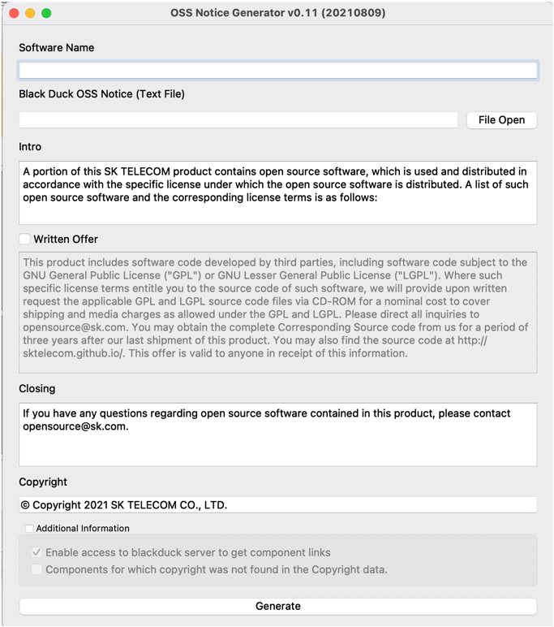
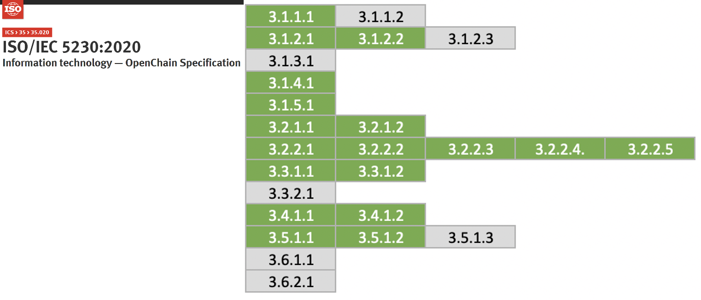

## Source Code Scanning Tools

Source code scanning tools can be used in the open source identification and auditing stage of the open source compliance process. Source code scanning tools range from free, open source-based tools to commercial tools, and each tool has its own strengths, but none provides complete functionality that can solve every problem. Therefore, a company must select the tool that best fits the characteristics and requirements of its product.

Many companies use these automated source code scanning tools alongside manual review. The Linux Foundation's [FOSSology](https://haksungjang.github.io/docs/openchain/#fn:24) project is a source code scanning tool released as open source, which companies can easily use for free.



<i>https://www.fossology.org/</i>



For how to install and use FOSSology, refer to [Appendix 3. Open Source Tools](https://haksungjang.github.io/docs/openchain/#1-fossology).



<i>https://haksungjang.github.io/docs/openchain/#1-fossology</i>



## Dependency Analysis Tools

Modern software development uses build environments that support package managers such as Gradle and Maven. In these build environments, even without the source code present, the dependency libraries needed at build time are fetched from a remote location to compose Supplied Software. These dependency libraries are included in Supplied Software but are not detected by source code scanning tools. Therefore, it is also important to use tools for dependency analysis.

The open source OSS Review Toolkit provides a dependency analysis tool called Analyzer.



<i>https://github.com/oss-review-toolkit/ort#analyzer</i>



In addition, LG Electronics released FOSSLight Dependency Scanner as open source. FOSSLight Dependency Scanner supports various package managers such as Gradle, Maven, NPM, PIP, Pub, and Cocoapods.



<i>https://fosslight.org/ko/scanner/</i>



## Open Source BOM Management Tools

Clause 3.3.1.2 of the ISO/IEC 5230 specification requires that the open source BOM list contained in Supplied Software be documented and retained. The open source BOM can be managed using a spreadsheet program such as Excel. However, when the number and versions of Supplied Software exceed several hundred, managing this manually is not easy. It is advisable to adopt an open source automation tool for this purpose.

[SW360](https://projects.eclipse.org/proposals/sw360), an open source project sponsored by the Eclipse Foundation, provides functionality to track the list of open source included in each Supplied Software.

For how to install and use SW360, refer to [Appendix 3. Open Source Tools](https://haksungjang.github.io/docs/openchain/#%EB%B6%80%EB%A1%9D-3-%EC%98%A4%ED%94%88%EC%86%8C%EC%8A%A4-%EB%8F%84%EA%B5%AC).



<i>https://haksungjang.github.io/docs/openchain/#부록-3-오픈소스-도구</i>



In addition, FOSSLight, the open source released by LG Electronics mentioned above, also provides functionality for open source BOM management.



<i>https://fosslight.org/fosslight-guide/started/2_try/4_project.html</i>



LG Electronics developed FOSSLight in-house and has used it to manage the open source BOM for Supplied Software across its entire business divisions for several years, and in June 2021 announced that it had released it as open source for anyone to use.

Detailed installation and usage instructions are provided in a Korean-language guide, which is expected to be of great help to domestic Korean companies.



<i>https://fosslight.org/</i>



Adopting such a tool allows a company to prepare the following evidence materials required by ISO/IEC 5230.

{}

* <b>3.3.1.2 Open source component records for each Supplied Software release that demonstrate the documented procedure was properly followed</b>

{}

| Self Certification 3.b  | Do you have open source component records for each Supplied Software release which demonstrates the documented procedure was properly followed? |
|---|:---|
|  | Do you have open source component records for each Supplied Software release which demonstrates the documented procedure was properly followed? |

## Generating Open Source Compliance Artifacts

Among the open source compliance artifacts, it is advisable to use a tool that automatically generates the open source notice rather than creating it manually.

Registering the open source BOM in FOSSLight automatically generates the open source notice. The open source notice generated by FOSSLight also includes a Written Offer for the source code to be disclosed.



<i>https://fosslight.org/fosslight-guide/started/2_try/4_project.html</i>



In addition, SK telecom plans to release its internal open source notice auto-generation tool as open source, so using it in the future would also be a good option.

## Archiving Open Source Artifacts

It is advisable for a company to build an open source website and register open source compliance artifacts there, so external customers can conveniently download the open source notice and source code package for Supplied Software at any time.

SK telecom's open source website can be referred to as an example.



<i>https://sktelecom.github.io/compliance/</i>



In particular, this website was developed as open source and its source code is publicly available, so other companies can easily build a similar website.



<i>https://github.com/sktelecom/sktelecom.github.io</i>



Building such a tool environment allows a company to prepare the following evidence materials required by ISO/IEC 5230.

{}

* <b>3.4.1.2 A documented procedure for archiving copies of the Compliance Artifacts of Supplied Software</b>
  - Copies of the artifacts must be retained for a reasonable period after the last distribution of the Supplied Software, or for the period required by the Identified Licenses, whichever is longer.
  - Records must exist that demonstrate this procedure was properly followed.

{}

| Self Certification 4.b  | Do you archive copies of the Compliance Artifacts of the Supplied Software? |
|---|:---|
|  | Do you archive copies of the Compliance Artifacts of the Supplied Software? |
| <b>Self Certification 4.c</b>  | <b>Are the copies of the Compliance Artifacts archived for at least as long as the Supplied Software is offered or as required by the Identified Licenses (whichever is longer)?</b> |
|  | Are the copies of the Compliance Artifacts archived for at least as long as the Supplied Software is offered or as required by the Identified Licenses (whichever is longer)? |

Building the tool environment up to this point results in compliance with the ISO/IEC 5230 requirements as shown below.

