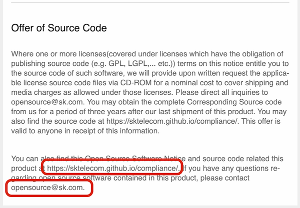
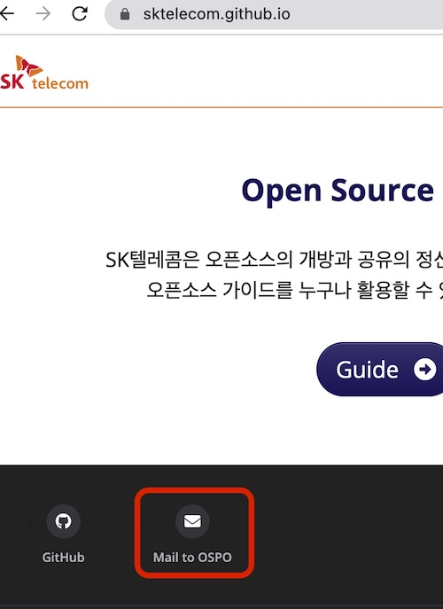
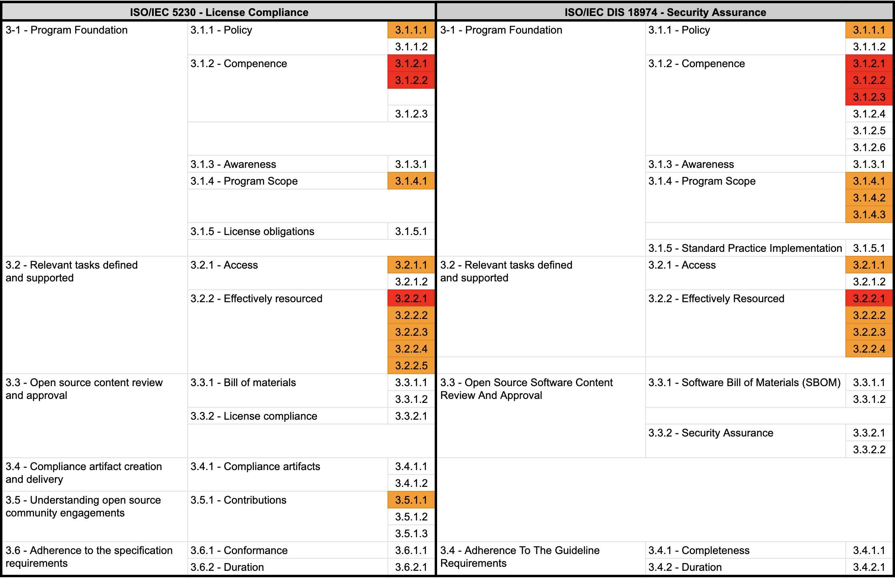

## 1. Documenting an Open Source Policy

An enterprise must establish and document an open source policy consisting of principles that let the organizations involved in developing, servicing, and delivering supplied software use open source correctly, and must propagate this policy throughout the organization.

To this end, the ISO standards commonly require a documented open source policy and security assurance policy as follows.

{}

* 3.1.1.1 - A documented open source policy.<br>`A documented open source policy`

{}


{}

* 3.1.1.1: A documented Open Source Software Security Assurance policy <br>`A documented Open Source Software Security Assurance policy`

{}

A typical open source policy includes the following. An enterprise must create and document an open source policy that includes these principles:

1. Principles for minimizing open source license compliance and security vulnerability risk when delivering supplied software products and services
2. Principles for contributing to external open source projects
3. Principles for releasing the enterprise's own software as open source
4. Principles for generating and managing the Software Bill of Materials (SBOM) of open source software components
5. Principles for responding to known vulnerabilities and newly discovered vulnerabilities

The open source policy must also be propagated to program participants and reviewed and updated regularly. This ensures the policy always stays current and reflects the organization's requirements.


## 2. What the Open Source Policy Must Cover

An open source policy must include the following core content:

### (1) Open Source License Compliance Principles

To achieve open source license compliance, the following principles must be established:

- Identify and document all open source included in supplied software
- Determine and comply with the license obligations of each open source
- Produce compliance artifacts that satisfy license obligations
- Fulfill license obligations such as open source notices and source code disclosure

### (2) Open Source Security Assurance Principles

To achieve open source security assurance, the following principles must be established:

- Monitor known vulnerabilities and newly discovered vulnerabilities in the open source components of supplied software
- Perform a risk/impact assessment when a vulnerability is found
- Respond promptly and apply patches for severe vulnerabilities
- Notify customers of vulnerability information and provide updates

### (3) Responding to Open Source Risk

To minimize the license and security risks that come with using open source, the following procedures must be established:

1. Identify open source and review its license obligations
2. Design the architecture with open source licenses in mind
3. Produce open source compliance artifacts
4. Generate and manage the Software Bill of Materials (SBOM)
5. Respond to open source license compliance issues
6. Respond to open source security vulnerabilities

You can see how these principles are documented in [6. Use of Open Source](../../templates/1-policy/) of [Appendix 1] the open source policy template.


```
1. Use of Open Source

When developing and delivering supplied software, the obligations required by each open source license must be observed. The activities carried out for this purpose are called open source license compliance.

For proper open source license compliance activities and security assurance, the software development/delivery organization must comply with the following and record and retain the entire process in an issue tracking system.

(1) Identify open source and review license obligations

When introducing open source into supplied software development, first identify what the open source license is, and review and confirm the obligations the license requires.

The company's [Open Source License Guide] includes a list of major open source licenses, and for each license, it explains the obligations required by each of the following distribution forms.

- Binary form
- Source form
- Strong/weak Copyleft
- SaaS-based delivery
- Whether modified
- Inclusion of open source requiring attribution, etc.

Software development/delivery organizations can refer to this guide when reviewing open source license obligations. If a review of an open source license not covered by this guide is needed, contact the open source program manager.

(2) Design with open source licenses in mind

Identify the coupling relationships of open source and design the software architecture so that the company's own code is not affected by open source licenses.

The company's [Open Source License Guide] explains the source code disclosure scope for each open source license and design methods for preventing disclosure of the company's own code.

(3) Produce open source compliance artifacts

The most basic element of open source license compliance activity is understanding the state of open source included in supplied software. This is precisely to properly satisfy the open source license requirements that are the core of open source license compliance. In other words, a set of compliance artifacts must be produced for the open source included in supplied software.

Open source compliance artifacts fall into two broad categories.

1. Open source notice: a document providing the full text of open source licenses and copyright information
2. Source code package to be disclosed: a package that gathers the source code to be disclosed to fulfill the obligations of open source licenses such as GPL and LGPL that require source code disclosure

To compile, distribute, and archive these compliance artifacts, the following must be observed.

- Compile the open source notice or the source code package to be disclosed according to the conditions required by each license. For example, if a license requires that the full text of the license be enclosed, providing only a link is not sufficient.
- Store the compiled artifacts in a separate repository.
- If the source code to be disclosed is provided via a written offer, publish a download link so that the repository of compiled artifacts can be accessed externally.

The company's open source process can be used to issue the open source notice and compile the source code package to be disclosed.

(4) Generate the Software Bill of Materials (SBOM)

There must be a process to generate and maintain an SBOM (Software Bill of Materials) that includes the details of each open source software component making up the supplied software.

The company's open source process can use open source tools to generate and retain the SBOM.

(5) Compliance issue response procedure

When a compliance issue is raised, the open source program manager performs the following procedure to respond promptly.

1. Acknowledge receipt of the inquiry and specify a reasonable resolution time.
2. Confirm whether the issue content actually points to a real problem. (If not, inform the person who raised the issue that it is not a problem.)
3. If it is a real problem, set a priority and decide on an appropriate response plan.
4. Carry out the response and, if necessary, appropriately supplement the open source process.
5. Preserve the above using the issue tracking system.

(6) Open source security assurance management

A documented procedure for detecting and resolving known vulnerabilities in the open source software components of supplied software must be established and maintained. This procedure must include the following.

- Apply methods for discovering the existence of known vulnerabilities
- Perform a risk/impact assessment for each discovered vulnerability
- Take appropriate action such as contacting customers or upgrading software components when necessary

The following processes must also be built.

- Identify structural and technical threats to supplied software
- Apply continuous and repeated security testing
- Confirm that identified risks have been resolved before the release of supplied software
- Secure monitoring and response capability after supplied software is released to the market

A record must be kept of the known vulnerabilities and newly discovered vulnerabilities identified for each open source software component, and of the actions taken.
```

### (4) Internal Responsibility Assignment Procedure

The open source policy must address a procedure for internally assigning responsibility to resolve open source management issues.

The ISO standards commonly require a documented procedure for assigning internal responsibility as follows.

{}

* 3.2.2.4 - A documented procedure that assigns internal responsibilities for open source compliance.<br>`A documented procedure that assigns internal responsibilities for open source compliance`

{}


{}

* 3.2.2.4: A documented procedure that assigns internal responsibilities for Security Assurance.<br>`A documented procedure that assigns internal responsibilities for Security Assurance`

{}

The open source program manager must identify license compliance issues and appropriately assign responsibility to the person in charge of each role to resolve them. Likewise, for open source security vulnerability issues, the person in charge of security identifies the issue and assigns responsibility to the appropriate personnel to resolve it.

To this end, a documented procedure for assigning internal responsibility can be reflected in the open source policy as in the example below.

```
4. Roles, Responsibilities, and Competencies

To ensure the policy is effective, the following defines the roles and responsibilities and the competencies the person in charge of each role must have.

(2) Open Source Program Manager

- Defines the roles necessary for open source license compliance and designates the responsible organization and person in charge of each role. Consults with the OSRB when necessary.

(6) Security Lead

- Assigns responsibility for each task so that open source security assurance can be carried out successfully.
```

Through this procedure, internal responsibility for open source license compliance and security assurance is clearly assigned, so that each person in charge can understand and perform their role. Consultation with the [OSRB (Open Source Review Board)](https://www.linuxfoundation.org/tools/open-source-glossary/#osrb) also helps maintain consistency with the organization's overall open source strategy.

The internal responsibility assignment procedure must be reviewed and updated regularly, and must be able to be flexibly adjusted as the organization's structure or projects change. This allows the efficiency and effectiveness of open source management to continuously improve.


### (5) Responding to Non-Compliant Cases

An enterprise must document a procedure for promptly reviewing and responding to non-compliant cases in open source license compliance and security assurance.

ISO/IEC 5230 and ISO/IEC 18974 commonly require a documented procedure for reviewing and remediating non-compliant cases as follows.

{}

* 3.2.2.5 - A documented procedure for handling the review and remediation of non-compliant cases.<br>`A documented procedure for handling the review and remediation of non-compliant cases`

{}

{}

* 3.2.2.5: A documented procedure for handling the review and remediation of non-compliant cases.<br>`A documented procedure for handling the review and remediation of non-compliant cases`

{}

To this end, an enterprise can reflect a documented procedure for reviewing and remediating non-compliant cases in the open source policy as in the example below.

```
6. Use of Open Source

(5) Compliance and Security Assurance Issue Response Procedure

When a license compliance or security assurance issue is raised, the open source program manager performs the following procedure to respond promptly:

1. Acknowledge receipt of the inquiry and specify a reasonable resolution time.
2. Confirm whether the issue content actually points to a real problem. (If not, inform the person who raised the issue that it is not a problem.)
3. If it is a real problem, set a priority and decide on an appropriate response plan.
   - For license compliance issues, consult with the legal lead to establish a plan for meeting license obligations.
   - For security assurance issues, consult with the security lead to establish a plan for resolving the vulnerability.
4. Carry out the response and, if necessary, appropriately supplement the open source process.
5. Record and preserve the above using the issue tracking system.
6. Analyze the root cause of the non-compliant case and establish an improvement plan to prevent recurrence.
7. Report the non-compliant case and the response outcome to the OSRB (Open Source Review Board) and, if necessary, discuss ways to improve the policy and process.
```

Through this procedure, an enterprise can systematically manage non-compliant cases related to open source license compliance and security assurance, and pursue continuous improvement. In addition, using a standardized format such as [SPDX](https://spdx.dev/) to manage license and security information makes it possible to identify and respond to non-compliant cases even more effectively.

### (6) Staffing and Budget Support

An enterprise must provide sufficient resources for the open source program to function smoothly. Personnel for each role in the program must be appropriately staffed, and adequate budget and working time must be guaranteed. If not, a procedure to compensate for this must be put in place.

The ISO standards commonly require that the personnel for each role in the program be properly staffed and that adequate funding be provided, as follows.

{}

* 3.2.2.2 - The identified program roles have been properly staffed and adequate funding provided.<br>`The personnel for each role in the program must be properly staffed and adequate funding provided.`

{}


{}

* 3.2.2.2: The identified Program roles have been properly staffed and adequate funding provided;<br>`The personnel for each role in the program must be properly staffed and adequate funding provided.`

{}

To this end, an enterprise can reflect content on staffing and budget support in the open source policy as in the example below:

```
4. Roles, Responsibilities, and Competencies

The head of the organization responsible for each role designates a person in charge within the organization and allocates adequate time and budget for that person to fully perform the role.

- If the person in charge of each role is not adequately supported while performing the role, they must raise the issue with the open source program manager.
- The open source program manager discusses the resolution with the relevant organization head. If not resolved adequately, the open source program manager may request the OSRB to resolve the issue.
- The OSRB shares the issue with the head of the higher organization and requests resolution.
```

In addition, an enterprise can strengthen staffing and budget support by considering the following:

1. Assign dedicated personnel to the open source program manager
2. Secure a budget for purchasing specialized tools for open source license compliance and security assurance
3. Set a budget for training and building the competency of program participants
4. Allocate a budget for consulting with outside experts
5. Establish a regular process for reviewing personnel and budget

Through this support, an enterprise can raise the effectiveness of its open source license compliance and security assurance program and meet the requirements of [ISO/IEC 5230](https://www.iso.org/standard/81039.html) and [ISO/IEC 18974](https://www.iso.org/standard/34044.html).


### (7) Providing Expert Advice

When the person in charge of each role needs a professional review to resolve an open source issue, the enterprise must provide a way to request advice for this.

The ISO standards commonly require a way to use internal or external professional advice to resolve issues, as follows.

{}

* 3.2.2.3 - Identification of legal expertise available to address open source license compliance matters which could be internal or external. <br>`A way to use internal or external professional legal advice to resolve open source license compliance issues`

{}


{}

* 3.2.2.3: Identification of expertise available to address identified Known Vulnerabilities<br>`A way to use professional technical advice to resolve identified known vulnerabilities`

{}

For open source license compliance issues, the company's internal legal team is the primary owner, and if an issue is contentious, an outside law firm with attorneys specializing in open source can be used.

For open source security vulnerability issues, the company's internal security team is the primary owner, and if an issue is complex and contentious, advice can be requested from an outside security specialist firm.

To this end, an enterprise can reflect content on providing advice in the open source policy as in the example below.

```
4. Roles, Responsibilities, and Competencies

(4) Legal Lead

The legal lead provides advice on legal risks and mitigation measures that may arise in the course of using open source, such as interpreting open source licenses and obligations.

- Provides a reasonable way for program participants to inquire about open source license compliance issues.
- Provides advice on license and intellectual property issues, including conflicts caused by incompatible open source licenses.
- Reviews necessary legal matters, such as open source licenses and the CLA (Contributor License Agreement), when contributing to external open source projects.
- If an issue is contentious, requests advice from an outside law firm with attorneys specializing in open source.

(6) Security Lead

The security lead operates open source security vulnerability analysis tools and builds a system so that security vulnerability analysis is smoothly performed for all supplied software.

- Provides a reasonable way for program participants to inquire about known vulnerabilities or newly discovered vulnerabilities, and uses outside professional technical advice when necessary to resolve vulnerabilities.
```

For reference, the [OpenChain Project](https://www.openchainproject.org/) provides, through its partner program, a list of global law firms that offer open source-related advice: [https://www.openchainproject.org/partners](https://www.openchainproject.org/partners)

Law firms registered as OpenChain partners meet the requirements set by the OpenChain Project, and in South Korea, [Bae, Kim & Lee LLC](https://www.bkl.co.kr/) is the sole registrant.


### (8) Specifying Scope of Application

A single open source policy (program) does not necessarily have to apply to the entire organization. The scope of application can be set differently depending on the characteristics of each organization and product within the enterprise. For example, an organization that does not deliver any supplied software at all can be excluded from the scope of the open source program.

The ISO standards commonly require a written statement that clearly defines the scope and limits of the program, as follows.

{}

* 3.1.4.1 - A written statement that clearly defines the scope and limits of the program. <br>`A written statement that clearly defines the scope and limits of the program`

{}

{}

* 3.1.4.1: A written statement that clearly defines the scope and limits of the Program <br>`A written statement that clearly defines the scope and limits of the Program`
* 3.1.4.2: A set of metrics the program shall achieve to improve<br>`A set of metrics the program must achieve to improve`
* 3.1.4.3: Documented Evidence from each review, update, or audit to demonstrate continuous improvement.<br>`Documented evidence demonstrating that a review, update, or audit was performed for continuous improvement`

{}

An enterprise must clearly define the scope and limits of the open source program in view of the characteristics of the organization and products, and state this in the open source policy.

Also, as the organizational structure, products, and services change to match the business environment, situations may arise where the scope of the program needs to be determined or revised. An enterprise must establish metrics for assessing scope, and perform reviews and inspections for continuous improvement to fix shortcomings.

To this end, an enterprise must have a system for clearly defining the scope of application in the open source policy and documenting the history of activities, as follows.

```
2. Scope of Application

This policy applies to the following three parts.

1. It applies to all supplied software the company provides or distributes externally. However, using open source solely for internal use is not within the scope of this policy.
2. It applies when program participants contribute to external open source projects.
3. It applies when releasing internal code as open source.

The scope of application can change to match the company's business environment. In particular, to ensure continuous effectiveness, the open source program manager investigates at least once a month whether there is any supplied software distributed or serviced externally that is not covered by this policy. If even one such case is found, this is used as the basis for determining that the scope of application must be changed.

The procedure for changing the scope of application is as follows.

1. When the open source program manager determines that a change to the policy's scope of application is needed due to changes in the company's business environment, such as a new business or reorganization, a proposal for this is submitted to the OSRB.
2. The OSRB approves an appropriate level of change to the scope of application.
3. The OSRB revises the open source policy to change the scope of the policy.

The open source program manager continuously documents the history of reviews, updates, and inspections performed at least once a month to improve the scope of application, using the [Jira](https://www.atlassian.com/software/jira) Issue Tracker.
```

Therefore, an enterprise must have a system for clearly defining the scope of application in the open source policy and documenting the history of activities, as shown above.


### (9) Responding to External Inquiries

Customers and open source copyright holders sometimes contact an enterprise regarding open source-related inquiries, requests, and claims about supplied software developed using open source. The main content of external inquiries and requests is as follows:

- Inquiries about whether open source was used in a specific piece of supplied software
- Requests to provide source code under the GPL or LGPL licenses referenced in a written offer
- Requests to explain and disclose source code for open source found in supplied software but not listed in the open source notice
- Requests to provide missing files and build instructions for source code disclosed under obligations such as GPL and LGPL
- Requests for attribution
- Inquiries and requests related to open source security vulnerabilities

An enterprise must designate a person in charge of handling these external inquiries. This is typically the open source program manager.

There have been cases where an outside open source developer, wanting to discuss an open source-related issue with a specific enterprise, could not find a way to contact the enterprise's representative and ended up filing a legal claim directly. To prevent this, an enterprise must always publicly disclose a way for third parties to make open source-related inquiries and requests to the enterprise.

The ISO standards commonly require a publicly available way for third parties to make open source inquiries, as follows:

{}

* 3.2.1.1 - Publicly visible method that allows any third party to make an open source license compliance inquiry (e.g., via a published contact email address, or the Linux Foundation's Open Compliance Directory).<br>`A publicly available way for a third party to make an open source license compliance inquiry (e.g., a contact email address, or use of the Linux Foundation's Open Compliance Directory)`

{}


{}

* 3.2.1.1: Publicly visible method to allow third parties to make Known Vulnerability or Newly Discovered Vulnerability enquires (e.g., via an email address or web portal that is monitored by Program Participants)<br>`A publicly available way for a third party to make an inquiry about a known vulnerability or a newly discovered vulnerability (e.g., an email address or a web portal monitored by program participants)`

{}

The following ways can be provided so that outside parties can make open source-related inquiries to the enterprise:

1. Publish a representative email address for the organization in charge of open source.
2. Use the [Linux Foundation's Open Compliance Directory](https://compliance.linuxfoundation.org/references/open-compliance-directory/).
3. If the enterprise has an open source website, publish the email address through it.

Including and publishing the representative email address of the organization in charge of open source in the open source notice enclosed with supplied software is also a good approach.

An enterprise can reflect content on responding to external inquiries in the open source policy as in the example below:

```
9. Responding to External Inquiries

(1) Responsibility for Responding to External Inquiries

Responding to inquiries and requests about open source from external parties is the responsibility of the open source program manager.

- The open source program manager may assign all or part of the handling of an inquiry to an appropriate program participant within the company. Legal is consulted for handling when necessary.
- Any program participant who receives an external inquiry about open source must notify the open source program manager so a prompt response can be made.

(2) Publishing Contact Information

The open source program manager publicly provides the contact information of the person in charge so that external parties can make open source-related inquiries and requests.

- Provides contact email information in the open source notice.
- Provides email information on the open source website.
- Registers contact information in the Linux Foundation's Open Compliance Directory.

(3) External Inquiry Response Procedure

Responding to external open source inquiries promptly and accurately can greatly reduce the risk of claims or legal action. To this end, the company follows the external inquiry response procedure defined in the company's open source process for responding to external open source inquiries.
```

[SK telecom](https://www.sktelecom.com/) includes an open source notice in all of its supplied software. The open source notice provides the address of the SK telecom open source website together with an email address for contacting the open source program office.



<center><i>SK telecom open source notice</i></center><br>

The [SK telecom open source website](https://sktelecom.github.io/) also provides an email address for contacting the open source program office.



<center><i>SK telecom open source website</i></center><br>


### (10) Open Source Contribution

Global software companies value not only using open source to build products and provide services, but also the strategic value that can be created by contributing to open source projects. However, approaching this without a sufficient understanding of and strategy for the open source project ecosystem and how communities operate can unexpectedly damage the company's reputation and create legal risk. It is therefore important for an enterprise to establish a strategy and policy for participating in and contributing to open source projects.

ISO/IEC 5230 requires a documented open source contribution policy, as follows.

{}

* 3.5.1.1 - A documented open source contribution policy<br>`A documented open source contribution policy`

{}

This policy on open source contribution can be found in [7. Open Source Contribution](../../templates/1-policy/#7-contribution-to-external-open-source-projects) of the [Appendix 1] open source policy sample.

```
7. Open Source Contribution

The company encourages participation and contribution to external open source projects to create business value from open source. However, this process requires care to avoid unintended exposure of the company's intellectual property or infringement of third-party rights. To this end, when a program participant of the company contributes to an external open source project, the following must be observed.

(1) Review Request and Approval

From a copyright standpoint, an open source contribution grants the open source project the right to modify, use, and distribute the work. In some cases, copyright must even be assigned to the open source project. Generally, the copyright of a work created during employment is owned by the employer. In other words, a work created by a program participant is owned by the company. A program participant contributing a work to open source on their own judgment can cause unnecessary copyright infringement issues.

Therefore, if there is an open source project you wish to contribute to, follow the review request and approval procedure before the first contribution, in accordance with the open source contribution process.

However, in the following simple cases, since the risk of copyright infringement is not significant, a program participant may contribute based on their own judgment without going through the review procedure.

- A small code snippet of 10 lines or fewer
- Questions/answers on Stack Overflow
- Administrative activity on GitHub: creating issues, reviewing/approving pull requests, etc.

...
```

The open source contribution policy must include the contribution procedure, approval process, measures for protecting intellectual property rights, and guidance on signing a [CLA (Contributor License Agreement)](https://en.wikipedia.org/wiki/Contributor_License_Agreement). It must also provide guidelines for behavior when program participants engage with the open source community on behalf of the company.

### (11) SBOM Generation and Management

A procedure for generating and managing the [SBOM (Software Bill of Materials)](https://www.cisa.gov/sbom) must be established:

- Select the SBOM generation tool and methodology
- Ensure the accuracy and completeness of SBOM information
- Establish an SBOM update and version management process
- Define a method for sharing and distributing the SBOM

An enterprise can reflect content on SBOM generation and management in the open source policy as in the example below:

```
6. Use of Open Source

(4) Generate the Software Bill of Materials (SBOM)

There must be a process to generate and maintain an SBOM (Software Bill of Materials) that includes the details of each open source software component making up the supplied software.

The company's open source process can use open source tools to generate and retain the SBOM.

- The SBOM is generated using a standard format such as [SPDX](https://spdx.dev/) or [CycloneDX](https://cyclonedx.org/).
- An SBOM is generated and managed for all supplied software.
- The SBOM is updated and version-controlled with each release of the supplied software.
- The accuracy of SBOM information is periodically verified.
- Preparations are made to share the SBOM with customers and regulators when necessary.
```

SBOM generation and management are core elements of open source license compliance and security assurance. Through this, an enterprise can accurately understand the open source components in use and respond promptly to known vulnerabilities or license issues.

An enterprise must include these SBOM-related principles in its open source policy to build a systematic SBOM management system.

## 3. Summary

Documenting an open source policy is the single most important process for effective open source management.

The next page provides a sample open source policy document that meets the requirements of ISO/IEC 5230 and ISO/IEC 18974 mentioned above: [[Appendix 1] Open Source Policy (template)](../../templates/1-policy)

Referring to the content above, it is necessary to establish appropriate principles for each requirement that fit the company's situation. It is also important to go beyond documentation alone and consider actionable procedures. A policy that is words alone is of no use.

An open source policy must include the following core elements:

1. Open source license compliance principles
2. Open source security assurance principles
3. Response to open source risk
4. Internal responsibility assignment procedure
5. Response to non-compliant cases
6. Staffing and budget support plan
7. Method of providing expert advice
8. Specification of the policy's scope of application
9. External inquiry response procedure
10. Open source contribution guidelines
11. Method for generating and managing the SBOM (Software Bill of Materials)

Establishing and documenting an open source policy that includes these elements makes it possible to meet the key requirements of the ISO/IEC 5230 and ISO/IEC 18974 standards.



A policy must not stop at documentation alone; it must actually be implemented within the organization. This requires regular review and updates, along with training for program participants. An effective open source policy will help systematically manage the organization's use of and contribution to open source, and minimize potential legal and security risks.
