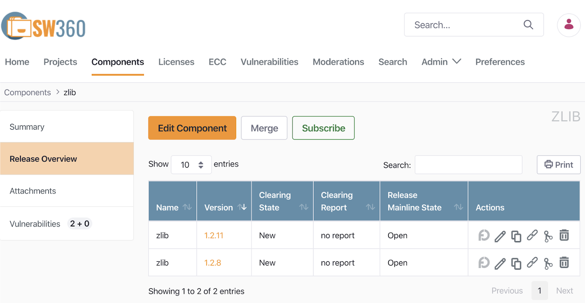
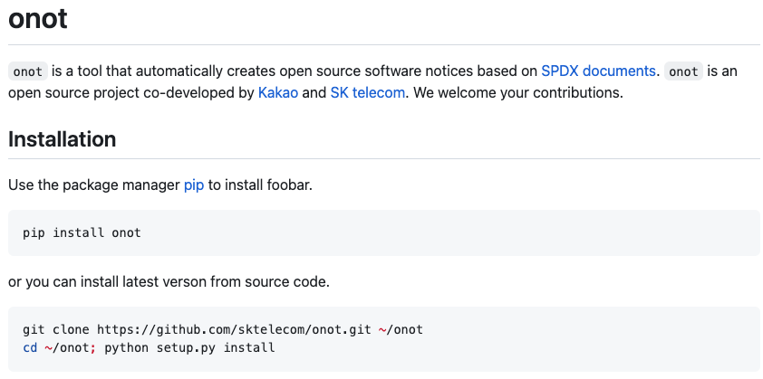
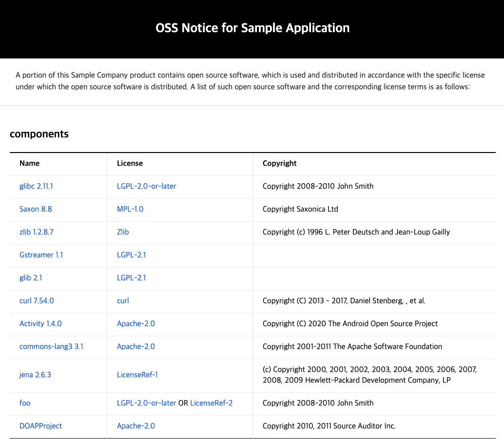
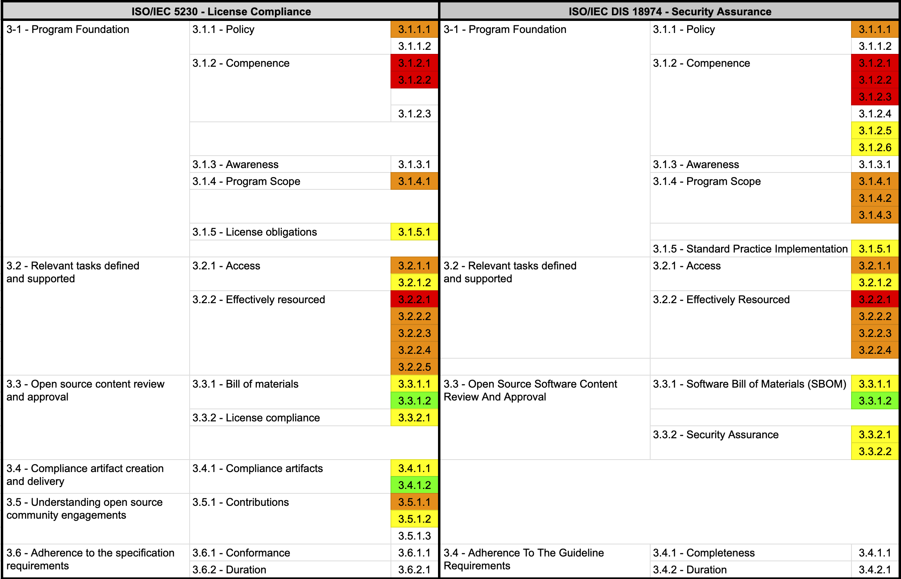

## 1. Source Code Scanning Tools

Source code scanning tools can be used in the open source identification and inspection stage of the open source process. Source code scanning tools help identify the open source included in supplied software and extract license and copyright information. These tools range from free open source-based tools to commercial tools. Each tool has its own strengths, but no tool offers a perfect feature set that solves every problem. An enterprise must therefore choose a tool suited to the characteristics and requirements of its supplied software.

Many enterprises use these automated source code scanning tools together with manual review. Two major open source source code scanning tools are introduced here.

### (1) FOSSology

[FOSSology](https://www.fossology.org/) is an open source project managed by the Linux Foundation, a source code scanning tool that supports a license compliance workflow.



<center><i>https://www.fossology.org/</i></center>



Key features:
- Source code scanning and license identification
- Extraction of license and copyright information
- Web-based user interface
- Support for analyzing large codebases

FOSSology is free for enterprises to use and receives continuous improvement and support from the open source community.

For how to install and use FOSSology, refer to the [FOSSology guide](https://openchain-project.github.io/OpenChain-KWG/guide/governance_iso5230/appendix/3-tools/fossology/).

### (2) SCANOSS

[SCANOSS](https://www.scanoss.com/) is a platform for identifying and managing open source software components.

Key features:
- Fast source code scanning and open source component identification
- License and vulnerability information
- Integration support via API
- Generation of the SBOM (Software Bill of Materials)

SCANOSS offers both a free and a paid version, and supports both cloud-based service and on-premises solutions.

These source code scanning tools can be used to effectively identify and manage the open source components in supplied software. However, rather than relying entirely on the tool's results, expert review and judgment by program participants must also be part of the process.

## 2. Dependency Analysis Tools

Modern software development commonly uses build environments that support package managers such as [Gradle](https://gradle.org/) and [Maven](https://maven.apache.org/). In these build environments, dependency libraries needed at build time are fetched from a remote repository even without the source code, and used to compose the supplied software. These dependency libraries are included in the supplied software but are not detected by source code scanning tools. It is therefore important to use tools for dependency analysis.

### (1) OSS Review Toolkit

The [OSS Review Toolkit (ORT)](https://github.com/oss-review-toolkit/ort) is a suite of tools for automating open source license compliance. ORT provides a dependency analysis tool called the Analyzer.

Key features of the Analyzer:
- Support for various package managers (Maven, Gradle, NPM, etc.)
- Generation of a project's dependency tree
- Extraction of license and copyright information
- Generation of reports in SPDX format


<center><i>https://github.com/oss-review-toolkit/ort#analyzer</i></center>


### (2) FOSSLight Dependency Scanner

[FOSSLight Dependency Scanner](https://github.com/fosslight/fosslight_dependency_scanner), developed by [LG Electronics](https://www.lg.com/) and released as open source, is a dependency analysis tool that supports various package managers.

Key features:
- Support for various package managers including Gradle, Maven, NPM, PIP, Pub, and Cocoapods
- Extraction of open source license and version information
- Generation of the SBOM (Software Bill of Materials)


<center><i>https://fosslight.org/ko/scanner/</i></center>



These dependency analysis tools can be used to accurately identify the open source components included in supplied software and generate an SBOM. This helps meet the requirements of ISO/IEC 5230 and ISO/IEC 18974.

## 3. Open Source Governance / SBOM Management Tools

Open source governance and SBOM (Software Bill of Materials) management are essential for effective open source license compliance and security assurance. The ISO/IEC 5230 and ISO/IEC 18974 standards require documenting and retaining records of the open source software components included in supplied software.

{}

* 3.3.1.2 - Open source component records for the supplied software that demonstrates the documented procedure was properly followed.<br>`Open source component records for the supplied software that demonstrate that the documented procedure was properly followed`

{}


{}

* 3.3.1.2: Open Source Software Component Records for the Supplied Software that demonstrates the documented procedure was properly followed.<br>`Open source software component records for the supplied software that demonstrate that the documented procedure was properly followed`

{}

An SBOM can be managed even with a spreadsheet program, but manual management becomes difficult as the number of supplied software products and versions grows. Introducing an automated open source tool is therefore efficient.

### (1) SW360

[SW360](https://github.com/eclipse-sw360/sw360) is an open source project sponsored by the Eclipse Foundation that provides the ability to track the open source inventory for each piece of supplied software.



Key features:
- Project, component, and license management
- SBOM generation and management
- Vulnerability management
- Tracking of license obligations


For how to install and use SW360, see the [SW360 guide](https://openchain-project.github.io/OpenChain-KWG/guide/governance_iso5230/appendix/3-tools/sw360/).

### (2) FOSSLight

[FOSSLight](https://fosslight.org/) is a comprehensive open source management tool developed by [LG Electronics](https://www.lg.com/) and released as open source.

Key features:
- SBOM generation and management
- Open source license compliance checks
- Vulnerability management
- Open source notice generation


<center><i>https://fosslight.org/fosslight-guide/started/2_try/4_project.html</i></center>


LG Electronics has used FOSSLight for years to manage SBOMs company-wide, and released it as open source in June 2021. It provides a Korean-language guide to help domestic enterprises use it.


<center><i>https://fosslight.org/</i></center>


Using these tools, an enterprise can effectively carry out open source governance and manage its SBOM, and can meet the requirements of ISO/IEC 5230 and ISO/IEC 18974.

## 4. Open Source Security Vulnerability Management Tools

To effectively manage known vulnerabilities or newly discovered vulnerabilities included in supplied software, an enterprise must build an automated tool environment. Three major open source security vulnerability management tools are introduced here.

### (1) OWASP Dependency-Check

[OWASP Dependency-Check](https://owasp.org/www-project-dependency-check/) is an open source tool that analyzes a project's dependencies to detect known vulnerabilities.

Key features:
- Support for various languages and package managers (Java, .NET, JavaScript, Ruby, etc.)
- Integration with the CVE (Common Vulnerabilities and Exposures) database
- Easy integration with CI/CD pipelines
- Generation of reports in various formats such as HTML, XML, CSV, and JSON

### (2) SW360

[SW360](https://github.com/eclipse/sw360) is an open source software component management tool managed by the Eclipse Foundation that also provides security vulnerability management features.

Key features:
- Automatic vulnerability checks for registered releases
- Periodic collection of CVE information (scheduled every 24 hours)
- Viewing security vulnerabilities by project
- Tracking the impact of newly published vulnerabilities on existing products

For how to manage security vulnerabilities with SW360, refer to the [SW360 guide](https://openchain-project.github.io/OpenChain-KWG/guide/governance_iso5230/appendix/3-tools/sw360/).

### (3) FOSSLight

[FOSSLight](https://fosslight.org/ko/) similarly acquires security vulnerability information automatically, automatically checks project information where a security vulnerability has been detected, and provides notifications such as email when necessary.


Using these tools, an enterprise can effectively manage open source security vulnerabilities while meeting the requirements of ISO/IEC 18974.


## 5. Open Source Compliance Artifact Generation Tools

The open source notice, a key open source compliance artifact, is a document that provides the copyright and license information of the open source included in supplied software. An open source notice can be written manually, but it is more efficient to use a tool that generates it automatically.

### (1) onot

[SK telecom](https://www.sktelecom.com/) has released as open source, under the name [onot](https://github.com/sktelecom/onot), the tool it uses internally to automatically generate open source notices. [Kakao](https://www.kakaocorp.com/) also participated in the joint development by contributing key features.



<center><i>How to install onot</i></center><br>

`onot` is a tool that automatically converts an SBOM written in the [SPDX](https://spdx.dev/) document format into an open source notice format. It is a Python program that is lightweight and simple to use.



<center><i>Sample open source notice generated by onot</i></center><br>

### (2) FOSSLight

[FOSSLight](https://fosslight.org/) also provides a feature that automatically generates an open source notice based on the SBOM it has acquired.


<center><i>https://fosslight.org/fosslight-guide/started/2_try/4_project.html</i></center>



Using these tools makes it possible to automate and standardize the process of generating open source notices, raising the efficiency and accuracy of the open source license compliance process. This also helps meet the requirements of ISO/IEC 5230 and ISO/IEC 18974.

## 6. Archiving Open Source Compliance Artifacts

Systematically archiving and managing open source compliance artifacts is very important for open source license compliance. In particular, for licenses such as GPL and LGPL that require source code disclosure, the source code must be available for at least three years after the distribution of the supplied software.

To this end, the ISO/IEC 5230 standard requires a documented procedure for archiving copies of the compliance artifacts of distributed software, as follows.

{}

* 3.4.1.2 - A documented procedure for archiving copies of the compliance artifacts of the supplied software - where the archive is planned to exist for a reasonable period of time (Determined by domain, legal jurisdiction and/or customer contracts) since the last offer of the supplied software; or as required by the identified licenses (whichever is longer). Records exist that demonstrate the procedure has been properly followed.<br>`A documented procedure for archiving copies of the compliance artifacts of distributed software - the archived copies must be kept for a reasonable period after the last offer of the distributed software, or for the period required by the identified licenses, whichever is longer. Records must exist that demonstrate this procedure has been properly followed.`

{}

To this end, an enterprise must build a system to safely archive its open source compliance artifacts and disclose them externally when necessary.

### (1) GitHub Pages

[GitHub Pages](https://pages.github.com/) is a service that lets you host a website directly from a GitHub repository. It can be used to archive and publish open source compliance artifacts.

The way to archive open source compliance artifacts using GitHub Pages is as follows:

1. Create a dedicated repository on GitHub
2. Upload the open source notice and source code to the repository
3. Activate the website through GitHub Pages settings
4. Configure it so it can be accessed externally through a public URL

Using GitHub Pages has the following benefits:

- Free to use
- Provides version control
- High availability and stability
- Easy to update and manage

This tool environment can be seen in reference on SK telecom's open source website.


<center><i>https://sktelecom.github.io/compliance/</i></center>


This website was developed as open source, and its source code is public, so other enterprises can easily build a similar environment.



<center><i>https://github.com/sktelecom/sktelecom.github.io</i></center>



By using GitHub Pages to archive and publish open source compliance artifacts, an enterprise can effectively fulfill its open source license obligations and improve transparency.

## 7. Integration with Continuous Integration/Deployment (CI/CD) Tools

Integrating open source compliance and security assurance activities into a continuous integration/deployment (CI/CD) pipeline enables automated inspection and management throughout the development process. This makes it possible to discover and resolve open source-related issues early.

### (1) Jenkins Plugins

[Jenkins](https://www.jenkins.io/) is a widely used open source automation server that can integrate with open source compliance and security assurance tools through various plugins.

Major Jenkins plugins:

- [FOSSology Plugin](https://plugins.jenkins.io/fossology/): Integrates FOSSology scans into a Jenkins pipeline.
- [OWASP Dependency-Check Plugin](https://plugins.jenkins.io/dependency-check-jenkins-plugin/): Automates checks for known vulnerabilities or newly discovered vulnerabilities.
- [SW360 Plugin](https://github.com/eclipse/sw360/tree/main/jenkins-pipeline): Integrates SW360 with Jenkins to automate SBOM management.

Example Jenkins pipeline:

```groovy
pipeline {
    agent any
    stages {
        stage('Checkout') {
            steps {
                checkout scm
            }
        }
        stage('Dependency Scan') {
            steps {
                dependencyCheck additionalArguments: '', odcInstallation: 'Default'
            }
        }
        stage('License Scan') {
            steps {
                fossology()
            }
        }
        stage('SBOM Update') {
            steps {
                sw360UpdateProject()
            }
        }
    }
    post {
        always {
            dependencyCheckPublisher pattern: '**/dependency-check-report.xml'
        }
    }
}
```

This pipeline sequentially performs source code checkout, dependency vulnerability scanning, license scanning, and SBOM update.

### (2) GitLab CI/CD Pipeline

[GitLab CI/CD](https://docs.gitlab.com/ee/ci/) is a continuous integration/deployment tool built into GitLab, with pipelines defined through a `.gitlab-ci.yml` file.

Example GitLab CI/CD pipeline:

```yaml
stages:
  - scan
  - analyze
  - report

dependency_scan:
  stage: scan
  script:
    - docker run --rm -v $(pwd):/src owasp/dependency-check --scan /src --format "ALL" --out /src/reports

license_scan:
  stage: scan
  script:
    - docker run --rm -v $(pwd):/project fossology/fossology:latest /usr/local/fossology/fo_cli -c /project

sbom_update:
  stage: analyze
  script:
    - sw360 update-project

vulnerability_report:
  stage: report
  script:
    - generate_vulnerability_report
  artifacts:
    reports:
      dependency_scanning: reports/dependency-check-report.json

license_report:
  stage: report
  script:
    - generate_license_report
  artifacts:
    reports:
      license_scanning: reports/license-scan-report.json
```

This pipeline performs dependency vulnerability scanning, license scanning, SBOM update, and generation of vulnerability and license reports.

By integrating these processes into a CI/CD pipeline, an enterprise can automate open source compliance and security assurance activities and integrate them smoothly into the development workflow. This helps effectively meet the requirements of ISO/IEC 5230 and ISO/IEC 18974.


## 8. Summary

Once this tool environment is in place, the key requirements of the ISO/IEC 5230 and ISO/IEC 18974 standards can be met.



Using these tools brings the following benefits:

1. Source code scanning and dependency analysis tools make it possible to accurately identify the open source included in supplied software and determine its license.

2. Open source governance and SBOM management tools make it possible to systematically manage and track the open source components in supplied software.

3. Open source security vulnerability management tools make it possible to continuously monitor and respond to known vulnerabilities or newly discovered vulnerabilities.

4. Open source compliance artifact generation and archiving tools make it possible to efficiently generate and manage the documents needed to comply with license obligations.

5. Integration with CI/CD tools makes it possible to integrate the open source management process into the development workflow and automate it.

Building this tool environment allows an enterprise to carry out open source license compliance and security assurance activities in a systematic and efficient way, and provides significant help in meeting the requirements of ISO/IEC 5230 and ISO/IEC 18974.

By making effective use of open source management tools, an enterprise can minimize the legal risk that comes with using open source, respond promptly to security vulnerabilities, and build a transparent and trustworthy software supply chain. This will ultimately lead to improved competitiveness and greater customer trust for the enterprise.
