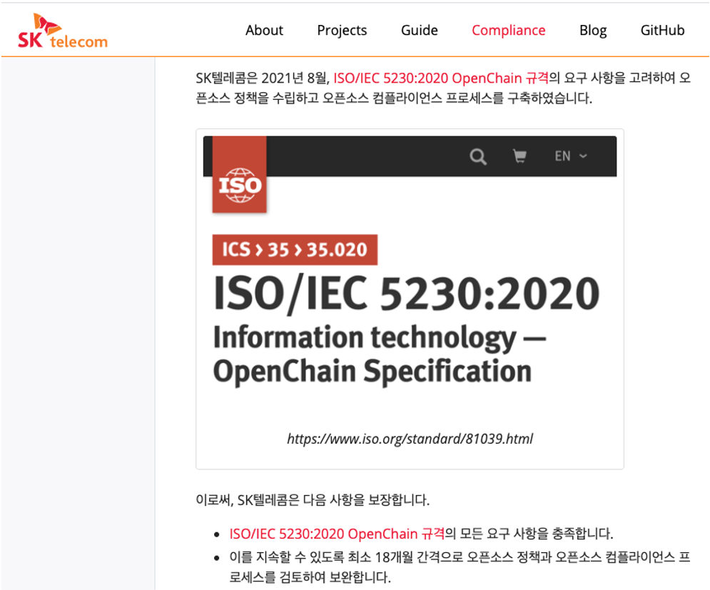
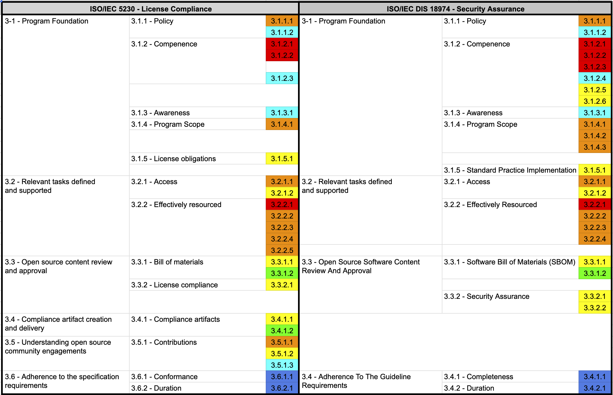

An enterprise that has built an open source program (open source policy / process / tools / organization) conforming to all the requirements of ISO/IEC 5230 and ISO/IEC 18974 must document and declare the following two items.

### (1) Confirming That Standard Requirements Are Met

ISO/IEC 5230 and ISO/IEC 18974 require a document confirming that the program meets all requirements, as follows:

{}

* 3.6.1.1 A document affirming the program specified in §3.1.4 satisfies all the requirements of this document.<br>`A document affirming that the program specified in §3.1.4 satisfies all the requirements of this specification`

{}

{}

* 3.4.1.1: Documented Evidence affirming the Program specified in §3.1.4 satisfies all the requirements of this document.<br>`Documented evidence affirming that the Program specified in §3.1.4 satisfies all the requirements of this document.`

{}

To this end, an enterprise must prepare a document containing the following content:

```
The open source program of [Company Name] meets all the requirements of ISO/IEC 5230:2020 (open source license compliance) and ISO/IEC 18974 (open source security assurance). 

This can be confirmed through the following documents and processes:
1. Open source policy document
2. Open source process document
3. Open source training and assessment records
4. SBOM (Software Bill of Materials) management system
5. Open source license compliance artifact generation and retention system
6. Open source security vulnerability management system
7. External inquiry response process records

[Date]
[Signature of Open Source Program Manager]
```

### (2) Declaring Continued Conformance Assurance

ISO/IEC 5230 and ISO/IEC 18974 also require a document confirming that all requirements continue to be met for 18 months after obtaining conformance certification:

{}

* 3.6.2.1 A document affirming the program meets all the requirements of this document, within the past 18 months of obtaining conformance validation.<br>`A document affirming that the program has met all the requirements of this specification version (v2.1) during the past 18 months since obtaining conformance validation`

{}

{}

* 3.4.2.1: A document affirming the Program meets all the requirements of this specification, within the past 18 months of obtaining conformance validation.<br>`A document affirming that the program has met all the requirements of this specification during the past 18 months since obtaining conformance validation`

{}

To this end, an enterprise must prepare and periodically update a document containing the following content:

```
[Company Name] guarantees that it will maintain a state of meeting all requirements for at least 18 months after obtaining conformance certification for ISO/IEC 5230:2020 (open source license compliance) and ISO/IEC 18974 (open source security assurance).

To this end, the following activities are carried out:
1. Conduct an internal audit at least every 6 months to verify that all requirements continue to be met
2. Obtain an external expert review at least once a year to assess the program's effectiveness
3. Provide ongoing training and competency assessment for program participants
4. Regularly review and update the open source policy and processes
5. Monitor and respond to changes in new technology trends and legal requirements

[Date]
[Signature of Open Source Program Manager]
```

An enterprise can include this document in its open source policy or publish it on a publicly accessible website. For example, [SK telecom](https://www.sktelecom.com/) publishes this content on its own open source portal site:

[https://sktelecom.github.io/compliance/iso5230/](https://sktelecom.github.io/compliance/iso5230/)
Through this documentation, an enterprise satisfies all the requirements of ISO/IEC 5230 and ISO/IEC 18974, and can guarantee ongoing management and improvement of its open source license compliance and security assurance.


