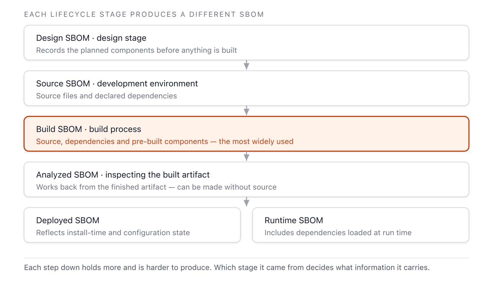

Not all SBOMs are the same. They are divided into levels based on how deep a dependency chain they
cover, and classified based on the point in the software lifecycle at which they were created.
Distinguishing these two axes makes it possible to clearly decide "which SBOM to require and which
SBOM to produce."

## Levels by Depth of Information

| Level | Description |
|---|---|
| Top-Level SBOM | A summary of the components directly integrated into or used by the product. Contains essential information such as component name and version. |
| Transitive SBOM | Includes not only direct dependencies but also the indirect (transitive) dependencies that those dependencies rely on in turn. |
| n-Level SBOM | Contains information hierarchically to an arbitrary depth (N levels), beyond the top-level overview. |
| Delivery SBOM | Describes all components and libraries included in a release or distribution package. |
| Complete SBOM | A complete inventory of all components, dependencies, and metadata present in a system. |

An organization does not need to commit to a single level. A common approach is to tailor the SBOM
delivered to consumers to a level that omits sensitive information while still meeting security
requirements, while internally maintaining a complete-level SBOM to track vulnerability updates.
This reduces the risk of exposing trade secrets and intellectual property while securing both
supply chain transparency and internal resilience.

The regulatory floor for obligations is also expressed in the language of levels. The EU Cyber
Resilience Act requires an SBOM that "cover[s] at the very least the top-level dependencies of the
product." There is no obligation to expand the entire dependency tree, but that is clearly the
direction of recommended practice.

## Classification by Point of Generation

The US CISA document *Types of Software Bill of Materials (SBOM)* divides SBOM into six types
aligned with the stages of the Software Development Life Cycle (SDLC). For the same product, the
information captured and its accuracy differ depending on when the SBOM was generated.

**Figure 1.** SBOM classification by SDLC stage *(source: CISA, Types of Software Bill of Materials
(SBOM), 2023)*

- **Design SBOM**: Records the components planned at the design stage, before the components
  actually exist.
- Source SBOM: Reflects the development environment and contains source files and dependencies.
- Build SBOM: Generated during the build process and includes information on source, dependencies,
  and pre-built components.
- Analyzed SBOM: Generated by inspecting the final artifact after the build.
- Deployed SBOM: A list of software installed and configured on a specific system, taking the
  deployment environment into account as well.
- Runtime SBOM: Monitors components while running, capturing dynamically loaded dependencies and
  external interactions as well.

The Build SBOM, generated at build time, is the most widely recommended in terms of accuracy and
automation, because it records exactly what the build tool actually assembled. Generation timing
and automation are covered in detail in [5. Tools and Automation](../../5-tools/).

## Sources

CISA (2023). *Types of Software Bill of Materials (SBOM)*.
<https://www.cisa.gov/resources-tools/resources/types-software-bill-materials-sbom> (accessed:
June 14, 2026). This is the primary basis for the classification of the six SBOM types (Design,
Source, Build, Analyzed, Deployed, Runtime). For attributes and maturity stages, see CISA (2024).
*Framing Software Component Transparency*, Third Edition.
<https://www.cisa.gov/resources-tools/resources/framing-software-component-transparency-2024>. The
EU Cyber Resilience Act's top-level dependency requirement is based on Regulation (EU) 2024/2847,
Annex I Part II(1).
