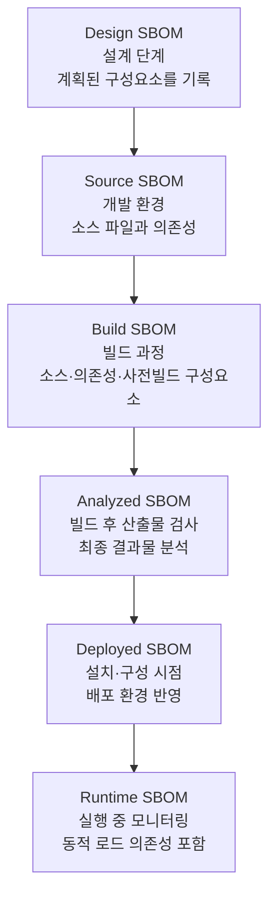

SBOM이라고 다 같은 SBOM이 아닙니다. 얼마나 깊은 의존성까지 담는가에 따라 수준이 나뉘고, 소프트웨어
수명주기의 어느 시점에 만들었는가에 따라 분류가 갈립니다. 두 축을 구분해 두면 "어떤 SBOM을
요구하고 어떤 SBOM을 만들지"를 명확히 정할 수 있습니다.

## 정보의 깊이에 따른 수준

| 수준 | 설명 |
|---|---|
| Top-Level SBOM | 제품에 직접 통합되거나 사용되는 구성요소의 요약. 구성요소 이름, 버전 등 필수 정보를 담습니다. |
| Transitive SBOM | 직접 의존성뿐 아니라 그 의존성이 다시 의존하는 간접(전이) 의존성까지 포함합니다. |
| n-Level SBOM | 최상위 개요를 넘어 임의의 깊이(N단계)까지 계층적으로 정보를 담습니다. |
| Delivery SBOM | 출시나 배포 패키지에 포함된 모든 구성요소와 라이브러리를 기술합니다. |
| Complete SBOM | 시스템에 존재하는 모든 구성요소와 의존성, 메타데이터의 완전한 목록입니다. |

조직은 하나의 수준만 고집할 필요가 없습니다. 소비자에게 전달하는 SBOM은 민감 정보를 빼고 보안
요구를 충족하는 수준으로 맞추되, 내부적으로는 완전한 수준의 SBOM을 유지해 취약점 업데이트를
추적하는 방식이 일반적입니다. 이렇게 하면 영업 비밀과 지식재산 노출 우려를 줄이면서도 공급망
투명성과 내부 복원력을 동시에 확보할 수 있습니다.

규제가 정한 의무의 최저선도 수준의 언어로 표현됩니다. EU 사이버 복원력법은 "최소한 제품의 최상위
의존성(top-level dependencies)을 포괄하는" SBOM을 요구합니다. 전체 의존성 트리를 끝까지 펼칠
의무는 아니지만, 그것이 권장 관행의 방향임은 분명합니다.

## 생성 시점에 따른 분류

미국 CISA의 *Types of Software Bill of Materials (SBOM)* 문서는 SBOM을 소프트웨어 개발 수명주기(Software
Development Life Cycle, SDLC)의 단계에 맞춰 여섯 유형으로 구분합니다. 같은 제품이라도 어느 시점에
만들었는가에 따라 담기는 정보와 정확도가 달라집니다.

**그림 1.** SDLC 단계에 따른 SBOM 분류 *(출처: CISA Types of Software Bill of Materials (SBOM), 2023)*

- **Design SBOM**: 구성요소가 실제로 존재하기 전 설계 단계에서 계획된 구성요소를 기록합니다.
- Source SBOM: 개발 환경을 반영하며 소스 파일과 의존성을 담습니다.
- Build SBOM: 빌드 과정에서 생성되며 소스, 의존성, 사전 빌드된 구성요소 정보를 포함합니다.
- Analyzed SBOM: 빌드 후 최종 산출물을 검사해 생성합니다.
- Deployed SBOM: 특정 시스템에 설치·구성된 소프트웨어 목록으로, 배포 환경을 함께 고려합니다.
- Runtime SBOM: 실행 중인 구성요소를 모니터링해, 동적으로 로드되는 의존성과 외부 상호작용까지 담습니다.

빌드 시점에 생성하는 Build SBOM이 정확도와 자동화 면에서 가장 널리 권장됩니다. 빌드 도구가
실제로 무엇을 묶었는지를 그대로 기록하기 때문입니다. 생성 시점과 자동화는
[5. 도구와 자동화](../../5-tools/)에서 자세히 다룹니다.

## 출처

CISA (2023). *Types of Software Bill of Materials (SBOM)*.
<https://www.cisa.gov/resources-tools/resources/types-software-bill-materials-sbom> (접속: 2026-06-14).
여섯 SBOM 유형(Design, Source, Build, Analyzed, Deployed, Runtime) 분류의 1차 근거입니다. 속성과
성숙도 단계는 CISA (2024). *Framing Software Component Transparency*, Third Edition.
<https://www.cisa.gov/resources-tools/resources/framing-software-component-transparency-2024>.
EU 사이버 복원력법의 최상위 의존성 요건은 Regulation (EU) 2024/2847, Annex I Part II(1)에 근거합니다.
