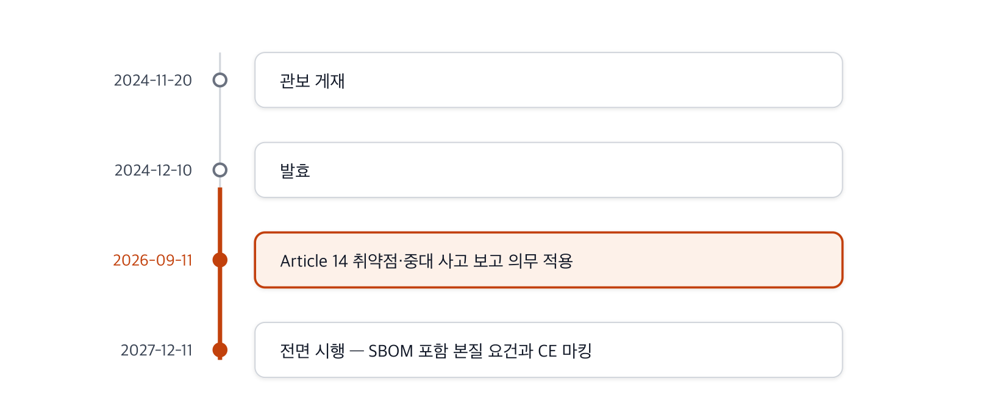

The first major piece of legislation to establish SBOM as an explicit legal obligation is the EU
Cyber Resilience Act (CRA, Regulation (EU) 2024/2847). Whereas the United States effectively
mandates SBOM through the market of federal procurement, the CRA is a directly effective law that
applies horizontally across products with digital elements.

## Legal Basis of the SBOM Obligation

In the CRA, the SBOM obligation appears in Annex I, Part II (vulnerability handling requirements),
point (1). Manufacturers must identify and document the vulnerabilities and components contained
in a product, and as a means of doing so, the CRA specifies that they must "draw up a software
bill of materials, in a commonly used and machine-readable format, covering at the very least the
top-level dependencies of the product."

Two points that matter in practice differ from the US pathway.

- **The scope of the obligation is top-level dependencies**: There is no obligation to expand the
  entire dependency tree; covering at least the top-level dependencies is sufficient. That said,
  going deeper than this is clearly the recommended direction.
- It is an obligation to retain and submit, not to disclose: There is no obligation to disclose the
  SBOM to the general public. It is sufficient to retain it so that it can be submitted when a
  market surveillance authority makes a reasoned request.

The core of the CRA is that producing an SBOM is not a recommendation but a legal obligation backed
by a system of fines.

## Implementation Timeline

**Figure 1.** Phased implementation timeline of the EU CRA *(source: Regulation (EU) 2024/2847;
collected June 14, 2026)*

The CRA was published in the Official Journal on November 20, 2024, and entered into force on
December 10, 2024. Its application is staged: the Article 14 obligation to report exploited
vulnerabilities and severe incidents applies from September 11, 2026, and full application of the
essential cybersecurity requirements, including SBOM, begins on December 11, 2027.

## Absence of Format Implementing Rules and a Practical Reference Point

As of June 2026, no official CRA-level implementing rule for SBOM format has been published. This
means there is not yet a document that establishes, as an EU-wide binding norm, which schema and
fields must be used to conform to the CRA.

The current practical reference point is Technical Guideline TR-03183-2 v2.1.0, published in
August 2025 by Germany's Federal Office for Information Security (Bundesamt für Sicherheit in der
Informationstechnik, BSI). This document provides specific field mappings for CRA-conformant SBOM
for both CycloneDX and SPDX. Note, however, that this is a German guideline, not an EU-wide binding
norm.

## Considerations for Open Source

The CRA uses commercial activity as its applicability criterion, and in principle excludes
non-commercial open source that is distributed free of charge without commercial activity. This is
a mechanism to avoid imposing manufacturer-level obligations directly on open source maintainers.
However, the obligations still apply in full to manufacturers who integrate open source into a
product and supply it commercially, so obtaining and managing SBOMs for open source components
remains the manufacturer's responsibility.

## Sources

European Parliament and Council (2024). *Regulation (EU) 2024/2847 — Cyber Resilience Act*. OJ L,
2024/2847, 20.11.2024. <https://eur-lex.europa.eu/eli/reg/2024/2847/oj/eng>. European Commission,
DG CNECT. *Cyber Resilience Act*.
<https://digital-strategy.ec.europa.eu/en/policies/cyber-resilience-act>. BSI. *Technical Guideline
TR-03183-2*. (all accessed: June 14, 2026)
