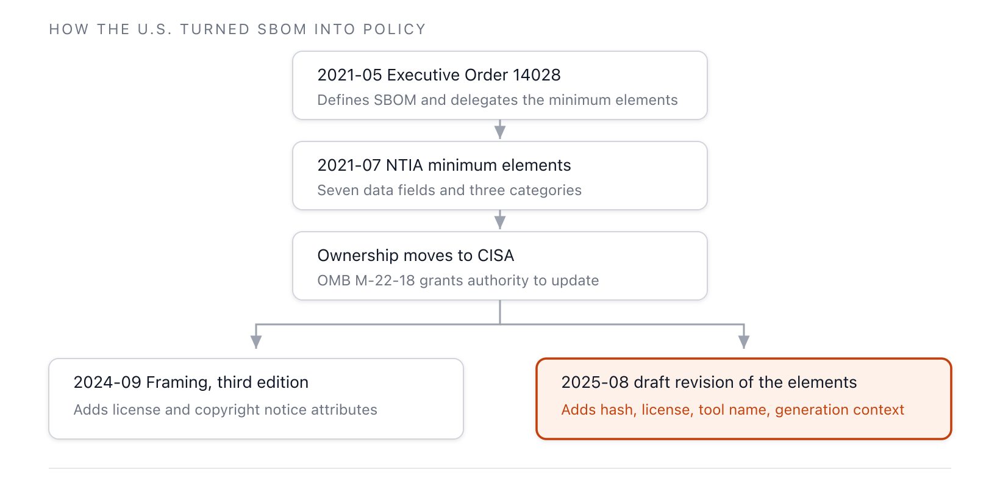

The regulatory standing of SBOM differs by jurisdiction. The United States takes an executive-order
pathway that leverages federal procurement, the European Union takes a directly effective
legislative pathway, and most other countries remain at the stage of advisory guidelines. This
section covers the United States first, followed by the
[EU Cyber Resilience Act](./1-eu-cra/) and
[other jurisdictions such as India and Korea](./2-global/).

## Regulatory Standing by Jurisdiction at a Glance

| Jurisdiction | Document/Legislation | Standing | SBOM Requirement |
|---|---|---|---|
| United States | Executive Order 14028 (2021), CISA minimum elements | Federal procurement recommendation | SBOM provision for software delivered to the federal government |
| European Union | Cyber Resilience Act, Regulation (EU) 2024/2847 | Legal obligation (with fines) | Annex I Part II, top-level dependencies, machine-readable |
| India | CERT-In Technical Guidelines (2024) | Voluntary recommendation | Best practices for government and essential services |
| Korea | Software Supply Chain Security Guideline 1.0 (2024) | Administrative recommendation | Recommended SBOM generation and review procedures |

**Table 1.** SBOM regulatory standing in major jurisdictions *(source: primary source for each
item; collected June 14, 2026)*

## United States: Leveraging Federal Procurement

US SBOM policy originates from an executive order. On May 12, 2021, shortly after the SolarWinds
incident, Executive Order 14028 ("Improving the Nation's Cybersecurity") was signed and published
in the Federal Register as 86 FR 26633. Section 10(j) of the order defined SBOM as "a formal record
containing the details and supply chain relationships of various components used in building
software," and Section 4(f) directed the Secretary of Commerce, working with NTIA, to publish
minimum elements for an SBOM within 60 days. This was the moment SBOM was elevated from a
recommendation of the research community to a candidate requirement for federal procurement.

Under this mandate, NTIA published the minimum elements in July 2021, and responsibility for the
work subsequently moved to CISA. Under Office of Management and Budget (OMB) Memorandum M-22-18,
CISA holds the authority to update the NTIA minimum elements and has focused on tooling and
operationalization. The results are the 2024 *Framing Software Component Transparency*, Third
Edition, and the 2025 draft revision of the minimum elements. Changes in the data fields between
the two documents are covered in [Minimum Elements](../2-standards/1-minimum-elements/).

It is important to understand the exact nature of the US pathway. Executive Order 14028 is the
basis for guidance requiring vendors that supply software to the federal government to provide an
SBOM; it is not a general statute that applies to all software. CISA's two documents themselves
state that they do not create new federal requirements. The normative standing remains that of a
procurement criterion and technical reference. Nonetheless, because the vast federal procurement
market operates on this basis, it functions as a de facto requirement for companies that supply
software to the US government.

**Figure 1.** Lineage of US SBOM policy documents *(source: Executive Order 14028, NTIA 2021, CISA
2024 and 2025; collected June 14, 2026)*

## Sources

The White House (2021). *Executive Order 14028 — Improving the Nation's Cybersecurity*, 86 FR
26633.
<https://www.federalregister.gov/documents/2021/05/17/2021-10460/improving-the-nations-cybersecurity>.
OMB (2022). *M-22-18*.
<https://www.whitehouse.gov/wp-content/uploads/2022/09/M-22-18.pdf>. CISA SBOM Resource Hub
<https://www.cisa.gov/sbom>. (all accessed: June 14, 2026)
