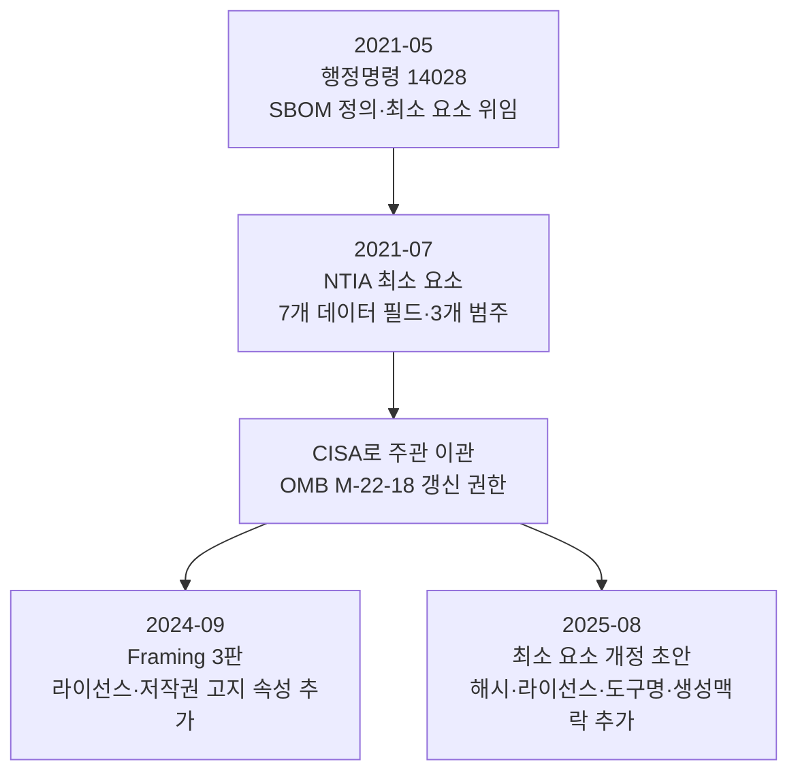

SBOM을 둘러싼 규제는 관할권마다 위상이 다릅니다. 미국은 연방 조달을 지렛대로 삼는 행정명령 경로,
유럽연합은 직접 효력을 갖는 법률 경로, 그 밖의 국가들은 대체로 권고 가이드라인 단계에 있습니다.
이 절에서는 미국을 먼저 다루고, [EU 사이버 복원력법](./1-eu-cra/)과 [인도·한국 등 기타
관할권](./2-global/)을 이어서 다룹니다.

## 관할권별 위상 한눈에 보기

| 관할권 | 문서·법령 | 위상 | SBOM 요건 |
|---|---|---|---|
| 미국 | 행정명령 14028(2021), CISA 최소 요소 | 연방 조달 권고 | 연방 납품 소프트웨어에 SBOM 제공 |
| 유럽연합 | 사이버 복원력법, Regulation (EU) 2024/2847 | 법적 의무(과징금) | Annex I Part II, 최상위 의존성, 기계 판독 |
| 인도 | CERT-In 기술 가이드라인(2024) | 자발적 권고 | 정부·필수 서비스 대상 모범 사례 |
| 한국 | SW 공급망 보안 가이드라인 1.0(2024) | 행정 권고 | SBOM 생성·점검 절차 권고 |

**표 1.** 주요 관할권의 SBOM 규제 위상 *(출처: 각 항목 1차 출처. 수집일 2026-06-14)*

## 미국: 연방 조달을 지렛대로

미국의 SBOM 정책은 행정명령에서 출발합니다. 솔라윈즈 사건 직후인 2021년 5월 12일, 행정명령
14028("Improving the Nation's Cybersecurity")이 서명되어 연방관보 86 FR 26633으로 공포되었습니다.
이 명령의 Section 10(j)는 SBOM을 "소프트웨어를 만드는 데 사용된 다양한 구성요소의 세부 정보와
공급망 관계를 담은 공식 기록"으로 정의했고, Section 4(f)는 상무부 장관이 NTIA와 협조해 60일 이내에
SBOM 최소 요소를 발행하도록 지시했습니다. SBOM이 연구 공동체의 권고에서 연방 조달의 요건 후보로
격상된 순간입니다.

이 위임에 따라 NTIA가 2021년 7월 최소 요소를 발행했고, 이후 작업 주관은 CISA로 옮겨갔습니다. CISA는
행정관리예산국(Office of Management and Budget, OMB) 메모 M-22-18에 따라 NTIA 최소 요소를 갱신할
권한을 갖고, 도구화와 운영화에 초점을 두고 있습니다. 그 결과가 2024년 *Framing Software Component
Transparency* 3판과 2025년 최소 요소 개정 초안입니다. 두 문서의 데이터 필드 변화는
[최소 요소](../2-standards/1-minimum-elements/)에서 다룹니다.

미국 경로의 성격을 정확히 이해하는 것이 중요합니다. 행정명령 14028은 연방정부에 소프트웨어를
공급하는 사업자에게 SBOM 제공을 요구하는 지침의 근거이지, 모든 소프트웨어에 적용되는 일반 법령이
아닙니다. CISA의 두 문서도 스스로 새로운 연방 요건을 창설하지 않는다고 밝힙니다. 규범의 위상은
여전히 조달 기준과 기술 참조에 머물러 있습니다. 그럼에도 연방 조달이라는 거대한 시장이 작동하는
탓에, 미국에 소프트웨어를 납품하는 기업에는 사실상의 요건으로 기능합니다.

**그림 1.** 미국 SBOM 정책 문서의 계보 *(출처: 행정명령 14028, NTIA 2021, CISA 2024·2025. 수집일 2026-06-14)*

## 출처

The White House (2021). *Executive Order 14028 — Improving the Nation's Cybersecurity*, 86 FR 26633.
<https://www.federalregister.gov/documents/2021/05/17/2021-10460/improving-the-nations-cybersecurity>.
OMB (2022). *M-22-18*. <https://www.whitehouse.gov/wp-content/uploads/2022/09/M-22-18.pdf>. CISA
SBOM 자료 허브 <https://www.cisa.gov/sbom>. (모두 접속: 2026-06-14)
