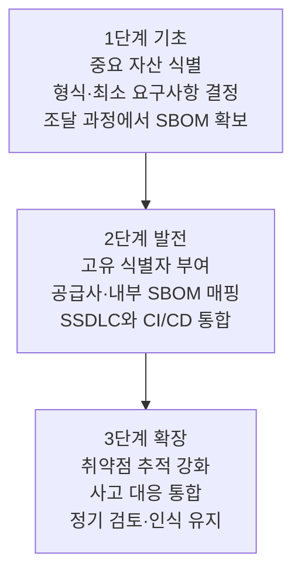

조직에 SBOM 체계를 들이는 일은 한 번에 끝나지 않습니다. 기반을 세우고(기초), 생성과 통합을
정착시키고(발전), 운영을 성숙시키는(확장) 단계적 접근이 현실적입니다. 아래 단계 구분은 미국 NTIA와
인도 CERT-In 가이드라인이 공통으로 제시하는 골격이며, 활동의 순서는 예시일 뿐 조직의 보안 요구와
일정, 자원에 맞춰 조정할 수 있습니다.

**그림 1.** SBOM 도입 3단계 *(출처: NTIA 2021, CERT-In 기술 가이드라인 재구성. 수집일 2026-06-14)*

## 1단계: 기초 다지기

첫 SBOM은 대개 조달 과정에서 공급사로부터 받게 됩니다. 이 단계의 목적은 조직 안에서 SBOM을 다루는
방법 자체를 수립하는 것입니다.

- **중요 자산 식별과 계획 수립**: 역할과 책임, 일정, 자원 요구를 정의하는 계획을 세우고, 새 프로세스에
  대한 이해관계자의 동의를 얻습니다.
- 형식과 최소 요구사항 결정: SBOM을 만들기 전에 형식(SPDX 또는 CycloneDX)과 최소 데이터 요구를
  정합니다. 공급망 전반에서 일관되게 처리할 표준 구조를 보장하기 위해서입니다.
- 보안 요구와 저장소·도구 식별: 분류와 처리 절차를 정하고, SBOM을 위한 안전한 저장소를 마련합니다.
- 조달 과정에서 SBOM 확보: 구매 주문서나 계약서에 공급사의 SBOM 제공 요구를 명시하고, 어떤 요소를
  언제 어떤 방법으로 제공할지를 지정합니다.

## 2단계: 생성과 통합

이 단계는 안전한 구성 관리를 확립하고, 고유 식별자로 구성요소를 일관되게 가리키며, 생성 자체를
개발 과정에 녹여 넣는 활동입니다.

- 고유 식별자 부여: 공급사나 구성요소의 이름이 바뀌거나 같은 이름으로 다른 버전이 나와도 추적이
  끊기지 않도록, [PURL 같은 식별자](../2-standards/2-identifiers/)로 각 구성요소를 고정합니다.
- 공급사 SBOM과 내부 SBOM 매핑: 공급사가 제공한 SBOM을 기반으로 내부 SBOM을 작성하고, 작성자와
  타임스탬프를 남겨 무결성과 갱신 이력을 관리합니다.
- **SSDLC와 CI/CD 통합**: 안전한 소프트웨어 개발 수명주기(Secure Software Development Life Cycle,
  SSDLC)와 지속적 통합·배포(CI/CD) 파이프라인에 SBOM 생성을 통합합니다. 빌드 시점에 자동으로
  생성하면 정확도와 적시성이 함께 올라갑니다. 도구 선택은 [5. 도구와 자동화](../5-tools/)를 참고하십시오.
- 안전한 구성 관리: 접근 통제와 암호화, 정기 감사를 적용해 SBOM을 안전하게 관리합니다.

## 3단계: 운영 성숙과 확장

마지막 단계는 SBOM을 취약점 관리와 사고 대응에 본격적으로 엮고, 체계를 지속적으로 갱신하는
활동입니다.

- 취약점 추적 강화: SBOM의 구성요소를 취약점 데이터베이스와 상호 참조해 영향과 완화 조치를 평가하는
  절차를 갖춥니다. 자세한 방법은 [6. 취약점 관리](../6-vulnerability/)에서 다룹니다.
- 사고 대응 통합: 새로 공개된 취약점에 대해 조직이 취약한지, 이미 침해됐는지를 SBOM으로 신속히
  판단하는 절차를 마련합니다.
- 정기 검토와 인식 유지: 구성요소와 의존성이 최신 기록과 일치하는지 주기적으로 점검하고, 새 형식과
  데이터 요소, 산업 동향에 대한 조직의 인식을 유지합니다.

## 출발점 정하기

세 단계를 순서대로 밟되, 처음부터 완벽을 노릴 필요는 없습니다. 가장 중요한 제품 한두 개를 골라
빌드 파이프라인에서 SBOM을 자동 생성하고, 그것을 취약점 스캐너에 물려 보는 것이 현실적인 첫걸음입니다.
체계가 한 제품에서 작동하는 것을 확인한 뒤 포트폴리오 전체로 넓히면, 시행착오의 비용을 줄일 수
있습니다.

## 출처

NTIA (2021). *The Minimum Elements For a Software Bill of Materials (SBOM)*. CERT-In. *Technical
Guidelines on Software Bill of Materials (SBOM)*. CISA SBOM 자료 허브 <https://www.cisa.gov/sbom>.
(모두 접속: 2026-06-14)
