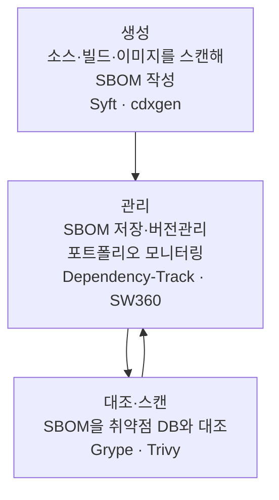

SBOM 워크플로우는 단일 도구로 완결되지 않습니다. 생성, 취약점 대조, 수명주기 관리의 세 역량이 서로
다른 도구로 나뉘며, 어느 하나도 세 영역을 완벽히 덮지 못한다는 것이 최근 도구 비교 분석의 공통
결론입니다. 도구를 조합해 파이프라인을 구성한다고 보는 편이 정확합니다.

## 생성·관리·스캔의 분업

**그림 1.** SBOM 도구의 세 역할 *(출처: 도구 비교 분석 정리, 2026-01. 수집일 2026-06-14)*

생성 영역에서는 Anchore의 Syft가 "SBOM 생성 한 가지를 가장 잘하는 전용 도구"로 평가받습니다. 서명
도구 cosign과 결합한 증명(attestation) 워크플로우가 성숙해 있습니다. OWASP CycloneDX의 cdxgen은 다중
언어와 컨테이너 이미지를 폭넓게 지원하고, AI BOM 전용 모드를 갖춘 점이 특징입니다.

관리 영역에서는 OWASP Dependency-Track이 조직 전체 애플리케이션 포트폴리오의 구성요소 사용 현황과
보안·라이선스 컴플라이언스를 모니터링하는 플랫폼으로 자리 잡았습니다. 라이선스 컴플라이언스 중심의
또 다른 선택지로 Eclipse SW360이 있습니다.

스캔 영역에서는 Grype가 SBOM을 입력으로 받아 취약점을 대조하고, Aqua Security의 Trivy가 스캐너이면서
SBOM 생성도 겸합니다.

| 역할 | 대표 오픈소스 도구 | 특징 |
|---|---|---|
| 생성 | Syft, cdxgen | Syft는 생성 전용·증명 성숙, cdxgen은 다중 언어·AI BOM 모드 |
| 관리 | Dependency-Track, SW360 | 포트폴리오 모니터링, 라이선스·취약점 추적 |
| 대조·스캔 | Grype, Trivy | SBOM을 취약점 데이터베이스와 대조 |

**표 1.** SBOM 도구의 역할별 분류 *(출처: 도구 비교 분석 정리, 2026-01. 수집일 2026-06-14)*

## 자동화는 어디까지 되는가

자동화가 잘 되는 영역과 사람이 채워야 하는 영역을 정직하게 구분하는 것이 중요합니다.

| 작업 | 자동화 수준 |
|---|---|
| 코드·의존성 SBOM 생성 | 성숙 |
| 컨테이너 이미지 구성요소 식별 | 성숙 |
| SBOM 저장·취약점 모니터링 | 성숙 |
| 라이선스 식별자 자동 추출 | 부분적(검토 필요) |
| 비표준 라이선스 해석·준수 추적 | 미성숙(사람·정책) |

**표 2.** SBOM 작업의 자동화 성숙도 *(출처: 도구 비교 분석 정리. 수집일 2026-06-14)*

생성은 도구가 잘합니다. 빌드 파이프라인에 Syft나 cdxgen을 넣으면 구성요소 목록은 자동으로 채워집니다.
그러나 생성된 SBOM의 라이선스 필드가 정확한지, 비표준 라이선스의 의무를 지키는지, 다운스트림으로
의무가 전파되며 누락되지 않았는지는 도구가 자동으로 보장하지 못합니다. 이 영역은 정책과 사람의
검토로 메웁니다.

## 도구 자체가 공격 표면이다

자동화 도구를 신뢰하기 전에 도구 자체의 무결성을 확인해야 합니다. 2026년 1월, 한 SBOM 도구가 짧은
기간에 두 차례 공급망 공격에 연루돼 하위 프로젝트로 피해가 번진 사례가 보고됐습니다. 이를 근거로
일부 파이프라인 운영자가 해당 도구를 제거하기도 했습니다.

SBOM 생성 도구 자체가 공급망 위험의 대상이 된다는 사실은, 생성과 검증 단계에서 해시와 서명, 증명을
결합할 것을 요구합니다. CISA 2025 최소 요소 초안이 도구명과 생성 맥락, 구성요소 해시를 신규 필드로
넣은 배경에도 이 문제의식이 있습니다. "신뢰할 수 없는 도구가 만든 SBOM은 신뢰할 수 없다"는 역설을
피하려면, 도구 버전을 고정하고 출처를 검증하며 생성물에 서명하는 절차가 필요합니다.

## 출처

Anchore. *Syft* <https://github.com/anchore/syft>, *Grype* <https://github.com/anchore/grype>. OWASP.
*cdxgen* <https://github.com/CycloneDX/cdxgen>, *Dependency-Track* <https://dependencytrack.org/>. Aqua
Security. *Trivy* <https://github.com/aquasecurity/trivy>. Eclipse *SW360*
<https://www.eclipse.org/sw360/>. (모두 접속: 2026-06-14)
