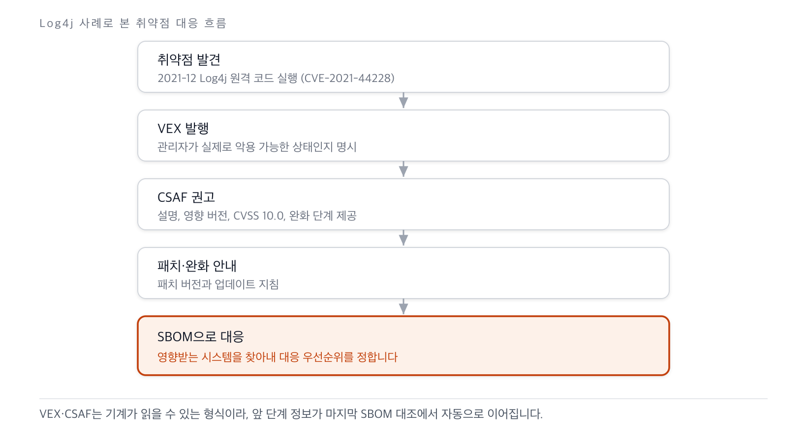

The most direct use of an SBOM is vulnerability management. With a component list in hand,
affected assets can be looked up immediately when a new vulnerability is disclosed. But listing
components in an SBOM brings along every past CVE for those components, creating a problem of
exploding false positives. Vulnerability Exploitability eXchange (VEX) is what solves this
problem.

## SBOM-Based Vulnerability Tracking

The basic flow of tracking is simple. Each component in an SBOM is matched against vulnerability
databases (NVD, CVE) using an [identifier such as PURL or CPE](../2-standards/2-identifiers/) to
map known vulnerabilities. A supplier can pre-map vulnerability information into an SBOM and
provide customers with an enriched SBOM, while a consumer can link its own SBOM to vulnerability
data through an API or data feed to set response priorities.

To increase effectiveness, a shift-left approach that moves checks earlier in development is
recommended. Integrating security tools into the development pipeline and automatically
analyzing SBOM data at early stages such as build and packaging catches vulnerabilities before
release.

## VEX: Sorting Out Exploitability

VEX is a document in which a manufacturer asserts "is this vulnerability actually exploitable in
our product," helping consumers make priority judgments. Where an SBOM answers "what is inside,"
VEX answers "does a known vulnerability inside actually affect this product." Even if a
component has a vulnerability, it may be unexploitable if the affected code path is never
invoked; VEX states this status explicitly, reducing unnecessary response effort.

A VEX document notates the vulnerability status of a specific product using the following four
states.

- **Not affected**: No remediation is needed for this vulnerability.
- Affected: A fix or mitigating action is recommended.
- Fixed: The vulnerability fix is included in the given product version.
- Under Investigation: Whether the product is affected has not yet been confirmed and will be
  updated later.

VEX is not a single format; CSAF VEX, OpenVEX, and CycloneDX VEX coexist. CycloneDX is
distinguished by expressing VEX natively within the format itself.

## CSAF: Structuring Advisories

Common Security Advisory Framework (CSAF) 2.0 is a standard that structures security advisories
in a machine-readable form, and it includes a VEX profile. OASIS approved it as a formal
standard in November 2022. Where VEX communicates exploitability status, CSAF delivers a
detailed advisory that includes a vulnerability description, affected versions, a severity
assessment (CVSS score), and recommended mitigation steps.

The practical turning point for adoption was Red Hat. Red Hat's Product Security team began
publishing CSAF/VEX files for every CVE in its database in 2023, and has since moved to full
production, publishing them on an ongoing basis.

## Case Study: Log4Shell

The Log4j vulnerability (Log4Shell), disclosed in December 2021, is a case that shows how SBOM,
VEX, and CSAF interlock.

**Figure 1.** The interplay of SBOM, VEX, and CSAF in the Log4Shell response *(source:
reconstructed from CERT-In technical guidelines. Retrieved 2026-06-14)*

When the vulnerability was disclosed, maintainers issued a VEX stating the exploitable status,
followed by a CSAF advisory containing the vulnerability description, affected versions, CVSS
10.0 (the highest severity), and mitigation steps. Organizations that included Log4j as a
component integrated this VEX and CSAF data into their own SBOMs, identifying the affected parts
of their systems and setting response priorities. The core point of this case is that, had an
SBOM already been in place, "where is Log4j" could have been answered with a single query.

## Sources

OASIS Open (2022). *CSAF 2.0*. <https://www.oasis-open.org/2022/11/21/new-version-of-csaf-standard/>.
CISA. *Vulnerability Exploitability eXchange (VEX)*. <https://www.cisa.gov/sbom>. OpenVEX
<https://github.com/openvex>. NVD. *CVE-2021-44228*. <https://nvd.nist.gov/vuln/detail/CVE-2021-44228>.
Red Hat (2023). *VEX files now available*. (All retrieved: 2026-06-14)
