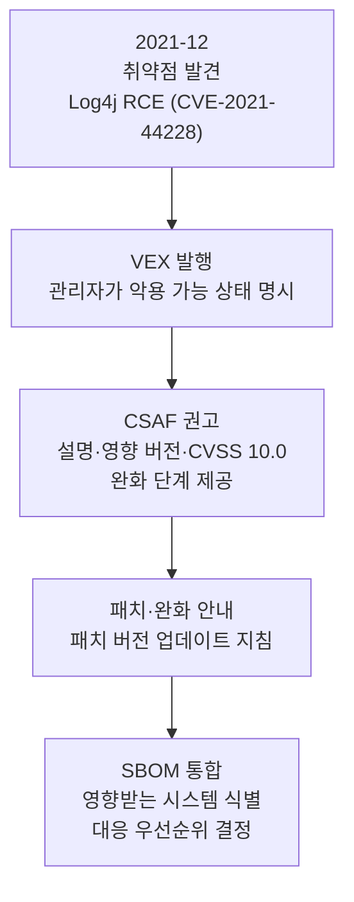

SBOM의 가장 직접적인 활용처가 취약점 관리입니다. 구성요소 목록이 있으면 새 취약점이 공개될 때
영향받는 자산을 즉시 조회할 수 있습니다. 그러나 SBOM에 구성요소를 나열하면 그 구성요소의 과거 CVE가
모두 따라붙어 오탐(false positive)이 폭증한다는 문제가 생깁니다. 이 문제를 푸는 것이 취약점 악용성
교환(Vulnerability Exploitability eXchange, VEX)입니다.

## SBOM 기반 취약점 추적

추적의 기본 흐름은 간단합니다. SBOM의 각 구성요소를 [PURL이나 CPE 같은 식별자](../2-standards/2-identifiers/)로
취약점 데이터베이스(NVD, CVE)와 대조해, 알려진 취약점을 매핑합니다. 공급사는 SBOM에 취약점 정보를
미리 매핑해 향상된 SBOM을 고객에게 제공할 수 있고, 소비자는 API나 데이터 피드로 자체 SBOM을 취약점
데이터와 연결해 대응 우선순위를 정합니다.

효과를 높이려면 개발 초기로 점검을 앞당기는 시프트 레프트(shift-left) 접근이 권장됩니다. 보안 도구를
개발 파이프라인에 통합해, 빌드와 패키징 같은 이른 단계에서 SBOM 데이터를 자동 분석하면 취약점을
출시 전에 잡을 수 있습니다.

## VEX: 악용 가능성을 가려낸다

VEX는 제조자가 "이 취약점이 우리 제품에서 실제로 악용 가능한가"를 단언해 소비자의 우선순위 판단을
돕는 문서입니다. SBOM이 "무엇이 들어 있는가"를 답한다면, VEX는 "그 안의 알려진 취약점이 이 제품에서
영향을 주는가"를 답합니다. 구성요소에 취약점이 있더라도 해당 코드 경로가 호출되지 않으면 악용
불가능할 수 있는데, 이때 VEX가 그 상태를 명시해 불필요한 대응을 줄입니다.

VEX 문서는 특정 제품의 취약점 상태를 다음 네 가지로 표기합니다.

- **Not affected(영향 없음)**: 이 취약점에 대한 수정이 필요하지 않습니다.
- Affected(영향 있음): 수정하거나 완화하는 조치가 권장됩니다.
- Fixed(수정됨): 해당 제품 버전에 취약점 수정이 포함돼 있습니다.
- Under Investigation(조사 중): 영향 여부가 아직 확인되지 않았으며, 추후 갱신됩니다.

VEX는 단일 형식이 아니라 CSAF VEX, OpenVEX, CycloneDX VEX가 공존합니다. CycloneDX는 VEX를 형식 안에서
네이티브로 표현하는 점이 특징입니다.

## CSAF: 권고를 구조화한다

공통 보안 권고 프레임워크(Common Security Advisory Framework, CSAF) 2.0은 보안 권고를 기계 판독
가능하게 구조화한 표준으로, VEX 프로파일을 포함합니다. OASIS가 2022년 11월 정식 표준으로 승인했습니다.
VEX가 악용 가능성 상태를 알린다면, CSAF는 취약점 설명, 영향받는 버전, 심각도 평가(CVSS 점수), 권장
완화 단계까지 담은 상세 권고를 전달합니다.

채택의 실질적 전환점은 Red Hat이었습니다. Red Hat 제품보안팀은 2023년 자사 데이터베이스의 모든 CVE에
대해 CSAF·VEX 파일을 공개하기 시작했고, 이후 정식 운영으로 전환해 상시 발행합니다.

## 사례: Log4Shell

2021년 12월 공개된 Log4j 취약점(Log4Shell)은 SBOM과 VEX, CSAF가 어떻게 맞물리는지를 보여주는 사례입니다.

**그림 1.** Log4Shell 대응에서 SBOM·VEX·CSAF의 연계 *(출처: CERT-In 기술 가이드라인 재구성. 수집일 2026-06-14)*

취약점이 공개되자 관리자는 악용 가능 상태를 알리는 VEX를 냈고, 이어 취약점 설명과 영향받는 버전,
CVSS 10.0(최고 심각도), 완화 단계를 담은 CSAF 권고를 발표했습니다. Log4j를 구성요소로 포함한 조직은
이 VEX와 CSAF 데이터를 자신의 SBOM에 통합해, 시스템의 영향받는 부분을 식별하고 대응 우선순위를
정했습니다. SBOM이 미리 갖춰져 있었다면 "어디에 Log4j가 있는가"를 질의 한 번으로 답할 수 있었다는
점이 이 사례의 핵심입니다.

## 출처

OASIS Open (2022). *CSAF 2.0*. <https://www.oasis-open.org/2022/11/21/new-version-of-csaf-standard/>.
CISA. *Vulnerability Exploitability eXchange (VEX)*. <https://www.cisa.gov/sbom>. OpenVEX
<https://github.com/openvex>. NVD. *CVE-2021-44228*. <https://nvd.nist.gov/vuln/detail/CVE-2021-44228>.
Red Hat (2023). *VEX files now available*. (모두 접속: 2026-06-14)
