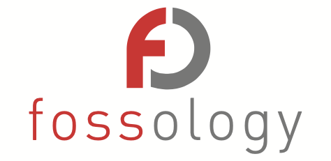
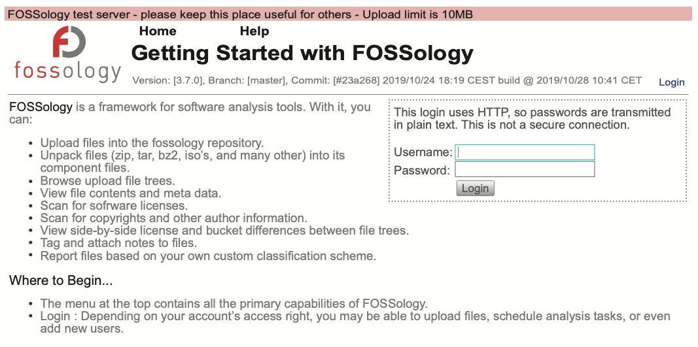

For open source compliance, you can use a source code scanning tool to detect the open source and license information contained within software.



_<center>< https://www.fossology.org/ ></center>_

The Linux Foundation's FOSSology project developed this scanning tool and released it as open source so that anyone can use it freely.

## Key Features

FOSSology is a web-based program that lets users log in to the website and upload individual files or software packages. FOSSology detects license text and copyright information within the uploaded files. Developers should use FOSSology when they want to check what license a piece of open source carries and what its copyright information looks like. FOSSology scans every file in an uploaded open source package, automatically detects license-related text and copyright information in each file, and generates a report from it. For more details on FOSSology's key features, refer to the following page. : [https://www.fossology.org/features/](https://www.fossology.org/features/)

## Installation

To use FOSSology within a company, you need to build a FOSSology server in-house. This requires installing FOSSology on a Linux-based server system. FOSSology can be installed in the following three ways.

1. Using Docker
2. Using Vagrant and VirtualBox
3. Installing via a source build

This section explains the simplest method, using Docker.

FOSSology publishes a containerized Docker image through Docker Hub \(https://hub.docker.com/\). : [https://hub.docker.com/r/fossology/fossology](https://hub.docker.com/r/fossology/fossology)

The pre-built Docker image can be run using the following command.

```text
$ docker run -p 8081:80 fossology/fossology
```

The Docker image can be accessed with the following URL and account information. : http://\[IP\_OF\_DOCKER\_HOST\]:8081/repo

* Username : fossy
* Passwd : fossy

For more details on installation, refer to the following page. : [https://github.com/fossology/fossology/blob/master/README.md](https://github.com/fossology/fossology/blob/master/README.md)

## Test Server

If it is difficult to build a system on which to install FOSSology, you can use the test server provided by the FOSSology Project. The FOSSology project provides an environment for testing. \(The test server may go down without notice.\)

Users can access the FOSSology test server with the following account to try out FOSSology's features.


Test server URL: [https://fossology.osuosl.org/](https://fossology.osuosl.org/)

* Username: fossy
* Password: fossy




## Basic Workflow

The basic usage procedure for FOSSology is as follows.

* To check the license and copyright information of the open source you want to use, compress its source code into a single file and upload it to FOSSology.
* To do this, select Menu &gt; Upload &gt; From File.


* Select the file to upload and click the Upload button.
* Once the upload completes, the Job Agent automatically performs the analysis.
* You can check the Status of the analysis in progress at Menu &gt; Jobs &gt; My Recent Jobs.


* Once the analysis completes, you can check the results at Menu &gt; Browse.


* Selecting an individual file lets you see what license-related text FOSSology has detected.


* At Menu &gt; Browser &gt; select a file or directory &gt; Copyright/Email/Url/Author, you can see the Copyright/Email/Url/Author information FOSSology detected.


After checking whether these analysis results are valid, users can exclude incorrectly detected items from the analysis results. FOSSology describes this as the Clearing process; for more details, refer to the following page. : [https://www.fossology.org/get-started/basic-workflow/](https://www.fossology.org/get-started/basic-workflow/)

Using the method above, you can easily check what license the open source you want to use carries and what its copyright information is.

