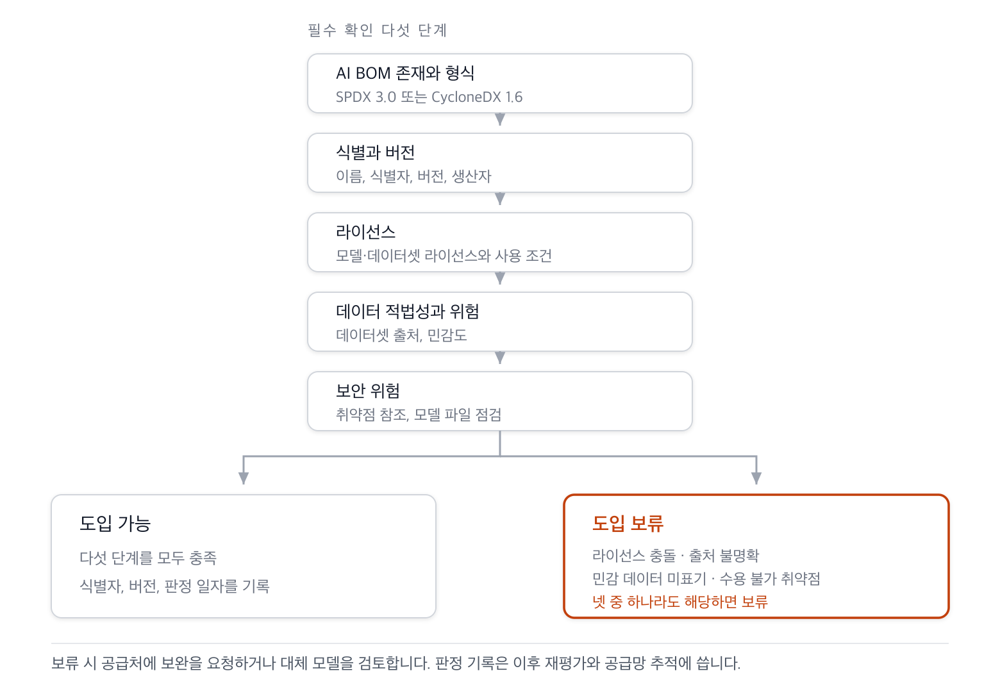

{}
This article was written with Claude Code, and the key facts cited here were cross-checked against primary sources.
{}

This checklist sets the criteria for vetting transparency and risk, on the basis of the AI Bill of Materials (AI BOM), when an in-house development team brings in and uses an external AI model or dataset. The items to check are drawn from the ingestion column of the [AI BOM Field Requirements Matrix]().

Because the purpose of an ingestion check is to bring a model in rather than to build one, fields that feed directly into risk assessment are prioritized. Licensing is the basis for judging compliance risk, provenance and sensitivity for judging data lawfulness and privacy risk, and vulnerability references for judging security risk.

## 1. AI BOM Presence and Format

- Is an AI BOM provided for the object being ingested?
- Is the format SPDX 3.0 or later, or CycloneDX 1.6 or later?
- Does the AI BOM's timestamp match the version of the object being ingested?

If no AI BOM is provided, or the format lacks an AI-specific profile, request one from the supplier before ingestion, or secure the minimum information independently.

## 2. Identification and Version (Required Check)

| Check item | Assessment criterion |
|---|---|
| Model name and identifier | Is it identified by a standard identifier (PURL/CPE)? |
| Model version | Does it match the version being ingested? |
| Dataset name and identifier | Is the training dataset identified? |
| System name and version | Is the delivered system identified, with a version stated? |
| System components | Are the included components enumerated? |
| Dependency relationships | Are the relationships between components stated? |

## 3. License Check (Required Check)

| Check item | Assessment criterion |
|---|---|
| Model license | Is a license stated, and is it compatible with our intended use? |
| open weight status | Confirm whether it is open weight, open architecture, or open data |
| Dataset license | Is the training dataset's license stated, and is it compatible with the intended use? |

An empty license field, or one that conflicts with the intended use, is grounds to hold off on ingestion. Because the model license and the dataset license are separate matters, check each independently.

## 4. Data Lawfulness and Risk (Required Check)

| Check item | Assessment criterion |
|---|---|
| Dataset provenance | Are the source, collection method, and preprocessing steps stated? |
| Dataset sensitivity | Is the presence of personally identifiable information, copyrighted data, or sensitive data stated? |
| Model description and lineage | Are the model's limitations and its lineage from prior models described? |

If the dataset's provenance is unclear, or whether it contains sensitive data is not stated, data lawfulness and privacy risk must be assessed separately.

## 5. Security Risk (Required Check)

| Check item | Assessment criterion |
|---|---|
| Vulnerability references | Are links to known vulnerability information provided, and are the known vulnerabilities acceptable in the ingestion environment? |

Vulnerability references are directly required by the Cyber Resilience Act and by US Food and Drug Administration guidance, so this is checked as required during ingestion vetting.

## 6. Recommended Checks

The following are checked additionally when the risk level is high or the use case is subject to regulation.

- Model timestamp and producer
- Model properties, input/output properties, training properties
- Model hash value and algorithm (integrity verification)
- Dataset contents and hash
- System data flow and data usage
- Whether the intended application domain matches our intended use

## 7. Ingestion Determination

**Figure 5.** Ingestion determination flow *(synthesized from research)*

If all the required check items in Sections 1 through 5 above are satisfied, the determination is ingestion approved. If any one of a license conflict, unclear provenance, undisclosed sensitive data, or an unacceptable vulnerability applies, the determination is held, and the supplier is asked to remedy the gap or an alternative model is considered.

The determination result is recorded together with the ingested object's AI BOM identifier, version, and determination date, for use in subsequent reassessment and supply chain tracing.
