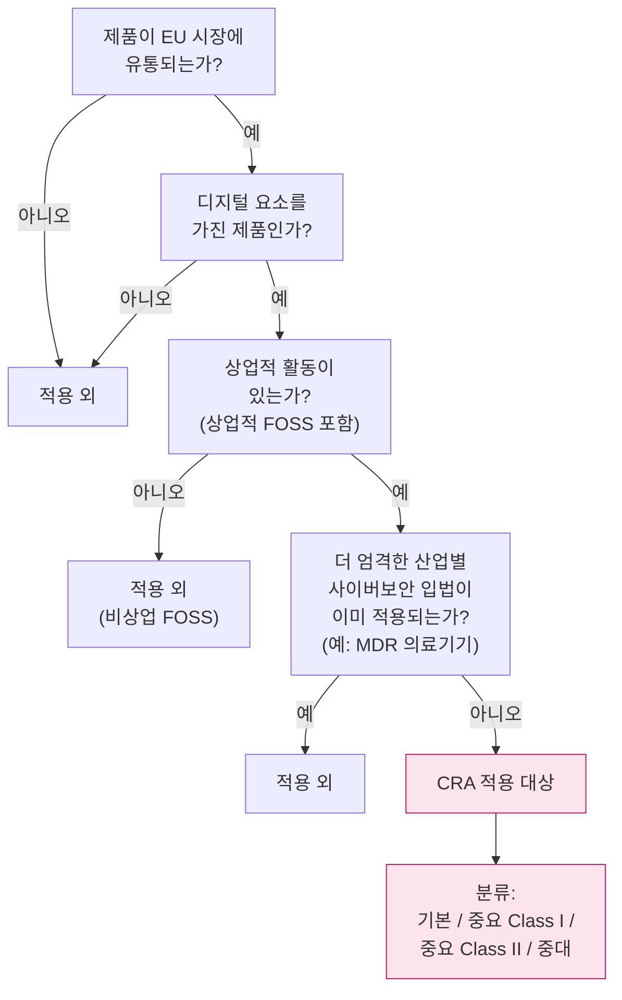
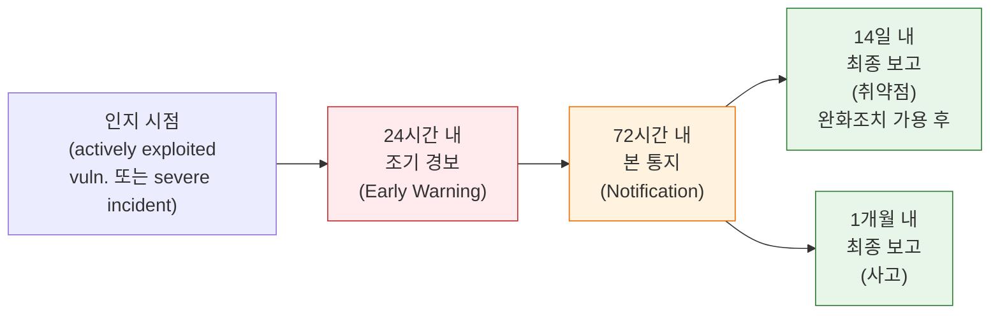
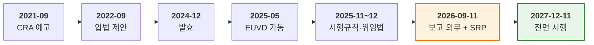
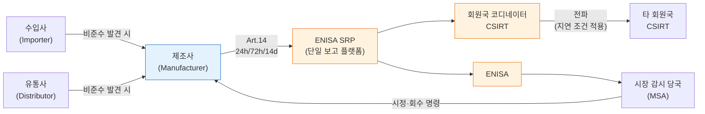

{}
이 보고서는 Claude Code 하네스를 통해 8개 전문 AI 에이전트가 협업해 생성되었습니다 — 원본 PDF 번역부터 배경·동향·근거 보강, 사실 검증까지. 검증 과정에서 발견된 환각 1건이 정정되었으며, 정정 이력은 [검증 보고서](verification/)에 영구 기록되어 있습니다. 하네스 자체에 대한 설명은 [방법론 글](../methodology-claude-code-harness/) 참조.

단계별 산출물: [원본 번역](source/) · [배경](background/) · [최신 동향](trends/) · [참고 자료](references/) · [검증 보고서](verification/) · [메이킹](meta/)
{}

> **요약**
> EU 사이버 복원력법(Cyber Resilience Act, CRA — Regulation (EU) 2024/2847)은 EU 시장의 모든 "디지털 요소를 가진 제품(product with digital elements, PDE)"에 사이버보안 의무를 부과하는 EU 최초의 수평적 규정이다. 2024년 12월 10일 발효된 이 규정은 단계적으로 적용되며, 2026년 9월 11일부터 제조사·수입사·유통사는 실제 악용되고 있는 취약점과 중대한 보안 사고를 24시간/72시간/14일 시한 안에 ENISA와 회원국 CSIRT에 통지해야 한다. 2027년 12월 11일에는 CE 마킹·완전 적합성 평가 등 본질 의무가 전면 발효된다.
>
> 본 보고서는 Black Duck Software의 체크리스트(2026년 4월 발행)를 1차 자료로 두고, CRA 원문·유럽위원회 공식 페이지·ENISA·법무법인·표준화 기구의 자료를 보강해 한국 제조·서비스 기업이 4개월 앞으로 다가온 보고 의무에 어떻게 대비해야 하는지 정리한다.[A1][B1][B2]

---

## 1. 보고서 개요

입수 자료는 Black Duck Software가 2026년 4월 발행한 3쪽 분량의 *EU CRA Vulnerability Reporting Checklist: Sept '26 Obligations*다. 법적 권위는 CRA 원문에 있고, 본 자료는 제조사 컴플라이언스 담당자가 2026년 9월 시행 의무를 빠르게 점검할 수 있도록 핵심 의무를 양식화한 업계 분석에 해당한다. 이하는 체크리스트의 6개 영역(적용 대상, 보고 시한, SBOM, 지속적 모니터링, 보고 인프라, 설계 보안 증빙)을 골격으로, 1차 출처와 최신 동향을 보강한 결과다.

---

## 2. 핵심 내용 — CRA 보고 의무의 구조

### 2.1 CRA 자체 — 무엇이 규정되는가

CRA의 공식 명칭은 *Regulation (EU) 2024/2847 on horizontal cybersecurity requirements for products with digital elements*이다. 2024년 11월 20일 EU 관보에 게재된 뒤 20일이 지난 2024년 12월 10일에 발효되었다.[A1][B1] CRA가 "수평적(horizontal)"이라는 말은 IoT·산업제어·일반 소프트웨어를 가로지르는 공통 기준을 정한다는 뜻이고, 의료기기·자동차 등 부문별 사이버보안 입법이 이미 적용되는 제품은 제외된다.[A1][B3]

### 2.2 적용 대상 — "디지털 요소를 가진 제품"

본 체크리스트가 제시하는 적용 대상 기준은 CRA 제2조·제3조의 정의와 일치한다.[A1][B3] 디지털 요소를 가진 제품(product with digital elements, PDE)은 다음을 포괄한다.

- 하드웨어 제품 (예: IoT 기기, 산업용 제어기)
- 소프트웨어 제품 (스탠드얼론 SW, 펌웨어, 임베디드 SW)
- 연결 제품의 동작에 필요한 소프트웨어 구성요소
- EU 시장에 이미 출시된 레거시 제품도 포함 — 신규 출시에 한정되지 않는다[E1]

**그림 1.** CRA 적용 여부 판단 흐름 *(출처: CRA Art. 2~3, 시행규칙 (EU) 2025/2392).[A1][A3]*

위반 시 제재는 강력하다. Bird & Bird의 정리에 따르면 가장 엄중한 위반에는 1,500만 유로 또는 전 세계 연간 매출액의 2.5% 중 큰 금액이 과징금으로 부과될 수 있고, EU 시장에서의 제품 회수 명령도 가능하다.[E1]

### 2.3 보고 의무 (Article 14)의 3단계 시한

CRA 제14조는 제조사에게 실제 악용되고 있는 취약점(actively exploited vulnerabilities)과 중대한 보안 사고(severe incidents)의 통지를 의무화한다. 통지는 회원국 코디네이터 CSIRT(Computer Security Incident Response Team)와 ENISA(European Union Agency for Cybersecurity)에 동시에 이뤄져야 하고, 단일 보고 플랫폼(Single Reporting Platform, SRP)이 그 채널이 된다.[A1][B2]

**그림 2.** CRA Article 14 보고 시한 *(출처: CRA Art. 14, EC "CRA — Reporting obligations" 페이지).[A1][B2]*

각 단계의 내용은 다음과 같다:[A1][B2]

| 단계 | 시한 | 포함해야 할 내용 |
|---|---|---|
| **조기 경보** | 인지 후 **24시간** | 영향 회원국, 악의적 활동과의 연관 여부 |
| **본 통지** | **72시간** | 취약점·사고의 일반적 성격, 사용 가능한 완화 조치, 민감도 평가 |
| **최종 보고(취약점)** | 완화 조치 가용 후 **14일** | 심각도·영향, 위협 행위자 정보, 보안 업데이트 |
| **최종 보고(사고)** | 통지 후 **1개월** | 상세 사고 기술, 위협 유형/근본 원인, 완화 |

> [!IMPORTANT]
> 24시간은 분류·해결을 위한 시간이 아니라 조기 경보 체계로만 의도되었다는 점을 본 체크리스트가 명시한다. CRA 원문 해석과도 일치한다.[A1] 마이크로기업·소기업은 24시간 시한 미준수에 대해 과징금이 면제될 수 있다.[A1]

> [!NOTE]
> 침해된 데이터가 개인정보에 해당하면 CRA 통지는 일반정보보호규정(General Data Protection Regulation, GDPR)[A5] 제33조의 72시간 통지 의무를 대체하지 않는다. 두 통지가 별도 채널·별도 수신처(데이터보호당국 vs CSIRT/ENISA)로 동시에 이뤄져야 한다.

### 2.4 SBOM 요건

SBOM(Software Bill of Materials)은 CRA Annex I의 본질 요건과 직접 연결된다. 체크리스트가 정리하는 4개 요건은 다음과 같다:

- 출고되는 모든 제품 버전마다 SBOM을 생성한다.
- 표준 형식: 소프트웨어 패키지 데이터 교환(Software Package Data Exchange, SPDX) 또는 CycloneDX.
- 시장 감시 당국(market surveillance authorities)의 검토에 대비해 보관한다.
- 시장 감시 당국 외 제3자에게 공유할 의무는 없다.

SPDX는 ISO/IEC 5962:2021로 국제 표준화되었으며(이는 SPDX v2.2.1 기반이고, 현행 사양은 spdx.dev의 v3.0이다),[C3][C4] CycloneDX는 OWASP가 관리하는 사양으로 2024년 6월 ECMA-424 1st Edition(v1.6 기반)에 이어 2025년 12월 10일 2nd Edition(v1.7 기반)으로 갱신되었다.[C5] 독일 연방정보보안청(Bundesamt für Sicherheit in der Informationstechnik, BSI)이 2025년 8월 발간한 기술 가이드 TR-03183-2 v2.1.0은 CRA 정합 SBOM의 구체적 필드 매핑을 제공한다 — CRA 시행규칙 차원의 공식 스키마는 본 보고서 작성 시점(2026년 5월 12일)까지 별도 발표되지 않은 상태에서 BSI 가이드가 사실상 참조점 역할을 한다.[G1]

### 2.5 지속적 취약점 모니터링과 EUVD

체크리스트는 모니터링 데이터의 1차 출처로 유럽 취약점 데이터베이스(European Vulnerability Database, EUVD)를 명시한다. EUVD는 NIS2 지침(Directive (EU) 2022/2555) 제12조에 근거해 ENISA가 2025년 5월 13일 정식 가동했다.[A4][F1][F2] 독자적 ID 체계(`EUVD-YYYY-NNNNNN`)를 사용하고 기존 CVE ID·CVSS 점수를 병기한다.

> [!NOTE]
> EUVD와 CRA의 단일 보고 플랫폼(SRP)은 별개다. EUVD는 공개 공시 데이터베이스이고, SRP는 제조사 → CSIRT/ENISA의 통지 채널이다.[B4][F1]

### 2.6 보고 인프라와 설계 보안 증빙

체크리스트의 §5(보고 인프라)와 §6(설계 보안 증빙)은 CRA Art. 13(제조사 의무)과 Annex I(본질 요건)에 대응한다.

단일 보고 플랫폼(SRP)은 2026년 9월 11일 가동 예정이다. 그러나 본 보고서 작성 시점까지 ENISA는 API 사양·인증 방식의 공개 사양을 발표하지 않았고, 시험 자체가 어려운 시간적 압박이 업계 분석에서 반복적으로 지적되고 있다.[B4][E2] 내부 정책·플레이북은 지원 기간(CRA Art. 13(8)에 따라 시장 출시 후 최소 5년 또는 예상 사용 기간) 동안의 취약점·사고 보고 절차를 담아야 한다.[A1][B3] 마지막으로, 도구 선정 근거, 취약점 처리 담당자·결정자, 외부 커뮤니케이션 담당자가 문서화되어 사이버보안 의사결정 자체가 추적 가능해야 한다.

---

## 3. 배경과 맥락

### 3.1 입법 경위

CRA는 2021년 9월 우어줄라 폰 데어 라이엔(Ursula von der Leyen) 위원장의 연두교서에서 처음 예고되었고, 2022년 9월 15일 유럽위원회(European Commission)가 입법안을 제안한 뒤 약 2년의 입법 절차를 거쳐 2024년 10월 23일 서명, 2024년 12월 10일 발효되었다.[A1][B1]

**그림 3.** CRA 입법·시행 타임라인 *(출처: Regulation (EU) 2024/2847, EC 시행 페이지).[A1][B1][B3]*

### 3.2 단계적 적용 — 왜 2026-09-11이 중요한가

CRA는 전면 적용이 단일 시점에 이뤄지지 않는다. 2026년 9월 11일에 적용되는 것은 제14조 보고 의무와 SRP 가동에 한정되며, CE 마킹·완전 적합성 평가·본질 요건 전반은 2027년 12월 11일에 발효된다.[A1][B1][B3] 2026년 9월 11일까지 준비해야 할 것은 제품 인증 완료가 아니라 보고 워크플로우 가동이다. CE 마킹·적합성 평가의 1차적 경로 가운데 하나로 ENISA가 발간한 *EU Common Criteria(EUCC) 인증의 CRA 활용*[B6] 분석이 참고가 된다.

### 3.3 이해관계자와 상호작용

**그림 4.** CRA 보고 체계의 이해관계자 상호작용 *(출처: CRA Art. 13~16, 위임법 (EU) 2026/881).[A1][A2]*

2025년 12월 11일 채택된 위임법 (EU) 2026/881(관보 게재 2026-04-20)은 **CSIRT 간 통지의 추가 전파(dissemination)를 지연할 수 있는 조건**을 구체화했다. ① 통지된 정보의 성격에 대한 평가에 비추어 정당화되는 경우, ② 수신 CSIRT가 해당 정보의 기밀성을 보장할 수 없는 경우, ③ 단일 보고 플랫폼이 침해되었거나 일시적으로 운영이 불가한 경우다. 또한 트래픽 라이트 프로토콜(Traffic Light Protocol, TLP)·정보 접근 프로토콜(Permissible Actions Protocol, PAP) 등 적절한 프로토콜로 위험을 완화할 수 없을 때, "엄격히 필요한 기간"에 한해 지연이 허용된다.[A2] 즉 제조사 → CSIRT의 24시간 시한은 그대로지만, **CSIRT 간 추가 전파 단계에 보안 사유의 완화 장치**가 마련된 셈이다.

### 3.4 관련 표준·프레임워크

CRA는 본질 요건만 규정하고, 세부는 조화 표준(harmonised standards)에 위임한다. 주요 표준·프레임워크의 매핑은 다음과 같다:[B5][C1][C2][C3][C4][C5][C6]

| 표준/프레임워크 | 주관 | CRA 매핑 |
|---|---|---|
| ISO/IEC 30111:2019 | ISO/IEC | 취약점 처리 절차 — Annex I "취약점 처리" 요건 |
| ISO/IEC 29147:2018 | ISO/IEC | 조정된 취약점 공개(CVD) — Art. 14 통지 워크플로우 매핑 |
| SPDX (ISO/IEC 5962) | Linux Foundation / ISO | SBOM 표준 형식 후보 |
| CycloneDX (ECMA-424) | OWASP / Ecma | SBOM 표준 형식 후보 — VEX 네이티브 지원 |
| NIST SP 800-218 (SSDF) | NIST | 설계 보안 실무 — Annex I 본질 요건과 정렬 |
| prEN 40000-2-1 (prEN) | CEN/CENELEC | CRA 조화 표준 — 2026-08-30 발행 목표 |

조화 표준의 최종 인용 목록은 CEN/CENELEC JTC 13 WG 9에서 책정 중이며, 본 보고서 작성 시점에서는 후보로만 매핑할 수 있다.

### 3.5 타 관할권 비교 — 한국 독자 관점

| 항목 | EU CRA | 미국 | 영국 PSTI | 한국 가이드라인 |
|---|---|---|---|---|
| 적용 | 모든 PDE | 연방 조달 SW | 소비자 IoT | 모든 SW |
| 강제력 | 규정·직접 효력 | 행정명령·BOD | 법률 | 비강제 |
| 보고 시한 | 24h/72h/14d | KEV별 | 채널 유지 | 없음 |
| SBOM | SPDX/CycloneDX | NTIA 권고 | 없음 | SSDF 권고 |
| 시행 | 2026-09 (보고) / 2027-12 (전면) | 2021-05 | 2024-04-29 | 2024-05 |

CRA의 두드러진 특징은 사전적 시장 출시 규제이자 모든 디지털 제품에 수평 적용되는 직접 효력의 EU 규정이라는 점이다. 미국 EO 14028은 연방 조달 중심의 사후 대응에 가깝고, 영국 PSTI는 소비자 IoT에 한정되며, 한국 SW공급망 가이드라인은 법적 강제력이 없는 권고다. EU 시장에 제품을 출시하는 한국 기업은 본국 제도와 별개로 CRA에 직접 노출된다.

---

## 4. 최신 동향 — 2025~2026년

### 4.1 위임법·시행규칙·가이던스

| 날짜 | 문서 | 핵심 내용 |
|---|---|---|
| 2025-11-28 | 시행규칙 (EU) 2025/2392 | 28개 "중요·중대 제품" 범주의 기술 정의[A3] |
| 2025-12-03 | Commission FAQ v1 (12-19 업데이트) | 위험 평가 범위, "의도된 사용" 해석 |
| 2025-12-11 | 위임법 (EU) 2026/881 | CSIRT 통지 지연 조건[A2] |
| 2026-03-03 | 첫 가이던스 초안 (의견수렴 2026-03-31 마감) | 원격 데이터 처리, FOSS, 지원 기간, 타 규정 상호관계[E3] |

시행규칙 (EU) 2025/2392은 제조사가 자사 제품의 적용 등급(기본/중요 Class I/중요 Class II/중대)을 판단할 1차 법적 기준을 제공한다.[A3] 위임법 (EU) 2026/881은 CSIRT 간 정보 공유의 보안 균형을 잡는 장치다.[A2]

가이던스 초안(2026-03-03)은 본 보고서 작성 시점에 의견수렴은 마쳤으나(2026-03-31) 최종본은 미공표 상태다. 약 75쪽 분량 중 약 1/4이 **오픈소스 스튜어드(open-source steward)** 정의에 할애되었다.[E3]

### 4.2 ENISA 단일 보고 플랫폼(SRP) 가동 준비

| 항목 | 상태 (2026-05-12 기준) |
|---|---|
| 운영 개시 예정일 | 2026-09-11 (보고 의무 적용과 동시)[B4] |
| 법적 근거 | CRA Art. 16 |
| 시험 기간 | "예정" 명시되었으나 공식 일정 미공시[B4] |
| API 사양·인증 방식 | 미공개 |
| 조달 상태 | 턴키 구축 조달 절차 공시 — NIS2/DORA 통합 가능 아키텍처 요구[B4] |

**가장 큰 실무 리스크는 사양 공개 지연**이다. 가동 4개월 전인 현 시점까지 통합 시험을 위한 사양이 없다는 점이 DLA Piper·Bird & Bird 등 법무법인 분석에서 반복적으로 지적되고 있다.[E1][E2]

### 4.3 오픈소스 진영의 공동 대응

- **2024-04-02**: Apache Software Foundation, Blender Foundation, Eclipse Foundation, OpenSSL Software Foundation, PHP Foundation, Python Software Foundation, Rust Foundation 등 **7개 재단의 공동 발표** — CRA 대응을 위한 보안 개발 공통 사양 수립 이니셔티브 출범.[D1]
- **2024-05-22**: Open Source Security Foundation(OpenSSF)가 컨소시엄에 합류해 정책·절차 표준화 작업에 참여.
- **Open Regulatory Compliance Working Group (ORC WG)**: Eclipse Foundation 산하로 발족. 스튜어드 책임·의무를 정리한 백서를 공개.

### 4.4 업계 반응의 주요 논점

| 입장 | 핵심 주장 | 출처 |
|---|---|---|
| 보안 연구자(HackerOne 등) | "24시간 보고는 미완화 취약점의 조기 노출 위험을 키운다" | [E4] |
| Eclipse Foundation | "오픈소스 커뮤니티가 CRA 대응 절차를 직접 구축해야" | (전무 Mike Milinkovich 블로그) |
| OpenSSF Cyber Policy WG | "프로젝트 리더라고 자동으로 스튜어드가 되지 않음. 모든 OSS 프로젝트가 스튜어드를 필요로 하지는 않음" | [D1] |
| Eclipse Foundation 연례 전망 | "SME 인지도가 12.3%로 대기업(83.5%) 대비 현저히 낮음 — 2026년 격차가 드러날 것" | (2025-12-18 블로그) |
| VulnCheck | "EUVD는 운영·베타 표시 공존으로 성숙도 의문, API·데이터 품질 미흡" | (2025 분석) |

### 4.5 남은 쟁점

가장 큰 쟁점은 오픈소스 스튜어드 3계층 분류의 실효성이다. 가이던스 초안은 비기술 재단/IT 인프라 제공자/엔지니어링 자원 보유 조직으로 구분하고 계층별로 Art. 14 보고 의무 적용을 달리하지만, ASF·PSF 같은 비기술 재단이 어느 계층에 속하는지가 모호하다.[E3] 24시간 통지의 실효성 논란도 보안 연구자 측에서 2024년부터 일관되게 제기해왔다. 위임법은 CSIRT 간 전파 지연 조건만 신설했을 뿐, 제조사 → CSIRT 24시간 시한 자체는 변경하지 않았다.[A2]

이 두 쟁점 외에 SBOM 스키마의 정밀 사양 부재(SPDX·CycloneDX 인정 수준에 그치고 공식 시행규칙은 미발표)[C4][C5]와, 2025년 11월 Commission이 발표한 Digital Omnibus 패키지의 "report once, share many" 모델이 CRA SRP와 어떻게 정리될지가 추가 입법으로 진행 중이다.[E1]

### 4.6 향후 12개월 주요 일정

| 날짜 | 이벤트 |
|---|---|
| 2026-Q2~Q3 | ENISA SRP 시험 기간 (예상) / 가이던스 초안 최종본 채택 (예상) |
| 2026-06-11 | 적합성 평가기관 통지 조항 적용 개시 |
| 2026-08-30 | CEN/CENELEC 수평 표준 prEN 40000-2-1 발행 목표 |
| **2026-09-11** | **취약점 보고 의무 적용 + SRP 가동** |
| 2026-10-30 | CEN/CENELEC 수직 표준 발행 목표 |
| 2026-12-11 | 회원국별 적합성 평가기관 통지 마감 |
| **2027-12-11** | **CRA 전면 시행** |

---

## 5. 시사점 — 한국 기업/실무자에게

### 5.1 적용 여부 자가 진단

먼저 확인할 것은 CRA가 우리 조직에 적용되는지 여부다. 다음 네 가지가 모두 "예"라면 적용 대상이다(그림 1 흐름도 참고): ① 제품(SW/HW/펌웨어)이 EU 시장에 유통되는가 — 직판·재판매·OEM 공급 모두 포함, ② 디지털 요소를 가진 제품인가 — 네트워크나 장치와 데이터 연결이 가능한지, ③ 상업적 활동이 있는가 — 무상 FOSS라도 상업적 지원이 있으면 해당, ④ 의료기기·자동차 등 부문별 사이버보안 입법이 이미 적용되는 제품이 아닌가.

레거시 제품도 적용 대상이고, EU 자회사가 없어도 EU에 제품을 출시하면 적용된다는 점에 유의해야 한다.[A1][E1]

### 5.2 2026년 9월 11일까지 갖춰야 할 항목

- [ ] 취약점·사고 인지 후 24시간 내 보고가 가능한 인적·기술 체계
- [ ] 트리아지 결과를 72시간 내 본 통지로 전달하는 워크플로우와 결정 권한
- [ ] 완화조치 가용 후 14일 내 최종 보고를 위한 보안 업데이트·정보 패키지 양식
- [ ] 모든 출고 버전에 대한 SPDX 또는 CycloneDX SBOM의 자동 생성·보관 (BSI TR-03183-2 v2.1.0을 사실상 참조점으로 활용 검토)
- [ ] EUVD 모니터링 절차 — `EUVD-YYYY-NNNNNN` 식별자 인식·CVE 매핑
- [ ] 단일 보고 플랫폼 통합 계획 — ENISA가 사양을 공개하는 즉시 시험에 착수할 수 있는 준비
- [ ] 내부 정책·플레이북 — 지원 기간(최소 5년)에 걸친 취약점·사고 보고 절차
- [ ] 의사결정 문서화 — 도구 선정, 처리 담당자, 외부 커뮤니케이션 책임자

### 5.3 2027년 12월 11일까지 갖춰야 할 항목

CE 마킹과 적합성 평가, 조화 표준(EN ISO/IEC 29147, 30111, prEN 40000-2-1 등) 준수, Annex I 본질 요건의 전면 충족이 필요하다. 본 보고서 작성 시점에 조화 표준이 책정 중이므로 CEN/CENELEC JTC 13 WG 9의 표준 발행 일정(2026-08-30 수평 / 2026-10-30 수직 목표)을 함께 모니터링해야 한다.

### 5.4 한국 SW공급망 보안 가이드라인과의 상호 활용

한국인터넷진흥원(KISA) 등 4개 기관이 2024년 5월 발표한 *SW 공급망 보안 가이드라인 1.0*은 30개 보안 점검 항목과 SBOM 생성·취약점 점검 절차를 NIST SSDF 기반으로 권고한다. CRA의 본질 요건과 NIST SSDF가 기능적으로 정렬되므로 국내 가이드라인을 따라 구축한 체계는 CRA 대응의 출발점으로 활용 가능하다. 다만 한국 가이드라인은 권고이고 CRA는 법적 강제·과징금 체계이며, CRA는 보고 의무를 별도로 부과한다는 점에서 한 단계 더 나아간 통합이 필요하다.

### 5.5 리스크 우선순위

가장 비중 있게 다룰 리스크는 시점·분류·공급망 셋이다. SRP 사양 공개가 늦어 통합 시험을 4개월 안에 마쳐야 할 가능성이 시점 리스크이고, 사양 발표 즉시 착수할 수 있는 인력 배정이 필요하다. 분류 리스크는 자사 제품이 시행규칙 (EU) 2025/2392의 "중요·중대 제품" 범주에 해당하는지에 따라 적합성 평가 경로가 갈리는 문제로, 분류 판단을 가장 먼저 끝내야 한다. 공급망 리스크는 자사가 직접 EU에 출시하지 않더라도 EU 출시 제품의 부품·소프트웨어를 공급하면 책임이 작동하는 경우다. 고객사의 CRA 대응 절차를 사전에 점검해두어야 한다.

---

## 6. 참고 자료

본 보고서 본문에서 인용한 참고문헌. 카테고리 코드와 번호 체계는 `03-references.md`와 일치한다.

### A. 법령·규제 원문 (1차)

**A1.** European Parliament and Council (2024). *Regulation (EU) 2024/2847 of 23 October 2024 on horizontal cybersecurity requirements for products with digital elements (Cyber Resilience Act)*. Official Journal of the European Union, OJ L, 2024/2847, 20.11.2024. <https://eur-lex.europa.eu/eli/reg/2024/2847/oj/eng> (접속: 2026-05-12).

**A2.** European Commission (2025). *Commission Delegated Regulation (EU) 2026/881 of 11 December 2025 supplementing Regulation (EU) 2024/2847 with regard to the conditions for delaying dissemination of notifications of actively exploited vulnerabilities and severe incidents*. Published 20 April 2026. <https://eur-lex.europa.eu/eli/reg_del/2026/881/oj> (접속: 2026-05-12).

**A3.** European Commission (2025). *Commission Implementing Regulation (EU) 2025/2392 of 28 November 2025 laying down technical descriptions of categories of important and critical products with digital elements*. OJ L, 2025/2392. <https://eur-lex.europa.eu/legal-content/EN/TXT/PDF/?uri=OJ:L_202502392> (접속: 2026-05-12).

**A4.** European Parliament and Council (2022). *Directive (EU) 2022/2555 — NIS2 Directive*. OJ L 333, 27.12.2022. <https://eur-lex.europa.eu/eli/dir/2022/2555/oj/eng> (접속: 2026-05-12).

**A5.** European Parliament and Council (2016). *Regulation (EU) 2016/679 — General Data Protection Regulation (GDPR)*. OJ L 119, 4.5.2016. <https://eur-lex.europa.eu/legal-content/EN/TXT/HTML/?uri=CELEX:32016R0679> (접속: 2026-05-12).

### B. 발행 기관 공식 문서

**B1.** European Commission, DG CNECT (2026). *Cyber Resilience Act — Shaping Europe's digital future*. <https://digital-strategy.ec.europa.eu/en/policies/cyber-resilience-act> (접속: 2026-05-12).

**B2.** European Commission, DG CNECT (2026). *Cyber Resilience Act — Reporting obligations*. <https://digital-strategy.ec.europa.eu/en/policies/cra-reporting> (접속: 2026-05-12).

**B3.** European Commission, DG CNECT (2024). *The Cyber Resilience Act — Summary of the legislative text*. <https://digital-strategy.ec.europa.eu/en/policies/cra-summary> (접속: 2026-05-12).

**B4.** ENISA (2026). *Single Reporting Platform (SRP)*. <https://www.enisa.europa.eu/topics/product-security-and-certification/single-reporting-platform-srp> (접속: 2026-05-12).

**B5.** ENISA & Joint Research Centre (2024). *Cyber Resilience Act Requirements Standards Mapping — Joint Analysis*. April 2024. <https://www.enisa.europa.eu/publications/cyber-resilience-act-requirements-standards-mapping> (접속: 2026-05-12).

**B6.** ENISA (2025). *Cyber Resilience Act implementation via EUCC and its applicable technical elements*. Published 26 February 2025. <https://certification.enisa.europa.eu/publications/cyber-resilience-act-implementation-eucc-and-its-applicable-technical-elements_en> (접속: 2026-05-12).

### C. 표준·프레임워크

**C1.** ISO/IEC (2019). *ISO/IEC 30111:2019 — Vulnerability handling processes*. <https://www.iso.org/standard/69725.html> (접속: 2026-05-12).

**C2.** ISO/IEC (2018). *ISO/IEC 29147:2018 — Vulnerability disclosure*. <https://www.iso.org/standard/72311.html> (접속: 2026-05-12).

**C3.** ISO/IEC (2021). *ISO/IEC 5962:2021 — SPDX® Specification V2.2.1*. <https://www.iso.org/standard/81870.html> (접속: 2026-05-12).

**C4.** The Linux Foundation / SPDX Project (2024). *SPDX Specifications (v3.0)*. <https://spdx.dev/specifications/> (접속: 2026-05-12).

**C5.** OWASP Foundation / Ecma International (2025). *CycloneDX Specification v1.7 / ECMA-424*. <https://cyclonedx.org/specification/overview/> (접속: 2026-05-12).

**C6.** Souppaya, M., Scarfone, K., Dodson, D. — NIST (2022). *Secure Software Development Framework (SSDF) Version 1.1*. NIST SP 800-218. DOI: 10.6028/NIST.SP.800-218. <https://csrc.nist.gov/publications/detail/sp/800-218/final> (접속: 2026-05-12).

### D. 학술·정책 연구

**D1.** OpenSSF Best Practices WG / Global Cyber Policy WG (2025). *Cyber Resilience Act (CRA) Brief Guide for Open Source Software (OSS) Developers*. Lead author: David A. Wheeler. <https://best.openssf.org/CRA-Brief-Guide-for-OSS-Developers.html> (접속: 2026-05-12).

### E. 업계·법무법인 분석

**E1.** Bird & Bird LLP (2026). *CRA's phased entry into application starts in September 2026*. <https://www.twobirds.com/en/insights/2026/cra%E2%80%99s-phased-entry-into-application-starts-in-september-2026> (접속: 2026-05-12).

**E2.** DLA Piper — Blum, L. & Moylan Burke, L. (2026). *Cyber Resilience Act: What you need to know and what you need to be doing*. 19 February 2026. <https://www.dlapiper.com/en/insights/publications/2026/02/cyber-resilience-act-what-you-need-to-know-and-what-you-need-to-be-doing> (접속: 2026-05-12).

**E3.** DLA Piper (2026). *Cyber Resilience Act: Commission unveils draft implementation guidance*. <https://www.dlapiper.com/en-us/insights/publications/law-in-tech/2026/cyber-resilience-act> (접속: 2026-05-12).

**E4.** HackerOne — Eldering, B. (2026). *EU Cyber Resilience Act: Preparing Your VDP for 2026 Reporting Requirements*. <https://www.hackerone.com/blog/cyber-resilience-act-vdp-2026-reporting-readiness> (접속: 2026-05-12).

### F. 언론·공식 발표 (보조)

**F1.** ENISA (2025). *Consult the European Vulnerability Database to enhance your digital security!* 13 May 2025. <https://www.enisa.europa.eu/news/consult-the-european-vulnerability-database-to-enhance-your-digital-security> (접속: 2026-05-12).

**F2.** European Commission (2025). *EU launches a European vulnerability database to boost its digital security*. <https://digital-strategy.ec.europa.eu/en/news/eu-launches-european-vulnerability-database-boost-its-digital-security> (접속: 2026-05-12).

### G. 회원국 기관 기술 가이드

**G1.** Bundesamt für Sicherheit in der Informationstechnik (BSI) (2025). *Technical Guideline TR-03183-2 v2.1.0 — Cyber Resilience Requirements for Manufacturers and Products, Part 2: Software Bill of Materials (SBOM)*. August 2025. 요지 정리: Sbomify, *EU Cyber Resilience Act (CRA) SBOM Requirements*. <https://sbomify.com/compliance/eu-cra/> (접속: 2026-05-12).

---

*조사 기준일: 2026-05-12*

---

## 함께 보기

이 보고서는 다음 단계별 산출물을 통합한 결과입니다. 본문에서 인용한 출처의 검증 이력과 단계별 원자료를 함께 공개합니다.

| 페이지 | 내용 |
|---|---|
| [원본 번역](source/) | Black Duck 체크리스트(3쪽)의 국문 번역 — 표·체크박스 보존 |
| [배경](background/) | CRA 입법 경위, 이해관계자, 관련 표준 매핑, 한·미·영 비교 |
| [최신 동향](trends/) | 2025~2026 위임법·시행규칙·가이던스, SRP/EUVD 현황, 업계 반응 (41개 출처) |
| [참고 자료](references/) | 인용 가능한 1차 출처 카탈로그 (25건, 카테고리별) |
| [검증 보고서](verification/) | URL 점검 + 환각 검출 1건 정정 이력 |
| [메이킹](meta/) | 8개 에이전트가 어떻게 협업해 이 보고서를 만들었는가 |
