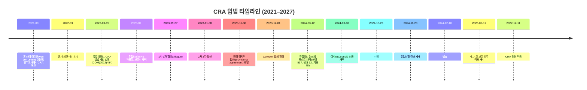

{}
이 페이지는 [EU CRA 취약점 보고 의무 보고서](../)의 **01단계 산출물**입니다. context-researcher 에이전트가 1차 출처(Eur-Lex, EC, ENISA)를 중심으로 조사한 배경 자료입니다.
{}

# 배경: EU CRA 취약점 보고 의무

## 1. 자료 개요

검토 대상 문서는 블랙덕 소프트웨어(Black Duck Software, Inc.)가 2026년 4월에 발행한 *EU CRA Vulnerability Reporting Checklist: Sept '26 Obligations*다.[^1] 블랙덕은 소프트웨어 구성 분석(Software Composition Analysis, SCA), 정적 분석(Static Analysis), 퍼징(Fuzzing) 등 애플리케이션 보안 솔루션을 제공하는 미국 매사추세츠주 기반 상장 기업으로, 2024년 시놉시스(Synopsys)의 소프트웨어 무결성 사업부가 분사되어 설립되었다.[^1]

이 체크리스트는 법적 구속력이 없는 업계 자료다. 1차 출처는 사이버 복원력법(Cyber Resilience Act, CRA) 원문 — 규정(EU) 2024/2847 — 이며, 체크리스트는 제조사 컴플라이언스 담당자가 2026년 9월 11일 시행되는 취약점 보고 의무에 대비하도록 만들어진 마케팅·교육 자료다.[^1] 모든 의무와 시한의 법적 권위는 CRA 원문, 그리고 유럽위원회(European Commission)·유럽 사이버보안청(European Union Agency for Cybersecurity, ENISA)의 공식 자료에 있다.

## 2. 상위 규제: 사이버 복원력법(CRA)

### 2.1 공식 명칭과 발효

CRA의 정식 명칭은 규정(EU) 2024/2847 — 디지털 요소를 가진 제품의 수평적 사이버보안 요건에 관한 규정(Regulation (EU) 2024/2847 on horizontal cybersecurity requirements for products with digital elements)이다.[^2] 유럽연합 관보(Official Journal of the EU)에는 2024년 11월 20일 게재되었고[^3], 그로부터 20일 뒤인 2024년 12월 10일 발효되었다.[^3][^4]

### 2.2 단계별 적용(Staggered application)

CRA는 한 번에 전면 적용되지 않고 단계적으로 발효된다.[^4][^5]

| 시점 | 적용 의무 |
|---|---|
| 2024-12-10 | 발효 (Entry into force) |
| 2026-06-11 | 적합성 평가 기관(notified bodies) 통보 관련 조항(제IV장) 적용 |
| **2026-09-11** | **제14조 보고 의무(Reporting obligations) 적용 — ENISA 단일 보고 플랫폼 운영 개시** |
| 2027-12-11 | CRA 주요 의무 전면 적용 (CE 마킹, 적합성 평가, 본질적 사이버보안 요건 등) |

### 2.3 적용 범위와 핵심 의무

적용 대상은 "디지털 요소를 가진 제품(product with digital elements, PDE)"이다. 하드웨어·소프트웨어 및 별도로 시장에 출시된 구성요소까지 포괄하며, 장치·네트워크와 직접·간접적인 논리적/물리적 데이터 연결을 갖는 제품이 모두 포함된다. 상업적으로 공급되지 않는 제품, 그리고 의료기기처럼 이미 별도의 부문별 사이버보안 입법이 적용되는 제품은 제외된다.[^5]

제조사가 제13~14조에 따라 부담하는 의무는 크게 다음 축으로 묶인다.[^5]

- 설계·개발·생산 단계의 본질적 사이버보안 요건 준수, 리스크 평가와 문서화, 제3자 구성요소에 대한 실사(due diligence)
- CE 마킹과 적합성 평가, 그리고 시장 출시 후 최소 5년(또는 예상 사용 기간)에 해당하는 지원 기간(support period) 명시
- 제14조 보고 의무 — 실제 악용 취약점과 중대 사고 통지

### 2.4 제14조: 보고 의무의 핵심

제조사는 두 부류의 사건 — 실제 악용되고 있는 취약점(actively exploited vulnerabilities), 그리고 제품 보안에 영향을 미치는 중대한 보안 사고(severe incidents) — 을 인지한 즉시 회원국 코디네이터 CSIRT와 ENISA에 동시 통지해야 한다.[^6][^7]

| 단계 | 시한 | 내용 |
|---|---|---|
| 조기 경보(Early warning) | 인지 후 24시간 | 영향 회원국, 악의적 활동 연관 여부 |
| 본 통지(Notification) | 72시간 | 취약점·사고의 일반적 성격, 사용 가능한 완화 조치, 민감도 평가 |
| 최종 보고(Final report) — 취약점 | 완화 조치 가용 후 14일 | 심각도·영향, 위협 행위자 정보, 보안 업데이트 |
| 최종 보고 — 사고 | 통지 후 1개월 | 상세 사고 기술, 위협 유형/근본 원인, 완화 |

24시간 시한은 분류·해결 시간이 아니라 조기 경보 체계로만 의도된 것이다.[^6] 마이크로기업과 소기업은 24시간 시한 미준수에 따른 과징금이 면제된다.[^5]

## 3. 입법 경위 (타임라인)

주요 시점은 유럽의회 입법 트레인, 유럽위원회 요약, Wikipedia 항목에서 교차 확인했다.[^4][^5][^8]

### 3.1 오픈소스 커뮤니티의 영향

2022~2023년 초안 단계에서 이클립스 재단(Eclipse Foundation), 오픈소스 이니셔티브(OSI), 도큐먼트 재단(Document Foundation) 등은 "상업 활동(commercial activity)" 정의가 불명확해 자원봉사 개발자에게 컴플라이언스 부담을 지운다는 우려를 제기했다.[^8] 2023년 12월 정치적 합의 시 "오픈소스 스튜어드(open source steward)" 개념과 오픈소스 예외가 도입되어 이클립스 재단의 마이크 밀린코비치(Mike Milinkovich)는 개선을 평가했으나, 데비안(Debian)·OSI는 소규모 재배포자에 대한 영향에 대해 우려를 유지했다.[^8]

## 4. 이해관계자

| 주체 | 역할/의무 | 입장·우려 |
|---|---|---|
| 제조사(Manufacturer) | 본질적 사이버보안 요건 충족, 적합성 평가, 제14조 보고, 지원 기간 동안 취약점 처리[^5] | 24시간 조기 경보 시한이 분류 전 단계임을 강조 — 과잉 보고 부담 우려[^6] |
| 수입사(Importer) | CRA 적합성 확인, CE 마킹·기술 문서 존재 확인, 비준수 제품 유통 중단[^5] | 제조사 자료 의존도 — 책임 분담 모호성 |
| 유통사(Distributor) | CE 마킹·연락처·지원 기간 표시 확인, 취약점 인지 시 제조사에 통지[^5] | 다수 제품 취급 시 검증 부담 |
| ENISA(유럽 사이버보안청) | 단일 보고 플랫폼(Single Reporting Platform, SRP) 구축·운영, EUVD 운영, 제조사 통지 수신[^9][^10] | NIS2와 CRA 두 체제 운영의 자원 부담 |
| 국가 코디네이터 CSIRT | 제조사 본부 소재 회원국 기준 1차 수신, 관련 회원국 CSIRT로 전파[^7][^9] | 예외 상황 시 사이버보안 사유로 전파 지연 가능 |
| 시장 감시 당국(Market Surveillance Authority) | 회원국이 지정, CRA 집행, 비준수 제품 시정·회수 명령, ADCO 통한 국제 협력[^5] | 회원국 간 집행 강도 편차 |
| 유럽위원회(Commission) | 위임법(delegated acts)·이행법(implementing acts)을 통해 세부 규정 보완 (예: 중요·중대 제품 분류)[^5] | — |
| 오픈소스 스튜어드 | 사이버보안 정책 보유, 취약점 보고 의무 — 단, CRA 위반 과징금 면제[^5] | 정의·실무 가이드 부족 |

## 5. 관련 표준·프레임워크

CRA는 본질적 요건만 규정하고 세부는 조화 표준(harmonised standards)에 위임한다.

| 표준/프레임워크 | 정식 명칭 | CRA 매핑 |
|---|---|---|
| ISO/IEC 29147:2018 | Information technology — Security techniques — Vulnerability disclosure | 취약점 공시 절차 — 제13조 취약점 처리 및 제14조 보고 의무에 대응[^11] |
| ISO/IEC 30111:2019 | Information technology — Security techniques — Vulnerability handling processes | 취약점 처리 절차 — 부속서 I(Annex I) 취약점 처리 요건의 기반이 되는 EN 표준의 후보[^11][^12] |
| SPDX (ISO/IEC 5962:2021) | Software Package Data Exchange | CRA가 명시하는 SBOM 표준 형식 후보[^13] |
| CycloneDX | OWASP CycloneDX BOM Standard | CRA SBOM 표준 형식 후보 — VEX(Vulnerability Exploitability eXchange) 네이티브 지원[^13] |
| NIST SSDF (SP 800-218) | Secure Software Development Framework | 설계 보안(secure by design) 요건과 기능적으로 정렬 — 한국 SW공급망 가이드라인 1.0도 SSDF 활용 권고[^14] |
| EUVD | European Vulnerability Database | NIS2 지침 제12조에 근거해 ENISA가 2025년 5월 13일 출범 — CRA SRP와는 별개의 공시 데이터베이스[^10] |
| CRA SRP | Single Reporting Platform (CRA 제16조) | 2026년 9월 11일 가동 예정 — 제14조 보고 채널[^9] |

> 주의: 위 표는 매핑 후보를 정리한 것이다. CEN/CENELEC JTC 13 WG 9가 CRA용 EN 조화 표준을 책정 중이라 최종 인용 표준은 바뀔 수 있다.[^12]

## 6. 타 관할권 비교

### 6.1 미국: EO 14028 + CISA KEV

2021년 5월 12일 바이든 행정명령 14028호(Executive Order 14028, "Improving the Nation's Cybersecurity")는 연방 정부 조달 소프트웨어에 대한 SBOM 요건과 공급망 보안 강화를 지시했다.[^15] CISA(Cybersecurity and Infrastructure Security Agency)는 BOD 22-01에 따라 알려진 악용 취약점 목록(Known Exploited Vulnerabilities Catalog, KEV)을 운영하며, 연방 민간 행정기관(FCEB)에 기한 내 조치를 의무화한다.[^16]

| 항목 | EU CRA | US (EO 14028 + KEV) |
|---|---|---|
| 적용 대상 | EU 시장 출시 모든 PDE | 연방 조달 SW (민간은 권고) |
| 보고 주체 | 제조사·수입사·유통사 | 연방 기관 (KEV는 사후 대응) |
| 시한 | 24h/72h/14d | KEV는 별도 기한 부여 |
| 법적 강제력 | 규정(직접 효력) | 행정명령·BOD (연방 한정) |

CRA는 시장 출시 단계의 사전 규제이고, EO 14028/KEV는 연방 조달과 사후 대응에 무게가 실린다는 점에서 작동 방식이 다르다.

### 6.2 영국: PSTI Act 2022

영국 제품보안·통신인프라법(Product Security and Telecommunications Infrastructure Act 2022, PSTI Act)은 2024년 4월 29일 시행되었다.[^17] 소비자용 연결 제품(consumer connectable products)에 대해 ① 기본 비밀번호 금지, ② 취약점 보고 채널 유지, ③ 보안 업데이트 기간 공개를 의무화한다.[^17]

| 항목 | EU CRA | UK PSTI |
|---|---|---|
| 적용 범위 | 모든 PDE (B2B 포함) | 소비자용 연결 제품 한정 |
| 취약점 처리 | 처리 + 당국 보고 의무 | 보고 접수 채널만 의무 |
| CE 마킹 | 필수 | 별도 |
| 시행 시점 | 2027-12-11 전면 | 2024-04-29 |

PSTI가 소비자 IoT에 좁게 초점을 맞춘 반면 CRA는 모든 디지털 요소 제품을 수평적으로 다루므로, 두 제도는 범위와 깊이가 다르다.

### 6.3 한국: SW공급망 보안 가이드라인 1.0 (참고)

한국에서는 과학기술정보통신부·국가정보원·디지털플랫폼정부위원회·한국인터넷진흥원(KISA)이 2024년 5월 SW 공급망 보안 가이드라인 1.0을 발표했다. 30개 보안 점검 항목, SBOM 생성·취약점 점검 절차, NIST SSDF 활용 권고가 포함된다.[^14] 다만 행정 가이드라인 수준이다. 정보통신망 이용촉진 및 정보보호 등에 관한 법률(정보통신망법)이나 정보보호산업법 등 현행 법령에는 CRA에 직접 대응하는 제조물 차원의 강제 보고 의무가 아직 없다.

## 참고 자료

[^1]: Black Duck Software, *EU CRA Vulnerability Reporting Checklist: Sept '26 Obligations*, 2026년 4월. (사용자 제공 1차 자료 — `/Users/1112821/projects/research/reports/eu-cra-vulnerability-reporting/00-source.md`)
[^2]: EUR-Lex, "Regulation - 2024/2847 - EN" — `https://eur-lex.europa.eu/eli/reg/2024/2847/oj/eng` (접속: 2026-05-12). 검색 결과를 통해 공식 ELI URI가 확인됨.
[^3]: European Commission, "Cyber Resilience Act | Shaping Europe's digital future" — `https://digital-strategy.ec.europa.eu/en/policies/cyber-resilience-act` (접속: 2026-05-12). 발효일(2024-12-10), 단계 적용 일정 확인.
[^4]: European Parliament, "Horizontal cybersecurity requirements for products with digital elements — Legislative Train" — `https://www.europarl.europa.eu/legislative-train/theme-a-europe-fit-for-the-digital-age/file-european-cyber-resilience-act` (접속: 2026-05-12). 입법 절차 일정(제안일, 3자 협상, 채택, 서명) 확인.
[^5]: European Commission, "The Cyber Resilience Act - Summary of the legislative text" — `https://digital-strategy.ec.europa.eu/en/policies/cra-summary` (접속: 2026-05-12). 적용 범위·정의·이해관계자 의무·단계 적용 일정·오픈소스 예외 확인.
[^6]: Black Duck Software, *EU CRA Vulnerability Reporting Checklist: Sept '26 Obligations*, 2026년 4월 (출처 [^1]). 24h 조기 경보의 성격에 대한 업계 해석.
[^7]: European Commission, "Cyber Resilience Act - Reporting obligations" — `https://digital-strategy.ec.europa.eu/en/policies/cra-reporting` (접속: 2026-05-12). 보고 시한, ENISA·CSIRT 역할 확인.
[^8]: Wikipedia, "Cyber Resilience Act" — `https://en.wikipedia.org/wiki/Cyber_Resilience_Act` (접속: 2026-05-12). 입법 타임라인 보조 및 오픈소스 커뮤니티 입장 인용. (1차 출처가 아닌 보조 자료로 사용; 핵심 날짜는 출처 [^4]·[^5]와 교차 확인)
[^9]: ENISA, "Single Reporting Platform (SRP)" — `https://www.enisa.europa.eu/topics/product-security-and-certification/single-reporting-platform-srp` (접속: 2026-05-12). SRP 운영 주체·시점·기능 확인.
[^10]: ENISA, "Consult the European Vulnerability Database to enhance your digital security!" — `https://www.enisa.europa.eu/news/consult-the-european-vulnerability-database-to-enhance-your-digital-security` (접속: 2026-05-12). EUVD 출범일(2025-05-13)·법적 근거(NIS2) 확인.
[^11]: ISO, "ISO/IEC 29147:2018 — Vulnerability disclosure" — `https://www.iso.org/standard/72311.html` (접속: 2026-05-12); ISO, "ISO/IEC 30111:2019 — Vulnerability handling processes" — `https://www.iso.org/standard/69725.html` (접속: 2026-05-12).
[^12]: CEN-CENELEC, "Online CRA Workshop 'Deep dive session: Vulnerability handling'" (CEN/CLC JTC 13 WG 9), 2025-07-22 — `https://www.cencenelec.eu/media/CEN-CENELEC/Events/Webinars/2025/cen-clc-jtc-13-wg-9_pt3_cra_workshop_2025-07-22.pdf` (접속: 2026-05-12). EN ISO/IEC 29147:2020·EN ISO/IEC 30111:2019 기반 CRA 조화 표준 책정 현황.
[^13]: OpenSSF, "Global Alignment on SBOM Standards: How the EU Cyber Resilience Act and OpenSSF Are Unifying Software Supply Chain Security", 2025-10-22 — `https://openssf.org/blog/2025/10/22/sboms-in-the-era-of-the-cra-toward-a-unified-and-actionable-framework/` (접속: 2026-05-12). SPDX·CycloneDX의 CRA 매핑 및 OpenSSF 정책.
[^14]: 한국인터넷진흥원(KISA), "SW 공급망 보안 가이드라인 1.0", 2024년 5월 — `https://www.kisa.or.kr/2060204/form?postSeq=15&page=1` (접속: 2026-05-12).
[^15]: CISA, "Executive Order on Improving the Nation's Cybersecurity" — `https://www.cisa.gov/topics/cybersecurity-best-practices/executive-order-improving-nations-cybersecurity` (접속: 2026-05-12). EO 14028 개요와 SBOM·공급망 보안 지시 사항.
[^16]: CISA, "Known Exploited Vulnerabilities Catalog" — `https://www.cisa.gov/known-exploited-vulnerabilities-catalog` (접속: 2026-05-12). KEV의 법적 근거(BOD 22-01)와 FCEB 적용 범위.
[^17]: UK Government, "The UK Product Security and Telecommunications Infrastructure (Product Security) regime" — `https://www.gov.uk/government/publications/the-uk-product-security-and-telecommunications-infrastructure-product-security-regime` (접속: 2026-05-12). PSTI Act 2022 시행일(2024-04-29)과 의무 사항.
