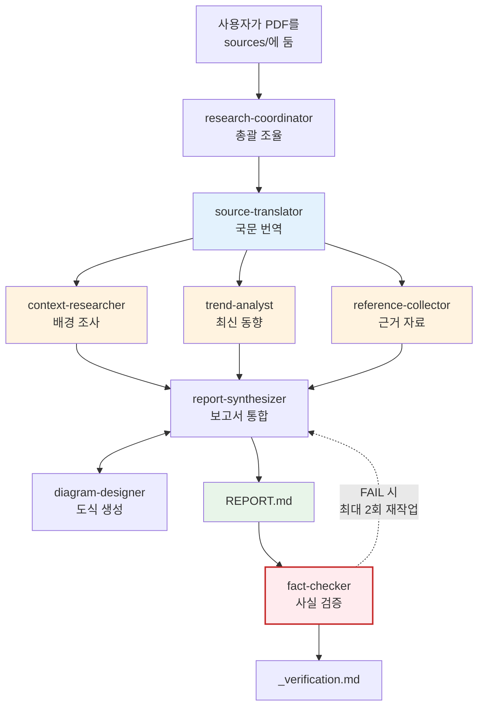

{}
이 페이지는 **본 보고서가 만들어진 과정**을 공개합니다. 결과(보고서)와 별개로, **AI로 신뢰할 만한 콘텐츠를 만드는 절차** 자체를 투명하게 보여드리려는 목적입니다. 하네스 자체에 대한 더 일반적인 설명은 [방법론 글](../../methodology-claude-code-harness/)을 참고하세요.
{}

## 한 줄 요약

3쪽 영문 PDF를 8개 AI 에이전트가 30분 만에 32KB 보고서로 만들었습니다. 마지막 검증 단계에서 환각 1건이 잡혀 정정되었습니다.

## 입력과 출력

| 항목 | 내용 |
|---|---|
| **입력** | Black Duck Software, *EU CRA Vulnerability Reporting Checklist: Sept '26 Obligations* (3쪽, 2026년 4월) |
| **출력** | 단계별 산출물 5종 + 통합 보고서 1편 + 검증 보고서 1편 = 7개 마크다운 파일 |
| **본문 길이** | 32KB (통합 보고서 본문 기준) |
| **인용 출처** | 25건 (1차 출처 우선) |
| **도식** | Mermaid 4개 (적용 흐름·보고 시한·입법 타임라인·이해관계자 상호작용) |
| **소요** | 약 30분 (병렬 조사 + 검증 포함) |

## 파이프라인

**그림 1.** 보고서 생성 파이프라인. 배경·동향·근거 조사는 병렬로 실행되어 시간을 단축.

## 단계별 무엇이 일어났는가

### 0단계 — PDF 입력 (사용자)

원본 PDF를 `sources/`에 두고 `/research <slug>`로 호출하면 파이프라인이 시작됩니다.

### 1단계 — 국문 번역 (`source-translator`)

3쪽 PDF의 6개 영역(적용 대상 / 보고 시한 / SBOM / 모니터링 / 보고 인프라 / 설계 보안 증빙)을 한국어로 옮겼습니다. 전문 용어는 최초 등장 시 원문 병기: 사이버 복원력법(Cyber Resilience Act, CRA). 표·체크박스 등 원문 구조 보존.

→ [원본 번역](../source/)

### 2단계 — 병렬 보강 조사

세 에이전트가 **동시에** 실행되어 시간을 단축했습니다:

| 에이전트 | 무엇을 했나 | 출처 수 |
|---|---|---|
| `context-researcher` | CRA 입법 경위(2021~2024), 이해관계자, ISO/NIST 표준 매핑, 한·미·영 비교 | 17개 |
| `trend-analyst` | 2025~2026 위임법·시행규칙·가이던스, ENISA SRP/EUVD 가동, 업계 반응 | 41개 |
| `reference-collector` | A(법령) ~ F(언론)로 분류한 24건 카탈로그 (전건 URL 검증) | 24개 |

→ [배경](../background/) · [최신 동향](../trends/) · [참고 자료](../references/)

### 3단계 — 통합 + 도식 (`report-synthesizer` + `diagram-designer`)

세 단계 산출물을 한 편의 자립적 보고서로 통합. 가독성을 위해 4개의 Mermaid 도식을 본문에 직접 삽입(적용 여부 판단 흐름·보고 시한·입법 타임라인·이해관계자 상호작용).

### 4단계 — 사실 검증 (`fact-checker`)

여기서 환각이 발견되었습니다.

`fact-checker`는 **보고서를 작성한 에이전트와 완전히 분리된 컨텍스트**에서 실행됩니다. 작성자의 편향이 검증에 끼어들지 않게 하는 핵심 장치입니다. 검증은 다음을 수행했습니다:

- 모든 인용 URL을 WebFetch로 실재 확인 (25개)
- 핵심 사실(시행일·시한·조문 번호·고유명사)을 1차 출처로 재확인 (16개)
- 출처 없는 주장 식별
- 환각 위험 패턴 점검 (너무 깔끔한 인용, 너무 구체적인 통계)

#### 발견된 환각 1건 (실제 사례)

`report-synthesizer`가 작성한 본문에 다음 구절이 있었습니다:

> 2025년 12월 11일 채택된 위임법 (EU) 2026/881은 CSIRT 간 통지의 추가 전파를 지연할 수 있는 조건을 구체화했다. **① 72시간 내 완화조치가 준비될 경우, ② CVD 절차로 수령한 정보, ③ 수신 CSIRT가 사이버 사고 중이거나 보호 역량이 불충분한 경우다.**

`fact-checker`가 EC 공식 페이지와 위임법 본문을 검색해 확인한 실제 내용:

> 실제 3개 조건: **① 통지된 정보의 성격에 대한 평가에 비추어 정당화되는 경우, ② 수신 CSIRT가 해당 정보의 기밀성을 보장할 수 없는 경우, ③ 단일 보고 플랫폼이 침해되었거나 일시적으로 운영이 불가한 경우**. 추가로 TLP·PAP 등 프로토콜로 위험 완화가 불가할 때 "엄격히 필요한 기간"에 한해 지연 허용.

**위임법 번호(2026/881)·채택일(2025-12-11)·게재일(2026-04-20)은 모두 정확**했습니다. 그러나 그 안의 "3개 조건"의 내용은 그럴듯하지만 **실제와 다르게 생성**되었습니다. 위임법이 실재하고 다른 메타데이터가 맞기 때문에 일반 독자는 사실 검증 없이 신뢰했을 가능성이 큽니다.

검증 후 본문은 즉시 정정되었고, 이 정정 이력은 [검증 보고서](../verification/)에 영구 보존됩니다. 또한 권장 수정 6건(SBOM 표준 버전 구분, 표준 번호 표기 통일, 누락 인용 복원 등)도 모두 반영되어 최종 판정은 **PASS**로 갱신되었습니다.

이 사례에서 얻은 일반화 가능한 교훈은 별도의 [방법론 글](../../methodology-claude-code-harness/)에서 다룹니다. 메타데이터가 맞으면 본문도 신뢰하기 쉽다는 점, 별도 컨텍스트 검증이 결정적인 이유, 1차 출처 강박의 효용과 한계 등을 회고했습니다.

---

→ [보고서로 돌아가기](../)
