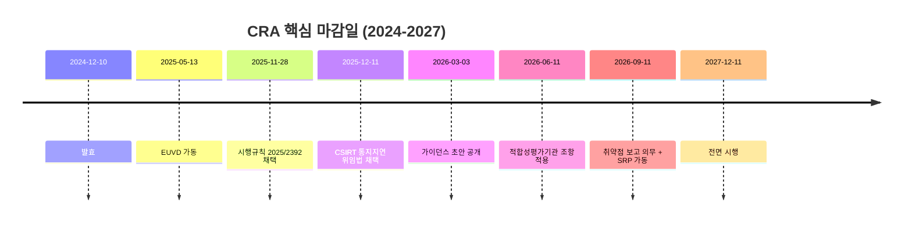

{}
이 페이지는 [EU CRA 취약점 보고 의무 보고서](../)의 **02단계 산출물**입니다. trend-analyst 에이전트가 직전 24개월(2024-05 ~ 2026-05)의 1차·2차 출처 41건을 정리한 자료입니다.
{}

# 최신 동향: EU CRA 취약점 보고 의무

> *조사 기준일: 2026-05-12*
> *대상 법규: 사이버 복원력법(Cyber Resilience Act, CRA) — Regulation (EU) 2024/2847*

2024년 12월 10일 발효된[^1] EU CRA에서 가장 임박한 마감일은 2026년 9월 11일 취약점·중대 사고 보고 의무다. 아래는 그 시점을 앞두고 지난 24개월(2024년 5월 ~ 2026년 5월) 사이 쌓인 1차·2차 자료를 시간순으로 훑어본 기록이다.

---

## 1. 시행 일정 (현재 시점에서 본 정확한 마감일)

| 날짜 | 이벤트 | 법적 근거 / 출처 |
|---|---|---|
| 2024-11-20 | 「관보(Official Journal)」 게재 | Regulation (EU) 2024/2847[^1] |
| 2024-12-10 | 발효(entry into force) | CRA Art. 71[^2] |
| 2025-05-13 | 유럽 취약점 데이터베이스(European Vulnerability Database, EUVD) 공식 가동 | ENISA 보도자료(2025-05-13)[^3] |
| 2025-11-28 | 시행규칙 (EU) 2025/2392 채택 — "중요(important)·중대(critical) 제품" 기술 기술서(技術書) | Commission Implementing Regulation 2025/2392[^4] |
| 2025-12-01 | (EU) 2025/2392 관보 공표 | EUR-Lex / 시행규칙[^4] |
| 2025-12-03 | 유럽위원회(European Commission) 첫 공식 FAQ 발표 | Commission FAQ v1(2025-12-03, 2025-12-19 업데이트)[^5] |
| 2025-12-11 | 위임법(delegated act) 채택 — CSIRT 통지 지연(grounds for delaying dissemination) 조건 | 위임법 (EU) 2026/0881 (예정 번호)[^6] |
| 2025-12-21 | 시행규칙 (EU) 2025/2392 발효 | EUR-Lex[^4] |
| 2026-03-03 | 유럽위원회 첫 가이던스 초안(draft guidance) 공개 — 공공 의견수렴 시작 | EC 보도자료(2026-03-03)[^7] |
| 2026-03-31 | 가이던스 초안 의견수렴 마감 | EC 보도자료(2026-03-03)[^7] |
| **2026-06-11** | **적합성 평가기관(Conformity Assessment Bodies) 통지 조항 적용 개시** | CRA Art. 71(2)[^8] |
| **2026-09-11** | **취약점·중대 사고 보고 의무 적용 개시 + ENISA 단일 보고 플랫폼(Single Reporting Platform, SRP) 가동** | CRA Art. 14, Art. 16[^9][^10] |
| 2026-12-11 | 회원국별 적합성 평가기관 통지 마감 | EU 집행위 시행 페이지[^8] |
| **2027-12-11** | **CRA 전면 시행** — CE 마킹, 완전 적합성 평가, 모든 본질 요구사항 적용 | CRA Art. 71(2)[^2][^8] |

---

## 2. 2025~2026년 발표된 공식 위임법·시행규칙·가이던스

### 2.1 시행규칙 (Implementing Acts)

Commission Implementing Regulation (EU) 2025/2392가 2025년 11월 28일 채택돼 12월 1일 관보 공표, 12월 21일 발효라는 비교적 빠른 일정으로 자리를 잡았다. 이 규칙은 CRA Annex III·IV에 열거된 "중요(important)·중대(critical) 제품"의 기술적 정의를 확정하면서, 28개 제품 범주를 3개 위험등급(중요 Class I / Class II / 중대)으로 가른 기술서를 부속한다.[^4] Hogan Lovells는 2026년 2월 분석에서 "이 규칙으로 제조사가 자사 제품의 적용 등급을 판단할 1차 기준이 확보됐다"고 평가했다.[^11]

### 2.2 위임법 (Delegated Acts)

CSIRT 통지 지연(delay of dissemination) 위임법은 2025년 12월 11일 채택돼 2026년 4월 20일 관보에 실렸다. 국가 CSIRT가 단일 보고 플랫폼을 통해 받은 통지를 다른 CSIRT에 즉시 전파하지 않을 수 있는 "사이버보안 사유"가 비로소 구체화됐다는 점에서 의미가 있다. 위임법은 세 가지 사유를 들었다 — ① 통지된 정보의 성격에 대한 평가에 비추어 정당화되는 경우, ② 수신 CSIRT가 해당 정보의 기밀성을 보장할 수 없는 경우, ③ 단일 보고 플랫폼이 침해되었거나 일시적으로 운영이 불가한 경우. 트래픽 라이트 프로토콜(TLP)·정보 접근 프로토콜(PAP) 등으로 위험을 완화할 수 없을 때만, 그리고 "엄격히 필요한 기간"에 한해 지연이 허용된다.[^6][^12]

*수정 이력 (2026-05-12, fact-checker 검증 반영): 위 3개 사유는 위임법 (EU) 2026/881 원문 기준으로 재기술됨. 이전 초안의 "72시간 내 완화조치 준비 / CVD 절차로 수령 / 수신 CSIRT가 사이버 사고 중"은 실제 위임법과 다른 잘못된 기술이었음.*

### 2.3 가이던스(Guidance) 문서

유럽위원회의 첫 공식 FAQ가 2025년 12월 3일에 나왔고(12월 19일 한 차례 업데이트), 위험평가의 범위·반복성과 "의도된 사용(intended purpose)" 및 "합리적 예측 가능 사용(reasonably foreseeable use)" 개념을 비구속적이지만 처음으로 풀어냈다. Timelex와 Alston & Bird는 "구속력은 없으나 시장감시당국의 해석에 강한 영향을 줄 것"이라 평가했다.[^5][^13]

이어 2026년 3월 3일에는 Article 26에 따른 첫 가이던스 초안(Draft Guidance)이 공개됐고, 3월 31일까지 공공 의견수렴이 진행됐다. 초안이 다룬 4개 주제는 ① 원격 데이터 처리 솔루션(remote data processing), ② 자유·오픈소스 소프트웨어(free and open-source software), ③ 지원 기간(support periods), ④ CRA와 NIS2·DORA 등 타 규정과의 상호관계다.[^7][^14] Linklaters는 2026년 3월 정리에서 초안 75쪽 중 약 4분의 1이 오픈소스 스튜어드(open-source steward) 정의에 할애됐다고 짚었다.[^15]

### 2.4 표준화 작업 (CEN/CENELEC/ETSI)

표준화 라인은 2025년 4월 3일 3개 표준화기구가 위원회의 표준화 위임(standardisation request)을 정식 수락하면서 본격적으로 움직였다. 위임은 41개 조화 표준(수평 15개·수직 25개)으로 구성됐다.[^16] 같은 해 12월 수평 표준 EN40000-2-1(사이버 복원력 원칙)의 prEN 초안이 공개됐고, 이후 일정은 다음 두 마감일로 정리된다.

- 2026-08-30(예정): 취약점 처리를 포함한 수평 표준 발행 목표일.[^16]
- 2026-10-30(예정): 수직 표준 발행 목표일.[^16]

---

## 3. ENISA 단일 보고 플랫폼(SRP) 및 EUVD 현황

### 3.1 단일 보고 플랫폼(Single Reporting Platform, SRP)

SRP는 보고 의무 적용 개시일인 2026년 9월 11일에 동시 가동될 예정이다. ENISA는 그 이전에 시험 기간(testing period)을 두겠다고 밝혔지만, 시험 일정의 공식 공지는 본 보고서 작성 시점(2026-05-12)까지 나오지 않았다.[^10] 법적 근거는 CRA Art. 16으로, ENISA가 CSIRT 네트워크와 협력해 기술·운영·조직적 사양을 마련하고, 회원국과 ENISA가 각자의 전자 통지 종단점(electronic notification end-points)을 설치할 수 있는 아키텍처를 갖추도록 한다.[^17]

ENISA는 플랫폼의 턴키(turnkey) 구축을 위해 조달 절차를 공시하면서 "NIS2·DORA의 향후 사고·취약점 보고 체계와의 통합을 가능케 하는 미래지향 아키텍처"를 요구했다.[^18] 설계 의도상 제조사가 한 번 제출하면 ① 주 사업장 소재국의 CSIRT 코디네이터와 ② ENISA로 자동 라우팅된다.[^10][^17]

문제는 시점이다. 2026년 5월 기준으로 API 사양·데이터 모델·인증 방식의 공개 사양은 어디에도 발표돼 있지 않다. CRA Evidence(2026)는 "운영 개시 4개월 전까지 제조사가 통합 시험을 수행하기 어려울 정도로 사양 공개가 늦다"고 지적했다.[^19]

### 3.2 유럽 취약점 데이터베이스(European Vulnerability Database, EUVD)

EUVD는 NIS2 Directive Art. 12를 이행하는 형태로 2025년 5월 13일 ENISA가 정식 가동했다.[^3] Computer Weekly는 사전 베타가 같은 해 4월에 이미 공개됐다고 보도했다.[^20] CRA의 "취약점 모니터링"은 EUVD를 1차 데이터 출처 중 하나로 명시한다(원문 p.2 본문 참조). 명명규칙은 독자적 ID 체계(`EUVD-YYYY-NNNNNN`)를 따르되 CVE ID와 CVSS 점수를 함께 적는다.[^21]

운영 1년이 지난 시점의 평가는 호의적이지만은 않다. VulnCheck의 2025년 분석은 "'operational'과 'beta' 표시가 동시에 존재해 성숙도에 대한 혼란을 야기한다"며 API 설계·데이터 품질·커뮤니티 협업의 미비를 지적했고, ENISA가 EPSS 점수를 1차 데이터로 가져오면서 다섯 번째 소수자리를 누락한 채 100을 곱해 백분율로 환산하는 구현 오류도 함께 보고했다.[^22] 같은 시기 Help Net Security(2025-05-14)는 NetRise CEO Thomas Pace가 "규제 감독으로 기업이 자진 보고를 줄일 수 있다"고, Contrast Security의 Jeff Williams가 "기하급수적으로 증가하는 CVE를 EU가 운영할 수 있을지 불확실"하다고 우려한 내용을 전했다.[^23]

2026년 5월 현재 ENISA의 공식 통계 페이지는 누적 등재건수를 공개하지 않는다. 검색 화면에서는 `EUVD-2026-NNNNN` 형식의 식별자가 1만 건 이상 부여된 것을 확인할 수 있으나, 공식 통계로 확정된 수치는 없다.[^21] *— 한계: 통계는 출처 공개를 확인하지 못해 본문 인용을 보류.*

---

## 4. 이행 사례·준비 현황

### 4.1 대형 제조사

Siemens는 자사 사이버보안 포털 안에 별도의 "EU Cyber Resilience Act" 페이지를 운영하면서 "CRA의 도전 과제를 고객·산업파트너·이해관계자와 함께 해결하겠다"고 입장을 밝혔다. Siemens Advanta는 한 발 더 나아가 위탁 컨설팅 형태로 CE 마킹 취득 지원 라인을 출시했다.[^24] 2026년 2월 Siemens Blog가 기계 제조사를 겨냥해 "5대 사이버보안 요건 변화" 시리즈를 발행한 것도 같은 흐름이다.[^25]

반면 SAP의 CRA 전담 공식 성명이나 로드맵은 본 조사 범위 안에서 확인되지 않았다. ISACA의 2025년 산업 분석은 "SAP 시스템이 CRA의 직간접 적용을 받을 가능성"을 일반론 차원에서만 다룬다.[^26] *— 한계.*

### 4.2 오픈소스 재단의 공동 대응

오픈소스 진영의 공식 행동은 2024년 4월 2일 7개 재단의 공동 발표로 시작됐다. Apache Software Foundation, Blender Foundation, OpenSSL Software Foundation, PHP Foundation, Python Software Foundation, Rust Foundation, Eclipse Foundation이 "CRA 대응을 위한 보안 개발 공통 사양(common specifications) 수립" 이니셔티브를 함께 띄웠다.[^27][^28] 5월 22일 Open Source Security Foundation(OpenSSF)이 이 컨소시엄에 합류하면서 보안 정책·절차의 표준화 작업에 가세했다.[^29]

이후 Eclipse Foundation 산하로 Open Regulatory Compliance Working Group(ORC WG)이 발족했고, 그 안의 Stewards Cyber Resilience SIG는 2025~2026년 사이 백서 `stewards-and-cra.md`를 GitHub에 공개해 스튜어드의 책임 한계와 의무를 정리했다.[^30]

### 4.3 SBOM 측 표준화

SBOM 정합성 논의는 2025년 동안 세 갈래로 굳어졌다. OpenSSF는 2025년 10월 22일 "SBOMs in the Era of the CRA" 블로그에서 SPDX·CycloneDX의 CRA 정합성과 통합 프레임워크 방향을 정리했고[^31], 같은 해 8월 독일 연방정보보안청(BSI)은 TR-03183-2 v2.1.0을 발표해 CycloneDX·SPDX 양식 모두에 대해 구체적 필드 매핑을 제공하는 CRA 정합 SBOM 기술 사양을 내놨다.[^32] CEN/CENELEC도 2025년 4월 8일 표준화 워크숍에서 Annex I 요구사항을 풀이하는 수평 표준이 SBOM 스키마를 포함해 2026년 중반까지 마련될 것이라고 보고했다.[^16]

---

## 5. 업계·시민사회 반응

| 주체 | 입장 / 핵심 주장 | 발언 시점 | 출처 |
|---|---|---|---|
| Mike Milinkovich (Eclipse Foundation, 전무) | "오픈소스 커뮤니티가 CRA 대응을 위한 사이버보안 프로세스를 직접 구축해야 한다" | 2024-04-02 | Eclipse Foundation 블로그[^28] |
| 7개 오픈소스 재단 공동 발표 (Apache·Eclipse·Python 등) | "CRA의 영향 범위가 오픈소스 생태계 전반에 미치므로 공통 사양으로 협력 필요" | 2024-04-02 | TechCrunch[^27] |
| OpenSSF (Mike Bursell, Cyber Policy WG) | "프로젝트 리더라고 자동으로 스튜어드가 되는 것은 아니다. 모든 OSS 프로젝트가 스튜어드를 가질 필요는 없다" | 2025-06-02 | OpenSSF 블로그[^33] |
| HackerOne (공공정책 페이지) | "24시간 보고는 미완화 취약점의 조기 노출 위험을 키운다. 연구자-제조사 협력 관계를 위축시킬 수 있다" | 2024 (CRA 협상 단계) | HackerOne[^34] |
| Cybersecurity Coalition + HPC | "CSIRT 통지지연 위임법 초안에 대한 공동 의견서" 제출 — CVD 절차 보호 요건 명확화 요청 | 2025 (의견수렴 단계) | Center for Cybersecurity Policy[^12] |
| Eclipse Foundation 연례 전망 | "SME 인지도가 12.3%로 대기업(83.5%) 대비 현저히 낮음 — 2026년에 격차가 고통스럽게 드러날 것" | 2025-12-18 | Eclipse Foundation 블로그[^35] |
| VulnCheck (블로그) | "EUVD는 운영 상태와 베타 표시가 공존해 성숙도 의문. API·데이터 품질·커뮤니티 협업이 미흡" | 2025 | VulnCheck[^22] |
| Thomas Pace (NetRise CEO) | "EUVD 운영으로 기업이 자진 보고를 꺼릴 수 있다" | 2025-05-14 | Help Net Security[^23] |
| Jeff Williams (Contrast Security CTO) | "기하급수적 CVE 증가를 EU가 운영 가능할지 의문" | 2025-05-14 | Help Net Security[^23] |
| DLA Piper 분석 | "법무·기술 부서 모두가 2026-09-11 이전에 보고 워크플로우를 시험해야 하나, SRP 사양 미공개로 시험 자체가 불가" | 2026-02 | DLA Piper[^36] |

---

## 6. 남은 쟁점 (Open Issues, 2026-05 기준)

### 오픈소스 스튜어드 정의의 실효성

2026년 3월 3일 가이던스 초안에서 위원회는 "기술적 권한(commit rights)이 아니라 거버넌스·의사결정 통제"를 책임의 기준으로 제시했다.[^15][^7] 동 초안은 스튜어드를 비기술 재단, IT 인프라 제공자, 엔지니어링 자원을 보유한 조직 등 3개 계층으로 구분했고, 계층별로 Article 14의 24/72시간 보고 의무 적용 여부가 달라진다고 못박았다.[^15][^37] 다만 ASF·PSF 같은 비기술 재단이 어느 계층에 속하는지에 대한 모호성이 그대로 남아 있고, 3월 31일에 마감된 의견수렴 결과에 대한 위원회의 최종 정리는 본 보고서 작성 시점(2026-05-12)까지 공표되지 않았다. *— 불확실성.*

### 24시간 통지의 실효성 논란

CRA Art. 14는 24시간 초기경고가 "분류·해결을 위한 시간이 아니라 조기경보 체계"임을 못박지만, CPO Magazine(2024)과 CSO Online(2024)이 정리한 대로 보안연구자와 HackerOne 등은 "패치 전 노출 위험"을 근거로 일관되게 비판해왔다.[^38][^39][^34] 2025년 12월 11일 위임법은 CSIRT 사이의 전파를 지연할 조건을 마련했을 뿐, 제조사 → CSIRT 보고의 24시간 시한 자체에는 손대지 않았다.[^6][^12]

### SBOM 형식의 세부 사양

원문 체크리스트(p.2)는 SPDX·CycloneDX를 인정하는 수준에 머무른다. 구체적 필드 정의는 BSI TR-03183-2(2025-08)와 CEN/CENELEC 수평 표준(2026-08-30 발행 목표) 작업에서 채워지는 중이다.[^32][^16] 위원회는 SBOM 스키마를 시행규칙으로 정할 권한을 갖고 있으나, 2026년 5월까지 별도 시행규칙은 나오지 않았다.[^31]

### 단일 보고 플랫폼의 API·인증 사양 미공개

가동 4개월 전인 2026년 5월 12일 기준으로 ENISA는 제조사용 통합 사양을 공식 공개하지 않았다.[^19] 시험 기간의 개시일도 마찬가지로 미공시다.[^10]

### 레거시 제품 적용 범위

보고 의무는 EU 시장에 이미 출시된 레거시 제품에도 적용된다(원문 p.2 본문 + Bird & Bird 분석).[^40] 그러나 제품 단종(end-of-life) 시점의 보고 의무 종료 기준은 가이던스 초안에서도 명확하지 않은 채로 남아 있다.

### Digital Omnibus 패키지의 통합 보고 창구

2025년 11월 위원회는 "Digital Omnibus" 패키지를 발표하면서, CRA·NIS2·DORA·GDPR 등의 사고 보고를 단일 진입점으로 통합하는 "report once, share many" 모델을 제안했다. 본 패키지 발효 후 18개월 안에 단일 진입점을 운영한다는 목표다.[^41] CRA SRP와의 관계 정리는 추가 입법으로 진행 중이고, 본 보고서 작성 시점에 두 체계의 통합 시점·범위는 확정되지 않았다. *— 불확실성.*

---

## 7. 향후 12개월 주요 일정 (2026-05 ~ 2027-05)

| 날짜 | 이벤트 | 비고 |
|---|---|---|
| 2026-05~08 | ENISA SRP 시험 기간(예상) | 공식 일정 미공시[^10] |
| 2026-Q2~Q3 | 가이던스 초안 의견수렴 결과 반영·최종본 채택(예상) | 2026-03-31 마감 후 위원회 작업[^7] |
| 2026-06-11 | 적합성 평가기관 통지 조항 적용 개시 | CRA Art. 71[^8] |
| 2026-08-30 | CEN/CENELEC 수평 표준 EN40000-2-1 발행 목표일 | 표준화 위임[^16] |
| **2026-09-11** | **취약점 보고 의무 적용 + SRP 가동** | CRA Art. 14, 16[^9][^10] |
| 2026-10-30 | CEN/CENELEC 수직 표준 발행 목표일 | 표준화 위임[^16] |
| 2026-Q4 | EUCC(Common Criteria) 적합성 추정 위임법 채택(예상) | EU 집행위 시행 페이지[^8] |
| 2026-12-11 | 회원국별 적합성 평가기관 통지 마감 | CRA Art. 71[^8] |
| 2027 상반기 | "Digital Omnibus" 단일 진입점 입법 진행(예상) | Bird & Bird 분석[^41] |
| **2027-12-11** | **CRA 전면 시행 (CE 마킹, 완전 적합성 평가)** | CRA Art. 71(2)[^2] |

---

## 참고 자료

[^1]: Regulation (EU) 2024/2847 — Cyber Resilience Act, Official Journal of the European Union, L series, 2024-11-20. <https://eur-lex.europa.eu/eli/reg/2024/2847/oj> (접속: 2026-05-12).
[^2]: CRA Art. 71 (Entry into force and application). 본문 위 EUR-Lex 링크. (접속: 2026-05-12).
[^3]: ENISA, "Consult the European Vulnerability Database to enhance your digital security!", 2025-05-13. <https://www.enisa.europa.eu/news/consult-the-european-vulnerability-database-to-enhance-your-digital-security> (접속: 2026-05-12).
[^4]: Commission Implementing Regulation (EU) 2025/2392 (adopted 2025-11-28, OJ 2025-12-01, in force 2025-12-21) — "Technical descriptions of important and critical products with digital elements." 출처 정리: Secure-by-Design Handbook, "CRA Gets Teeth: Technical Definitions for Product Classes Now Official", 2025-11-28. <https://www.securebydesignhandbook.com/blog/2025/11/28/cra-implementing-regulation-published> (접속: 2026-05-12). 및 C-PRAV Group, 2025-12-03. <https://c-prav.com/2025/12/03/european-commission-adopts-regulation-eu-2025-2392-for-cyber-resilience-act-what-it-means-for-devices-with-digital-elements/> (접속: 2026-05-12).
[^5]: European Commission, "Cyber Resilience Act implementation — Frequently asked questions", 2025-12-03 발행(2025-12-19 업데이트). <https://digital-strategy.ec.europa.eu/en/library/cyber-resilience-act-implementation-frequently-asked-questions> (접속: 2026-05-12).
[^6]: Commission Delegated Act (CELEX:32026R0881 예정 번호), 채택 2025-12-11 — CSIRT 통지 지연 사유. 출처: European Commission, "CRA — Reporting obligations", 페이지 본문. <https://digital-strategy.ec.europa.eu/en/policies/cra-reporting> (접속: 2026-05-12).
[^7]: European Commission, "Commission publishes for feedback draft guidance to assist companies in applying the Cyber Resilience Act", 2026-03-03. <https://digital-strategy.ec.europa.eu/en/news/commission-publishes-feedback-draft-guidance-assist-companies-applying-cyber-resilience-act> (접속: 2026-05-12).
[^8]: European Commission, "Cyber Resilience Act — Implementation" factpage. <https://digital-strategy.ec.europa.eu/en/factpages/cyber-resilience-act-implementation> (접속: 2026-05-12).
[^9]: European Commission, "Cyber Resilience Act — Reporting obligations". <https://digital-strategy.ec.europa.eu/en/policies/cra-reporting> (접속: 2026-05-12). 페이지 본문: "As of 11 September 2026, manufacturers are required to report actively exploited vulnerabilities and severe incidents…".
[^10]: ENISA, "Single Reporting Platform (SRP)" 페이지. <https://www.enisa.europa.eu/topics/product-security-and-certification/single-reporting-platform-srp> (접속: 2026-05-12). 페이지 본문: "The platform is scheduled to be operational by 11 September 2026… A testing period is expected to take place before this date."
[^11]: Hogan Lovells, "EU Cyber Resilience Act: Key 2026 milestones toward CRA compliance", 2026-02. <https://www.hoganlovells.com/en/publications/eu-cyber-resilience-act-getting-ready-for-cra-compliance-in-2026> (접속: 2026-05-12).
[^12]: Cybersecurity Coalition / Hacking Policy Council, "Comment on EU CRA Delegated Act on Delaying Dissemination of Notifications About Vulnerabilities and Incidents", 2025. <https://www.centerforcybersecuritypolicy.org/insights-and-research/cybersecurity-coalition-hpc-comment-on-eu-cra-delegated-act-on-delaying-dissemination-of-notifications-about-vulnerabilities-and-incidents> (접속: 2026-05-12).
[^13]: Alston & Bird, "European Commission Publishes Guidance For Companies Implementing the EU Cyber Resilience Act", 2025-12. <https://www.alstonprivacy.com/european-commission-publishes-guidance-for-companies-implementing-the-eu-cyber-resilience-act/> (접속: 2026-05-12). 및 Timelex, "First FAQ on the Cyber Resilience Act", 2025-12. <https://www.timelex.eu/en/blog/first-faq-cyber-resilience-act> (접속: 2026-05-12).
[^14]: Hogan Lovells, "EU Cyber Resilience Act: European Commission publishes draft guidance", 2026-03. <https://www.hoganlovells.com/en/publications/eu-cyber-resilience-act-european-commission-publishes-draft-guidance-> (접속: 2026-05-12).
[^15]: Linklaters TechInsights (Ceyhun Pehlivan), "EU Cyber Resilience Act: Commission issues first draft guidance — 10 key points you need to know", 2026-03. <https://techinsights.linklaters.com/post/102mmlo/eu-cyber-resilience-act-commission-issues-first-draft-guidance-10-key-points-y> (접속: 2026-05-12).
[^16]: CEN-CENELEC, "Cyber Resilience Act and the horizontal standards" workshop 자료, 2025-04-08. <https://www.cencenelec.eu/media/CEN-CENELEC/Events/Events/2025/2025-04-08_cyber-resilience-act-and-the-horizontal-standards-workshop.pdf> (접속: 2026-05-12). 후속 웨비나 자료 2025-09-09 발행분도 참조.
[^17]: CRA Article 16 (Single Reporting Platform) 본문. 정리: european-cyber-resilience-act.com 사본. <https://www.european-cyber-resilience-act.com/Cyber_Resilience_Act_Article_16.html> (접속: 2026-05-12).
[^18]: ENISA, "Implementation of the Single Reporting Platform" — 조달 공시 페이지. <https://www.enisa.europa.eu/procurement/implementation-of-the-single-reporting-platform> (접속: 2026-05-12).
[^19]: CRA Evidence Blog, "Cyber Resilience Act 24-Hour Reporting: ENISA SRP, Sept 2026", 2026. <https://craevidence.com/blog/cra-enisa-vulnerability-reporting-24-hour> (접속: 2026-05-12).
[^20]: Computer Weekly, "Enisa launches European vulnerability database", 2025-05. <https://www.computerweekly.com/news/366623995/Enisa-launches-European-vulnerability-database> (접속: 2026-05-12).
[^21]: EUVD 검색 인터페이스. <https://euvd.enisa.europa.eu/> 및 <https://euvd.enisa.europa.eu/search> (접속: 2026-05-12). 본문에 식별자 형식 명시.
[^22]: VulnCheck, "Does ENISA EUVD live up to all the hype?", 2025. <https://www.vulncheck.com/blog/enisa-euvd> (접속: 2026-05-12).
[^23]: Help Net Security, "European Vulnerability Database goes live, but who benefits?", 2025-05-14. <https://www.helpnetsecurity.com/2025/05/14/enisa-european-vulnerability-database-euvd/> (접속: 2026-05-12).
[^24]: Siemens, "Cyber Resilience Act (CRA)" 공식 페이지. <https://www.siemens.com/en-us/company/digital-transformation/cybersecurity/eu-cra/> (접속: 2026-05-12). 및 Siemens Advanta 백서 <https://www.siemens-advanta.com/whitepaper/cyber-resilience-act> (접속: 2026-05-12).
[^25]: Siemens Blog, "Machine Builder, are you familiar with CRA yet? 5 key changes to cybersecurity requirements", 2026-02. <https://blog.siemens.com/en/2026/02/machine-builder-are-you-familiar-with-cra-yet-5-key-changes-to-cybersecurity-requirements-2/> (접속: 2026-05-12).
[^26]: ISACA, "Protecting SAP Systems in the Cybersecurity Era", 2025. <https://www.isaca.org/resources/news-and-trends/industry-news/2025/protecting-sap-systems-in-the-cybersecurity-era> (접속: 2026-05-12).
[^27]: TechCrunch, "Open source foundations unite on common standards for EU's Cyber Resilience Act", 2024-04-02. <https://techcrunch.com/2024/04/02/open-source-foundations-unite-on-common-standards-for-eus-cybersecurity-resilience-act/> (접속: 2026-05-12).
[^28]: Eclipse Foundation Blog (Mike Milinkovich), "The Open Source Community is Building Cybersecurity Processes for CRA Compliance", 2024-04-02. <https://eclipse-foundation.blog/2024/04/02/open-source-community-cra-compliance/> (접속: 2026-05-12). Apache Software Foundation 동일 발표문: <https://news.apache.org/foundation/entry/open-source-community-unites-to-build-cra-compliant-cybersecurity-processes> (접속: 2026-05-12).
[^29]: OpenSSF, "OpenSSF Joins Open Source Consortium To Define E.U. CRA Security Specifications", 2024-05-22. <https://openssf.org/blog/2024/05/22/openssf-joins-open-source-consortium-to-define-e-u-cra-security-specifications/> (접속: 2026-05-12).
[^30]: Open Regulatory Compliance Working Group, "stewards-and-cra" 백서. <https://github.com/orcwg/orcwg/blob/main/cyber-resilience-sig/whitepapers/stewards-and-cra.md> (접속: 2026-05-12). ORC WG 포털: <https://orcwg.org/cra/> (접속: 2026-05-12).
[^31]: OpenSSF, "Global Alignment on SBOM Standards: How the EU Cyber Resilience Act and OpenSSF Are Unifying Software Supply Chain Security", 2025-10-22. <https://openssf.org/blog/2025/10/22/sboms-in-the-era-of-the-cra-toward-a-unified-and-actionable-framework/> (접속: 2026-05-12).
[^32]: BSI Technical Guideline TR-03183-2 v2.1.0, "Cyber Resilience Requirements for Manufacturers and Products — SBOM", 2025-08. (요지 정리: Sbomify, "EU Cyber Resilience Act (CRA) SBOM Requirements". <https://sbomify.com/compliance/eu-cra/> (접속: 2026-05-12).)
[^33]: OpenSSF (Mike Bursell), "OSS and the CRA: am I a Manufacturer or a Steward?", 2025-06-02. <https://openssf.org/blog/2025/06/02/oss-and-the-cra-am-i-a-manufacturer-or-a-steward/> (접속: 2026-05-12).
[^34]: HackerOne, "What You Need to Know About the EU's Cyber Resilience Act" 공공정책 페이지. <https://www.hackerone.com/public-policy/eu-cyber-resilience-act> (접속: 2026-05-12).
[^35]: Eclipse Foundation Blog (Mike Milinkovich), "What's in store for open source in 2026?", 2025-12-18. <https://eclipse-foundation.blog/2025/12/18/whats-in-store-for-open-source-in-2026/> (접속: 2026-05-12).
[^36]: DLA Piper, "Cyber Resilience Act: What you need to know and what you need to be doing", 2026-02. <https://www.dlapiper.com/en/insights/publications/2026/02/cyber-resilience-act-what-you-need-to-know-and-what-you-need-to-be-doing> (접속: 2026-05-12).
[^37]: Antonio Antenore, "I Read the EU's 75-Page CRA Draft Guidance. Here's What Open Source Stewards Should Worry About.", 2026. <https://antenore.simbiosi.org/cra-draft-guidance-stewards/> (접속: 2026-05-12).
[^38]: CPO Magazine, "EU Cyber Resilience Act Proposal Requires Controversial 24-Hour Vulnerability Disclosure", 2024. <https://www.cpomagazine.com/cyber-security/eu-cyber-resilience-act-proposal-requires-controversial-24-hour-vulnerability-disclosure/> (접속: 2026-05-12).
[^39]: CSO Online, "Cybersecurity experts raise concerns over EU Cyber Resilience Act's vulnerability disclosure requirements", 2024. <https://www.csoonline.com/article/654175/cybersecurity-experts-raise-concerns-over-eu-cyber-resilience-acts-vulnerability-disclosure-requirements.html> (접속: 2026-05-12).
[^40]: Bird & Bird, "CRA's phased entry into application starts in September 2026", 2026. <https://www.twobirds.com/en/insights/2026/cra%E2%80%99s-phased-entry-into-application-starts-in-september-2026> (접속: 2026-05-12).
[^41]: Bird & Bird, "Digital Omnibus package: Single EU harmonised incident reporting regime across cyber and data protection", 2025-11. <https://www.twobirds.com/en/insights/2025/digital-omnibus-package-single-eu-harmonised-incident-reporting-regime-across-cyber-and-data-protect> (접속: 2026-05-12). 및 Taylor Wessing, "The Digital Omnibus and incident reporting", 2026. <https://www.taylorwessing.com/en/global-data-hub/2026/the-digital-omnibus-proposal/gdh---the-digital-omnibus-and-incident-reporting> (접속: 2026-05-12).
