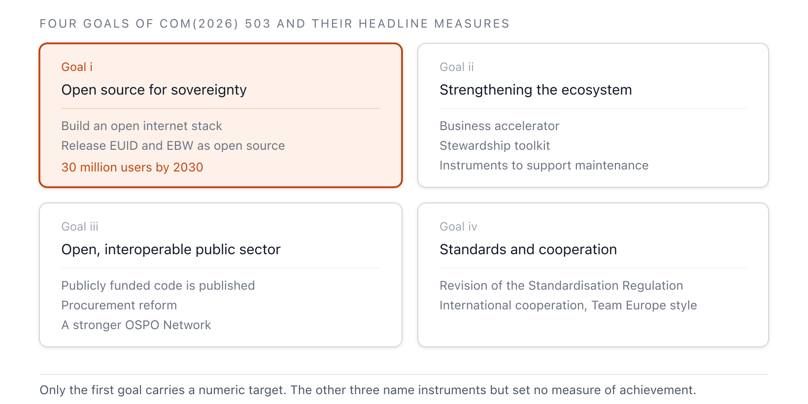
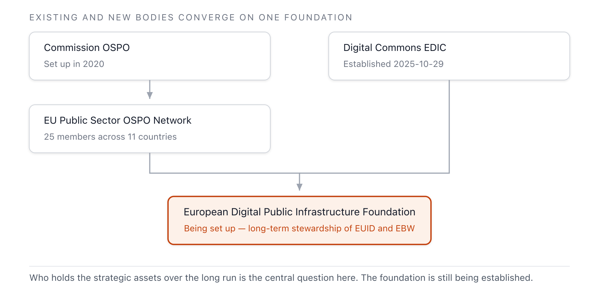
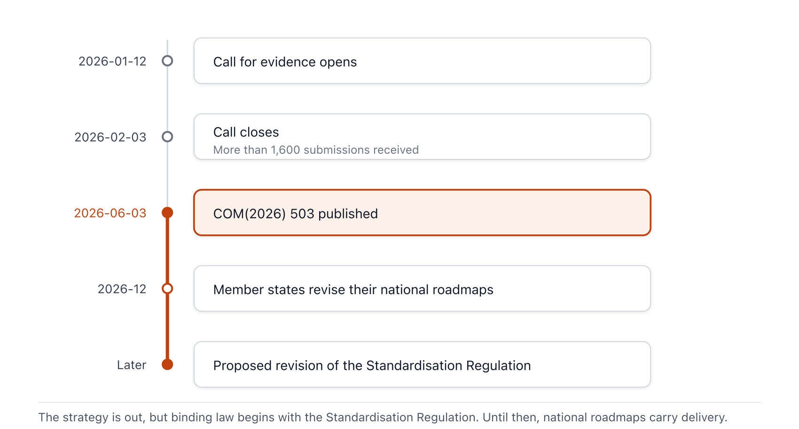

{}
This article was written with Claude Code, and the key facts cited here were cross-checked against primary sources.
{}

> **Summary**
>
> The Communication on European Tech Sovereignty (COM(2026) 503 final), published by the European Commission on June 3, 2026, comes with an attached EU Open Source Strategy. It is the first instance of placing open source at the center of EU digital policy. The strategy sets four goals — leveraging open source for sovereignty, strengthening the ecosystem, opening up public administration, and standards and international cooperation — and calls for the public and private sectors to mobilize approximately €2 billion for open-source-related measures over the next seven years. The aim is to reduce the EU's dependency structure, under which it spends €264 billion annually on proprietary IT from the United States. Civil society (FSFE) and policy analysts welcomed the direction while pointing to limitations in funding adequacy, the relationship between open standards and open source, the neglect of open hardware, and the practitioner skills gap. For Korean public and corporate practitioners, the opening of EU procurement, open source steward regulation, and the open-source default for the EUDI Wallet are the points to watch directly.

## 1. Overview

The European Commission announced the technological sovereignty package in Brussels on June 3, 2026. A Communication is not binding legislation but a document that sets out the Commission's policy direction and planned follow-up actions.[A1](#a1)·[A2](#a2) The package consists of four interconnected initiatives: Chips Act 2.0 for semiconductors, the Cloud and AI Development Act (CADA), the Open Source Strategy, and a roadmap for energy sector digitalization and AI. The scope of this report is the Open Source Strategy (Chapter 4 of the COM document).[A1](#a1)

The problem the strategy seeks to address is clear. The Draghi Report noted that the EU depends on non-EU suppliers for more than 80% of its digital products and services, infrastructure, and intellectual property.[A1](#a1) The Open Source Strategy chose open source as the means to reduce this dependency. Europe, the birthplace of Linux, has more than 3 million open source contributors, and nearly half of code commits come from small companies with fewer than 50 employees. The assets exist, but they face structural limitations in scaling and funding.[A1](#a1)

## 2. Key Content: Four Goals

The strategy combines two tracks of measures: supply-side measures that help EU communities and companies develop and maintain high-quality open source components, and demand-side measures that accelerate adoption in the private and public sectors. It bundles public funding together with market- and demand-driven measures, and was built on more than 1,600 responses received through the Commission's call for evidence.[A1](#a1)·[B3](#b3)

**Figure 1.** The four goals of the Open Source Strategy and their representative measures *(Source: COM(2026) 503 final, Chapter 4, 2026-06-03)*

**Leveraging open source for technological sovereignty (Goal i).** The Commission is expanding the Open Internet Stack into a shared catalogue of European open source building blocks, and has mobilized €41.3 million through three calls under the Horizon Europe 2026–2027 work programme.[A1](#a1) Making the EU digital identity ecosystem open source is a central pillar. The EU Digital Identity Regulation (EUDIR) sets a legal default requiring the EUDI Wallet application components to be open source; building on this, the reference implementations of the Identity Wallet (EUID) and the European Business Wallet (EBW) are being developed as open source, with their long-term stewardship transferred to the European Digital Public Infrastructure Foundation.[A1](#a1) The Commission cooperates with member states through the European Digital Infrastructure Consortium (EDIC) on Digital Commons, and aims to reach 30 million active users of open source collaboration and productivity tools and secure email by 2030.[A1](#a1)

**Strengthening the ecosystem (Goal ii).** Open source building blocks are mostly maintained through foundations, and most of the funding comes from US and Chinese Big Tech.[A1](#a1) The open source software steward concept introduced by the Cyber Resilience Act (CRA) is the regulatory pillar of this goal. The Commission is developing a stewardship toolkit to help establish foundations, and supports the establishment of a European Digital Public Infrastructure steward organization that governs EU-funded strategic assets from a single hub. To maintain and secure key components, it is creating a new Open Source Maintenance Instrument, building European capacity to fork projects when needed.[A1](#a1)

> [!IMPORTANT]
> The figure of "€350 million for the Open Source Maintenance Instrument," frequently cited in outside analyses, does not appear in the original COM(2026) 503 text. It is the TechPolicy.Press authors' own estimate of what the instrument would require, and the original document attaches no amount to it.[A1](#a1)·[E1](#e1) By contrast, "approximately €500 million for RISC-V" is actually listed in Annex II, but it is recorded as a Chips Joint Undertaking investment and is a separate line item from the Open Source Strategy's €2 billion budget.[A1](#a1)

**Opening up public administration (Goal iii).** The "public money, public code" principle has been explicitly written into the strategy.[A1](#a1)·[B2](#b2) The Commission already operates a Matrix-based communication platform, the openDesk collaboration environment, and Drupal across more than 300 europa.eu sites.[A1](#a1) In procurement, it is revising tender guidelines so that open source can compete with proprietary solutions, and strengthening the Open Source Programme Office (OSPO) and the EU Public Sector OSPO Network as central hubs.[A1](#a1)·[B2](#b2)

**Standards and international cooperation (Goal iv).** In the revision of the EU Standardisation Regulation, the Commission is improving cooperation between open source and standardization communities, and providing conditions for specific standards to be implemented as open source. Through the Team Europe approach, EU open source solutions are being deployed to enlargement and partner countries.[A1](#a1)

### Governance Structure

Rather than creating new bodies, the strategy weaves together existing governance assets. Three pillars interlock.

**Figure 2.** How the governance bodies of the Open Source Strategy connect *(Source: COM(2026) 503 final, Chapter 4 and Annex II, 2026-06-03)*

The Commission's OSPO (established 2020) and the EU Public Sector OSPO Network, with 25 members from 11 countries, handle the public administration pillar, while the Digital Commons EDIC, established on October 29, 2025, handles the multi-country cooperation pillar.[A1](#a1)·[A5](#a5) Both converge into the European Digital Public Infrastructure Foundation, currently being established, which will take on long-term stewardship of strategic assets such as EUID and EBW.[A1](#a1)

## 3. Background and Context

The Open Source Strategy is not a standalone regulation but a policy umbrella layered on top of several pieces of EU legislation. The Interoperable Europe Act (Regulation (EU) 2024/903) defines "open source licence" and underpins public sector reuse,[A4](#a4) while the CRA (Regulation (EU) 2024/2847) provides the steward regulatory category and voluntary security attestation (Article 25).[A3](#a3) The AI Act places proportionate obligations on free and open source models, and the EUDIR sets the open-source default for the EUDI Wallet.[A1](#a1)·[C1](#c1)

The watershed in this policy lineage was 2020. The Commission adopted the Open Source Software Strategy 2020–2023 (C(2020) 7149 final) on October 21, 2020, introducing a "think open" culture, and established the Commission's OSPO as its first action.[A5](#a5) Since then, code.europa.eu (4,500 users and 1,280 repositories as of May 2026) and the EU Open Source Solutions Catalogue (launched March 2025, 1,047 solutions) have been built.[A1](#a1) The new strategy explicitly cites these as its foundation.

The "public money, public code" principle originated in a campaign launched by the Free Software Foundation Europe (FSFE) in 2017. The strategy adopted this principle nine years after the campaign began.[B4](#b4)

## 4. Recent Developments and Timeline

As the announcement was only days ago, developments center on the immediate reactions and the procedures scheduled ahead.

**Figure 3.** Rollout timeline of the EU Open Source Strategy *(Source: COM(2026) 503 final and Commission announcements, as of 2026-06-05)*

On the day of the announcement, FSFE issued a cautious welcome. While welcoming the adoption of the "Public Money? Public Code!" principle, Johannes Näder said "the Commission still falls short on concrete goals, milestones, and secured funding," and Lucas Lasota stated that "implementation is now what matters, and it will require secured long-term funding, meaningful civil society participation, and effective enforcement of the Digital Markets Act."[B4](#b4)

A policy analysis by TechPolicy.Press (Gates, Givropoulou, Karhu, 2026-06-03) assessed the strategy as "Europe's most meaningful progress yet" while pointing to four gaps.[E1](#e1) The precedence between open standards and open source remains unsettled, treatment of open hardware is limited to RISC-V and EDA tools, the €2 billion over seven years is insufficient against the €264 billion in annual dependency, and development of practitioner-level contribution, maintenance, and governance capacity remains weak. The law firm Covington also summarized the package's investment scale and corporate impact on June 4, 2026.[E3](#e3)

The nature of the funding adds to the uncertainty. The €2 billion is not a firmly allocated budget but an aggregate estimate of what the public and private sectors "should mobilize" over seven years.[A1](#a1) The Open Source Maintenance Instrument, the European Digital Public Infrastructure Foundation, and the voluntary EU assessment framework are all still at the stage of a "we will create" commitment, with no concrete design or amount yet determined.

On the schedule ahead, the package will be reflected in member states' revisions of their national Digital Decade strategic roadmaps in December 2026, and the proposed revision of the Standardisation Regulation and the legislative processes for CADA and Chips Act 2.0 will flesh out the open source requirements. The Commission discusses progress annually at the Digital Decade Board and reports to the European Parliament every three years.[A1](#a1)

## 5. Implications and Considerations

This strategy does not apply directly to Korean public agencies and companies, but there are several points worth watching in practice.

The opening of EU public procurement is the most concrete variable. If tender specifications come to include open standards and models, and open source is put in a position to compete with proprietary solutions, Korean software vendors seeking to enter the EU public market will benefit from open-source-friendly proposals and clear licensing.[A1](#a1)·[B2](#b2) Conversely, this opens up EU procurement opportunities for Korean companies with open-source-based businesses.

Open source steward regulation is a point that companies launching CRA-covered products in the EU need to examine. Security attestation for products relying on open source components (CRA Article 25) and the scope of steward responsibility are expected to be fleshed out through the strategy's voluntary EU assessment framework, so it is prudent to put a Software Bill of Materials (SBOM) and dependency management framework in place in advance.[A1](#a1)·[A3](#a3) That the EUDI Wallet and the European Business Wallet default to open source reference implementations is something Korean fintech and authentication providers considering EU digital identity integration should watch.[A1](#a1)

From the perspective of Korean public software policy, the institutionalization path of the "public money, public code" principle and the OSPO Network governance model offer a useful reference. However, since the EU itself has left funding adequacy and practitioner capacity as unresolved challenges, the gap between declaration and implementation also bears watching.[B4](#b4)·[E1](#e1)

## 6. References

### A. Primary Legal and Regulatory Texts

**A1.** European Commission (2026). *Communication from the Commission on European Tech Sovereignty, accompanied by an EU Open Source Strategy*. COM(2026) 503 final, Brussels, 3.6.2026 (main text and ANNEXES 1–2). Primary source for this report. `sources/COM-2026-503-eu-tech-sovereignty.pdf` and `…-annexes.pdf`. Download: <https://digital-strategy.ec.europa.eu/en/library/communication-european-tech-sovereignty-accompanied-eu-open-source-strategy> (accessed: 2026-06-05). <a href="#a1-ref-1" onclick="event.preventDefault(); history.back(); return false;" title="Back to text">↩</a>

**A2.** European Commission (2026). *Strengthening Europe's tech sovereignty* (press release). 2026-06-03. <https://commission.europa.eu/news-and-media/news/strengthening-europes-tech-sovereignty-2026-06-03_en> (accessed: 2026-06-05). <a href="#a2-ref-1" onclick="event.preventDefault(); history.back(); return false;" title="Back to text">↩</a>

**A3.** European Parliament and Council (2024). *Regulation (EU) 2024/2847 — Cyber Resilience Act*. Official Journal, OJ L, 2024/2847, 20.11.2024. <https://eur-lex.europa.eu/eli/reg/2024/2847/oj/eng> (accessed: 2026-06-05). <a href="#a3-ref-1" onclick="event.preventDefault(); history.back(); return false;" title="Back to text">↩</a>

**A4.** European Parliament and Council (2024). *Regulation (EU) 2024/903 — Interoperable Europe Act*. Official Journal, OJ L, 2024/903, 22.3.2024. <https://eur-lex.europa.eu/eli/reg/2024/903/oj/eng> (accessed: 2026-06-05). <a href="#a4-ref-1" onclick="event.preventDefault(); history.back(); return false;" title="Back to text">↩</a>

**A5.** European Commission (2020). *Open Source Software Strategy 2020–2023*. C(2020) 7149 final, Brussels, 21.10.2020. <https://commission.europa.eu/system/files/2023-02/en_ec_open_source_strategy_2020-2023.pdf> (accessed: 2026-06-05). <a href="#a5-ref-1" onclick="event.preventDefault(); history.back(); return false;" title="Back to text">↩</a>

### B. Official Documents and Policy Pages from Issuing Bodies

**B1.** European Commission — Shaping Europe's digital future (2026). *The EU Open Source Strategy* (policy page). Updated 2026-06-03. <https://digital-strategy.ec.europa.eu/en/policies/open-source-strategy> (accessed: 2026-06-05).

**B2.** European Commission (2026). *Commission boosts open and interoperable digital ecosystems for public administrations* (press release). 2026-06-03. <https://commission.europa.eu/news-and-media/news/commission-boosts-open-and-interoperable-digital-ecosystems-public-administrations-2026-06-03_en> (accessed: 2026-06-05). <a href="#b2-ref-1" onclick="event.preventDefault(); history.back(); return false;" title="Back to text">↩</a>

**B3.** European Commission — Shaping Europe's digital future (2026). *Commission opens call for evidence on Open-Source Digital Ecosystems*. 2026-01-12 (deadline 2026-02-03). <https://digital-strategy.ec.europa.eu/en/news/commission-opens-call-evidence-open-source-digital-ecosystems> (accessed: 2026-06-05). <a href="#b3-ref-1" onclick="event.preventDefault(); history.back(); return false;" title="Back to text">↩</a>

**B4.** Free Software Foundation Europe (2026). *EU Tech Sovereignty: A milestone for Public Code? Now implementation is key*. 2026-06-03. <https://fsfe.org/news/2026/news-20260603-01.en.html> (accessed: 2026-06-05). <a href="#b4-ref-1" onclick="event.preventDefault(); history.back(); return false;" title="Back to text">↩</a>

### C. Standards and Frameworks

**C1.** European Commission (2024). *Regulation (EU) 2024/1689 — Artificial Intelligence Act*. Official Journal, OJ L, 2024/1689, 12.7.2024. <https://eur-lex.europa.eu/eli/reg/2024/1689/oj/eng> (accessed: 2026-06-05). <a href="#c1-ref-1" onclick="event.preventDefault(); history.back(); return false;" title="Back to text">↩</a>

**C2.** European Parliament and Council (2023). *Regulation (EU) 2023/2854 — Data Act*. Official Journal, OJ L, 2023/2854, 22.12.2023. <https://eur-lex.europa.eu/eli/reg/2023/2854/oj/eng> (accessed: 2026-06-05).

### D. Academic and Policy Research

**D1.** Blind, K. et al. (2021). *The impact of Open Source Software and Hardware on technological independence, competitiveness and innovation in the EU economy*. European Commission. <https://digital-strategy.ec.europa.eu/en/library/study-about-impact-open-source-software-and-hardware-technological-independence-competitiveness-and> (accessed: 2026-06-05).

### E. Industry, Law Firm, and Media Analysis (Supplementary)

**E1.** Gates, N., Givropoulou, A., Karhu, J. (2026). *How the EU's Tech Sovereignty Package Finally Puts Open Source to the Test*. TechPolicy.Press, 2026-06-03. <https://www.techpolicy.press/how-the-eus-tech-sovereignty-package-finally-puts-open-source-to-the-test/> (accessed: 2026-06-05). <a href="#e1-ref-1" onclick="event.preventDefault(); history.back(); return false;" title="Back to text">↩</a>

**E2.** TechPolicy.Press (2026). *EU Unveils Sweeping Tech Sovereignty Push, Balancing Autonomy with Openness*. 2026-06-03. <https://www.techpolicy.press/eu-unveils-sweeping-tech-sovereignty-push-balancing-autonomy-with-openness/> (accessed: 2026-06-05).

**E3.** Covington & Burling (2026). *EU Tech Sovereignty Package*. Global Policy Watch, 2026-06-04. <https://www.globalpolicywatch.com/2026/06/eu-tech-sovereignty-package/> (accessed: 2026-06-05). <a href="#e3-ref-1" onclick="event.preventDefault(); history.back(); return false;" title="Back to text">↩</a>

**E4.** Agence Europe (2026). *European Commission seeks to harness open source in its tech sovereignty strategy and develop European alternatives*. 2026-06. <https://agenceurope.eu/en/bulletin/article/13877/4/european-commission-seeks-to-harness-open-source-in-its-tech-sovereignty-strategy-and-develop-european-alternatives> (accessed: 2026-06-05).
