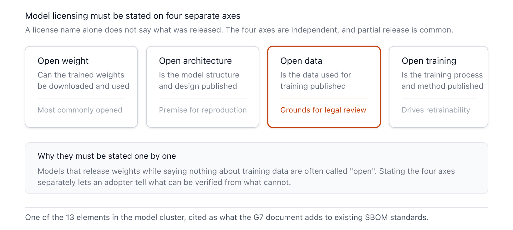

{}
This article was written with Claude Code, and the key facts cited here were cross-checked against primary sources.
{}

> **Summary**
> "Software Bill of Materials for AI — Minimum Elements," published by the G7 Cybersecurity Working Group on May 12, 2026, is the first G7 joint guidance to reach agreement, at the level of 7 clusters and 50 elements, on what an SBOM applied to AI systems must contain. Germany's BSI and Italy's ACN co-led the effort, and it was published together with France's ANSSI, Canada's CSE, the United States' CISA, the United Kingdom's NCSC, and Japan's NCO, alongside the European Commission. The document is a recommendation rather than an obligation and creates no new requirement, standard, or law, but by elevating AI models, datasets, and infrastructure to first-class tracked objects on top of the general SBOM, it becomes a reference point for national regulation and public procurement. For Korean companies and suppliers that adopt, develop, and deploy AI, it is worth reviewing in advance as a structural baseline for documents that respond to the EU Artificial Intelligence Act and the Cyber Resilience Act.

## 1. Overview

This document is the first G7 consensus document to define the minimum elements of an SBOM for AI at the item level. The issuing body is the G7 Cybersecurity Working Group, and the actual co-publishing agencies are seven: Germany's Federal Office for Information Security (BSI), Italy's National Cybersecurity Agency (ACN), France's National Cybersecurity Agency (ANSSI), Canada's Communications Security Establishment (CSE), the United States' Cybersecurity and Infrastructure Security Agency (CISA), the United Kingdom's National Cyber Security Centre (NCSC), and Japan's National Cybersecurity Office (NCO). The European Commission joined as a collaborating body[C1](#c1)·[C2](#c2). The publication date is May 12, 2026, and the United States' CISA jointly announced the same document classified at the TLP:CLEAR information-sharing level (free to redistribute)[C1](#c1)·[C2](#c2).

The work was co-led by Italy's ACN and Germany's BSI with the support of the G7 presidencies of Canada (2025) and France (2026), and the drafting period the text states runs from August 2025 to February 2026[C1](#c1). The official published version can be downloaded from the BSI download page and the CISA resource library[C1](#c1)·[C2](#c2).

The document's status is clearly a recommendation. The text states explicitly that these minimum elements are not mandatory and create no new requirement, standard, or law, and describes the list of proposals as a non-exhaustive baseline that does not cover everything[C1](#c1). Although not binding, it carries weight for national regulation and public procurement requirements to reference, given that it was agreed by the cybersecurity authorities of all seven G7 countries together with the European Commission. Its scope of application is every developer and deployer that builds or deploys AI systems, and the document itself acknowledges that additional clusters or elements may be needed depending on industry, sector, and jurisdiction[C1](#c1).

One point of terminology first. SBOM for AI, the term this document uses, is one of several names for the same object. The OpenChain project specifies AI SBOM as the abbreviation in its definitions clause, while CycloneDX uses Machine Learning Bill of Materials (ML-BOM), also written AI/ML-BOM depending on the document[B16](#b16). The industry also widely uses the general term AI BOM. The discussion below follows the original document's usage, SBOM for AI, when referring to this document, and uses AI BOM only when referring to the general concept independent of any specific standard.

## 2. Core Content: The Seven Clusters and Elements

Because AI systems are also software systems, SBOM remains valid for AI, and the minimum elements of an SBOM for AI do not replace the general SBOM minimum elements but are added on top of them[C1](#c1). What the document newly defines is a cluster system that divides the structured record into seven groups. Each cluster contains "elements" that capture the distinctive characteristics of AI system components. The metadata cluster concerns information about the SBOM itself, so it is presented first, and the remaining six clusters follow with equal weight[C1](#c1).

| Cluster | Layer | Elements | Information Captured |
|---|---|---:|---|
| Metadata | The SBOM document itself | 10 | Author, version, signature, timestamp, etc. |
| System Level Properties (SLP) | AI system composition | 9 | System and data flow |
| Models | AI system composition | 13 | Identification, weights, training, license |
| Datasets Properties (DP) | AI system composition | 10 | Identity, provenance, sensitivity |
| Infrastructure | AI system composition | 2 | SW dependencies, HW (HBOM) |
| Security Properties (SP) | AI system composition | 4 | Controls, compliance, vulnerabilities |
| Key Performance Indicators (KPI) | AI system composition | 2 | Security and operational metrics |
| **Total** | | **50** | 7 clusters |

**Table 1.** The seven clusters of an SBOM for AI. Metadata is the layer that describes the SBOM document itself, and the remaining six clusters are equally weighted information domains that make up the AI system. The 50 elements are divided across the 7 clusters. *(G7 Software Bill of Materials for AI — Minimum Elements (2026-05-12); collected 2026-06-22)*

### 2.1 Metadata: The Record of the SBOM Itself

The metadata cluster describes not individual components but the SBOM for AI itself[C1](#c1). It comprises 10 elements: author (SBOM author), version, data format name and version, author signature, tool name and version, generation context, timestamp, and dependency relationships. The author element refers to the entity that generated the SBOM, distinct from the Producer that made the component. The version element may use Semantic Versioning, in which case the major version of the published SBOM must be 1[C1](#c1)·[B14](#b14). The author signature is recommended to use an algorithm approved by a relevant body, such as the NIST Digital Signature Standard (DSS), ISO/IEC 14888-4:2024, or an ENISA-agreed cryptographic mechanism[B1](#b1)·[B3](#b3). The timestamp follows RFC 9557, and the identifier serial number follows RFC 9562[B5](#b5)·[B4](#b4).

Two elements, generation context (SBOM generation context) and dependency relationship (SBOM dependency relationship), deserve particular attention in practice. Generation context marks the software lifecycle stage at which the SBOM was created, using references such as "before build," "build," and "after build." An SBOM produced from source code falls under before build, and one produced by a binary analysis tool falls under after build. Dependency relationship goes beyond simple inclusion ("includes"/"included in") to express that a given component is mostly derived from, or is a descendant of, other software, allowing backported or forked software to be recorded explicitly[C1](#c1).

### 2.2 System Level Properties (SLP): Where the Data Flows

The System Level Properties (SLP) cluster addresses the AI system as a whole. It captures, in 9 elements, the internal operation of a system composed of multiple elements such as classifiers, large language models (LLM), and AI agents; its software dependencies and frameworks; and how the system processes and interacts with user data[C1](#c1). Alongside basic identifying information such as system name and components, producer, version, and timestamp, it includes data flow, data usage, input/output properties, and intended application domain.

The most distinctive element is System data flow. It names, as examples, input/output endpoints, a description of the data information flow from source to destination, external service APIs, plus multi-agent communication protocols and web grounding, the bidirectional data flow toward external services[C1](#c1). Drawing inter-agent communication and external web access into the data flow item signals that the tracking unit is not a single model but a composite system that interacts with the outside world. System data usage requires information such as whether the data is used to improve model performance and whether API calls log the data, captured via a link to technical documentation.

### 2.3 Models: How the Weights Were Made

The Models cluster, with the largest count at 13 elements, identifies the models an AI system uses and describes how their weights were generated[C1](#c1). It captures identifying information such as name, identifier, version, timestamp, and producer; integrity expressed as a hash value and hash algorithm; and the model's character through model properties, input/output properties, training properties, license, and external references. Model identifier designates Common Platform Enumeration (CPE) or Package-URL (PURL) as the preferred identifier, while also permitting intrinsic identifiers such as UUID, commit hash, OmniBOR, and SWHID[B6](#b6)·[B7](#b7)·[B9](#b9)·[B10](#b10). The hash algorithm is identified by its IANA hash function textual name and is required to use a NIST-approved algorithm[B12](#b12)·[B13](#b13).

Model training properties spans pretraining and post-training, fine-tuning, and continual learning, describing via a link to the model card everything from unsupervised/supervised/self-supervised learning types to reinforcement learning optimization types such as reinforcement learning from human feedback, instruction tuning, and Direct Preference Optimization[C1](#c1).

The Model license element is a distinctive contribution of the G7 document. Rather than merely naming the type of open source license, it requires stating separately which of open weight, open architecture, open data, and open training the model qualifies as[C1](#c1).

**Figure 1.** The four axes that model license requires to be disclosed separately *(based on Section 2.3 of the G7 "Software Bill of Materials for AI — Minimum Elements").*

Breaking openness, previously lumped together under the single word "open model," into four axes serves to distinguish, at the SBOM level, the common case where only the weights are open while the training data or procedure remain closed. Disclosing weights and disclosing training data carry entirely different implications for licensing, reproducibility, and legal liability.

### 2.4 Datasets Properties (DP): Provenance and Sensitivity

The Datasets Properties (DP) cluster documents, in 10 elements, the identity and provenance of the datasets used across the model lifecycle[C1](#c1). Basic information such as name, description, content, identifier, and hash is joined by provenance, statistical properties, sensitivity, dependency relationships, and license. Dataset provenance captures who contributed the data, the collection method — whether web crawling or commercial agreement — post-processing and pre-processing, labeling steps, and, for synthetic data, even its generation method. Dataset sensitivity indicates which of personally identifiable information (PII), freely accessible data, copyrighted data, sensitive data such as financial or medical data, and national-security-related data the dataset includes. This is a design aimed at tracking the legal and ethical risk of training data as an SBOM item.

### 2.5 Infrastructure: The Link to HBOM

The Infrastructure cluster captures, in two elements, the physical and virtual infrastructure essential to operating an AI system[C1](#c1). Infrastructure software lists dependencies such as firmware, package managers, third-party libraries, frameworks, and runtime environments. Infrastructure hardware, rather than directly describing specialized AI hardware, connects a dependency link to an existing Hardware Bill of Materials (HBOM). The structure whereby the software SBOM does not directly absorb hardware specifications but instead pulls in the HBOM by reference is a compromise that delegates the tracking of AI-accelerating hardware such as GPUs to a separate standard while still leaving a connecting link.

### 2.6 Security Properties (SP) and Key Performance Indicators (KPI)

The Security Properties (SP) cluster addresses, in 4 elements, the cybersecurity measures applied to the AI model and system[C1](#c1). Security controls lists, distinguishing between them, general controls such as encryption, data minimization, differential privacy, and access control, and AI-specific controls such as adversarial robustness training, prompt injection controls, and training data curation. Security compliance covers certifications and standards obtained, cybersecurity policy information links to a security.txt file, and Vulnerability referencing carries a link to a database of the exploitability of known vulnerabilities.

The Key Performance Indicators (KPI) cluster is a grouping unique to G7 that has no counterpart in the general SBOM. Security metrics covers security benchmarks such as resilience against third-party manipulation, and Operational performance KPIs covers system uptime, incident resolution time, latency, request throughput, and load balancing[C1](#c1). This is an attempt to capture, in the SBOM, not just a static list of configuration but also operational status and threat indicators, and, as seen later in Section 4, it is also the area that draws the most criticism for measurement consistency.

## 3. Background and Context

This document exists now because two separate lineages converged at a single point. One is the general SBOM minimum elements institutionalized in the United States, and the other is the vision for an SBOM for AI that the G7 sketched out in 2025.

**Figure 2.** The standardization progression from general SBOM to AI SBOM *(compiled for this report).*

The reference point for the general SBOM minimum elements is "The Minimum Elements for a Software Bill of Materials," published in July 2021 by the U.S. Department of Commerce's National Telecommunications and Information Administration (NTIA) under the direction of Executive Order 14028. That document presented seven data fields — supplier name, component name, version, unique identifier, dependency relationship, SBOM author, and timestamp — and stewardship of the SBOM community's ongoing work was subsequently transferred to CISA[C7](#c7). Evidence that the G7 document directly continues this lineage shows up in how the metadata cluster is defined. Author, version, data format, timestamp, and dependency relationship carry the NTIA data fields almost unchanged into the AI context, and the fact that the Model identifier designates CPE and PURL as preferred identifiers while citing CISA's "Software Identification Ecosystem Option Analysis" (2023) shows the same roots[C6](#c6)·[C7](#c7).

The direct starting point is the 2025 vision document. "A shared G7 vision on Software Bill of Materials for AI" was published by BSI and ACN in June 2025 and endorsed at the Ottawa G7 meeting; it defined the concept, goals, benefits, and properties of an SBOM for AI and went no further than presenting the seven clusters as high-level examples[C3](#c3). At the same time, experts recommended that each cluster be defined in detail, and the 2026 minimum elements document is that follow-up. If the vision was the outline of "what must be captured," this document is the detail of "which elements, defined how, go into each cluster"[C1](#c1)·[C3](#c3).

The difference lies in drawing AI-specific components in as first-class tracked objects. Where the general SBOM targets identification of software components, the G7 document adds five groupings: models, datasets, infrastructure, security properties, and key performance indicators. The reason for this expansion is that code alone cannot express the training process, the data, and model behavior. Breaking model license into four axes and having dataset provenance capture even the collection method and, for synthetic data, the generation method are items that did not exist in the general SBOM.

On implementation, the document is format-neutral. Placing the data format name and version elements in the metadata cluster is evidence of this, and actual implementation is carried by two existing BOM standards. SPDX (System Package Data Exchange), a Linux Foundation project, introduced AI and dataset profiles starting with 3.0 (April 2024), defining model type and architecture, hyperparameters, autonomy type, and whether sensitive information is used, among others[B15](#b15). CycloneDX (OWASP) has supported the Machine Learning Bill of Materials (ML-BOM) since 1.5, capturing training approach, architecture, performance, and ethical considerations through a modelCard object[B16](#b16). The G7 document's note, in the model license example, that one "can point to the corresponding field in the SPDX/CDX file," shows that it presupposes these two formats as the implementation medium[C1](#c1).

## 4. Recent Developments and Verification Challenges

Looking at the reaction in the roughly one month following publication, broad agreement gathered around the direction of the seven clusters, but a gap emerged over measurability and verifiability. The announcement took the form of simultaneous publication by BSI, CISA, ANSSI, ACN, CSE, NCSC, and NCO together with the European Commission, and ANSSI, in an English-language post on May 13, 2026, introduced the document as "concrete guidance on what can reasonably be expected of an SBOM for AI" while noting the possibility of future adjustment[A4](#a4). Trade press coverage concentrated on May 13–14, and the law firm Morgan Lewis, in a June analysis, emphasized that the guidance is voluntary and non-binding[E1](#e1).

Questions about measurability were the common focus of commentary. Allan Friedman, CISA's former SBOM lead, affirmed much of the seven clusters while noting that many "are difficult to even measure or define in a concrete, organization-consistent way"[A6](#a6). Sanchit Vir Gogia of Greyhound Research summarized that "the minimum elements create visibility but not assurance," and Nigel Douglas of Cloudsmith likewise noted, while acknowledging that the document raises the right requirements, the limitation that the seven data clusters are hard to measure consistently across organizations[A10](#a10)·[A8](#a8). TLCTC, a security threat classification framework, criticized the Security Properties (SP) cluster head-on the same day the document was published, pointing out that while it lists control items, it does not state which threat each control addresses, which reduces auditability[A11](#a11).

Standard and tool implementations do not yet fully fill the G7's seven clusters. The SPDX dataset profile's `hasSensitivePersonalInformation` and `confidentialityLevel` map to G7's dataset sensitivity, and `dataCollectionProcess` maps to dataset provenance[B15](#b15)·[A13](#a13). By contrast, the metadata cluster's author signature and generation context, and the KPI cluster's operational performance indicators (uptime, latency, throughput), have no clearly structured, dedicated field in either standard, requiring a workaround through external references or free text[A13](#a13)·[A16](#a16). The SP cluster's AI-specific controls similarly lack adequate structured fields.

It is particularly worth noting that the G7's judgment on agentic AI and the movement of the standards community diverged. The document's Discussion section explicitly addressed whether to add the decision-making level, or autonomy, of an AI system as a separate element. The working group acknowledged that the rapid advance of agentic AI could increase the importance of this element and that it could help in assessing the impact of a compromise, but decided not to specify autonomy as a separate element, on the grounds that this element might be handled differently across jurisdictions through mechanisms such as safety requirements[C1](#c1)·[A7](#a7). The standards community moved in the opposite direction over the same period. SPDX 3.1, unveiled at FOSDEM in February 2026, added AI agents and retrieval-augmented generation (RAG) as first-class concepts, with the data format providing vocabulary ahead of the area where policy consensus had held back[A14](#a14). How the G7's future refinement work absorbs this standard vocabulary is worth watching.

Regulatory alignment remains an open question. On the publication date, the primary source, the BSI publication page, states May 12, and the May 13 date given by some outlets appears to stem from differences in time zone and posting time[A3](#a3)·[A4](#a4). Mapping the fields between the voluntary G7 recommendation and the soon-to-be-binding EU obligations is the next task for corporate practice.

## 5. Implications for Korean Readers

The first thing to confirm is not a reporting obligation but a signal of documentation-structure standardization. The G7 minimum elements themselves impose no direct legal obligation in any country[C1](#c1). However, the EU Artificial Intelligence Act requires the technical documentation of Article 11 and Annex IV for high-risk AI systems, and that obligation applies from August 2, 2026 for the high-risk systems of Annex III[A1](#a1). The components, data, and performance documentation Annex IV requires overlap substantially with the G7's System Level Properties, Models, and Datasets clusters. For a Korean company supplying AI products to the EU, it is practical to use the G7 clusters as a checklist of technical documentation items and fill in the gaps in advance.

The Cyber Resilience Act (CRA) directly mandates an SBOM. Annex I, Part II(1) requires that the components of a product with digital elements be documented in an SBOM in a machine-readable format, with the vulnerability and incident reporting obligation (Article 14) applying from September 11, 2026, and the remaining core requirements applying from December 11, 2027[A2](#a2). The G7 document's choice to build a structure that stacks AI elements on top of the general SBOM meshes naturally with the SBOM obligation foundation the CRA has already laid. A company launching AI-equipped products in the EU would do well to prepare a two-layer structure: the general SBOM (CRA obligation) plus the G7 AI elements on top.

On preparation, the highest-priority items are datasets and model license. Dataset provenance and sensitivity (PII, copyright, national security) bear directly on the legal risk of training data, so an organization that draws on external models and data all the more needs a procedure for requiring this information from its suppliers. The four-axis breakdown of model license (weights, architecture, data, training procedure) becomes the criterion that distinguishes, when adopting an "open model," what is actually disclosed and what constraints apply to redistribution, fine-tuning, and commercial use. Because the data flow element of System Level Properties covers even inter-agent communication and web grounding, for systems that use external APIs and multiple agents, specifying where data goes becomes both a regulatory response and a security check.

Risk and opportunity sit in the same place. The criticism that the minimum elements do not guarantee measurement and verification is a warning that simply filling in the items does not by itself ensure agreement with the actual system[A8](#a8)·[A10](#a10). The G7 document itself emphasizes that an SBOM not connected to vulnerability scanning and management tools and to security advisories remains no more than a paper document[C1](#c1). Conversely, adopting this cluster framework early for asset inventory and supply chain checks can lower conversion costs once EU and U.S. regulation becomes more concrete, and can turn supply chain transparency into a differentiator.

## 6. Relationship to Other Reports in This Workspace

This report addresses a different layer than this workspace's general AI BOM report and its OpenChain report. The AI BOM report (reports/ai-bom) is the overview and regulatory-mapping layer, broadly covering the history of SBOM, AI BOM in general, and mapping to EU regulation. The OpenChain AI SBOM report (reports/openchain-ai-sbom) covers the process and compliance layer — the compliance process that extends ISO 5230 to AI, that is, how an organization generates and manages an SBOM. The distinctive value of this G7 report is the data-definition layer that sits between them: the item-level specification of exactly which elements, defined how, an SBOM must contain. The three reports complement one another as the general account (why and what), the process (how to manage), and the element definitions (exactly what to record). If you are actually designing an AI BOM adoption, the natural combination is to set the context with the general account, build the operating process with OpenChain, and fill in the recorded items with the G7 clusters.

## 7. References

Only sources cited in the body are listed. All URLs were accessed and verified on 2026-06-22.

### Legislation and Regulation (Primary)

**A1.** European Parliament and Council (2024). *Regulation (EU) 2024/1689 (Artificial Intelligence Act)*. OJ L, 2024/1689, 12.7.2024. <https://eur-lex.europa.eu/eli/reg/2024/1689/oj/eng> (accessed 2026-06-22; ELI permanent link. The August 2, 2026 application date for high-risk systems was cross-checked against the European Commission's policy page). — *Use: obligation for high-risk AI technical documentation and correspondence with the G7 clusters.* <a href="#a1-ref-1" onclick="event.preventDefault(); history.back(); return false;" title="Back to text">↩</a>

**A2.** European Parliament and Council (2024). *Regulation (EU) 2024/2847 (Cyber Resilience Act, CRA)*. OJ L, 2024/2847, 20.11.2024. <https://eur-lex.europa.eu/eli/reg/2024/2847/oj/eng> (accessed 2026-06-22; ELI permanent link). Supplemented for the Annex I Part II(1) and Article 14 (2026-09-11) / Annex I (2027-12-11) application schedule by Anchore's explainer on CRA SBOM requirements: <https://anchore.com/sbom/eu-cra/> (accessed 2026-06-22). — *Use: legal basis and application schedule for the SBOM-creation obligation.*

### Standards and Specifications (Primary) <a href="#a2-ref-1" onclick="event.preventDefault(); history.back(); return false;" title="Back to text">↩</a>

**B1.** National Institute of Standards and Technology (2023). *FIPS 186-5: Digital Signature Standard (DSS)*. February 2023. <https://nvlpubs.nist.gov/nistpubs/FIPS/NIST.FIPS.186-5.pdf> (accessed 2026-06-22). — *Use: basis for the approved algorithms for the author signature element (original document footnote 4).* <a href="#b1-ref-1" onclick="event.preventDefault(); history.back(); return false;" title="Back to text">↩</a>

**B3.** ISO/IEC (2024). *ISO/IEC 14888-4:2024, Information security — Digital signatures with appendix — Part 4: Stateful hash-based mechanisms*. <https://www.iso.org/standard/80492.html> (accessed 2026-06-22; the ISO page returns 403 to automated tools, so the standard number and title were confirmed from ISO search results). — *Use: basis for the approved signature mechanisms for the author signature element.* <a href="#b3-ref-1" onclick="event.preventDefault(); history.back(); return false;" title="Back to text">↩</a>

**B4.** Internet Engineering Task Force (2024). Davis, K., Peabody, B., Leach, P. *RFC 9562: Universally Unique IDentifiers (UUIDs)*. May 2024. <https://www.rfc-editor.org/rfc/rfc9562.html> (accessed 2026-06-22). — *Use: identifier serial-number standard for SBOM version (original document footnote 3).* <a href="#b4-ref-1" onclick="event.preventDefault(); history.back(); return false;" title="Back to text">↩</a>

**B5.** Internet Engineering Task Force (2024). Sharma, U., Bormann, C. *RFC 9557: Date and Time on the Internet: Timestamps with Additional Information*. April 2024. <https://www.rfc-editor.org/rfc/rfc9557.html> (accessed 2026-06-22). — *Use: format for SBOM timestamp (original document footnote 6).* <a href="#b5-ref-1" onclick="event.preventDefault(); history.back(); return false;" title="Back to text">↩</a>

**B6.** NIST, National Vulnerability Database. *Official Common Platform Enumeration (CPE) Dictionary*. <https://nvd.nist.gov/products/cpe> (accessed 2026-06-22). — *Use: CPE as a recommended identifier for Model identifier (original document footnote 8).* <a href="#b6-ref-1" onclick="event.preventDefault(); history.back(); return false;" title="Back to text">↩</a>

**B7.** Ecma International (2025). *ECMA-427: Package-URL (PURL) Specification, 1st Edition*. December 2025. <https://ecma-international.org/publications-and-standards/standards/ecma-427/> (accessed 2026-06-22). — *Use: PURL as a recommended identifier for Model identifier (original document footnote 9).* <a href="#b7-ref-1" onclick="event.preventDefault(); history.back(); return false;" title="Back to text">↩</a>

**B9.** OmniBOR Project. *OmniBOR Specification*. <https://omnibor.io/> (accessed 2026-06-22). — *Use: OmniBOR as an example intrinsic identifier for Model identifier (original document footnote 10).* <a href="#b9-ref-1" onclick="event.preventDefault(); history.back(); return false;" title="Back to text">↩</a>

**B10.** SWHID Project. *The SWHID Specification Version 1.2*. <https://www.swhid.org/specification/v1.2/> (accessed 2026-06-22). — *Use: SWHID as an example intrinsic identifier for Model identifier (original document footnote 11).* <a href="#b10-ref-1" onclick="event.preventDefault(); history.back(); return false;" title="Back to text">↩</a>

**B12.** Internet Assigned Numbers Authority. *Named Information Hash Algorithm Registry (Hash Function Textual Names)*. <https://www.iana.org/assignments/named-information/named-information.xhtml> (accessed 2026-06-22). — *Use: recommendation for identifying Model hash algorithm (original document footnote 12).* <a href="#b12-ref-1" onclick="event.preventDefault(); history.back(); return false;" title="Back to text">↩</a>

**B13.** NIST, Computer Security Resource Center. *Hash Functions (project)*. <https://csrc.nist.gov/projects/hash-functions> (accessed 2026-06-22). — *Use: basis for NIST-approved algorithms for Model hash algorithm (original document footnote 13).* <a href="#b13-ref-1" onclick="event.preventDefault(); history.back(); return false;" title="Back to text">↩</a>

**B14.** Preston-Werner, T. and the SemVer Team (2013). *Semantic Versioning 2.0.0*. <https://semver.org/> (accessed 2026-06-22). — *Use: Semantic Versioning for SBOM version (original document footnote 2).* <a href="#b14-ref-1" onclick="event.preventDefault(); history.back(); return false;" title="Back to text">↩</a>

**B15.** SPDX Project. *SPDX 3.0.1 Specification — AI Profile*. Linux Foundation. <https://spdx.github.io/spdx-spec/v3.0.1/model/AI/AI/> (accessed 2026-06-22). — *Use: data-format implementation of the SBOM for AI, cluster correspondence.* <a href="#b15-ref-1" onclick="event.preventDefault(); history.back(); return false;" title="Back to text">↩</a>

**B16.** OWASP CycloneDX. *Machine Learning Bill of Materials (ML-BOM / AI-BOM) capabilities*. <https://cyclonedx.org/capabilities/mlbom/> (accessed 2026-06-22). — *Use: an alternative implementation of the SBOM for AI (ML-BOM / modelCard).*

### Government and Agency Guidance and Official Publication Sources (Primary) <a href="#b16-ref-1" onclick="event.preventDefault(); history.back(); return false;" title="Back to text">↩</a>

**C1.** G7 Cybersecurity Working Group (2026). *Software Bill of Materials for AI — Minimum Elements* (BSI official publication). Published 2026-05-12. <https://www.bsi.bund.de/SharedDocs/Downloads/EN/BSI/KI/SBOM-for-AI_minimum-elements.html> (accessed 2026-06-22; direct PDF link <https://www.bsi.bund.de/SharedDocs/Downloads/EN/BSI/KI/SBOM-for-AI_minimum-elements.pdf>). — *Use: the source document. The primary basis for all cluster and element definitions.* <a href="#c1-ref-1" onclick="event.preventDefault(); history.back(); return false;" title="Back to text">↩</a>

**C2.** G7 Cybersecurity Working Group / CISA et al. (2026). *Software Bill of Materials for AI — Minimum Elements* (TLP:CLEAR, CISA joint publication). Published 2026-05-12. <https://www.cisa.gov/resources-tools/resources/software-bill-materials-ai-minimum-elements> (accessed 2026-06-22; the CISA page returns 403 to automated tools, so the fact and date of publication, the TLP:CLEAR classification, and the seven clusters were cross-checked against search results and a WaterISAC notice). — *Use: confirmation of the U.S. official publication, the TLP:CLEAR distribution status, and the co-publishing agencies.* <a href="#c2-ref-1" onclick="event.preventDefault(); history.back(); return false;" title="Back to text">↩</a>

**C3.** G7 Cybersecurity Working Group (2025). *A shared G7 vision on Software Bill of Materials for AI* (Shared G7 Vision, 2025-06). Published by ACN. <https://www.acn.gov.it/portale/documents/d/guest/paper_sbom-for-ai_19may2025_-clean-2> (accessed 2026-06-22). — *Use: the preceding vision document, the first proposal of the seven clusters (original document footnote 1).* <a href="#c3-ref-1" onclick="event.preventDefault(); history.back(); return false;" title="Back to text">↩</a>

**C6.** Cybersecurity and Infrastructure Security Agency (2023). *Software Identification Ecosystem Option Analysis*. 2023-10-26. <https://www.cisa.gov/sites/default/files/2023-10/Software-Identification-Ecosystem-Option-Analysis-508c.pdf> (accessed 2026-06-22; the CISA site returns 403 to automated tools; the document's existence and date match the original document's footnote 7). — *Use: basis for the software identification ecosystem referenced by Model identifier (original document footnote 7).* <a href="#c6-ref-1" onclick="event.preventDefault(); history.back(); return false;" title="Back to text">↩</a>

**C7.** National Telecommunications and Information Administration (2021). *The Minimum Elements for a Software Bill of Materials (SBOM)*. 2021-07-12. <https://www.ntia.gov/sites/default/files/publications/sbom_minimum_elements_report_0.pdf> (accessed 2026-06-22; automated tools encounter a certificate error, alternate publication source <https://www.ntia.doc.gov/report/2021/minimum-elements-software-bill-materials-sbom>). — *Use: the general SBOM minimum elements that the SBOM for AI builds on.*

### Industry and Law Firm Analysis, and Press Coverage (Secondary, Cross-Checked Against Primary Sources) <a href="#c7-ref-1" onclick="event.preventDefault(); history.back(); return false;" title="Back to text">↩</a>

**A3.** BSI (2026). *Software Bill of Materials (SBOM) for Artificial Intelligence — Minimum Elements* (publication page). States a publication date of 2026-05-12. <https://www.bsi.bund.de/SharedDocs/Downloads/EN/BSI/KI/SBOM-for-AI_minimum-elements.html> (accessed 2026-06-22). — *Use: primary confirmation of the publication date.* <a href="#a3-ref-1" onclick="event.preventDefault(); history.back(); return false;" title="Back to text">↩</a>

**A4.** ANSSI (2026). *Software bill of materials (SBOM) for artificial intelligence* (English-language post, 2026-05-13). <https://cyber.gouv.fr/en/publications/jointly-led-international-publications/software-bill-of-materials-sbom-for-artificial-intelligence/> (accessed 2026-06-22). — *Use: primary commentary from a publishing agency.* <a href="#a4-ref-1" onclick="event.preventDefault(); history.back(); return false;" title="Back to text">↩</a>

**A6.** Infosecurity Magazine (2026-05-13). *Global Cyber Agencies Issue New SBOMs for AI Guidance*. <https://www.infosecurity-magazine.com/news/new-sboms-for-ai-guidance-2026/> (accessed 2026-06-22). — *Use: citation of Friedman's commentary.* <a href="#a6-ref-1" onclick="event.preventDefault(); history.back(); return false;" title="Back to text">↩</a>

**A7.** Industrial Cyber (2026-05-13). *CISA, G7 partners release SBOM for AI guidance...* <https://industrialcyber.co/sbom/cisa-g7-partners-release-sbom-for-ai-guidance-to-boost-ai-supply-chain-transparency-and-cybersecurity-resilience/> (accessed 2026-06-22). — *Use: coverage of the cluster and autonomy discussion.* <a href="#a7-ref-1" onclick="event.preventDefault(); history.back(); return false;" title="Back to text">↩</a>

**A8.** SecurityWeek (2026-05-14). *G7 Countries Release AI SBOM Guidance*. <https://www.securityweek.com/g7-countries-release-ai-sbom-guidance/> (accessed 2026-06-22). — *Use: commentary from Douglas (Cloudsmith).* <a href="#a8-ref-1" onclick="event.preventDefault(); history.back(); return false;" title="Back to text">↩</a>

**A10.** CIO (2026-05-13). *CISA's AI SBOM guidance pushes software supply-chain oversight into new territory*. <https://www.cio.com/article/4170711/cisas-ai-sbom-guidance-pushes-software-supply-chain-oversight-into-new-territory-2.html> (accessed 2026-06-22). — *Use: expert commentary on the measurement and verification gap (Gogia and others).* <a href="#a10-ref-1" onclick="event.preventDefault(); history.back(); return false;" title="Back to text">↩</a>

**A11.** TLCTC (2026-05-12). *The Control Fixation in the Security Properties — A TLCTC critique of G7 SBOM-for-AI*. <https://www.tlctc.net/sbom-for-ai-control-fixation.html> (accessed 2026-06-22; WebFetch returned 403, confirmed via a search cache). — *Use: critique of the SP cluster.* <a href="#a11-ref-1" onclick="event.preventDefault(); history.back(); return false;" title="Back to text">↩</a>

**A13.** Bennet, K., Rajbahadur, G., Suriyawongkul, A., Stewart, K. (2024-10). *Implementing AI Bill of Materials (AI BOM) with SPDX 3.0*. Linux Foundation. DOI 10.70828/RNED4427. <https://www.linuxfoundation.org/hubfs/LF%20Research/lfr_spdx_aibom_102524a.pdf> (accessed 2026-06-22). — *Use: analysis of SPDX field selection and gaps.* <a href="#a13-ref-1" onclick="event.preventDefault(); history.back(); return false;" title="Back to text">↩</a>

**A14.** SPDX AI Working Group (2026). *Publications* — FOSDEM 2026 (2026-02-01) SPDX 3.1 announcement. <https://fosdem.org/2026/schedule/event/9Q9EEL-what_is_new_in_spdx_3_1_which_is_now_a_living_knowledge_graph/> (accessed 2026-06-22). — *Use: SPDX 3.1's addition of AI Agent, Prompt, and RAG.* <a href="#a14-ref-1" onclick="event.preventDefault(); history.back(); return false;" title="Back to text">↩</a>

**A16.** OWASP CycloneDX. *Inventory Management Use Case: AI Models and Model Cards*. <https://cyclonedx.org/use-cases/ai-models-and-model-cards/> (accessed 2026-06-22). — *Use: field gaps in ML-BOM and model cards.* <a href="#a16-ref-1" onclick="event.preventDefault(); history.back(); return false;" title="Back to text">↩</a>

**E1.** Morgan Lewis (2026-06-16). *US CISA, G7 Partners ... Release Minimum Elements for AI Software Bills of Materials*. <https://www.morganlewis.com/pubs/2026/06/us-cisa-g7-partners-in-europe-and-asia-release-minimum-elements-for-ai-software-bills-of-materials> (accessed 2026-06-22; key facts cross-checked against C1/C2). — *Use: analysis of regulatory alignment.* <a href="#e1-ref-1" onclick="event.preventDefault(); history.back(); return false;" title="Back to text">↩</a>

