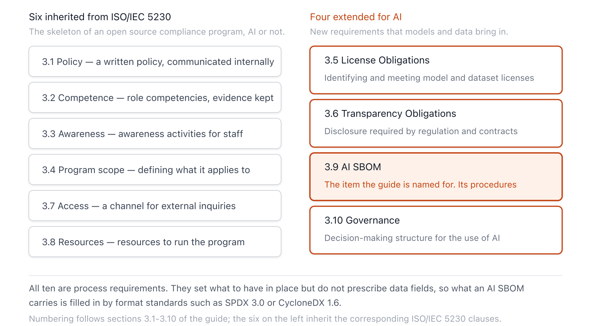

{}
This article was written with Claude Code, and the key facts cited here were cross-checked against primary sources.
{}

> **Summary**
> This report analyzes *Artificial Intelligence System Bill of Materials — Compliance Management Guide for the Supply Chain*, written by the AI Work Group (OpenChain AI Work Group) of the OpenChain Project under the Linux Foundation. The guide carries the methodology of ISO/IEC 5230, the international standard for software license compliance, over to the artificial intelligence (AI) supply chain, defining the core requirements a quality AI SBOM compliance program must meet. Its purpose is to provide a common baseline for trust between organizations that exchange AI solutions, and it extends traditional SBOM compliance by pulling not just code but model weights, training datasets, and the licensing and transparency obligations of the Model Tree into the scope of tracking. For Korean companies and practitioners preparing for AI supply chain governance, it serves as a checklist asking "what must be documented and demonstrated."

> The text this report analyzes is a working copy (RFC draft) from the `/docs` directory of the `OpenChain-Project/AI-WG` repository on GitHub. As confirmed in the trend research, the same document went through six weeks of public comment and was formally published as OpenChain AI SBOM Compliance Guide Version 1 on October 20, 2025[A9](#a9). This report therefore covers not the formal Version 1 but an earlier draft snapshot. The citable formal edition is published as PDF and Markdown in the OpenChain Reference-Material repository[A9](#a9)·[A12](#a12). A full-text comparison of the two documents on July 20, 2026 found that the nine normative (shall) provisions covered below and the section structure remain identical in wording in the formal edition. However, four definitions (2.5 Identified License, 2.6 Program, 2.7 Program Participant, 2.8 Supplied Software) were reworded in the formal edition, so these definitions should be checked directly against the formal text when cited.

## 1. Document Overview

This guide defines the core requirements a quality AI SBOM compliance program must meet. It was published by the AI Work Group of the OpenChain Project under the Linux Foundation, and is the product of an open working group operated through a mailing list anyone can join for free and regular workshops[A1](#a1)·[A2](#a2). The license the document specifies is Creative Commons Attribution 4.0 (CC-BY-4.0)[A1](#a1).

The guide's design intent is clear from its overview. It focuses on the "what" and "why" of a program rather than the "how" and "when," leaving flexibility for organizations of different sizes operating in different markets to choose the specific policies and procedures that fit their own scale, goals, and scope[A1](#a1). The guide states that it drew inspiration from OpenChain ISO/IEC 5230, applying its lessons to the market need for AI SBOM management in the supply chain. In preparing it, ISO/IEC 5230:2020, ISO/IEC 42001:2023, and ISO/IEC 5962:2021 were cited as reference standards[A1](#a1).

The document's status is an RFC (Request for Comments) draft. The NOTICE at the top states plainly that it is not a production release but "a working document for interested parties to share ideas" and a "living document"[A1](#a1). The relationship between the draft and the formal edition is a matter of timing. After reviewing the draft, the OpenChain AI Work Group opened a public comment period on July 7, 2025, closed it and reviewed the comments on August 18, 2025, and, following a decision by the Governing Board, formally published Version 1 on October 20, 2025[A10](#a10)·[A11](#a11)·[A9](#a9). The RFC.docx in `AI-WG/docs` that this report covers is that working copy, and the formal edition for external citation is published separately in the Reference-Material repository[A12](#a12). The difference in license notation between the two texts (the working copy is CC-BY-4.0 per the document's NOTICE) stems from the difference in distribution stage.

## 2. Background: Extending the OpenChain Methodology to AI

The OpenChain Specification is a process management standard that defines the requirements a quality open source license compliance program must meet. Developed by roughly 100 contributors between 2014 and 2016, it launched as Version 1.0 in October 2016, then, through ISO/IEC JTC 1's Publicly Available Specification (PAS) Transposition procedure in April 2020, became the international standard ISO/IEC 5230:2020 in December of the same year[A14](#a14)·[A3](#a3). OpenChain also extended the same framework into the security domain, standardizing an open source security assurance specification focused on checking for disclosed security vulnerabilities as ISO/IEC 18974:2023[A13](#a13).

The core of the 5230 methodology is the structure it uses to describe requirements. Each requirement consists of Verification Materials — the records that must be produced to demonstrate that the requirement was met — and a Rationale explaining why the requirement is needed[A14](#a14). This design, which fixes only the outcome and purpose while leaving the means of implementation open, is the basis for its non-prescriptive character, which allows organizations of different sizes and markets to shape a program that fits them. The fact that the AI SBOM guide repeats the "Verification Materials + Rationale" structure in every section is a direct carryover of this methodology.

In AI systems, what must be tracked extends beyond code. Model weights, the datasets used for training, testing, and validation, and even the Model Tree — which represents the relationship of one AI system being derived from several others — can each carry their own license. This is why the guide's License Obligations (3.5) and Transparency Obligations (3.6) discuss code, weights, and datasets together. Where open source compliance asks "which component came in under which license," AI requires extending that same question to models and data. The process-centered, non-prescriptive philosophy of 5230 suits this extension well. In an environment where the regulatory landscape is splitting rapidly by jurisdiction, fixing only "what must be demonstrated" instead of pinning down specific procedures lets organizations under different regimes — the European Union, the United States, China — share the same common baseline.

A Software Bill of Materials (SBOM) is a formal record of the components that make up a piece of software and their supply chain relationships. In the United States, Executive Order 14028 on Improving the Nation's Cybersecurity directed the definition of SBOM minimum elements in May 2021, and the National Telecommunications and Information Administration (NTIA) published *Minimum Elements for a Software Bill of Materials* on July 12, 2021[D4](#d4)·[D1](#d1). Traditional SBOMs are designed to identify and track software components, making them ill-suited to representing training processes, data, and model behavior as such. The AI SBOM the guide defines is "a list of components that make up part or all of an AI system, and related information about them," explicitly including models and datasets. The industry also calls the same concept an AI BOM or a Machine Learning Bill of Materials (ML-BOM). The names diverge because each standard has set its own terminology. The guide specifies AI SBOM as its abbreviation in definition clause 2.2[A1](#a1), while the G7 cybersecurity working group calls the same thing SBOM for AI, and CycloneDX calls it ML-BOM. This report uses AI SBOM when referring to the guide, and uses AI BOM only when discussing the general concept without tying it to a specific standard.

In terms of format, the guide leaves the door open to SPDX, CycloneDX, or any other format. SPDX (System Package Data Exchange) is an exchange standard internationalized as ISO/IEC 5962:2021; SPDX 3.0, released on April 16, 2024, introduced an AI Profile and a Dataset Profile that let it express information such as model type, hyperparameters, training data preprocessing, energy consumption, and safety risk assessments[A5](#a5)·[B6](#b6)·[B2](#b2). CycloneDX is a full-stack BOM standard maintained by OWASP; it introduced ML-BOM in version 1.5, requiring documentation of datasets and models, configuration and training data provenance, ethical considerations, bias, and model security risks[B5](#b5). The two formats use different representation models but target the same problem by treating models and datasets as first-class components.

It is also worth noting that the guide's footnotes repeatedly reference ISO/IEC 42001:2023. 42001 is the first international standard for an AI Management System (AIMS), specifying the requirements for establishing, operating, and improving one, and its Annex B describes how to implement controls by stage of the AI lifecycle[A4](#a4). If the OpenChain methodology defines "what must be demonstrated," 42001 Annex B supplies the specific control items for "what must be documented and operated to demonstrate it." The guide does not replace 42001; rather, it cites specific clauses of Annex B (B.2.2, B.3, B.4.2, B.4.6, B.5.3, B.6.2, B.8.5, B.9.3, and others) and main text clause 7.3 as the rationale for its Competence, Awareness, Resources, Governance, and SBOM sections[A4](#a4).

## 3. Structure and Requirements of the Guide

The body of the guide (Chapter 3, Guidance) consists of ten requirement sections. Every section repeats the three-part 5230 pattern: requirement statement, verification materials, and rationale. As a footnote notes, what a specification would call "Requirements" this document calls "Guidance," to make clear that the items are recommendations rather than normative mandates[A1](#a1).

Grouping the requirements by meaning yields two families. One is the program governance skeleton inherited directly from ISO/IEC 5230 (Policy, Competence, Awareness, Scope, Resources, Access); the other is the territory newly extended because of AI (License Obligations, Transparency Obligations, AI SBOM, AI Governance). Figure 1 shows this cluster structure.

**Figure 1.** Six inherited, four extended for AI *(based on OpenChain AI SBOM Compliance Guide body 3.1-3.10, as of 2026-06-12)*

Table 1 summarizes the core of each requirement. The "Enforcement Level" column carries over the RFC 2119 keywords (shall, should, and so on) that the guide's body text uses; their definitions are drawn, per the guide's Chapter 2, from IETF RFC 2119[A1](#a1)·[A6](#a6).

**Table 1.** Summary of the guide's ten requirements *(based on OpenChain AI SBOM Compliance Guide body 3.1-3.10, 2026-06-12)*

| Section | Requirement | Key Point | Enforcement Level |
|---|---|---|---|
| 3.1 | Policy | A written policy governing AI SBOM compliance must exist and be communicated internally, reflecting business strategy, jurisdictional legal requirements, and risk level | shall |
| 3.2 | Competence | Identify by role the competence needed for governance, security, safety, privacy, development, and supplier management functions, and retain evidence | shall / must |
| 3.3 | Awareness | Ensure participants are aware of the policy, business objectives, their own contribution, and the impact of nonconformity | shall |
| 3.4 | Program Scope | Declare in writing the program's scope of application and its limits (e.g., a product line, a department, the whole organization) | (declaration required) |
| 3.5 | License Obligations | A procedure exists to review the licenses of code, weights, datasets, and the AI system itself to determine obligations, restrictions, and rights; note the individual licenses within the Model Tree | shall |
| 3.6 | Transparency Obligations | A procedure exists to review transparency obligations imposed by regulation (e.g., downstream disclosure obligations), with risk mitigation measures | shall / should |
| 3.7 | Access | Specify a public means for third parties to raise AI SBOM compliance inquiries, and maintain an internal response procedure | (procedure required) |
| 3.8 | Effectively Resourced | Assign responsibility, time, and funding to program tasks, provide access to legal expertise, and maintain a procedure for correcting nonconformity | (resourcing required) |
| 3.9 | AI SBOM | A procedure exists to generate and manage AI SBOMs. Any format (SPDX, CycloneDX, etc.) is acceptable; inbound materials must be reflected | shall |
| 3.10 | Governance | Maintain an AI governance framework, policies, and practices, with compliance with emerging AI regulation (EU AI Act, Hiroshima AI Process, China's initiative) and lifecycle monitoring | shall |

The License Obligations (3.5) section best reveals the character of the AI extension. The review scope covers not just code but the licenses of weights, training/test/validation datasets, and the AI system itself, and it requires reviewing and documenting the obligations, restrictions, and rights spanning upstream and downstream on the Model Tree[A1](#a1). This section cites 5230:2020 Section 3.3.2 as its basis and references 42001 Annex B.2.2 as an example. The AI SBOM (3.9) section leaves the format open — SPDX, CycloneDX, or otherwise — but requires at the shall level that inbound materials (models, datasets, and the like flowing in from third parties) be reflected[A1](#a1)·[B2](#b2). The Governance (3.10) section names the EU AI Act, the Hiroshima AI Process, and China's Global AI Governance Initiative directly as examples of emerging regulation, and covers the ability to monitor the AI system lifecycle alongside ethical considerations, risk management, and transparency[A1](#a1).

## 4. Regulatory and Governance Trends

All three pillars named in the guide's Governance section saw meaningful progress around the research reference date (2026-06-12). Above all, the guide itself was published as Version 1 on October 20, 2025[A9](#a9).

The EU AI Act (Regulation (EU) 2024/1689) is the first pillar. It applies in stages, and as of the research reference date only some provisions had come into effect. Table 2 summarizes the application schedule.

**Table 2.** EU AI Act phased application schedule *(source: Regulation (EU) 2024/1689 Article 113 / EUR-Lex, European Commission, accessed 2026-06-12)*

| Application Date | Scope of Application | Status as of Reference Date |
|---|---|---|
| 2025-02-02 | Prohibited AI practices (Chapter II), AI literacy (Chapter I) | In effect [C1](#c1)·[C6](#c6) |
| 2025-08-02 | General-Purpose AI (GPAI) model obligations, governance, and penalty provisions | In effect [C1](#c1)·[C6](#c6) |
| 2026-08-02 | General application date. Annex III high-risk obligations, transparency obligations, GPAI enforcement powers | Not yet in effect (about 2 months away) [C1](#c1)·[C6](#c6) |
| 2027-08-02 | Article 6(1) high-risk classification, compliance deadline for existing GPAI models | Not yet in effect [C1](#c1) |

Obligations for General-Purpose AI (GPAI) model providers began applying on August 2, 2025, but the point at which the European Commission can actually exercise its enforcement powers, including fines, is August 2, 2026[C1](#c1)·[C6](#c6). Annex III high-risk AI system obligations and transparency obligations also apply from the same date. This August 2026 application date is the backdrop for why the guide's Section 3.6 requires reviewing "transparency obligations imposed by regulation." Its point of contact with AI SBOM is the technical documentation required under Article 11 and Annex IV of the AI Act; this requirement, which takes effect from August 2026, is cited as a driver pushing AI BOM from an optional security artifact toward a de facto procurement requirement[C1](#c1).

The second pillar, the Hiroshima AI Process, began during Japan's G7 presidency in 2023 and produced the International Code of Conduct for organizations developing advanced AI; the Organisation for Economic Co-operation and Development (OECD) operates the HAIP Reporting Framework as its implementation-tracking mechanism[C4](#c4). Version 1.0 launched on February 7, 2025, and the OECD announced Reporting Framework 2.0 on May 28, 2026, on the occasion of the G7 Digital and Technology Ministers' Meeting in Paris[C4](#c4)·[C7](#c7). Version 2.0 simplified procedures to broaden participation by small and medium-sized enterprises and introduced a role-based structure distinguishing model developers, application developers, and deployers; more than 50 organizations have indicated they will report under the new framework (the next analytical review submission deadline is 2026-09-01)[C7](#c7). What the guide calls "Hiroshima AI Process compliance" refers to participation in this voluntary reporting framework.

The third pillar, China's Global AI Governance Initiative, is a policy declaration announced in October 2023 on the occasion of the Belt and Road Forum for International Cooperation in Beijing. Unlike the EU AI Act or the Hiroshima Process, it does not define a specific reporting format or compliance deliverable, so there is currently no directly corresponding obligation item from an AI SBOM standpoint. The guide mentions it only in passing, as one example of emerging AI regulation.

Format standards have moved as well. SPDX introduced its AI and Dataset profiles with SPDX 3.0 in April 2024, and CycloneDX introduced ML-BOM in v1.5 in June 2023, then released v1.7 (ECMA-424 2nd edition) in October 2025 as the final release of the 1.x series[B6](#b6)·[B5](#b5). Generation tools have also appeared. In 2025, OWASP released the OWASP AIBOM Generator, which automatically generates a CycloneDX-format AI SBOM from a Hugging Face model and scores its completeness[B7](#b7), and CycloneDX's cdxgen also supports a dedicated AI BOM mode[B8](#b8). However, these tools merely carry over the license stated on a model card without guaranteeing its accuracy, and the OWASP AIBOM project is separately assessing the gap where SPDX and CycloneDX do not yet fully cover AI-specific use cases[E6](#e6).

## 5. Significance and Limitations

The value of this guide lies in specifying "the minimum requirements an AI supply chain compliance program must meet" on top of a methodology already validated as an ISO international standard. Thanks to the 5230-style structure that attaches verification materials and rationale to every section, an organization can turn each requirement into its own checklist and directly check "do we have this artifact." The non-prescriptive design — leaving the format open to SPDX, CycloneDX, and others, and delegating the specifics of procedure to the organization — is a practical choice that provides a common baseline in an environment where regulation is splitting by jurisdiction.

The limitations are also clear. The license and transparency tracking the guide requires is difficult in practice. One study that quantified license drift — the loss of obligations as a model propagates downstream — reports that about 35.5% of transitions from model to application lose their restrictive clauses and get reassigned to a permissive license, and that machine-learning-specific obligations are preserved in only 0.4% of cases after downstream integration[E4](#e4). The Responsible AI License (RAIL) family and the Llama Community License carry behavioral use clauses that keep them from meeting the Open Source Initiative (OSI)'s Open Source Definition, and tools to track compliance with these non-standard licenses are still lacking[E8](#e8)·[E5](#e5). The guide's Section 3.5 requirement to review licenses beyond code, down to weights and datasets, is a design that reflects this reality. Several tools already exist to generate AI SBOMs automatically, but verifying whether the licenses in a generated bill of materials are accurate, and whether the usage restrictions of non-standard licenses are being honored, is still left to people and policy. As of 2026, what remains between requirement and feasibility is not a generation gap but a verification gap.

It is both a limitation and a feature that the guide defines itself as a living document and, by numbering itself Version 1, presupposes future revisions. Because this is a domain where regulation and format standards change quickly, the guide too is not a fixed specification, and as of the research reference date no schedule for the next revision had been published.

## 6. Process Requirements and Data Item Requirements

What this guide defines is the process layer of compliance. It focuses on the minimum requirements a program must meet — does a policy exist, are competence and resources assigned, is there a procedure to generate and manage AI SBOMs. A distinct, separate layer is data items. What items regulation actually requires an AI BOM to contain — as with the technical documentation required by Article 11 and Annex IV of the EU AI Act — must be worked out through separate mapping work[C1](#c1). Only by combining the procedures the guide's Sections 3.5 (License Obligations), 3.6 (Transparency Obligations), and 3.9 (AI SBOM) require in the abstract with the specific items each regulatory provision requires to be recorded do process requirements and data item requirements connect into a single system.

---

## References

Only the sources cited in the body text are organized here as paragraphs, following the unified label scheme in 03-references.md. For the full source list and automated verification notes, see 03-references.md in the same folder.

### A. Primary Source and OpenChain/Standards

**A1.** OpenChain Project AI Work Group (2024). *Artificial Intelligence System Bill of Materials — Compliance Management Guide for the Supply Chain* (RFC Draft, CC-BY-4.0 per document NOTICE). GitHub `OpenChain-Project/AI-WG`, `/docs` directory. <https://github.com/OpenChain-Project/AI-WG/tree/main/docs> (accessed: 2026-06-12). — The primary source document for this report. <a href="#a1-ref-1" onclick="event.preventDefault(); history.back(); return false;" title="Back to text">↩</a>

**A2.** OpenChain Project AI Work Group. *AI-WG repository (working group home)*. <https://github.com/OpenChain-Project/AI-WG> (accessed: 2026-06-12). — Basis for the guide's publication context and the working group's operation. <a href="#a2-ref-1" onclick="event.preventDefault(); history.back(); return false;" title="Back to text">↩</a>

**A3.** ISO/IEC (2020). *ISO/IEC 5230:2020 — Information technology — OpenChain Specification*. <https://www.iso.org/standard/81039.html> (accessed: 2026-06-12, automated verification limited: iso.org blocks bots). — The parent standard from which the guide draws inspiration. Basis for the reference to Section 3.3.2 in the License Obligations (3.5) section. <a href="#a3-ref-1" onclick="event.preventDefault(); history.back(); return false;" title="Back to text">↩</a>

**A4.** ISO/IEC (2023). *ISO/IEC 42001:2023 — Information technology — Artificial intelligence — Management system*. <https://www.iso.org/standard/81230.html> (accessed: 2026-06-12, automated verification limited: iso.org blocks bots). — The standard the guide's footnotes repeatedly reference (Annex B, Section 7.3). <a href="#a4-ref-1" onclick="event.preventDefault(); history.back(); return false;" title="Back to text">↩</a>

**A5.** ISO/IEC (2021). *ISO/IEC 5962:2021 — Information technology — SPDX Specification V2.2.1*. <https://www.iso.org/standard/81870.html> (accessed: 2026-06-12, automated verification limited: iso.org blocks bots). — The SBOM format standard referenced directly in the overview. <a href="#a5-ref-1" onclick="event.preventDefault(); history.back(); return false;" title="Back to text">↩</a>

**A6.** Bradner, S. (1997). *RFC 2119 — Key words for use in RFCs to Indicate Requirement Levels*. IETF, BCP 14. <https://www.ietf.org/rfc/rfc2119.txt> (accessed: 2026-06-12). — Source for the MUST/SHOULD/MAY interpretation in Chapter 2's terms and definitions. <a href="#a6-ref-1" onclick="event.preventDefault(); history.back(); return false;" title="Back to text">↩</a>

**A9.** OpenChain Project (2025-10-20). *Welcoming the OpenChain AI System Bill of Materials Compliance Guide*. <https://openchainproject.org/news/2025/10/20/welcoming-the-openchain-ai-system-bill-of-materials-compliance-guide> (accessed: 2026-06-12). — Primary source for the Version 1 formal publication date (2025-10-20), the document's nature (a reference guide), and its distribution formats (PDF, Markdown). <a href="#a9-ref-1" onclick="event.preventDefault(); history.back(); return false;" title="Back to text">↩</a>

**A10.** OpenChain Project (2025-07-07). *Public Comment Period Announced: Artificial Intelligence System Bill of Materials – Compliance Management Guide for the Supply Chain*. <https://openchainproject.org/news/2025/07/07/public-comments-ai-system-bill-of-materials> (accessed: 2026-06-12). — Primary confirmation of the six-week public comment period's opening (2025-07-07) and closing (2025-08-18). <a href="#a10-ref-1" onclick="event.preventDefault(); history.back(); return false;" title="Back to text">↩</a>

**A11.** OpenChain Project (2025-08-20). *Review of Public Comments and Next Steps: Artificial Intelligence System Bill of Materials – Compliance Management Guide for the Supply Chain*. <https://openchainproject.org/news/2025/08/20/ai-bom-next-steps> (accessed: 2026-06-12). — The comment review outcome and the Governing Board's publication decision process. <a href="#a11-ref-1" onclick="event.preventDefault(); history.back(); return false;" title="Back to text">↩</a>

**A12.** OpenChain Project. *Reference-Material repository — AI-SBOM-Compliance/en (formal edition distribution location)*. <https://github.com/OpenChain-Project/Reference-Material/tree/master/AI-SBOM-Compliance/en> (accessed: 2026-06-12). — The actual distribution location of the citable formal edition. <a href="#a12-ref-1" onclick="event.preventDefault(); history.back(); return false;" title="Back to text">↩</a>

**A13.** OpenChain Project (2023-12-19). *OpenChain Welcomes ISO/IEC 18974:2023, The International Standard For Open Source Security Assurance*. <https://openchainproject.org/news/2023/12/19/openchain-welcomes-iso-iec-18974> (accessed: 2026-06-12). Standard text: <https://www.iso.org/standard/86450.html>. — Basis for OpenChain's extension into the security domain (ISO/IEC 18974:2023). <a href="#a13-ref-1" onclick="event.preventDefault(); history.back(); return false;" title="Back to text">↩</a>

**A14.** OpenChain Project (2020). *OpenChain ISO/IEC 5230:2020 Specification (en)*. GitHub License-Compliance-Specification. <https://github.com/OpenChain-Project/License-Compliance-Specification/blob/master/Official/en/ISO-5230-2020/ISO-5230-2020.md> (accessed: 2026-06-12). — Primary source for the "Verification Materials + Rationale" structure and the statement that it "focuses on what and why, leaving how and when non-prescriptive." <a href="#a14-ref-1" onclick="event.preventDefault(); history.back(); return false;" title="Back to text">↩</a>

### B. AI BOM Formats

**B2.** SPDX Project. *SPDX 3.0.1 Specification — AI Profile*. <https://spdx.github.io/spdx-spec/v3.0.1/model/AI/AI/> (accessed: 2026-06-12). — The primary specification for the concrete data elements that go into an AI SBOM. <a href="#b2-ref-1" onclick="event.preventDefault(); history.back(); return false;" title="Back to text">↩</a>

**B5.** CycloneDX. *Capabilities — Machine Learning Bill of Materials (ML-BOM)*. <https://cyclonedx.org/capabilities/mlbom/> (accessed: 2026-06-12). — The ML-BOM specification. History from its introduction in v1.5 (2023-06) through v1.7 (2025-10, ECMA-424 2nd edition). <a href="#b5-ref-1" onclick="event.preventDefault(); history.back(); return false;" title="Back to text">↩</a>

**B6.** The Linux Foundation (2024-04-16). *SPDX 3.0 Revolutionizes Software Management in Systems with Enhanced Functionality and Streamlined Use Cases* (press release, Seattle). <https://www.linuxfoundation.org/press/spdx-3-revolutionizes-software-management-in-systems-with-enhanced-functionality-and-streamlined-use-cases> (accessed: 2026-06-12). — Primary source for the SPDX 3.0 release date (2024-04-16) and the new AI Profile use cases. <a href="#b6-ref-1" onclick="event.preventDefault(); history.back(); return false;" title="Back to text">↩</a>

**B7.** OWASP Gen AI Security Project. *OWASP AIBOM Generator*. <https://genai.owasp.org/resource/owasp-aibom-generator/> (accessed: 2026-06-12). — Primary source for the public tool that automatically generates a CycloneDX-format AI SBOM from a Hugging Face model and scores its completeness. <a href="#b7-ref-1" onclick="event.preventDefault(); history.back(); return false;" title="Back to text">↩</a>

**B8.** cdxgen Project (OWASP CycloneDX). *AI/ML-BOM generation (AI_BOM.md)*. GitHub `cdxgen/cdxgen`. <https://github.com/cdxgen/cdxgen/blob/master/docs/AI_BOM.md> (accessed: 2026-06-12). — Primary source for how to use cdxgen's dedicated AI BOM mode (Hugging Face URL, Modelfile, GGUF input). <a href="#b8-ref-1" onclick="event.preventDefault(); history.back(); return false;" title="Back to text">↩</a>

### C. Regulation and Governance

**C1.** European Parliament and Council (2024). *Regulation (EU) 2024/1689 — Artificial Intelligence Act*. Official Journal of the EU, 2024/1689, 13.6.2024 (published in the Official Journal 2024-07-12, entered into force 2024-08-01). <https://eur-lex.europa.eu/eli/reg/2024/1689/oj> (accessed: 2026-06-12). — The EU AI Act text specified in the Governance (3.10) section. Primary regulatory source for the phased application dates of Article 113 and for the transparency and risk management obligations. <a href="#c1-ref-1" onclick="event.preventDefault(); history.back(); return false;" title="Back to text">↩</a>

**C4.** OECD. *Hiroshima AI Process (HAIP) Reporting Framework (transparency.oecd.org)*. <https://transparency.oecd.org/> (accessed: 2026-06-12, automated verification limited: connection refused/bot blocked). — The submission platform for the HAIP corporate reporting framework. Basis for the 1.0 stage. <a href="#c4-ref-1" onclick="event.preventDefault(); history.back(); return false;" title="Back to text">↩</a>

**C6.** European Commission. *AI Act | Shaping Europe's digital future (Regulatory framework for AI)*. <https://digital-strategy.ec.europa.eu/en/policies/regulatory-framework-ai> (accessed: 2026-06-12). — Primary confirmation that GPAI obligations apply from 2025-08-02. Cross-reference, together with the EUR-Lex text (C1), for the application date and scope of obligations. <a href="#c6-ref-1" onclick="event.preventDefault(); history.back(); return false;" title="Back to text">↩</a>

**C7.** OECD.AI (2026-05-28). *OECD launches Hiroshima AI Process Reporting Framework 2.0*. <https://oecd.ai/en/haip-2-launch> (accessed: 2026-06-12). Press release: <https://www.oecd.org/en/about/news/press-releases/2026/05/oecd-launches-streamlined-hiroshima-ai-process-reporting-framework-to-help-small-and-medium-sized-enterprises-participate.html> (automated verification limited: oecd.org blocks bots). — Basis for the HAIP Reporting Framework 2.0 launch date (2026-05-28, Paris G7 Digital and Technology Ministers' Meeting), its focus on small and medium-sized enterprises, its role-based structure, participation by more than 50 organizations, and the next review deadline (2026-09-01). <a href="#c7-ref-1" onclick="event.preventDefault(); history.back(); return false;" title="Back to text">↩</a>

### D. SBOM Policy Background

**D1.** NTIA, U.S. Department of Commerce (2021). *The Minimum Elements For a Software Bill of Materials (SBOM)* (implementing Executive Order 14028 §10(j), 2021-07-12). <https://www.ntia.gov/files/ntia/publications/sbom_minimum_elements_report.pdf> (accessed: 2026-06-12, automated verification limited: .gov blocks bots). — The SBOM minimum elements policy baseline from which AI SBOM descends. <a href="#d1-ref-1" onclick="event.preventDefault(); history.back(); return false;" title="Back to text">↩</a>

**D4.** NIST. *Software Security in Supply Chains: Software Bill of Materials (SBOM) — Executive Order 14028*. Information Technology Laboratory. <https://www.nist.gov/itl/executive-order-14028-improving-nations-cybersecurity/software-security-supply-chains-software-1> (accessed: 2026-06-12). — The primary NIST page that carries Executive Order 14028's SBOM definition and recommends compliance with SPDX, CycloneDX, and SWID and meeting the NTIA minimum elements. <a href="#d4-ref-1" onclick="event.preventDefault(); history.back(); return false;" title="Back to text">↩</a>

### E. Supplementary (Academic/Industry)

**E4.** Jewitt, J., Li, H., Adams, B., Rajbahadur, G. K., Hassan, A. E. (2025). *From Hugging Face to GitHub: Tracing License Drift in the Open-Source AI Ecosystem*. arXiv:2509.09873. <https://arxiv.org/abs/2509.09873> (accessed: 2026-06-12). — Academic source quantifying license drift (35.5% loss of restrictive clauses in model-to-application transitions, 0.4% preservation of ML-specific obligations). <a href="#e4-ref-1" onclick="event.preventDefault(); history.back(); return false;" title="Back to text">↩</a>

**E5.** arXiv (2025). *New Tools are Needed for Tracking Adherence to AI Model Behavioral Use Clauses*. arXiv:2505.22287. <https://arxiv.org/abs/2505.22287> (accessed: 2026-06-12). — Notes the lack of tools to track compliance with the behavioral use restrictions in RAIL/OpenRAIL and the Llama Community License. <a href="#e5-ref-1" onclick="event.preventDefault(); history.back(); return false;" title="Back to text">↩</a>

**E6.** Jin, S. et al. (2025). *Building an Open AIBOM Standard in the Wild*. arXiv:2510.07070 (accepted at ICSE 2026 SEIP). <https://arxiv.org/abs/2510.07070> (accessed: 2026-06-12). — Discusses the OWASP AIBOM project's standardization approach and the gap in representing AI datasets and training artifacts. <a href="#e6-ref-1" onclick="event.preventDefault(); history.back(); return false;" title="Back to text">↩</a>

**E8.** JUN Legal (2025-03-18). *Responsible AI Licenses (RAIL)*. <https://jun.legal/en/2025/03/18/responsible-ai-licenses-rail-verantwortungsvolle-ki-nutzung-durch-lizenzierung/> (accessed: 2026-06-12). — Industry/legal commentary explaining that RAIL/OpenRAIL and the Llama Community License fail to meet the OSI Open Source Definition because of their behavioral use restrictions. <a href="#e8-ref-1" onclick="event.preventDefault(); history.back(); return false;" title="Back to text">↩</a>
