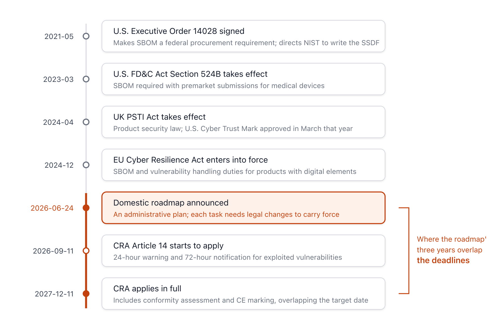

{}
This article was written with Claude Code, and the key facts cited here were cross-checked against primary sources.
{}

> **Citation and Commentary Notice.** This article cites and comments on the *Software Supply Chain Security Roadmap for the Age of Everyday AI* (2026-06-24), publicly published by the Ministry of Science and ICT, the National Intelligence Service, and the Korea Internet & Security Agency, with attribution under Article 28 of the Copyright Act. The tables and diagrams in the original are not reproduced; the narrative and diagrams here are original work based on external primary sources. Attribution: Ministry of Science and ICT, National Intelligence Service, Korea Internet & Security Agency, *Software Supply Chain Security Roadmap for the Age of Everyday AI*, 2026-06-24.

> **Summary**
> On June 24, 2026, the government released a roadmap outlining software supply chain security policy for the next three years. At its core are a transparency management model centered on the Software Bill of Materials (SBOM), a testbed and consulting program to help companies check their security, pilot certification to identify high-performing companies, and a rapid detection-and-response system. Notably, the roadmap places burden reduction for small and medium-sized enterprises throughout, reflecting an industry structure in which 81% of all software companies have fewer than 10 employees. Because the U.S. Food and Drug Administration (FDA)'s medical device approval process and the EU Cyber Resilience Act (CRA) have already made SBOMs a condition of market entry, this roadmap bears directly on the practical work of exporting companies, public-sector software vendors, and small and medium-sized software companies.

## 1. Nature of the Roadmap and Background to the Announcement

On June 24, 2026, the government released the *Software Supply Chain Security Roadmap for the Age of Everyday AI* at the Supply Chain Security Workshop held at the aT Center in Yangjae, Seoul[A1](#a1)·[B-news-zdnet](#b-news-zdnet). The Ministry of Science and ICT, the National Intelligence Service, and the Korea Internet & Security Agency (KISA) prepared it jointly with related ministries, and KISA is the publisher[A1](#a1). Rather than a law or notice, it is an administrative planning document setting out policy direction for the next three years; many of its individual tasks will gain normative force only after legal and institutional reform, guideline publication, and certification-system reorganization[A1](#a1).

The announcement followed an already-signaled path. When the government released the *SW Supply Chain Security Guideline 1.0* in 2024, it stated that it would form a joint industry-academia-research task force in the second half of the year to discuss the direction of institutionalization and then prepare a roadmap[D6](#d6); after the Ministry of Science and ICT and the National Intelligence Service agreed on December 24, 2025 to build a government-wide cooperation framework[B-news-etnews](#b-news-etnews), that process led to this announcement. The government has consistently described 2027 as its target for institutionalization[B-news-zdnet](#b-news-zdnet).

The roadmap declares its vision as "securing cyber resilience through a transition to a safe and responsible supply chain security system," converging this into three pillars: prevention, recovery, and foundation[A1](#a1). Beneath these sit three implementation strategies and nine detailed tasks.

**Figure 1.** The vision, the three strategies, and each strategy's core tasks *(compiled for this report; see §5 for external sources).*

## 2. Prevention — Building In Security and SBOM Transparency

The prevention strategy starts from establishing standards and guidance that build security into the software lifecycle as a whole. The roadmap presents a "secure SW development methodology" that draws on the National Institute of Standards and Technology (NIST)'s Secure Software Development Framework (SSDF, SP 800-218), and states that it will place activities such as defining security requirements, secure coding, vulnerability re-verification, and code signing at each stage — planning and design, development, testing, and deployment[A1](#a1)·[B5](#b5). Its predecessor, the *SW Supply Chain Security Guideline 1.0*, will be upgraded to a practically usable 2.0. The direction is to broaden open source management, which had centered on licensing, to cover security as well; to extend development security, which had focused on self-developed code, across the full supply chain; and to newly add the use of automated security compliance tools[A1](#a1)·[A2](#a2).

SBOM is the core instrument of the transparency task. An SBOM is a specification that describes information about a software's components; domestically it is also called a "software component specification," among other names. The roadmap identifies exporting companies and high-impact sectors as the priority targets for applying the SBOM management model[A1](#a1). For exporting companies, the direct drivers are the U.S. FDA's medical device approval process, the U.S. Department of Commerce's SBOM management obligation for connected vehicles, and the EU CRA's SBOM obligation for products with digital elements[A1](#a1)·[B7](#b7)·[B1](#b1); high-impact sectors include security software, socially foundational software such as finance and transportation, and software handling sensitive information such as health and medical data[A1](#a1).

The data format is effectively already settled. The International Organization for Standardization (ISO) standardized the Linux Foundation's SPDX as ISO/IEC 5962:2021[C4](#c4), and OWASP's CycloneDX was standardized as ECMA-424, published in December 2025[C5](#c5). The roadmap's statement that it will "derive the minimum SBOM items so they do not function as dual regulation," made with an eye to the National Telecommunications and Information Administration (NTIA)'s *The Minimum Elements For a Software Bill of Materials* (2021) and the CRA's requirements, is a design aimed at aligning with this international format[A1](#a1)·[C1](#c1). Format compatibility is only the starting point; the roadmap itself names verifying SBOM trustworthiness and safely distributing the vulnerability information it contains as remaining tasks[A1](#a1). An SBOM raises transparency but can also reveal to attackers which components carry which vulnerabilities, so designing the right balance between generation and sharing is the key question for the follow-on guidelines[A1](#a1).

## 3. Recovery — Rapid Detection, Risk Management, and Reducing the Burden on Companies

The detection-and-response strategy centers on expanding the scope of KISA's security vulnerability reward program (bug bounty), which it has run since October 2012[D2](#d2), and on progressively expanding Coordinated Vulnerability Disclosure (CVD) and a Vulnerability Disclosure Policy (VDP)[A1](#a1). To introduce security condition inspections for Internet of Things (IoT) appliances such as robot vacuums and IP cameras and for network-connected devices such as solar inverters, the government is pursuing an amendment to the Act on Promotion of Information and Communications Network Utilization and Information Protection, etc. (Network Act)[A1](#a1).

The risk management system is split into public and private sectors. In the public sector, the government will develop an SBOM management framework that includes Vulnerability Exploitability eXchange (VEX) information at the reliability-assurance stage, and will build an integrated public-sector SBOM management system and a vulnerability information database in stages[A1](#a1). In the private sector, it will establish a standing management framework for high-risk vulnerabilities, and set a goal of shortening the response period "from an average of more than four months to within three days" through a cleaning service (C-Clean) that, once a vulnerability is found, requests a patch from the manufacturer and performs a mass removal via antivirus software[A1](#a1).

The support companies actually feel is concentrated in inspection and diagnosis and in the distribution of tools and personnel. The roadmap states that it will expand testbeds where companies can use SBOM generation and vulnerability inspection tools, drawing on existing facilities such as the Development Security Hub and the National Cyber Security Center (NCSC) in Pangyo, and will add checks against global regulations such as medical device approval and the EU CRA to the menu[A1](#a1). For small and medium-sized software development companies, it has placed consulting to analyze and diagnose development infrastructure and management systems starting in 2026, and the distribution of cloud-based development environments and security solutions starting in 2027[A1](#a1). A defining feature of the roadmap overall is that it explicitly states the industry structure — 81% of all software companies have fewer than 10 employees (2023 Software Industry Survey, a total of 43,932 companies by employee-size bracket) — and designs its support accordingly[A1](#a1)·[D1](#d1).

## 4. Foundation — Policy Framework, Pilot Certification, and Global Cooperation

In the foundation-building strategy, the Ministry of Science and ICT and the National Intelligence Service will jointly chair a (tentatively named) government-wide SW Supply Chain Security Council, organized into five subcommittees: medical devices, automobiles, public information systems, finance, and security[A1](#a1). Pilot certification sits at the center of legal and institutional reform. The government states that it will verify software supply chain security management and issue certificates recognizing high-performing companies (tentatively named SSS Verified, Software Supply-Chain Security Verified), pursue Mutual Recognition Agreements (MRA) with countries that have institutionalized similar systems, and formally institutionalize the framework by incorporating supply chain security testing and evaluation elements into the Information Security Management System certification (ISMS), the Cloud Security Assurance Program (CSAP), and IoT security certification[A1](#a1). It is notable that the government chose to build on existing systems rather than create a separate new certification.

The changes on the public procurement side are also clear. SBOM submission and vulnerability response procedures, along with a supply chain cybersecurity risk management procedure document, have been added as tasks for informatization projects, and security conformity assessment will widen its scope in consideration of the National Network Security Framework (N2SF) while combining it with confirmation of SBOM submission[A1](#a1)·[D3](#d3). N2SF is a multi-tier security approach that applies differentiated security levels according to the importance of the work and data involved; its formal Security Guideline 1.0 was published on September 30, 2025, and reflected in the 2026 cybersecurity assessment[D3](#d3)·[D-news-boan](#d-news-boan).

The global cooperation task connects to two multilateral bodies. The Global Cybersecurity Labelling Initiative (GCLI), a coalition that discusses mutual recognition of IoT security certification labels and the establishment of a single standard, launched with 11 founding members at Singapore International Cyber Week on October 23, 2025, with Korea's Ministry of Science and ICT and KISA participating as founding members[A10](#a10). Alongside this, the roadmap presents cooperation with the Global Government Expert Forum (GGEF), the U.S. Cybersecurity and Infrastructure Security Agency (CISA), the European Commission's Directorate-General for Communications Networks, Content and Technology (DG CONNECT), and the UK Department for Science, Innovation and Technology (DSIT) as channels for supporting global expansion[A1](#a1).

**Figure 2.** The correspondence between the global regimes the roadmap references and its policy tasks *(compiled for this report; see §5 for external sources).*

The roadmap separates its response to emerging technologies into a distinct research task. It places research on a supply chain security model that responds to the everyday normalization of emerging technologies such as AI as a task for 2027 and beyond[A1](#a1), and the data layer of an SBOM for AI (training data, model weights, and the like) falls outside the direct scope of this roadmap, which centers on the general software supply chain.

## 5. The Background Shaped by Global Regulation

Behind the roadmap's choice of SBOM, pilot certification, and mutual recognition as its core instruments lies the overseas regulation exporting companies face. A company interview the roadmap quotes shows this plainly. A digital medical device manufacturer struggled to respond to SBOM requirements during the FDA approval process; a security company that had entered the U.S. market was notified, while supplying software to the federal government, that failing to meet SBOM management requirements would make it ineligible for next year's contract; and an AI solution developer lost a contract during preparations to supply a global financial company because it failed to meet cybersecurity requirements[A1](#a1).

**Figure 3.** The overseas regulation behind the roadmap and the deadlines ahead *(compiled for this report; see §7 for sources).*

Most of these regulations were finalized between 2021 and 2024. The EU Cyber Resilience Act (Regulation (EU) 2024/2847) is a regulation that imposes horizontal cybersecurity requirements on products with digital elements, and it entered into force on December 10, 2024[B1](#b1)·[B2](#b2). The Article 14 reporting obligation applies from September 11, 2026, and the essential obligations as a whole, including conformity assessment and CE marking, apply from December 11, 2027[B2](#b2). Manufacturers bear the obligation to produce an SBOM for products with digital elements, to handle vulnerabilities across the full lifecycle, and to issue an early warning within 24 hours and notify within 72 hours of becoming aware of an actively exploited vulnerability or a severe incident[B1](#b1). Penalties for violation run up to €15 million or 2.5% of worldwide annual turnover, whichever is higher[B1](#b1). The roadmap's recurring "scheduled for '27.12 implementation" refers to this date of full application[A1](#a1).

U.S. supply chain regulation began with Executive Order 14028 (Improving the Nation's Cybersecurity), signed on May 12, 2021, which led to institutionalizing SBOM as a federal procurement requirement and directed NIST to draw up the SSDF[B3](#b3)·[B5](#b5). CISA finalized the Secure Software Development Attestation Common Form on March 11, 2024[B4](#b4). Medical device regulation began when Section 3305 of the 2022 Consolidated Appropriations Act added a new Section 524B to the Federal Food, Drug, and Cosmetic Act (FD&C Act); the amended provision took effect on March 29, 2023[B7](#b7). Manufacturers filing a premarket submission must submit a postmarket vulnerability management plan, secure-by-design documentation, and an SBOM covering commercial, open source, and off-the-shelf components[B7](#b7). In the consumer IoT space, the U.S. Federal Communications Commission (FCC) adopted a voluntary labeling program (the U.S. Cyber Trust Mark) on March 14, 2024[B8](#b8), and the UK brought the Product Security and Telecommunications Infrastructure Act 2022 (PSTI) into force on April 29, 2024[B9](#b9). These are the "U.S. Cyber Trust Mark" and "UK PSTI (effective '24.4)" the roadmap cites in its post-market management task[A1](#a1).

## 6. Implications and Considerations

### 6.1 Exporting Companies — SBOM Is Already a Market Entry Condition

With the FDA's medical device approval process and the EU CRA having effectively made SBOM management a condition of market entry, the government's inspection support and its push for mutual recognition offer direct value to exporting companies[A1](#a1)·[B1](#b1)·[B7](#b7). Because the EU CRA's reporting obligation begins September 11, 2026, and full application begins December 11, 2027[B2](#b2), exporting companies are safer preparing their SBOM generation and vulnerability reporting systems ahead of time on the CRA's own schedule, rather than waiting for Korea's MRA to be concluded. An MRA requires the counterpart country to recognize Korean certification as equivalent, and the roadmap itself only describes the MRA as being "pursued," without offering a timeline for agreement[A1](#a1).

### 6.2 Public-Sector Software Vendors — SBOM Submission Becomes a Standing Requirement

In the public sector, SBOM submission and vulnerability response procedures for informatization projects have been explicitly set as tasks, and confirmation of SBOM submission is combined with security conformity assessment and the transition to N2SF[A1](#a1)·[D3](#d3). Companies supplying software to the public sector need to prepare by integrating SBOM generation into their build pipeline. Since the policy is to derive public-sector SBOM items at a minimum so they do not become dual regulation[A1](#a1), it is practically useful to check the follow-on guidelines for how alignment with overseas requirements is actually designed.

### 6.3 Small and Medium-Sized Software Companies — Whether Support Is Sufficient Is the Question

In an industry structure where 81% of all software companies have fewer than 10 employees[A1](#a1)·[D1](#d1), it is difficult for these companies to bear on their own the tools and personnel needed for SBOM generation and vulnerability management. The roadmap places consulting and the distribution of cloud-based development environments and security solutions as its support measures, but no figures are given for whether the scale of distribution and the budget will actually cover the majority of the roughly 40,000 companies involved[A1](#a1). Whether the support is sufficient is an area that future budget allocation will decide.

### 6.4 Remaining Risks

There is a risk from dependence on external infrastructure. The contract between MITRE, which operates the U.S. Common Vulnerabilities and Exposures (CVE) program, and CISA came within a day of expiring on April 16, 2025, before an 11-month extension patched things over, and the CVE Board confirmed on January 21, 2026 that "there will be no March funding cliff"[E6](#e6)·[F-news-cso](#f-news-cso). The immediate crisis was averted, but the structural instability of a global vulnerability identification system that depends on the U.S. government's budget remains unchanged, which makes the roadmap's inclusion of finding an alternative program as a task a reasonable precaution[A1](#a1).

The readiness of the development field is another variable. According to Black Duck's survey of the state of DevSecOps, conducted among 1,001 professionals worldwide in July and August 2025, 45.56% still handle putting new code through security testing manually[H1](#h1). Speed has become the standard while security automation has not kept pace, and this gap overlaps with the problem the roadmap identifies in its plan to shift from human-centered manual response to an AI-centered autonomous system[A1](#a1). If SBOM generation and vulnerability inspection are not integrated into an automated pipeline, mandating them risks becoming, on the ground, an added burden of manual work.

As a side note, the estimate of global damage from supply chain attacks that the roadmap attributes to "Gartner ('24.6)" — $46 billion in 2023, projected to reach $138 billion by 2031 — is actually a Cybersecurity Ventures estimate[E4](#e4).

---

## 7. References

This section lists the items cited in the text as `[A1]` and similar. All URLs were accessed on 2026-06-24. Government and institutional sites sometimes return a bot block to automated crawling tools; these are not dead links, and such items were cross-checked using existing verification assets or WebSearch.

### Subject of Analysis and Domestic Prior Documents

**A1.** Ministry of Science and ICT, National Intelligence Service, and Korea Internet & Security Agency, joint (2026). *Software Supply Chain Security Roadmap for the Age of Everyday AI*. Published by the Korea Internet & Security Agency (Naju), 1st edition, 1st printing, 2026-06-24. 30 pages, CC BY-NC-ND 2.0 KR. Released on the day of the announcement (2026-06-24, Supply Chain Security Workshop, aT Center, Yangjae); a fixed direct PDF link was not yet available, but it can be found via the Ministry of Science and ICT press release (<https://www.msit.go.kr/bbs/list.do?sCode=user&mId=307&mPid=208>) and the KISA resource library. — *Use: the publicly released government roadmap that is the subject of this article's citation and commentary. Cited with attribution; the original's tables and diagrams are not reproduced.* <a href="#a1-ref-1" onclick="event.preventDefault(); history.back(); return false;" title="Back to text">↩</a>

**A2.** Ministry of Science and ICT, National Intelligence Service, and Presidential Committee on Digital Platform Government (2024). *SW Supply Chain Security Guideline 1.0* (summary, 2024-05-13). Published in the KISA resource library. <https://www.kisa.or.kr/2060204/form?postSeq=15> (accessed 2026-06-24; publishing entity and SSDF, SBOM, and stage-by-stage inspection content cross-checked via WebSearch). — *Use: the direct predecessor document the roadmap states it will upgrade to 2.0.* <a href="#a2-ref-1" onclick="event.preventDefault(); history.back(); return false;" title="Back to text">↩</a>

**A10.** Cyber Security Agency of Singapore et al. (2025). *Joint Statement on the Global Cybersecurity Labelling Initiative (GCLI)*. Launched 2025-10-23. <https://www.csa.gov.sg/news-events/press-releases/joint-statement-on-the-global-cybersecurity-labelling-initiative/> (accessed 2026-06-24; launch date, 11 founding members, and Korea's participation cross-checked via WebSearch). — *Use: confirms the GCLI's launch, composition, and Korea's participation.* <a href="#a10-ref-1" onclick="event.preventDefault(); history.back(); return false;" title="Back to text">↩</a>

### Primary Texts of Global Laws and Regulations

**B1.** European Parliament and Council (2024). *Regulation (EU) 2024/2847 — Cyber Resilience Act*. Official Journal of the EU, OJ L, 2024/2847, 20.11.2024. <https://eur-lex.europa.eu/eli/reg/2024/2847/oj/eng> (accessed 2026-06-24; reconfirmed against the `eu-cra-vulnerability-reporting` workspace verification asset). — *Use: primary basis for the CRA's SBOM and vulnerability obligations, reporting deadlines (24h/72h), penalties, and effective dates.* <a href="#b1-ref-1" onclick="event.preventDefault(); history.back(); return false;" title="Back to text">↩</a>

**B2.** European Commission, DG CNECT (2026). *Cyber Resilience Act — Shaping Europe's digital future*. <https://digital-strategy.ec.europa.eu/en/policies/cyber-resilience-act> (accessed 2026-06-24). — *Use: primary confirmation of the implementation schedule (entry into force 2024-12-10, reporting obligation 2026-09-11, full application 2027-12-11).* <a href="#b2-ref-1" onclick="event.preventDefault(); history.back(); return false;" title="Back to text">↩</a>

**B3.** The White House (2021). *Executive Order 14028 — Improving the Nation's Cybersecurity*. Federal Register, 86 FR 26633, 2021-05-17. <https://www.federalregister.gov/documents/2021/05/17/2021-10460/improving-the-nations-cybersecurity> (accessed 2026-06-24, 200 OK). — *Use: primary basis for making SBOM a federal procurement requirement and directing NIST to draw up the SSDF.* <a href="#b3-ref-1" onclick="event.preventDefault(); history.back(); return false;" title="Back to text">↩</a>

**B4.** CISA (2024). *Secure Software Development Attestation Common Form* (Final). Released 2024-03-11. <https://www.cisa.gov/secure-software-attestation-form> (accessed 2026-06-24; cisa.gov returned a bot block, release date cross-checked via WebSearch). — *Use: the U.S. federal procurement SSDF self-attestation obligation. The roadmap's "'23.6~" notation refers to when the policy was discussed; the form itself was released in 2024-03.* <a href="#b4-ref-1" onclick="event.preventDefault(); history.back(); return false;" title="Back to text">↩</a>

**B5.** NIST — Souppaya, M., Scarfone, K., Dodson, D. (2022). *Secure Software Development Framework (SSDF) Version 1.1*. NIST SP 800-218. DOI: 10.6028/NIST.SP.800-218. <https://csrc.nist.gov/pubs/sp/800/218/final> (accessed 2026-06-24). — *Use: the framework the roadmap's "secure SW development methodology" directly references.* <a href="#b5-ref-1" onclick="event.preventDefault(); history.back(); return false;" title="Back to text">↩</a>

**B7.** U.S. Food and Drug Administration / Federal Register (2023). *Cybersecurity in Medical Devices: Quality System Considerations and Content of Premarket Submissions* (FD&C Act §524B, added by §3305 of the 2022 Consolidated Appropriations Act, effective 2023-03-29). <https://www.federalregister.gov/documents/2023/09/27/2023-20955/cybersecurity-in-medical-devices-quality-system-considerations-and-content-of-premarket-submissions> (accessed 2026-06-24, 200 OK). — *Use: primary basis for the FDA's medical device SBOM requirement.* <a href="#b7-ref-1" onclick="event.preventDefault(); history.back(); return false;" title="Back to text">↩</a>

**B8.** Federal Communications Commission (2024). *Cybersecurity Labeling for Internet of Things — Report and Order (FCC 24-26)* (U.S. Cyber Trust Mark). Adopted 2024-03-14. <https://www.federalregister.gov/documents/2024/03/25/2024-06249/cybersecurity-labeling-for-internet-of-things> (accessed 2026-06-24, 200 OK). Program hub: <https://www.fcc.gov/CyberTrustMark>. — *Use: primary basis for the U.S. voluntary IoT labeling program.* <a href="#b8-ref-1" onclick="event.preventDefault(); history.back(); return false;" title="Back to text">↩</a>

**B9.** UK Government / DSIT (2022/2024). *Product Security and Telecommunications Infrastructure (PSTI) Act 2022, Part 1* (effective 2024-04-29). <https://www.gov.uk/government/publications/the-uk-product-security-and-telecommunications-infrastructure-product-security-regime> (accessed 2026-06-24; effective date and penalty cap cross-checked via WebSearch). — *Use: primary basis for the UK's mandatory PSTI regulation.* <a href="#b9-ref-1" onclick="event.preventDefault(); history.back(); return false;" title="Back to text">↩</a>

### Standards and Guidance

**C1.** U.S. Department of Commerce / NTIA (2021). *The Minimum Elements For a Software Bill of Materials (SBOM)*. 2021-07-12. <https://www.ntia.gov/files/ntia/publications/sbom_minimum_elements_report.pdf> (accessed 2026-06-24; ntia.gov blocked the crawler, reconfirmed against the `sbom-guide` and `g7-sbom-for-ai` workspace verification assets). — *Use: the baseline for the roadmap's "deriving minimum SBOM items."* <a href="#c1-ref-1" onclick="event.preventDefault(); history.back(); return false;" title="Back to text">↩</a>

**C4.** The Linux Foundation / SPDX Project. *SPDX Specifications* (current version SPDX 3.0, standardized as ISO/IEC 5962:2021). <https://spdx.dev/use/specifications/> (accessed 2026-06-24, 200 OK, verified against `sbom-guide`). — *Use: an SBOM standard format. Basis for global compatibility.* <a href="#c4-ref-1" onclick="event.preventDefault(); history.back(); return false;" title="Back to text">↩</a>

**C5.** OWASP Foundation / Ecma International (2025). *CycloneDX Specification / ECMA-424* (published 2025-12-10). <https://cyclonedx.org/specification/overview/> (accessed 2026-06-24, 200 OK, verified against `sbom-guide`). — *Use: an SBOM standard format.* <a href="#c5-ref-1" onclick="event.preventDefault(); history.back(); return false;" title="Back to text">↩</a>

### Domestic Institutions and Statistics

**D1.** Ministry of Science and ICT and the Korea Association for ICT Promotion (KAIT) (2024). *2023 Software Industry Survey* (a nationally approved statistic). Statistics portal SWSTAT: <https://stat.spri.kr/> (accessed 2026-06-24; publishing body and the nature of the statistic confirmed via WebSearch). — *Use: basis for the publishing framework behind the roadmap's statistic that "81% of software companies have fewer than 10 employees (43,932 companies in total)." The 81% figure and the 43,932 count are attributed to the roadmap's citation, as direct comparison against the survey's original tables was not completed.* <a href="#d1-ref-1" onclick="event.preventDefault(); history.back(); return false;" title="Back to text">↩</a>

**D2.** Korea Internet & Security Agency (KISA) / KrCERT (2012–). *Security Vulnerability Reward Program (Bug Bounty)*. <https://www.krcert.or.kr/kr/bbs/list.do?menuNo=205027> (accessed 2026-06-24; October 2012 program start and quarterly evaluation cross-checked via WebSearch). — *Use: basis for the existing program the roadmap's detection-and-response task expands.* <a href="#d2-ref-1" onclick="event.preventDefault(); history.back(); return false;" title="Back to text">↩</a>

**D3.** National Intelligence Service · National Cyber Security Center (2025). *National Network Security Framework (N2SF) Security Guideline*, formal edition 1.0 (published 2025-09-30). <https://www.nis.go.kr/CM/1_4/view.do?seq=373> (accessed 2026-06-24; publication date and tiered security-level system cross-checked via WebSearch). — *Use: basis for the roadmap's expansion of the scope of security conformity assessment (N2SF).* <a href="#d3-ref-1" onclick="event.preventDefault(); history.back(); return false;" title="Back to text">↩</a>

**D6.** Presidential Committee on Digital Platform Government (2024). *Government Announces 'SW Supply Chain Security Guideline 1.0'* (press release, 2024-05-13). <https://www.dpg.go.kr/DPG/contents/DPG02020000.do?schM=view&id=20240513105420991857&schBcid=press> (accessed 2026-06-24; the announcement date of 2024-05-13 and the text's plan for "preparing a roadmap through a government-wide joint task force in the second half of the year" cross-checked via WebSearch). — *Use: primary announcement of the background to Guideline 1.0's release and the "plan to prepare a roadmap through a second-half joint task force."* <a href="#d6-ref-1" onclick="event.preventDefault(); history.back(); return false;" title="Back to text">↩</a>

### Original Sources of Statistics Cited by the Roadmap

**E4.** Cybersecurity Ventures (2024). *Software Supply Chain Attacks To Cost The World $60 Billion By 2025*. <https://cybersecurityventures.com/software-supply-chain-attacks-to-cost-the-world-60-billion-by-2025/> (accessed 2026-06-24; the $46 billion figure for 2023 and $138 billion for 2031 confirmed via WebSearch). — *Use: the actual original source of the roadmap's supply chain damage statistic. The roadmap's attribution to "Gartner ('24.6)" is inaccurate and is corrected here to Cybersecurity Ventures.* <a href="#e4-ref-1" onclick="event.preventDefault(); history.back(); return false;" title="Back to text">↩</a>

**E6.** MITRE / CISA (2025). Background on the CVE program's contract expiration and extension. Cybersecurity Dive (2025-04): <https://www.cybersecuritydive.com/news/cisa-extend-funding-cve/745531/> (accessed 2026-06-24; the $57.8 million contract, 2025-04-16 expiration, 11-month extension, and the founding of the CVE Foundation confirmed via WebSearch). Program site: <https://www.cve.org/>. — *Use: background for the roadmap's task of finding an alternative to the CVE program. Supplementary press source.* <a href="#e6-ref-1" onclick="event.preventDefault(); history.back(); return false;" title="Back to text">↩</a>

### News and Industry Coverage

**B-news-etnews.** ETNews (2025-12-24). *Ministry of Science and ICT and National Intelligence Service Join Hands on SW Supply Chain Security… Build Government-Wide Cooperation Framework*. <https://www.etnews.com/20251224000334> (accessed 2026-06-24). — *Use: confirms the timing of the government-wide cooperation agreement (2025-12-24).* <a href="#b-news-etnews-ref-1" onclick="event.preventDefault(); history.back(); return false;" title="Back to text">↩</a>

**B-news-zdnet.** ZDNet Korea (2026-06-16). *Government to Release SW Supply Chain Security Roadmap on the 24th*. <https://zdnet.co.kr/view/?no=20260616111556> (accessed 2026-06-24). — *Use: primary confirmation of the announcement date (2026-06-24), the responsible bodies (Ministry of Science and ICT, National Intelligence Service), the location (aT Center, Yangjae), and the 2027 institutionalization target.* <a href="#b-news-zdnet-ref-1" onclick="event.preventDefault(); history.back(); return false;" title="Back to text">↩</a>

**D-news-boan.** Boannews (2026). *From NIS Security Conformity Assessment to N2SF… What's Changed in the Paradigm?*. <https://m.boannews.com/html/detail.html?tab_type=1&idx=140209> (accessed 2026-06-24). — *Use: coverage of the transition from security conformity assessment to N2SF and its incorporation into the 2026 cybersecurity assessment.* <a href="#d-news-boan-ref-1" onclick="event.preventDefault(); history.back(); return false;" title="Back to text">↩</a>

**F-news-cso.** CSO Online (2026). *CVE program funding secured, easing fears of repeat crisis*. <https://www.csoonline.com/article/4142600/cve-program-funding-secured-easing-fears-of-repeat-crisis.html> (accessed 2026-06-24). — *Use: confirms the CVE Board's January 21, 2026 statement of "no March funding cliff."* <a href="#f-news-cso-ref-1" onclick="event.preventDefault(); history.back(); return false;" title="Back to text">↩</a>

### Development-Field Trends

**H1.** Black Duck (2025). *Balancing AI Usage and Risk in 2025: The Global State of DevSecOps* (October 2025). The survey was conducted by Censuswide among 1,001 professionals worldwide in July–August 2025. — *Use: the security automation gap in the development field (45.56% still handled manually).* <a href="#h1-ref-1" onclick="event.preventDefault(); history.back(); return false;" title="Back to text">↩</a>
