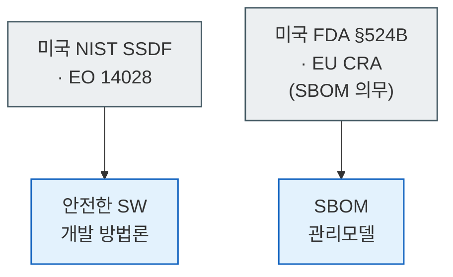
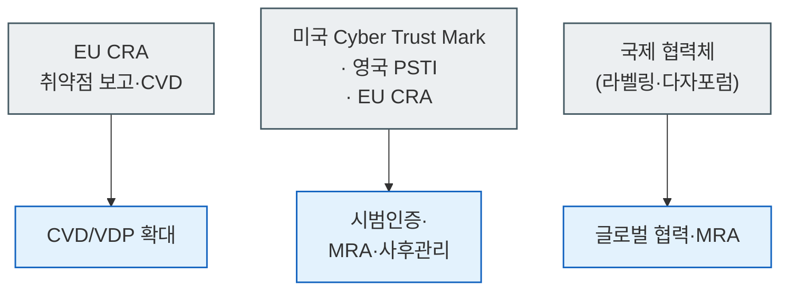
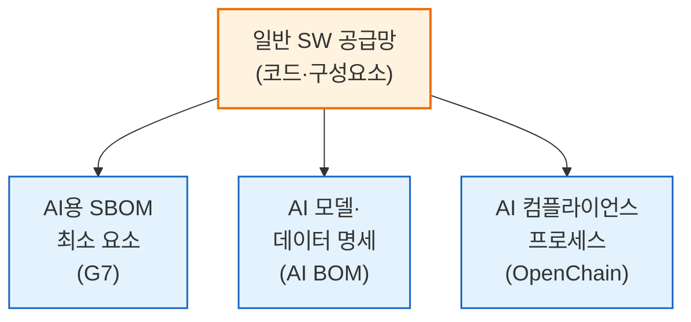
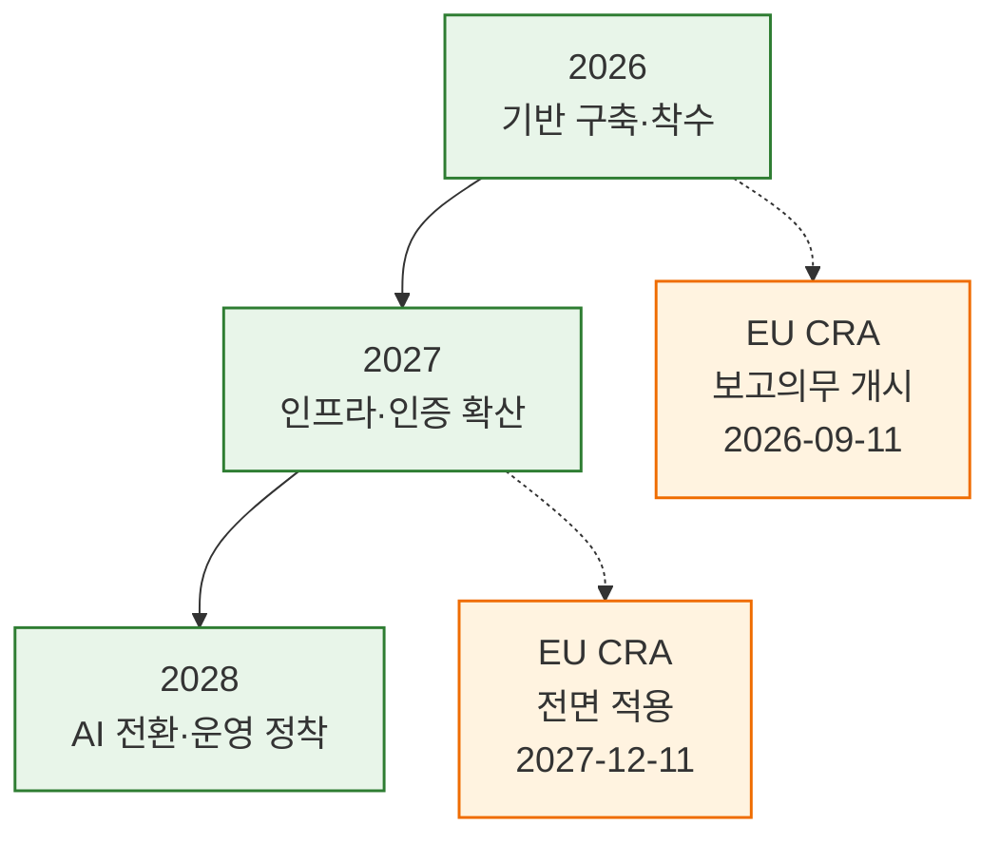

{}
이 글은 Claude Code를 이용해 작성했고, 인용한 핵심 사실은 1차 출처로 교차 검증했습니다.
{}

> **인용·논평 안내.** 본 글은 정부가 2026년 6월 24일 공개한 「AI 일상화 시대를 준비하는 SW 공급망 보안 강화 로드맵」(과학기술정보통신부·국가정보원·한국인터넷진흥원 합동, 발행처 한국인터넷진흥원)을 대상으로 한 독립 분석·논평입니다. 원문은 크리에이티브 커먼즈 저작자표시-비영리-변경금지 2.0 대한민국(CC BY-NC-ND 2.0 KR) 라이선스이므로, 저작권법 제28조(공표된 저작물의 인용)가 허용하는 정당한 범위에서 출처를 밝혀 인용했고 원문의 표·도식은 복제하지 않았습니다. 로드맵 본문은 분석에 필요한 최소한만 따옴표로 인용했으며, 이 글의 서술과 도식은 외부 1차 출처를 근거로 한 자체 저작물입니다. 원저작자 표시: 과학기술정보통신부·국가정보원·한국인터넷진흥원, 「AI 일상화 시대를 준비하는 SW 공급망 보안 강화 로드맵」, 2026-06-24.

> **요약**
> 한국 정부의 SW 공급망 보안 정책은 소프트웨어 자재명세서(Software Bill of Materials, SBOM)와 시범인증, 상호인정(Mutual Recognition Agreement, MRA)을 핵심 수단으로 삼습니다. 이 세 가지는 모두 미국과 유럽연합(EU)이 2021~2024년에 먼저 제도화한 영역이라, 한국은 후발 추격자의 위치에서 자국 산업 부담과 글로벌 정합성을 조율하는 과제를 안고 있습니다. 수출기업은 미국 식품의약국(FDA) 의료기기 인허가와 EU 사이버복원력법(Cyber Resilience Act, CRA)이 이미 SBOM을 시장 진입 조건으로 만든 환경에 놓여 있어, 한국 정책의 향방은 국내 SW·정보보호 산업의 컴플라이언스 비용과 직결됩니다. 본 글은 글로벌 제도가 어디까지 와 있는지, 한국 정책이 그 흐름에 어떻게 정렬되는지, 그리고 수출·공공·중소기업 각각이 무엇을 준비해야 하는지를 외부 1차 출처를 근거로 분석합니다.

## 1. 분석의 출발점

한국 정부는 2026년 6월 24일 향후 3년의 SW 공급망 보안 정책 방향을 담은 로드맵을 공개했습니다[A1](#a1). 법령이나 고시가 아니라 정책 방향을 제시하는 행정계획 성격의 문서로, 개별 과제의 상당수는 법·제도 정비와 가이드라인 발간, 인증제 개편을 거쳐야 비로소 규범력을 얻습니다. 로드맵은 예방·복원·기반의 세 전략 아래 아홉 개 세부과제를 두며, 그 중심 수단으로 SBOM 관리 모델과 시범인증, 그리고 제도화 국가와의 상호인정을 제시했습니다[A1](#a1).

이 정책을 평가하려면 두 좌표가 필요합니다. 하나는 국내에 이미 자리 잡은 제도에 무엇을 새로 더하는가이고, 다른 하나는 미국과 EU가 먼저 움직인 글로벌 규제에 한국이 어떻게 정렬하는가입니다. 로드맵 자신이 추진 배경의 한 축으로 글로벌 정책 패러다임의 전환을 들고, 세부과제 곳곳에서 EU 사이버복원력법과 미국 표준기술연구소(National Institute of Standards and Technology, NIST) 프레임워크, FDA 의료기기 규제를 명시적으로 참조하기 때문입니다[A1](#a1). 그래서 본 글은 로드맵의 내용을 차례로 옮기기보다, 한국이 따라가려는 글로벌 제도의 실체를 먼저 정리하고 그 위에서 정책의 정합성과 실무 시사점을 따집니다.

발표는 예고된 흐름을 따랐습니다. 정부는 2024년 가이드라인 발표 당시부터 하반기에 산·학·연 합동 태스크포스를 구성해 제도화 추진방향을 논의한 뒤 로드맵을 마련하겠다고 밝혔고[D6](#d6), 2025년 12월 24일 과기정통부와 국정원이 범정부 협력체계 구축에 합의한 뒤[B-news-etnews](#b-news-etnews), 2026년 6월 24일 서울 양재 aT센터 공급망보안워크숍에서 로드맵 윤곽이 공개됐습니다[B-news-zdnet](#b-news-zdnet). 정부는 일관되게 2027년 제도화를 목표로 설명해 왔습니다[B-news-zdnet](#b-news-zdnet).

## 2. 먼저 자리 잡은 글로벌 제도

한국이 뒤따르려는 흐름의 근거가 되는 제도들은 대부분 2021~2024년 사이에 확정됐습니다. 이 절은 그 제도들을 외부 1차 출처로 정리합니다. 한국 정책의 정합성은 이 제도들과의 거리로 측정되기 때문입니다.

### 2.1 EU 사이버복원력법

EU 사이버복원력법(Regulation (EU) 2024/2847)은 디지털 요소를 가진 제품에 수평적 사이버보안 요건을 부과하는 규정으로, 2024년 10월 23일 서명, 11월 20일 관보 게재를 거쳐 2024년 12월 10일 발효됐습니다[B1](#b1)·[B2](#b2). CRA는 단계적으로 시행되어, 제14조 보고 의무는 2026년 9월 11일부터, 적합성 평가와 CE 마킹을 포함한 본질적 의무 전반은 2027년 12월 11일부터 적용됩니다[B2](#b2). 제조사는 위험 평가 기반 설계 보안, 디지털 요소를 가진 제품의 SBOM 작성, 생애주기 전반의 취약점 처리, 그리고 적극적으로 악용되는 취약점이나 중대 사고를 인지 후 24시간 안에 조기 경보하고 72시간 안에 통지하는 의무를 집니다[B1](#b1). 위반 시 과징금은 최대 1,500만 유로 또는 전 세계 연 매출의 2.5% 중 높은 금액입니다[B1](#b1).

로드맵이 반복하는 "'27.12 시행 예정"은 이 전면 적용일을 가리킵니다[A1](#a1). 한국 정책의 시간표가 CRA를 의식해 짜였다는 점은 로드맵 곳곳에서 드러납니다.

### 2.2 미국 — 행정명령에서 의료기기 규제까지

미국의 공급망 규제는 2021년 5월 12일 서명된 행정명령 14028(Executive Order 14028, Improving the Nation's Cybersecurity)에서 출발합니다[B3](#b3). 이 행정명령이 SBOM을 연방 조달 요건으로 제도화하고 NIST에 안전한 소프트웨어 개발 프레임워크(Secure Software Development Framework, SSDF, SP 800-218)를 정리하도록 이끌었습니다[B3](#b3)·[B5](#b5). 사이버보안·인프라보안청(Cybersecurity and Infrastructure Security Agency, CISA)은 2024년 3월 11일 안전한 소프트웨어 개발 증명 공통서식을 확정했고, 연방기관은 중요 소프트웨어에 대해 2024년 6월 8일부터 증명서를 수집하기 시작했습니다[B4](#b4).

의료기기 규제는 2022년 통합세출법(2023 Consolidated Appropriations Act) 제3305조가 연방 식품의약품화장품법(FD&C Act)에 제524B조를 신설하면서 시작됐고, 개정 조항은 2023년 3월 29일 발효됐습니다[B7](#b7). 시판전 신청을 내는 제조자는 시판후 취약점 관리 계획과 보안 설계, 그리고 상용·오픈소스·기성품 구성요소를 담은 SBOM을 제출해야 합니다[B7](#b7). 로드맵이 무역장벽 사례로 든 국내 의료기기 기업의 "FDA 인허가 단계에서 SBOM 요구로 대응 곤란"이라는 어려움이 바로 이 규제에서 나옵니다[A1](#a1).

### 2.3 소비자 IoT 라벨링

소비자 사물인터넷(Internet of Things, IoT) 영역에는 라벨링 제도가 자리 잡았습니다. 미국 연방통신위원회(Federal Communications Commission, FCC)는 2024년 3월 14일 자발적 IoT 라벨링 프로그램(미국 사이버 신뢰 마크, U.S. Cyber Trust Mark)을 의결했습니다[B8](#b8). 영국은 제품 보안 및 통신 인프라법(Product Security and Telecommunications Infrastructure Act 2022, PSTI)을 2024년 4월 29일 발효해 기본 비밀번호 금지, 취약점 신고 연락처 공개, 보안 업데이트 지원 기간 명시를 의무화했습니다[B9](#b9). 로드맵이 사후관리 유도 과제에서 인용한 "美 Cyber Trust Mark"와 "영국 PSTI('24.4 시행)"가 이들입니다[A1](#a1).

### 2.4 SBOM 형식 표준은 이미 정해졌다

데이터 형식 측면에서는 진입장벽이 낮습니다. 국제표준화기구(ISO)는 리눅스 재단의 SPDX를 ISO/IEC 5962:2021로 표준화했고[C4](#c4), OWASP의 CycloneDX는 ECMA-424로 표준화돼 2025년 12월 공표됐습니다[C5](#c5). 채택할 형식이 국제적으로 정해진 이상, 형식 자체보다 신뢰도 검증과 SBOM 안에 담긴 민감정보(취약점 정보 등)의 유통 방안이 실제 난제로 남습니다. 미국 통신정보관리청(National Telecommunications and Information Administration, NTIA)의 「SBOM 최소 요소」(2021)는 SBOM 항목의 국제적 기준선으로 통용됩니다[C1](#c1).

## 3. 국내에 이미 갖춰진 기반

한국 정책은 백지에서 출발하지 않습니다. 가장 직접적인 선행 자료는 「SW 공급망 보안 가이드라인 1.0」으로, 과학기술정보통신부·국가정보원·디지털플랫폼정부위원회가 합동으로 발표하고 KISA가 발행처로 게시했습니다(2024-05-13)·[A2](#a2)·[D6](#d6). 이 가이드라인은 SSDF 적용, SBOM 국제표준, 생애주기별 SBOM 관리, 단계별 보안 점검 항목을 담았고, 로드맵은 이를 2.0으로 개선하겠다고 밝혀 후속 정책임을 분명히 했습니다[A1](#a1)·[A2](#a2).

인증·검증 쪽에서는 정보보호 관리체계 인증(ISMS), 클라우드 보안인증(CSAP), IoT 보안인증, 국가용 보안제품의 보안적합성 검증이 이미 운영되고 있습니다. 여기에 국가정보원이 추진하는 국가 망 보안체계(National Network Security Framework, N2SF)가 더해졌습니다. N2SF는 업무·데이터 중요도에 따라 보안 수준을 차등 적용하는 다층보안 접근으로, 보안가이드라인 정식판 1.0이 2025년 9월 30일 공개됐고 2026년 사이버보안 평가에 반영됐습니다[D3](#d3)·[D-news-boan](#d-news-boan). 보안적합성 검증에서 N2SF로 이동하는 이 패러다임 전환에 SBOM 요구를 결합하겠다는 것이 로드맵 법·제도 정비 과제의 설계입니다[A1](#a1).

탐지·대응 기반으로는 KISA가 2012년 10월부터 운영해 온 보안취약점 신고포상제(버그바운티)·[D2](#d2), 민간 대상 사이버위협정보 분석공유 시스템(Cyber Threats Analysis System, C-TAS)·[D4](#d4), 공공 대상 시스템과 KISA 개발보안허브, 판교 국가사이버안보센터(National Cyber Security Center, NCSC) 같은 시설이 있습니다. 로드맵의 탐지·대응 과제는 이 시설과 시스템을 단계적으로 확충하는 계획에 가깝습니다[A1](#a1).

정부 내 역할 분담은 비교적 명확합니다. 과기정통부는 민간 지원과 산업 육성, SBOM 투명성 모델, 글로벌 협력을 주도하고, 국정원은 공공분야 위험관리와 보안적합성 검증을 맡으며, 행정안전부는 공공분야 관리체계에 함께 참여합니다. KISA는 발행 주체이자 대부분 과제의 실무 집행기관입니다[A1](#a1). 이해관계의 핵심 긴장은 규제 정합과 산업 부담 사이에 있습니다. 미국·EU 규제에 정렬해 수출기업의 무역장벽을 낮춰야 하는 한편, 전체 SW기업의 81%가 10인 미만인 국내 산업 구조에서 중소기업이 규제를 감당하도록 지원해야 합니다. 로드맵은 이 비율을 2023년 SW산업 실태조사(종사자 규모별 합계 43,932개 기준)에서 인용했습니다[A1](#a1)·[D1](#d1).

## 4. 글로벌 정합성 분석 — 후발 추격자 한국의 위치

한국 정책의 SBOM 의무화, 시범인증, MRA는 독자 행보가 아니라 미국·EU·주요 7개국(G7)이 먼저 마련한 제도를 따라가는 후발 대응입니다. 무역장벽 대응이라는 동기가 그만큼 큽니다. 로드맵이 인용한 기업 인터뷰는 이 제도화가 이미 국내 수출기업에 실질적 비용으로 작용함을 보여줍니다. 디지털 의료기기 제조기업이 FDA 인허가 단계에서 SBOM 요구로 대응에 곤란을 겪었고, 미국에 진출한 정보보호기업은 연방정부 SW 납품 중 SBOM 관리요건 미충족 시 차년도 계약 불가를 통보받았으며, 인공지능 솔루션 개발기업은 글로벌 금융기업 납품 준비 중 사이버보안 요건 미충족으로 계약이 무산됐습니다[A1](#a1).

글로벌 제도가 한국 정책 과제로 흡수되는 대응 관계를 분석하면 다음과 같이 정리됩니다.

**그림 1.** 글로벌 제도와 한국 정책 과제의 대응 관계 (1) 예방·개발 영역 *(본 보고서 분석; 외부 출처는 §2 참조).*

**그림 2.** 글로벌 제도와 한국 정책 과제의 대응 관계 (2) 대응·인증·협력 영역 *(본 보고서 분석; 외부 출처는 §2 참조).*

### 4.1 형식보다 신뢰도와 유통이 난제

SBOM 형식 표준이 이미 정해졌으므로(§2.4), 한국 정책의 실제 부담은 데이터 형식이 아니라 다른 곳에 있습니다. 로드맵이 SBOM 항목을 NTIA 최소 요소와 CRA 요건을 의식해 최소한으로 도출하겠다고 한 것은 형식 정합성을 노린 설계로 읽힙니다[A1](#a1)·[C1](#c1). 형식 호환은 출발점일 뿐이고, SBOM의 신뢰도 검증과 그 안에 담긴 취약점 정보를 안전하게 유통하는 방안이 남은 난제입니다. SBOM은 투명성을 높이는 동시에 어떤 구성요소에 어떤 취약점이 있는지를 공격자에게도 노출할 수 있어, 생성과 공유 사이의 균형 설계가 향후 가이드라인의 관건입니다[A1](#a1).

### 4.2 AI 층위 — 부제와 본문의 간극

표준화 최전선에서는 SBOM이 인공지능(AI) 영역으로 확장되는 중입니다. G7 사이버보안 작업반은 2026년 5월 12일 「AI를 위한 SBOM — 최소 요소(Software Bill of Materials for AI — Minimum Elements)」를 발표해, 메타데이터·모델·데이터셋 등 일곱 개 클러스터로 AI용 SBOM 요소를 정의했습니다[F1](#f1)·[F2](#f2). 독일 연방정보보안청(BSI), 미국 CISA, 프랑스 국가사이버보안청(ANSSI) 등이 EU 집행위와 공동 발표한 자발적 지침입니다. SPDX는 3.0부터 AI Profile과 Dataset Profile을 도입했고, CycloneDX는 1.5부터 기계학습 자재명세서(Machine Learning Bill of Materials, ML-BOM) 역량을 제공합니다[C5](#c5)·[F4](#f4).

한국 정책은 "AI 일상화 시대"를 부제로 내세웠지만, AI용 SBOM의 데이터 층위(학습 데이터, 모델 가중치, 프롬프트)는 일반 SW 공급망 중심인 로드맵의 범위 밖에 있습니다. 로드맵은 신기술 일상화 대응 공급망 보안 모델 연구를 2027년 이후 과제로 약속하는 데 그쳤습니다[A1](#a1). 부제로 AI를 내걸고도 정작 AI용 SBOM 요소를 구체화하지 않은 점은 후속 가이드라인에서 채워야 할 공백입니다.

**그림 3.** 일반 SW 공급망과 AI 층위 표준의 보완 구도 *(본 보고서 분석).*

### 4.3 국제 협력체와 데이터의 한계

로드맵의 글로벌 협력 과제는 두 다자 협력체를 언급합니다. 글로벌 사이버보안 라벨링 이니셔티브(Global Cybersecurity Labelling Initiative, GCLI)는 IoT 보안인증 라벨의 상호인정과 단일 표준 제정을 논의하는 협력체로, 2025년 10월 23일 싱가포르 국제사이버위크에서 11개 창립 회원으로 출범했고 한국의 과기정통부와 KISA가 창립 회원으로 참여합니다[A10](#a10). 다만 로드맵이 든 참여국 표기는 GCLI 공동성명의 창립 회원 구성과 정확히 일치하지 않으므로, 회원 구성은 공동성명을 기준으로 확인하는 편이 안전합니다[A10](#a10). 또 하나인 글로벌 정부 전문가 포럼(Global Government Expert Forum, GGEF)에 대해 로드맵은 "미국, 독일, 영국 등 31개국"이라고 적었으나, 이 명칭과 31개국 구성은 1차 출처로 직접 확인되지 않습니다. 이 수치는 로드맵의 주장으로만 인용하고 별도 확인이 필요합니다[A1](#a1).

## 5. 추진 시점의 현실성 — 글로벌 시계와 대조

한국 정책은 대부분 2026년에 착수하고, 시범인증과 일부 대응 체계는 2027~2028년에 본격화하는 흐름으로 짜였습니다[A1](#a1). 이 흐름을 EU CRA의 시행 시점과 나란히 두면, 한국의 일정이 글로벌 규제보다 뒤에 자리한다는 사실이 분명해집니다.

**그림 4.** 한국 정책의 연차 흐름과 EU CRA 주요 시점 대조 *(본 보고서 분석; CRA 시행일은 EU 집행위[B2](#b2), 연차 구분은 로드맵[A1](#a1)).*

수단별 실현 가능성은 갈립니다. 가이드라인 2.0은 1.0이라는 선행 자산이 있어 실현 가능성이 높고, SBOM 관리 모델도 SPDX·CycloneDX 형식이 이미 국제 표준화돼 기술적 진입장벽이 낮습니다[A2](#a2)·[C4](#c4)·[C5](#c5). 반면 시범인증과 MRA는 불확실성이 큽니다. 로드맵이 발급하겠다고 한 우수기업 확인서((가칭) SSS Verified, Software Supply-Chain Security Verified)는 2027년부터 추진하는 신규 제도로 평가 기준, 평가 인력, 발급 주체가 아직 정해지지 않았습니다[A1](#a1). MRA는 상대국이 한국 인증을 동등하게 인정해야 성립하는데, EU CRA(2027년 12월 전면 적용)나 미국 제도와의 상호인정은 협상 결과에 좌우됩니다[B1](#b1)·[B2](#b2). 로드맵 자신도 MRA를 "추진"으로 표현할 뿐 합의 시점을 제시하지 않았습니다[A1](#a1).

법·제도 정비의 근거인 정보통신망법(정보통신망 이용촉진 및 정보보호 등에 관한 법률) 개정은 별도 트랙에서 진행 중입니다. 과기정통부는 2026년 3월 24일 국무회의에서 개정안을 의결했고, 개정안은 최고정보보호책임자(Chief Information Security Officer, CISO)의 임원급 격상, 침해 의심 정황만으로 가능한 직권조사, 반복 침해사고 과징금을 담았습니다[C-news-shinkim](#c-news-shinkim)·[C-news-lawtimes](#c-news-lawtimes). 다만 IoT 가전·정보통신망연결기기에 대한 실태점검 권한이 개정안 어느 조항으로 구체화됐는지는 1차 조문으로 확정되지 않아, 후속 확인이 필요합니다.

## 6. 시사점·고려사항

### 6.1 수출기업 — SBOM은 이미 시장 진입 조건

FDA 의료기기 인허가와 EU CRA가 SBOM 관리를 사실상 시장 진입 조건으로 만든 상황에서, 정부 지원과 상호인정 추진은 수출기업에 직접적 효용입니다[A1](#a1)·[B1](#b1)·[B7](#b7). EU CRA 보고 의무는 2026년 9월 11일, 전면 적용은 2027년 12월 11일이므로[B2](#b2), 수출기업은 한국의 MRA 합의를 기다리기보다 CRA 자체 일정에 맞춰 SBOM 생성과 취약점 보고 체계를 선제적으로 준비하는 편이 안전합니다. MRA는 협상 결과에 좌우되고 합의 시점이 명시되지 않았기 때문입니다.

### 6.2 공공 SW 납품기업 — SBOM 제출이 정규 요건으로

공공분야는 정보화사업 SBOM 제출과 취약점 대응 절차, 공급망 사이버보안 위험관리 절차서가 과제로 명시됐고, 보안적합성 검증과 N2SF 전환에 SBOM 제출 확인이 결합됩니다[A1](#a1)·[D3](#d3). 공공 SW를 납품하는 기업은 SBOM 생성을 빌드 파이프라인에 통합해 두는 준비가 필요합니다. 다만 공공분야 SBOM 항목은 이중 규제로 작용하지 않도록 최소한으로 도출한다는 방침이라[A1](#a1), 해외 요건과의 정합성이 실제로 어떻게 설계되는지를 후속 가이드라인에서 확인해야 합니다.

### 6.3 중소 SW기업 — 지원의 충분성이 관건

전체 SW기업의 81%가 10인 미만인 구조에서[A1](#a1)·[D1](#d1), SBOM 생성과 취약점 관리에 필요한 도구·인력을 자체 부담하기는 어렵습니다. 로드맵은 컨설팅과 클라우드 기반 개발환경·보안솔루션 보급을 지원책으로 배치했으나, 보급 규모와 예산이 4만여 개 기업의 다수를 실질적으로 포괄하는지는 수치로 제시되지 않았습니다[A1](#a1). 지원 충분성은 향후 예산 편성으로 판가름될 영역입니다.

### 6.4 남은 리스크

외부 인프라 의존 리스크가 있습니다. 미국 공통 취약점·노출(Common Vulnerabilities and Exposures, CVE) 프로그램을 운영하는 마이터(MITRE)와 CISA의 계약이 2025년 4월 16일 만료 직전까지 갔다가 11개월 연장으로 봉합됐고, CVE 이사회는 2026년 1월 21일 "3월 자금 절벽은 없다"고 확인했습니다[E6](#e6)·[F-news-cso](#f-news-cso). 위기는 봉합됐으나 미국 정부 예산에 종속된 글로벌 취약점 식별 체계의 구조적 불안정성은 그대로여서, 로드맵이 대체 프로그램 발굴을 과제로 넣은 것은 합당한 대비입니다[A1](#a1).

개발 현장의 준비 수준도 변수입니다. Black Duck이 2025년 7~8월 전 세계 전문가 1,001명을 조사한 DevSecOps 현황에 따르면, 45.56%는 새 코드를 보안 테스트에 넣는 일을 여전히 수동으로 처리합니다[H1](#h1). 속도는 표준이 됐지만 보안 자동화가 따라가지 못하는 이 격차는, 로드맵이 사람 중심 수동 대응을 AI 중심 자율체계로 전환하겠다고 한 문제의식과 겹칩니다[A1](#a1). SBOM 생성과 취약점 점검을 자동화 파이프라인에 통합하지 못하면 의무화는 현장에서 추가 수작업 부담으로 귀결될 위험이 있습니다.

### 6.5 로드맵이 인용한 통계에 대한 주의

로드맵 본문이 인용한 일부 통계는 귀속이나 표기에 주의가 필요합니다. 로드맵이 "가트너('24.6)"로 귀속한 공급망 공격 글로벌 피해액(2023년 460억 달러에서 2031년 1,380억 달러 추정)은 실제로는 Cybersecurity Ventures의 추정치이며, 가트너 수치가 아닙니다[E4](#e4). 그 밖에 로드맵이 인용한 통계로는 2024년 카스퍼스키 보고서의 장기 공격 지속 기간 중앙값 253일[E3](#e3), 2025년 전 세계 생성형 AI 서비스 지출 6,440억 달러(가트너, 전년 대비 76.4% 증가, 발표 2025-03-31)·[E2](#e2), 오픈소스 포함 코드베이스 96%·취약점 포함 84%·고위험 악용 가능 74%(Synopsys OSSRA 2024)·[E1](#e1)가 있습니다. 누적 악성 패키지 704,102건(2019~2024)은 로드맵이 인용한 수치이나 원 출처가 직접 대조되지 않아 "로드맵 인용 수치"로 한정합니다[E5](#e5). 이들은 모두 로드맵이 2차 인용한 통계로, 본 글은 직접 단정하지 않고 인용 주체를 명시했습니다.

---

## 7. 참고 자료

본문에서 `[A1]`처럼 인용한 항목을 카탈로그 형식으로 정리합니다. 모든 URL의 접속일은 2026-06-24입니다. 정부·기관 사이트는 자동 수집 도구에 봇 차단을 반환하는 경우가 있으나 죽은 링크가 아니며, 해당 항목은 기존 검증 자산이나 WebSearch로 교차 확인했습니다.

### 분석 대상·국내 선행 자료

**A1.** 과학기술정보통신부, 국가정보원, 한국인터넷진흥원 관계부처 합동 (2026). *AI 일상화 시대를 준비하는 SW 공급망 보안 강화 로드맵*. 발행처 한국인터넷진흥원(나주), 2026-06-24 1판 1쇄. 본문 30쪽, CC BY-NC-ND 2.0 KR. — *용도: 본 글의 인용·논평 대상인 공개 정부 로드맵. 변경금지 조건을 준수해 전문 복제·재구성 없이 출처를 밝혀 인용했고, 본문 비전·전략 체계와 일정표는 산문 인용으로만 다뤘으며 표·도식은 복제하지 않음.* <a href="#a1-ref-1" onclick="event.preventDefault(); history.back(); return false;" title="본문으로 돌아가기">↩</a>

**A2.** 과학기술정보통신부, 국가정보원, 디지털플랫폼정부위원회 (2024). *SW 공급망 보안 가이드라인 1.0*(요약본 2024-05-13). 발행처 KISA 자료실. <https://www.kisa.or.kr/2060204/form?postSeq=15> (접속: 2026-06-24, WebSearch로 발행 주체와 SSDF·SBOM·단계별 점검 내용 교차 확인). — *용도: 로드맵이 2.0으로 개선하겠다고 밝힌 직접 선행 자료.* <a href="#a2-ref-1" onclick="event.preventDefault(); history.back(); return false;" title="본문으로 돌아가기">↩</a>

**A10.** Cyber Security Agency of Singapore et al. (2025). *Joint Statement on the Global Cybersecurity Labelling Initiative (GCLI)*. 2025-10-23 출범. <https://www.csa.gov.sg/news-events/press-releases/joint-statement-on-the-global-cybersecurity-labelling-initiative/> (접속: 2026-06-24, WebSearch로 출범일과 11개 창립 회원, 한국 참여 교차 확인). — *용도: GCLI 구성과 참여국 확인. 로드맵 회원 표기와 일부 차이.* <a href="#a10-ref-1" onclick="event.preventDefault(); history.back(); return false;" title="본문으로 돌아가기">↩</a>

### 글로벌 법령·규제 원문

**B1.** European Parliament and Council (2024). *Regulation (EU) 2024/2847 — Cyber Resilience Act*. Official Journal of the EU, OJ L, 2024/2847, 20.11.2024. <https://eur-lex.europa.eu/eli/reg/2024/2847/oj/eng> (접속: 2026-06-24, 워크스페이스 `eu-cra-vulnerability-reporting` 검증 자산으로 재확인). — *용도: CRA SBOM·취약점 의무, 보고 시한(24h/72h), 과징금, 시행일의 1차 근거.* <a href="#b1-ref-1" onclick="event.preventDefault(); history.back(); return false;" title="본문으로 돌아가기">↩</a>

**B2.** European Commission, DG CNECT (2026). *Cyber Resilience Act — Shaping Europe's digital future*. <https://digital-strategy.ec.europa.eu/en/policies/cyber-resilience-act> (접속: 2026-06-24). — *용도: 시행 일정(2024-12-10 발효, 2026-09-11 보고 의무, 2027-12-11 전면 적용)의 1차 확인.* <a href="#b2-ref-1" onclick="event.preventDefault(); history.back(); return false;" title="본문으로 돌아가기">↩</a>

**B3.** The White House (2021). *Executive Order 14028 — Improving the Nation's Cybersecurity*. Federal Register, 86 FR 26633, 2021-05-17. <https://www.federalregister.gov/documents/2021/05/17/2021-10460/improving-the-nations-cybersecurity> (접속: 2026-06-24, 200 OK). — *용도: SBOM의 연방 조달 요건화, NIST SSDF 정리 지시의 1차 근거.* <a href="#b3-ref-1" onclick="event.preventDefault(); history.back(); return false;" title="본문으로 돌아가기">↩</a>

**B4.** CISA (2024). *Secure Software Development Attestation Common Form* (Final). 2024-03-11 공개. <https://www.cisa.gov/secure-software-attestation-form> (접속: 2026-06-24, cisa.gov 봇 차단, 공개일·수집 일정 WebSearch 교차 확인). — *용도: 미국 연방 조달 SSDF 자가증명 의무. 로드맵 "'23.6~" 표기는 정책 논의 시점, 서식 자체는 2024-03 공개.* <a href="#b4-ref-1" onclick="event.preventDefault(); history.back(); return false;" title="본문으로 돌아가기">↩</a>

**B5.** NIST — Souppaya, M., Scarfone, K., Dodson, D. (2022). *Secure Software Development Framework (SSDF) Version 1.1*. NIST SP 800-218. DOI: 10.6028/NIST.SP.800-218. <https://csrc.nist.gov/pubs/sp/800/218/final> (접속: 2026-06-24). — *용도: 로드맵 "안전한 SW 개발 방법론"의 직접 참조 프레임워크.* <a href="#b5-ref-1" onclick="event.preventDefault(); history.back(); return false;" title="본문으로 돌아가기">↩</a>

**B7.** U.S. Food and Drug Administration / Federal Register (2023). *Cybersecurity in Medical Devices: Quality System Considerations and Content of Premarket Submissions* (FD&C Act §524B, 2022 Consolidated Appropriations Act §3305 신설, 시행 2023-03-29). <https://www.federalregister.gov/documents/2023/09/27/2023-20955/cybersecurity-in-medical-devices-quality-system-considerations-and-content-of-premarket-submissions> (접속: 2026-06-24, 200 OK). — *용도: FDA 의료기기 SBOM 요구의 1차 근거.* <a href="#b7-ref-1" onclick="event.preventDefault(); history.back(); return false;" title="본문으로 돌아가기">↩</a>

**B8.** Federal Communications Commission (2024). *Cybersecurity Labeling for Internet of Things — Report and Order (FCC 24-26)* (U.S. Cyber Trust Mark). 채택 2024-03-14. <https://www.federalregister.gov/documents/2024/03/25/2024-06249/cybersecurity-labeling-for-internet-of-things> (접속: 2026-06-24, 200 OK). 프로그램 허브: <https://www.fcc.gov/CyberTrustMark>. — *용도: 미국 자발적 IoT 라벨링의 1차 근거.* <a href="#b8-ref-1" onclick="event.preventDefault(); history.back(); return false;" title="본문으로 돌아가기">↩</a>

**B9.** UK Government / DSIT (2022/2024). *Product Security and Telecommunications Infrastructure (PSTI) Act 2022, Part 1* (시행 2024-04-29). <https://www.gov.uk/government/publications/the-uk-product-security-and-telecommunications-infrastructure-product-security-regime> (접속: 2026-06-24, WebSearch로 발효일·과징금 한도 교차 확인). — *용도: 영국 PSTI 의무 규제의 1차 근거.* <a href="#b9-ref-1" onclick="event.preventDefault(); history.back(); return false;" title="본문으로 돌아가기">↩</a>

### 표준·가이던스

**C1.** U.S. Department of Commerce / NTIA (2021). *The Minimum Elements For a Software Bill of Materials (SBOM)*. 2021-07-12. <https://www.ntia.gov/files/ntia/publications/sbom_minimum_elements_report.pdf> (접속: 2026-06-24, ntia.gov 크롤러 차단, 워크스페이스 `sbom-guide`·`g7-sbom-for-ai` 검증 자산으로 재확인). — *용도: 로드맵 "SBOM 항목 최소한 도출"의 기준선.* <a href="#c1-ref-1" onclick="event.preventDefault(); history.back(); return false;" title="본문으로 돌아가기">↩</a>

**C4.** The Linux Foundation / SPDX Project. *SPDX Specifications* (현행 SPDX 3.0, ISO/IEC 5962:2021로 표준화). <https://spdx.dev/use/specifications/> (접속: 2026-06-24, 200 OK, `sbom-guide` 검증 완료). — *용도: SBOM 표준 형식. 글로벌 호환성 근거.* <a href="#c4-ref-1" onclick="event.preventDefault(); history.back(); return false;" title="본문으로 돌아가기">↩</a>

**C5.** OWASP Foundation / Ecma International (2025). *CycloneDX Specification / ECMA-424* (published 2025-12-10). <https://cyclonedx.org/specification/overview/> (접속: 2026-06-24, 200 OK, `sbom-guide` 검증 완료). — *용도: SBOM 표준 형식과 ML-BOM 역량.* <a href="#c5-ref-1" onclick="event.preventDefault(); history.back(); return false;" title="본문으로 돌아가기">↩</a>

### 국내 제도·통계

**D1.** 과학기술정보통신부와 한국정보통신진흥협회(KAIT) (2024). *2023년 소프트웨어산업 실태조사*(국가승인통계). 통계 포털 SWSTAT: <https://stat.spri.kr/> (접속: 2026-06-24, WebSearch로 발행 기관과 통계 성격 확인). — *용도: 로드맵 "SW기업 81%가 10인 미만(합계 43,932개)" 통계의 발행 체계 근거. 81% 비율과 43,932개 수치는 실태조사 원본 표 직접 대조 미완으로 로드맵 인용으로 표기.* <a href="#d1-ref-1" onclick="event.preventDefault(); history.back(); return false;" title="본문으로 돌아가기">↩</a>

**D2.** 한국인터넷진흥원(KISA) / KrCERT (2012~). *보안취약점 신고포상제(버그바운티)*. <https://www.krcert.or.kr/kr/bbs/list.do?menuNo=205027> (접속: 2026-06-24, WebSearch로 2012-10 운영 개시·분기별 평가 교차 확인). — *용도: 로드맵 탐지·대응 과제가 확대하려는 기존 제도의 근거.* <a href="#d2-ref-1" onclick="event.preventDefault(); history.back(); return false;" title="본문으로 돌아가기">↩</a>

**D3.** 국가정보원·국가사이버안보센터 (2025). *국가 망 보안체계(N2SF) 보안가이드라인* 정식판 1.0 (2025-09-30 공개). <https://www.nis.go.kr/CM/1_4/view.do?seq=373> (접속: 2026-06-24, WebSearch로 공개일·차등 보안등급 체계 교차 확인). — *용도: 로드맵 보안적합성 검증 대상 확대(N2SF)의 근거.* <a href="#d3-ref-1" onclick="event.preventDefault(); history.back(); return false;" title="본문으로 돌아가기">↩</a>

**D4.** 한국인터넷진흥원(KISA). *사이버위협정보 분석공유 시스템(C-TAS)*. <https://www.krcert.or.kr/kr/bbs/list.do?menuNo=205047> (접속: 2026-06-24, 메뉴 개편으로 URL 변동 가능). — *용도: 로드맵 "민간은 C-TAS 운영"의 근거.* <a href="#d4-ref-1" onclick="event.preventDefault(); history.back(); return false;" title="본문으로 돌아가기">↩</a>

**D6.** 디지털플랫폼정부위원회 (2024). *정부, 'SW 공급망 보안 가이드라인 1.0' 발표* (보도자료, 2024-05-13). <https://www.dpg.go.kr/DPG/contents/DPG02020000.do?schM=view&id=20240513105420991857&schBcid=press> (접속: 2026-06-24, WebSearch로 발표일 2024-05-13과 "하반기 범정부 합동TF로 로드맵 마련 계획" 본문 교차 확인). — *용도: 가이드라인 1.0 발표 경위와 "하반기 합동TF로 로드맵 마련 계획"의 1차 발표.* <a href="#d6-ref-1" onclick="event.preventDefault(); history.back(); return false;" title="본문으로 돌아가기">↩</a>

### 로드맵 인용 통계의 원 출처

**E1.** Synopsys / Black Duck (2024). *2024 Open Source Security and Risk Analysis (OSSRA) Report*, 9th edition. 보도자료(2024-02-27): <https://news.synopsys.com/2024-02-27-New-Synopsys-Report-Finds-74-of-Codebases-Contained-High-Risk-Open-Source-Vulnerabilities,-Surging-54-Since-Last-Year> (접속: 2026-06-24, WebSearch로 96%·84%·74% 확인). — *용도: 로드맵 통계의 원 출처(로드맵은 아시아경제 재인용으로 표기).* <a href="#e1-ref-1" onclick="event.preventDefault(); history.back(); return false;" title="본문으로 돌아가기">↩</a>

**E2.** Gartner (2025). *Gartner Forecasts Worldwide GenAI Spending to Reach $644 Billion in 2025*. 2025-03-31. <https://www.gartner.com/en/newsroom/press-releases/2025-03-31-gartner-forecasts-worldwide-genai-spending-to-reach-644-billion-in-2025> (접속: 2026-06-24, WebSearch로 6,440억 달러·76.4% 확인). — *용도: 로드맵 생성형 AI 지출 통계의 원 출처(로드맵 표기 '25.4와 1개월 이내 오차).* <a href="#e2-ref-1" onclick="event.preventDefault(); history.back(); return false;" title="본문으로 돌아가기">↩</a>

**E3.** Kaspersky (2025). *Kaspersky Incident Response analyst report for 2024*. Securelist. <https://securelist.com/kaspersky-incident-response-report-2024/115873/> (접속: 2026-06-24, WebSearch로 253일 확인). — *용도: 로드맵 "평균 253일" 통계의 원 출처. 253일은 장기 공격의 중앙값.* <a href="#e3-ref-1" onclick="event.preventDefault(); history.back(); return false;" title="본문으로 돌아가기">↩</a>

**E4.** Cybersecurity Ventures (2024). *Software Supply Chain Attacks To Cost The World $60 Billion By 2025*. <https://cybersecurityventures.com/software-supply-chain-attacks-to-cost-the-world-60-billion-by-2025/> (접속: 2026-06-24, WebSearch로 2023년 460억 달러·2031년 1,380억 달러 확인). — *용도: 로드맵 공급망 피해액 통계의 실제 원 출처. 로드맵의 "가트너('24.6)" 귀속은 부정확하며 본 글에서 Cybersecurity Ventures로 정정.* <a href="#e4-ref-1" onclick="event.preventDefault(); history.back(); return false;" title="본문으로 돌아가기">↩</a>

**E5.** Synopsys / Black Duck (2024). *2024 Annual Report* — 누적 악성 패키지 704,102건(2019~2024). (원 출처 직접 미확인.) — *용도: 로드맵 통계의 인용처. 704,102 수치는 원 출처 직접 대조 미완으로 "로드맵 인용 수치"로 한정.* <a href="#e5-ref-1" onclick="event.preventDefault(); history.back(); return false;" title="본문으로 돌아가기">↩</a>

**E6.** MITRE / CISA (2025). CVE 프로그램 계약 만료와 연장 경위. Cybersecurity Dive(2025-04): <https://www.cybersecuritydive.com/news/cisa-extend-funding-cve/745531/> (접속: 2026-06-24, WebSearch로 5,780만 달러 계약, 2025-04-16 만료, 11개월 연장, CVE Foundation 설립 확인). 프로그램 공식: <https://www.cve.org/>. — *용도: 로드맵 CVE 대체 프로그램 발굴 배경. 언론 보조 출처.* <a href="#e6-ref-1" onclick="event.preventDefault(); history.back(); return false;" title="본문으로 돌아가기">↩</a>

### 동향·업계 보도

**B-news-etnews.** 전자신문 (2025-12-24). *과기정통부-국정원, SW 공급망 보안 손잡았다…범정부 협력체계 구축*. <https://www.etnews.com/20251224000334> (접속: 2026-06-24). — *용도: 범정부 협력체계 합의(2025-12-24) 시점 확인.* <a href="#b-news-etnews-ref-1" onclick="event.preventDefault(); history.back(); return false;" title="본문으로 돌아가기">↩</a>

**B-news-zdnet.** ZDNet Korea (2026-06-16). *정부, SW 공급망 보안 로드맵 24일 공개*. <https://zdnet.co.kr/view/?no=20260616111556> (접속: 2026-06-24). — *용도: 발표일(2026-06-24), 주체(과기정통부·국정원), 장소(양재 aT센터), 2027 제도화 목표 1차 확인.* <a href="#b-news-zdnet-ref-1" onclick="event.preventDefault(); history.back(); return false;" title="본문으로 돌아가기">↩</a>

**C-news-shinkim.** 신&김 법률사무소 뉴스레터 (2026). *개정 정보통신망법 시행 및 추가 개정안 관련 동향*(정보통신망법 개정안 2026-03-24 국무회의 의결). <https://www.shinkim.com/kor/media/newsletter/3178> (접속: 2026-06-24). — *용도: 정보통신망법 개정 동향(CISO 격상, 직권조사, 과징금). 실태점검 근거 조항은 추가 1차 확인 필요.* <a href="#c-news-shinkim-ref-1" onclick="event.preventDefault(); history.back(); return false;" title="본문으로 돌아가기">↩</a>

**C-news-lawtimes.** 법률신문 (2025). *정보통신망법 전면 개정*(화우). <https://www.lawtimes.co.kr/news/articleView.html?idxno=218902> (접속: 2026-06-24). — *용도: 정보통신망법 개정 배경·주요 내용 분석. 핵심 사실은 신&김 뉴스레터와 교차.* <a href="#c-news-lawtimes-ref-1" onclick="event.preventDefault(); history.back(); return false;" title="본문으로 돌아가기">↩</a>

**D-news-boan.** 보안뉴스 (2026). *국정원 보안적합성검증에서 N2SF로…달라진 패러다임 무엇?*. <https://m.boannews.com/html/detail.html?tab_type=1&idx=140209> (접속: 2026-06-24). — *용도: 보안적합성 검증에서 N2SF로의 전환, 2026 사이버보안 평가 반영 보도.* <a href="#d-news-boan-ref-1" onclick="event.preventDefault(); history.back(); return false;" title="본문으로 돌아가기">↩</a>

**F-news-cso.** CSO Online (2026). *CVE program funding secured, easing fears of repeat crisis*. <https://www.csoonline.com/article/4142600/cve-program-funding-secured-easing-fears-of-repeat-crisis.html> (접속: 2026-06-24). — *용도: CVE 이사회 2026-01-21 "3월 자금 절벽 없음" 확인.* <a href="#f-news-cso-ref-1" onclick="event.preventDefault(); history.back(); return false;" title="본문으로 돌아가기">↩</a>

### AI 층위·글로벌 표준 동향

**F1.** G7 Cybersecurity Working Group (BSI, ACN, ANSSI, CSE, CISA, NCSC, NCO with European Commission) (2026). *Software Bill of Materials for AI — Minimum Elements*. 발표일 2026-05-12. <https://www.bsi.bund.de/SharedDocs/Downloads/EN/BSI/KI/SBOM-for-AI_minimum-elements.pdf> (접속: 2026-06-24). — *용도: AI용 SBOM 일곱 클러스터·발표일 1차 출처.* <a href="#f1-ref-1" onclick="event.preventDefault(); history.back(); return false;" title="본문으로 돌아가기">↩</a>

**F2.** CISA (2026). *Software Bill of Materials for AI — Minimum Elements* (리소스 페이지). <https://www.cisa.gov/resources-tools/resources/software-bill-materials-ai-minimum-elements> (접속: 2026-06-24). — *용도: 동일 문서의 미국 공식 게시본.* <a href="#f2-ref-1" onclick="event.preventDefault(); history.back(); return false;" title="본문으로 돌아가기">↩</a>

**F4.** SPDX AI Working Group (2026). FOSDEM 2026 SPDX 3.1 발표(AI Agent, Prompt, RAG 추가). <https://fosdem.org/2026/schedule/event/9Q9EEL-what_is_new_in_spdx_3_1_which_is_now_a_living_knowledge_graph/> (접속: 2026-06-24). — *용도: 데이터 형식 표준의 AI 확장 동향.* <a href="#f4-ref-1" onclick="event.preventDefault(); history.back(); return false;" title="본문으로 돌아가기">↩</a>

**H1.** Black Duck (2025). *Balancing AI Usage and Risk in 2025: The Global State of DevSecOps* (October 2025). 설문은 Censuswide가 2025-07~08 전 세계 전문가 1,001명 대상으로 수행. — *용도: 개발 현장 보안 자동화 격차(수동 처리 45.56%).* <a href="#h1-ref-1" onclick="event.preventDefault(); history.back(); return false;" title="본문으로 돌아가기">↩</a>
