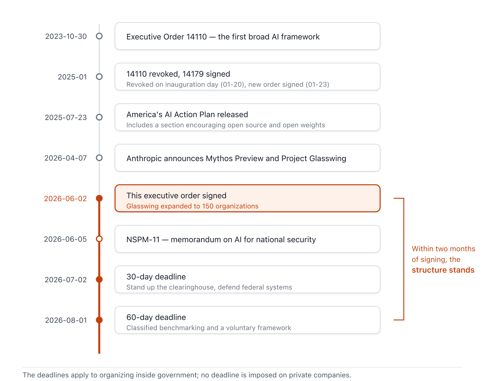
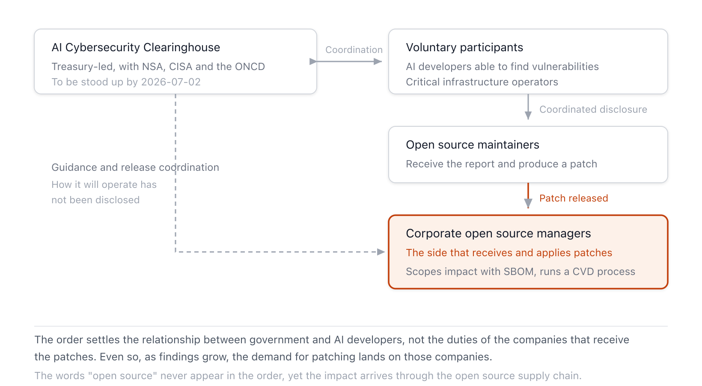

{}
This article was written with Claude Code, and the key facts cited here were cross-checked against primary sources.
{}

> **Summary**
>
> The executive order "Promoting Advanced Artificial Intelligence Innovation and Security," signed on June 2, 2026, imposes no obligations on companies. Its core is the Treasury Department-led AI Cybersecurity Clearinghouse (a relay body that gathers, verifies, and distributes vulnerability information in one place, to be formed within 30 days) and a voluntary pre-sharing framework for frontier models (to be designed within 60 days); mandatory licensing and pre-approval are explicitly excluded [A1](#a1). No provision applies directly to corporate open source managers either. Still, the order is worth reading because of what lies behind it. AI finding open source vulnerabilities faster than humans is already a reality. Before the order, Anthropic's unreleased model found 6,202 high- or critical-severity vulnerabilities in open source projects over two months, and patching has not kept pace [A6](#a6)·[C1](#c1). What open source managers need to prepare for is not executive-order compliance but a response system that can handle a patch-processing capacity check, EOL component cleanup, and the EU Cyber Resilience Act reporting obligations that take effect September 11, 2026 — all at once.

## 1. What the Executive Order Actually Establishes

The executive order consists of five sections, all premised on voluntary cooperation. Section 1 declares a stance of "refusing to stifle innovation through excessive regulation" and an America First approach to cybersecurity, while Section 5 contains standard general provisions. The substantive content sits in the three middle sections [A1](#a1).

Section 2 addresses strengthening federal and private-sector cyber defense. Within 30 days, it prioritizes defense of national security systems, Department of War systems, and federal civilian systems, and on the same timeline the Treasury Secretary, in consultation with the National Cyber Director, the National Security Agency (NSA), and the Cybersecurity and Infrastructure Security Agency (CISA), forms the AI cybersecurity clearinghouse. A clearinghouse originally refers to an interbank institution for clearing checks — a relay body that gathers, verifies, and distributes information from multiple participants in one place. Here, it takes on the role of coordinating software vulnerability scanning through voluntary cooperation with the AI industry and critical infrastructure operators to eliminate duplication, discovering and verifying vulnerabilities, and prioritizing the fixing and distribution of patches [A1](#a1).

Section 3 addresses the safe deployment of frontier models. Within 60 days, it establishes a classified benchmarking procedure to assess AI models' cyberattack capabilities, and the NSA Director determines, based on those results, the threshold for which models qualify as "covered frontier models." Through a voluntary framework, developers consult with the government on whether their models meet the designated criteria, provide the government with model access up to 30 days before the planned public release date, and jointly select trusted partners who will receive early access. Sec. 3(c) explicitly states that nothing in this section establishes mandatory licensing, pre-approval, or permitting requirements for the development, publication, disclosure, or deployment of new AI models [A1](#a1).

Section 4 addresses investigation and enforcement. The Attorney General prioritizes enforcement of existing federal criminal law — including `18 U.S.C. 1030` (Computer Fraud and Abuse Act) — against unauthorized computer access and damage carried out using AI, and other crimes committed in the process [A1](#a1).

**Figure 1.** Policy timeline before and after the executive order *(source: official White House documents)*

Observers describe the choice of lead agency as unexpected. Given that vulnerability coordination is the function at stake, it would seem natural for CISA or the Office of the National Cyber Director to lead, yet the clearinghouse is led by the Treasury Department. The Council on Foreign Relations (CFR) suggested this may be because Treasury is "one of the few agencies with institutional capacity remaining," while the Atlantic Council flagged the risk of overlap with existing vulnerability coordination frameworks [B4](#b4)·[B5](#b5). The key term "covered frontier model" is also left undefined in the text. It will be determined as a result of the classified benchmarking, and WilmerHale expects this definition to be the focus of agency rulemaking over the coming months [B2](#b2).

## 2. Why Now

The direct backdrop to the executive order is Claude Mythos Preview, which Anthropic announced on April 7, 2026. This unreleased model scored 83.1% on the vulnerability-reproduction benchmark CyberGym (up from 66.6% for the prior model), and rather than a general release, Anthropic chose Project Glasswing, opening access only to 12 partners including AWS, Apple, Google, and Microsoft [A6](#a6). In under two months, participating organizations identified more than 10,000 high- or critical-severity vulnerabilities. Anthropic's own scans alone turned up 23,019 issues across more than 1,000 open source projects, of which 6,202 were high or critical severity, and an independent security firm verified a sample of 1,752 and confirmed that more than 90% were genuine vulnerabilities [C1](#c1)·[C2](#c2). Notable examples include a remote crash flaw that had lain dormant in OpenBSD for 27 years, a 16-year-old flaw in FFmpeg that had survived 5 million automated tests, and a privilege-escalation chain in the Linux kernel [A6](#a6).

This process revealed a sharp mismatch between the speed of finding vulnerabilities and the speed of fixing them. Anthropic itself stated that "the bottleneck to fixing these bugs is human capacity to triage, report, and design and ship patches," and as open source maintainers became that bottleneck, it began collaborating with OpenSSF's Alpha-Omega project [C1](#c1)·[C2](#c2). Bruce Schneier assessed that, for now, "discovery for fixing" remains easier than "discovery for exploitation," opening a window favorable to defenders — but that this window is temporary, and an era of automated zero-day discovery will arrive before we finish preparing for it. He also noted, citing the security firm Aisle's reproduction of some results with older, publicly available models, that this capability is not the exclusive property of any one company [C3](#c3).

The executive order is the US government's response to this situation. The clearinghouse is the government's plan to coordinate at a national level what had been done individually in the private sector, as with Glasswing — using AI to find and verify vulnerabilities and coordinate patches [A1](#a1)·[B5](#b5).

## 3. What This Means for Corporate Open Source Managers

### 3.1 A Document That Never Says "Open Source"

Neither the executive order's text nor the White House fact sheet contains the phrase "open source" anywhere [A1](#a1)·[A2](#a2). Viewed favorably, this means there is no regulatory burden. The order imposes no obligations on open source developers or open-weight model distributors, and Sec. 3(c)'s prohibition on licensing covers "development, publication, disclosure, or deployment" of models broadly, so distribution via open weights also falls within its protection [A1](#a1). The administration's official stance is consistent with what was stated in the July 2025 AI Action Plan: the choice between open and closed rests entirely with the developer, and the federal government will foster an environment favorable to open models [A5](#a5).

What remains an open question is the threshold for covered frontier models. Because it is determined through a classified benchmark, it is currently impossible to know what happens if an open-weight model exceeds that threshold. The core mechanism of the voluntary framework — "government access 30 days before release" — is designed for closed models whose release timing can be controlled, and this approach does not translate to open models, whose weights, once released, cannot be recalled. CFR experts have suggested that frontier-level vulnerability-reasoning capability will likely be reproduced in open-weight systems before long, and similar reproduction studies are already being mentioned [B5](#b5). If the capability spreads to open models, the gap in the voluntary pre-sharing design will become apparent, and further regulatory discussion could then target open models. Companies that internally adopt or fine-tune and deploy open-weight models should watch how the benchmarking procedure and subsequent rulemaking, due by August 1, treat open models.

Open source foundations have also stayed quiet so far. As of the search conducted on 2026-06-10, no statement from the Open Source Initiative (OSI), the Linux Foundation, or OpenSSF regarding this executive order could be found. With no obligations imposed, the incentive to respond immediately appears to have been weak. The closest official position is OSI's response to the 2025 AI Action Plan public comment period, submitted in March 2025 [B7](#b7).

### 3.2 Where the Clearinghouse Meets Corporate Vulnerability Management

The clearinghouse's three functions — coordinating scans, discovering and verifying vulnerabilities, and prioritizing patch deployment — overlap precisely with the vulnerability management systems that corporate open source organizations (OSPOs or product security teams) already operate [A1](#a1).

**Figure 2.** Where the corporate open source manager sits in the clearinghouse and vulnerability information flow *(source: Executive Order Sec. 2(d))*

Most companies will encounter the clearinghouse as information consumers. Once it is operational, discovery, verification, and patch-priority information for open source component vulnerabilities will flow through a new channel. This effectively adds a US-originated channel to a company's vulnerability intelligence pipeline and adds a coordinating body that influences patch-priority decisions.

Whether to participate directly in the clearinghouse is a separate decision. Companies in critical infrastructure sectors (energy, finance, healthcare, telecommunications, and the like) are explicitly named as intended participants [A1](#a1). Participation brings early access to vulnerability information, a voice in patch coordination, and access to the government-supported security tools mentioned in Sec. 2(c)(iii). In exchange, participants take on the legal-review burden that comes with information sharing, and, as Crowell & Moring pointed out, face the uncertainty that liability protection for participants is not specified and the consequences of non-participation are not defined either [B3](#b3). As WilmerHale anticipates, if the voluntary provisions migrate into federal procurement standards, there is a scenario where participation becomes a de facto precondition for companies doing business with the US government [B2](#b2). There is no reason to rush a decision before the operational details are published in early July.

### 3.3 The Most Direct Impact: A Surge in Patch Demand and EOL Risk

Changes already underway independent of the executive order are now being accelerated by it. As AI-driven discovery becomes institutionalized at the national level, backed by federal funding (Sec. 2(e)), the volume of reported vulnerabilities in open source components can only grow. The Glasswing figures gave an early preview of that scale.

The first thing companies run into is throughput. As new CVEs multiply across the open source components in a company's own products, triage (impact analysis), patch application, and customer communication must scale up together. Organizations relying on manual triage will be the first to accumulate a backlog.

EOL (End-of-Life) components present a deeper problem. AI scans code indiscriminately, whether or not it is still maintained, but patches require a maintainer. As HeroDevs, a commercial long-term support (LTS) vendor, has pointed out, the gap between discovery speed and fix speed opens widest in EOL software. If components remain in inventory for which discovery is accelerating while a fix will never arrive, that risk only grows over time [C4](#c4). The 27-year-old OpenBSD flaw and the 16-year-old FFmpeg flaw show that the assumption that older, stable components are safer no longer holds [A6](#a6).

Pressure on the upstream side ultimately becomes the company's own risk. Anthropic itself confirmed that open source maintainers are becoming the bottleneck in the flood of reports [C2](#c2). When the maintainer of a core component a company depends on is overwhelmed with triage, it is the company that bears the resulting patch delay. Adding upstream maintenance health (maintainer count, security-response track record, foundation affiliation) as an evaluation criterion for core dependencies, and participating in upstream support such as Alpha-Omega where needed, is a path to reducing that risk.

### 3.4 Contrast with the EU CRA: Handling Voluntary and Mandatory Regimes at Once

The problem the US clearinghouse addresses — discovering and patching software vulnerabilities — is the same area the EU has made mandatory through the Cyber Resilience Act (CRA — Regulation (EU) 2024/2847).

| Category | US Executive Order (2026-06-02) | EU CRA Article 14 (effective 2026-09-11) |
|---|---|---|
| Nature | Voluntary cooperation (company chooses to participate) | Legal obligation (applies immediately upon placing on the EU market) |
| Scope | AI industry, critical infrastructure operators | Manufacturers, importers, and distributors of products with digital elements |
| Key mechanism | Clearinghouse scan coordination and patch deployment coordination | Staged 24-hour/72-hour/14-day reporting of actively exploited vulnerabilities |
| Receiving body | Treasury-led clearinghouse (operational details not yet public) | ENISA's Single Reporting Platform (SRP) and member-state CSIRTs |
| Non-compliance | No penalty (possible shift to procurement standards is still speculative) | Fines up to €15 million or 2.5% of global annual turnover |
| Model regulation | Explicit exclusion of mandatory licensing and pre-approval | CRA is a product-security regulation, not an AI model regulation |

**Table 1.** Comparison of US executive order and EU CRA vulnerability reporting regimes *(sources: original text of the executive order [A1](#a1), Regulation (EU) 2024/2847 [A7](#a7), separate report [D1](#d1). As of 2026-06-10)*

For Korean companies shipping products into both markets, the priority is clear. Whichever regime carries binding force, deadlines, and fines comes first. The CRA Article 14 reporting workflow must be operational by September 11, three months from now, and it has already been confirmed that, because ENISA does not currently offer an SRP integration API, the workflow must be designed as a manual, human-submitted process [A7](#a7)·[D1](#d1). The US clearinghouse comes next. Still, both regimes run on the same underlying internal capabilities — a component inventory (SBOM), vulnerability triage, a Coordinated Vulnerability Disclosure (CVD) intake channel, and a patch deployment process. A system built to prepare for the CRA becomes the foundation for voluntary participation on the US side, so there is no need to build a separate system twice.

### 3.5 Policy Divergence: US Voluntary Cooperation, EU Institutionalization

The day after the executive order, on June 3, the European Commission published its Tech Sovereignty package, placing open source at the center of digital policy. Its core elements are mobilizing roughly €2 billion in public and private funding over seven years, establishing an Open Source Maintenance Instrument, and opening up public procurement [A8](#a8)·[D2](#d2). The two documents, published a day apart, reveal contrasting institutional designs for the same technological landscape. The US model excludes regulation and has government coordinate the private sector's voluntary capacity; the EU model institutionalizes the open source ecosystem itself through public funding and legal obligation (including the CRA's steward regime).

Global companies' open source management policy needs to be built with this divergence as a given. In the US market, they must decide whether to enter the voluntary cooperation channel; in the EU market, they must respond to the obligations of CRA compliance and the steward regime. Since the same team within a company will end up operating both modes, it is more realistic to build market-specific modules on top of shared capabilities than to keep policy documents and response organizations separated by market.

### 3.6 A Different Axis from AI-Generated Code Management

A separate analysis addressing the inflow of AI-generated code into open source and snippet inspection [D3](#d3) and this matter both sit at the intersection of AI and open source management, but along different axes. That analysis addressed inflow management — the licensing and provenance problems that arise when AI coding tools bring code fragments not declared as packages into a codebase. What this executive order points to is operations — the response problem in an environment where vulnerabilities in open source components already present in the codebase are being surfaced faster and in greater volume because of AI. AI is now affecting both the stage where code enters and the stage where vulnerabilities surface, and the response systems for both axes need to be checked separately.

## 4. What to Prepare

Since the executive order makes no direct demands of companies, preparation splits into what to do now and what to watch.

### What to Do Now

The starting point is an inventory of your own AI exposure surface. Bring together, in one place, the models you develop or fine-tune internally (especially open-weight-based ones), the AI coding and security tools you've adopted, and the current state of AI-generated code that has entered your codebase. This puts you in a position to judge quickly, once the covered-frontier-model criteria take shape after August 1, whether your company falls near that boundary.

Also review your open source vulnerability response system. Check whether SBOMs are current across all products, whether new-CVE triage can absorb a two- to three-fold increase in volume, and whether the CVD intake channel is functioning. This review is the same work as preparing for CRA Article 14 (deadline September 11), so there is no need to spin up a separate project — fold it into CRA preparation [D1](#d1).

The most urgent item is cleaning up EOL components. Identify end-of-maintenance components in your SBOM, set a schedule for those with an upgrade path, and for those that cannot be removed immediately, arrange a patch source such as commercial LTS or in-house patching. For items where you can demonstrate no impact, document them using Vulnerability Exploitability eXchange (VEX) to reduce the triage burden [C4](#c4).

Finally, assess the health of critical upstream dependencies. Check the maintainer base size and security-response track record of the upper-level components that your revenue-critical products depend on, and consider support measures such as sponsorship or contribution for projects where a bottleneck is a concern [C2](#c2).

### What to Watch

| Item to track | Timing | What to check |
|---|---|---|
| Clearinghouse formation announcement | By 2026-07-02 | Operating body and participation process, scope of information sharing expected from companies, whether liability protection exists [A1](#a1)·[B3](#b3) |
| Classified benchmarking and voluntary framework | By 2026-08-01 | Contours of the covered-frontier-model threshold, treatment of open-weight models [A1](#a1)·[B2](#b2) |
| Subsequent rulemaking | Over a period of months | Whether voluntary provisions migrate into federal procurement standards [B2](#b2) |
| NSPM-11 classified annex and implementation | By early 2026-09 | Treatment of open source AI in national security procurement [A3](#a3) |
| Open source foundation responses | From July onward | Statements and participation approach from OSI, the Linux Foundation, and OpenSSF [B7](#b7) |
| EU CRA SRP going live | 2026-09-11 | Reporting workflow going into actual operation (tracked in the separate report [D1](#d1)) |

**Table 2.** Items to track and their timing *(as of 2026-06-10)*

## 5. Conclusion

This executive order imposes no new obligations on corporate open source managers, but it is a signal that the premises of the operating environment are shifting. An era in which AI finds open source vulnerabilities in bulk has been demonstrated, and the US government has decided to institutionalize that trend through coordination rather than regulation. Discovery is accelerating while patching still moves at human speed. The only thing companies can control in this gap is the processing capacity of their own inventory. Because the EU CRA reporting obligation taking effect three months from now requires SBOM, triage, and CVD capabilities regardless, preparing for both markets with a single system is the most efficient path. As for the executive order itself, only two dates need to go on the calendar: July 2 (clearinghouse) and August 1 (benchmarking criteria).

---

## References

All URLs were confirmed accessible and matching their cited content on 2026-06-10 (except where noted otherwise).

### A. Primary Sources (Official Government Documents, Direct-Party Statements)

**A1.** The White House (2026). *Promoting Advanced Artificial Intelligence Innovation and Security* (Executive Order). Signed 2026-06-02. <https://www.whitehouse.gov/presidential-actions/2026/06/promoting-advanced-artificial-intelligence-innovation-and-security/> (accessed: 2026-06-10). — *The primary source for this report.* <a href="#a1-ref-1" onclick="event.preventDefault(); history.back(); return false;" title="Back to text">↩</a>

**A2.** The White House (2026). *Fact Sheet: President Donald J. Trump Promotes Advanced Artificial Intelligence Innovation and Security*. 2026-06-02. <https://www.whitehouse.gov/fact-sheets/2026/06/fact-sheet-president-donald-j-trump-promotes-advanced-artificial-intelligence-innovation-and-security/> (accessed: 2026-06-10). <a href="#a2-ref-2" onclick="event.preventDefault(); history.back(); return false;" title="Back to text">↩</a>

**A3.** The White House (2026). *National Security Presidential Memorandum/NSPM-11 — Artificial Intelligence in the National Security Enterprise*. 2026-06-05. <https://www.whitehouse.gov/presidential-actions/2026/06/national-security-presidential-memorandum-nspm-11/> (accessed: 2026-06-10). <a href="#a3-ref-2" onclick="event.preventDefault(); history.back(); return false;" title="Back to text">↩</a>

**A4.** The White House (2025). *Removing Barriers to American Leadership in Artificial Intelligence* (Executive Order 14179). 2025-01-23. <https://www.whitehouse.gov/presidential-actions/2025/01/removing-barriers-to-american-leadership-in-artificial-intelligence/> (accessed: 2026-06-10).

**A5.** The White House (2025). *Winning the Race: America's AI Action Plan*. 2025-07. <https://www.whitehouse.gov/wp-content/uploads/2025/07/Americas-AI-Action-Plan.pdf> (accessed: 2026-06-10, passage confirmed directly against the PDF original). <a href="#a5-ref-2" onclick="event.preventDefault(); history.back(); return false;" title="Back to text">↩</a>

**A6.** Anthropic (2026). *Project Glasswing: Securing critical software for the AI era*. Announced 2026-04-07 (subsequently updated). <https://www.anthropic.com/glasswing> (accessed: 2026-06-10). <a href="#a6-ref-1" onclick="event.preventDefault(); history.back(); return false;" title="Back to text">↩</a>

**A7.** European Parliament and Council (2024). *Regulation (EU) 2024/2847 — Cyber Resilience Act*. OJ L, 2024/2847, 20.11.2024. <https://eur-lex.europa.eu/eli/reg/2024/2847/oj/eng> (accessed: 2026-05-12, confirmed during verification of this workspace's CRA report). <a href="#a7-ref-1" onclick="event.preventDefault(); history.back(); return false;" title="Back to text">↩</a>

**A8.** European Commission (2026). *Communication on European Tech Sovereignty, accompanied by an EU Open Source Strategy*. COM(2026) 503 final, 2026-06-03. <https://digital-strategy.ec.europa.eu/en/library/communication-european-tech-sovereignty-accompanied-eu-open-source-strategy> (accessed: 2026-06-10). <a href="#a8-ref-1" onclick="event.preventDefault(); history.back(); return false;" title="Back to text">↩</a>

### B. Legal and Policy Analysis

**B1.** Wiley Rein LLP (2026). *New AI Executive Order Addresses Frontier Models and Cybersecurity Vulnerabilities*. <https://www.wiley.law/alert-New-AI-Executive-Order-Addresses-Frontier-Models-and-Cybersecurity-Vulnerabilities> (accessed: 2026-06-10).

**B2.** WilmerHale (2026). *New Executive Order Addressing Early Government Access to Frontier AI Models*. 2026-06-02. <https://www.wilmerhale.com/en/insights/client-alerts/20260602-new-executive-order-addressing-early-government-access-to-frontier-ai-models> (accessed: 2026-06-10). <a href="#b2-ref-1" onclick="event.preventDefault(); history.back(); return false;" title="Back to text">↩</a>

**B3.** Crowell & Moring LLP (2026). *Executive Order Creates Voluntary Regulatory Regime of Frontier AI Models*. <https://www.crowell.com/en/insights/client-alerts/executive-order-creates-voluntary-regulatory-regime-of-frontier-ai-models> (accessed: 2026-06-10). <a href="#b3-ref-1" onclick="event.preventDefault(); history.back(); return false;" title="Back to text">↩</a>

**B4.** Atlantic Council (2026). *Reading between the lines of Trump's new executive order on AI*. <https://www.atlanticcouncil.org/dispatches/reading-between-the-lines-of-trumps-new-executive-order-on-ai/> (accessed: 2026-06-10). <a href="#b4-ref-1" onclick="event.preventDefault(); history.back(); return false;" title="Back to text">↩</a>

**B5.** Council on Foreign Relations (2026). *Assessing Trump's Executive Order on AI Oversight*. <https://www.cfr.org/articles/assessing-trumps-executive-order-on-ai-oversight> (accessed: 2026-06-10). <a href="#b5-ref-1" onclick="event.preventDefault(); history.back(); return false;" title="Back to text">↩</a>

**B6.** CSO Online (2026). *OpenAI responds to White House executive order on AI governance*. <https://www.csoonline.com/article/4181294/openai-responds-to-white-house-executive-order-on-ai-governance.html> (accessed: 2026-06-10).

**B7.** Open Source Initiative (2025). *OSI and Apereo Foundation Respond to White House on AI Action Plan*. <https://opensource.org/blog/osi-and-apereo-foundation-respond-to-white-house-on-ai-action-plan> (accessed: 2026-06-10). <a href="#b7-ref-1" onclick="event.preventDefault(); history.back(); return false;" title="Back to text">↩</a>

### C. Industry and Security Community

**C1.** CyberScoop (2026). *Anthropic expanding access to Project Glasswing*. 2026-06-02. <https://cyberscoop.com/anthropic-project-glasswing-expansion-critical-infrastructure-claude-mythos/> (accessed: 2026-06-10). <a href="#c1-ref-1" onclick="event.preventDefault(); history.back(); return false;" title="Back to text">↩</a>

**C2.** Help Net Security (2026). *Anthropic: Claude Mythos identified 10,000+ software flaws*. 2026-05-26. <https://www.helpnetsecurity.com/2026/05/26/anthropic-project-glasswing-update/> (accessed: 2026-06-10). <a href="#c2-ref-1" onclick="event.preventDefault(); history.back(); return false;" title="Back to text">↩</a>

**C3.** Schneier, Bruce (2026). *On Anthropic's Mythos Preview and Project Glasswing*. Schneier on Security, 2026-04. <https://www.schneier.com/blog/archives/2026/04/on-anthropics-mythos-preview-and-project-glasswing.html> (accessed: 2026-06-10). <a href="#c3-ref-1" onclick="event.preventDefault(); history.back(); return false;" title="Back to text">↩</a>

**C4.** HeroDevs (2026). *AI Cybersecurity Executive Order 2026: What It Means for EOL Software*. <https://www.herodevs.com/blog-posts/ai-cybersecurity-executive-order-2026-what-it-means-for-eol-software> (accessed: 2026-06-10). — *Cited with awareness of the vendor's commercial-LTS interest.* <a href="#c4-ref-1" onclick="event.preventDefault(); history.back(); return false;" title="Back to text">↩</a>

### D. Related Analysis (This Blog)

**D1.** [EU Cyber Resilience Act (CRA) Vulnerability Reporting Obligations — Preparing for the 2026-09-11 Effective Date](../2026-eu-cra-vulnerability-reporting/) (updated 2026-06-09). <a href="#d1-ref-1" onclick="event.preventDefault(); history.back(); return false;" title="Back to text">↩</a>

**D2.** [EU Open Source Strategy: Institutionalizing Open Source for Tech Sovereignty](../2026-eu-open-source-strategy/) (2026-06-05). <a href="#d2-ref-1" onclick="event.preventDefault(); history.back(); return false;" title="Back to text">↩</a>

**D3.** [AI-Generated Code: How Far Should Open Source Inspection Go](/blog/20260608_ai_snippet_scan/) (2026-06-08). <a href="#d3-ref-1" onclick="event.preventDefault(); history.back(); return false;" title="Back to text">↩</a>
</content>
