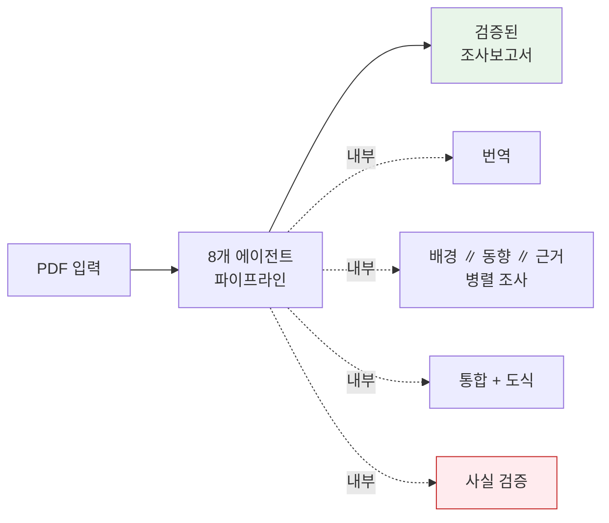

## 들어가며

AI로 글을 빨리 만드는 건 쉬워졌습니다. 신뢰할 만한 글은 여전히 어렵습니다. 환각, 출처 없는 주장, 1차 자료 미확인 — 우리가 익숙한 문제들입니다.

저는 외부 자료(주로 영문 PDF)를 받아 국문으로 정리하고 배경·동향을 보강한 조사보고서를 자주 만듭니다. 한 편에 번역·찾아보기·요약·검증을 다 하면 반나절이 갑니다. 이걸 AI로 자동화하되 결과의 정확성도 함께 보장할 방법을 고민하다가, [Claude Code](https://claude.com/claude-code)의 서브에이전트와 스킬을 조합한 하네스(harness)를 만들었습니다.

이 글은 그 구축 회고입니다. 실제로 환각 1건이 검증에서 잡힌 사례까지 함께 공유합니다.

> 출발점은 [revfactory/harness-100 — 63-research-assistant](https://github.com/revfactory/harness-100/tree/main/ko/63-research-assistant)였습니다. 그 위에 검증 단계와 도식화 에이전트를 추가해 제 용도에 맞췄습니다.

## 무엇을 만들었나

PDF 한 편을 `sources/` 디렉토리에 두고 `/research <파일명>`을 호출하면:



다음 산출물이 자동으로 생성됩니다:

- 국문 번역본 (구조·표·체크박스 보존)
- 배경 조사 (1차 출처 우선)
- 최신 동향 (2024~2026의 위임법·가이던스·업계 반응)
- 참고 자료 카탈로그 (모든 URL 사전 검증)
- **통합 보고서** (Mermaid 도식 포함)
- **검증 보고서** (URL 점검 + 환각 검출 결과)

첫 사례인 [EU CRA 취약점 보고 의무 조사](../2026-eu-cra-vulnerability-reporting/)는 3쪽 PDF 입력에서 약 30분 만에 32KB 보고서가 나왔습니다.

## 하네스 구조

```
research-workspace/
├── sources/                   # 원본 자료 (수정 금지)
├── reports/<slug>/            # 주제별 산출물
│   ├── 00-source.md           # 번역
│   ├── 01-background.md       # 배경
│   ├── 02-trends.md           # 동향
│   ├── 03-references.md       # 근거
│   ├── REPORT.md              # 통합 보고서
│   └── _verification.md       # 검증 결과
├── .claude/
│   ├── CLAUDE.md              # 워크플로우 규약
│   ├── agents/                # 8개 전문 에이전트
│   └── skills/                # 3개 스킬 (오케스트레이터 포함)
```

### 8개 에이전트의 역할 분담

| 에이전트 | 역할 | 비고 |
|---|---|---|
| `research-coordinator` | 파이프라인 총괄, 단계 조율, 품질 점검 | 진입점 |
| `source-translator` | 외국어 → 국문 변환, 전문 용어 병기 | 직렬 |
| `context-researcher` | 배경, 입법 경위, 표준 매핑, 이해관계자 | **병렬** |
| `trend-analyst` | 최신 동향, 가이던스, 업계 반응 | **병렬** |
| `reference-collector` | 1차 출처 카탈로그, URL 사전 검증 | **병렬** |
| `report-synthesizer` | 단계별 산출물을 자립적 보고서로 통합 | 직렬 |
| `diagram-designer` | Mermaid/matplotlib/SVG 도식 생성 | synthesizer가 호출 |
| `fact-checker` | URL 실재성·1차 출처 재확인·환각 패턴 검출 | **별도 컨텍스트** |

각 에이전트는 약 100~200줄의 마크다운 파일(`.claude/agents/<name>.md`)로 정의됩니다. 정의에는 ① 호출 시점, ② 입출력, ③ 규칙·체크리스트, ④ 자기 점검 항목이 포함됩니다.

### 3개 스킬

- `research` — `/research <파일명>`으로 호출되는 메인 트리거. 부분 실행(`--only trends` 등) 지원
- `translate-source` — 번역 표준(문체·용어·구조 보존 규칙)
- `citation-formatter` — 인용·각주·참고문헌 표기 표준 (한국어 환경에 맞춘 카테고리 A~F)

## 핵심 설계 결정

### 결정 1. 병렬 조사를 강제

배경·동향·근거 조사는 한 번의 메시지 안에서 3개 에이전트를 동시 호출합니다. Claude Code의 서브에이전트는 각자 독립적인 컨텍스트를 갖기 때문에, 병렬 실행은 단순히 빠른 것을 넘어 컨텍스트 오염 없는 독립 조사를 만듭니다. 시간이 줄어드는 건 부수 효과고, 더 중요한 건 같은 사실에 대해 세 에이전트가 서로 다른 1차 출처를 가져온다는 점입니다. 자연스럽게 교차 검증이 일어납니다.

### 결정 2. 검증을 별도 컨텍스트로 분리

`report-synthesizer`가 작성한 보고서를 같은 컨텍스트에서 자기 점검하면, 작성 시 만들어진 잘못된 가정이 그대로 유지됩니다. LLM은 자기가 한 번 한 말을 일관성 있게 옹호하는 경향이 있습니다.

`fact-checker`는 완전히 새로운 컨텍스트에서 시작합니다. 보고서를 처음 보는 것처럼 읽고, 모든 인용 URL을 WebFetch로 직접 확인하고, 핵심 사실(시행일·조문·고유명사·통계)을 1차 출처에서 재검색하고, 환각 위험 패턴(너무 깔끔한 인용, 너무 구체적인 통계, 그럴듯하지만 검증 안 된 보고서 제목)을 점검합니다. 판정은 PASS / CONDITIONAL / FAIL로 나뉘고, FAIL이면 자동 재작업(최대 2회)을 트리거합니다.

### 결정 3. 1차 출처 강박

참고 자료는 카테고리 코드로 분류합니다:

- **A** — 법령·규제 원문 (Eur-Lex, 관보 등)
- **B** — 발행 기관 공식 문서 (EC, ENISA 등)
- **C** — 표준·프레임워크 (ISO, NIST 등)
- **D** — 학술·정책 연구
- **E** — 업계·법무법인 분석
- **F** — 언론 (보조)

동일 사실을 다룬 자료가 여럿이면 A>B>C>D>E>F 순으로 인용합니다. 이게 환각 위험이 큰 2차 자료 의존을 구조적으로 줄여줍니다.

### 결정 4. 검증 보고서를 영구 공개

검증은 보고서마다 `_verification.md`로 저장되고, 블로그에 함께 공개됩니다. AI 콘텐츠에 대한 회의가 정당한 이상, **"검증했다"고 말하는 것보다 검증한 내용 자체를 공개하는 것**이 훨씬 설득력이 있습니다. 첫 사례의 [검증 보고서](../2026-eu-cra-vulnerability-reporting/verification/)를 보시면 매 URL을 어떻게 확인했고, 어떤 핵심 사실을 1차 출처에서 재검색했는지 표로 정리되어 있습니다.


## 실제 발생한 환각 1건

첫 보고서를 만들 때 `report-synthesizer`가 작성한 본문에 다음 구절이 있었습니다:

> 2025년 12월 11일 채택된 위임법 (EU) 2026/881은 CSIRT 간 통지의 추가 전파를 지연할 수 있는 조건을 구체화했다. **① 72시간 내 완화조치가 준비될 경우, ② CVD 절차로 수령한 정보, ③ 수신 CSIRT가 사이버 사고 중이거나 보호 역량이 불충분한 경우**다.

위임법 번호(2026/881)·채택일(2025-12-11)·게재일(2026-04-20)은 모두 정확합니다. 그러나 그 사이의 "3개 조건"이 실제 위임법 본문과 달랐습니다.

`fact-checker`가 EC 공식 페이지와 위임법 본문을 검색해 발견한 실제 내용:

> ① 통지된 정보의 성격에 대한 평가에 비추어 정당화되는 경우, ② 수신 CSIRT가 해당 정보의 기밀성을 보장할 수 없는 경우, ③ 단일 보고 플랫폼이 침해되었거나 일시적으로 운영이 불가한 경우.

위임법 자체는 실재하고, 번호·채택일·게재일도 정확하니 일반 독자는 본문도 신뢰하기 쉽습니다. 사이버보안 위임법이라면 충분히 나올 법한 3개 조건이고 "72시간"·"CVD" 같은 익숙한 표현이 들어가 있어 더 자연스럽게 읽힙니다. 동일 컨텍스트에서 자기 점검을 시켰다면 LLM이 그대로 옹호했을 가능성이 큽니다.

별도 컨텍스트의 `fact-checker`만이 이 차이를 발견했습니다. 정확한 출처와 함께 `report-synthesizer`에 수정을 요청해 즉시 정정되었고, 이력은 [검증 보고서](../2026-eu-cra-vulnerability-reporting/verification/)에 영구 보존됩니다.

## 무엇을 배웠나

이 경험에서 일반화할 만한 점이 몇 가지 있습니다.

환각은 메타데이터 사이의 본문에 숨습니다. 번호·날짜·고유명사가 정확하면 그 사이의 내용도 맞을 거라고 신뢰하기 쉬운데, 위임법 사례가 정확히 그랬습니다. URL이 200 OK라는 사실은 시작이지 끝이 아닙니다. URL이 가리키는 페이지 본문이 인용 내용과 실제로 일치하는지까지 확인해야 환각이 잡힙니다. 그래서 별도 컨텍스트의 검증이 결정적이었습니다. 자기 검증은 작성 시 만든 잘못된 가정을 거의 그대로 옹호합니다.

1차 출처 강박은 효과적이지만 충분하지 않습니다. 카테고리 A~F의 우선순위가 2차 자료 의존을 줄여주는 건 사실이고 보고서 톤을 단단하게 만들었습니다. 그러나 1차 출처(예: 위임법 원문)를 직접 읽지 않고 "원문에 따르면"이라고 쓰는 것도 LLM은 할 수 있습니다. WebFetch로 실제 본문을 확인하는 검증이 마지막 안전망이고, 이마저도 100%가 아닙니다. `fact-checker` 자신도 LLM이라서, 검증 보고서를 공개해 독자가 한 번 더 볼 수 있게 하는 것이 차선책입니다.

도식이 가독성을 바꿉니다. `diagram-designer`는 본문 어느 지점이 도식으로 더 잘 표현될지 판단해 Mermaid를 삽입합니다. 텍스트라 diff 추적이 깔끔하고 대부분의 환경에서 자동 렌더링됩니다. 다만 모든 곳에 도식을 넣지 않게 한 것이 중요했습니다. 도식이 흔해지면 시그널이 약해집니다.

## 한계와 다음 단계

이 하네스로 모든 리서치 문제가 풀리지는 않습니다. OCR이 필요한 스캔본은 현재 지원이 약하고, 100쪽 이상의 매우 긴 PDF는 번역 단계의 분할 처리가 길어집니다. 사실 검증도 100%가 아닙니다. 그리고 보고서 시사점의 깊이는 결국 모델 능력에 달려 있어서 — 하네스가 정확성을 보장해주지는 환경별로 최적 전략을 자동으로 만들지는 못합니다.

다음으로 시도해보고 싶은 건 한국 산업·규제 맥락에서의 함의를 더 깊게 다루는 시사점 강화 에이전트, 반복 발행을 위한 publish 자동화(이미 일부 작성 중), 영문 출력 옵션, 보고서마다 실무자가 해야 할 일 체크리스트 자동 추출 정도입니다.

## 하네스 코드

전체 에이전트와 스킬 정의는 GitHub에 공개했습니다 — [haksungjang/research-harness](https://github.com/haksungjang/research-harness). `.claude/agents/`의 8개 정의 파일과 `.claude/skills/`의 4개 스킬, 그리고 워크플로우 규약을 담은 `CLAUDE.md`가 그대로 들어 있습니다. 자신의 워크스페이스에 복사해서 변형해도 됩니다(MIT 라이선스).

핵심을 빠르게 보고 싶다면 검증 단계의 정의(`fact-checker.md`)가 시작점으로 좋습니다. 검증이 어떤 체크리스트를 따르는지 한눈에 들어옵니다.

```markdown
### 1. 인용 URL 실재성 (Critical)
- REPORT.md와 03-references.md의 모든 URL을 WebFetch로 점검
- 응답 정상 + 페이지 제목/도메인이 인용 항목과 일치하는가
- 만료·이동·404 발견 시 FAIL(Critical) 표시

### 2. 인용 내용 일치성 (Critical)
- WebFetch로 출처 페이지 본문을 가져옴
- 본문에 인용된 사실(숫자·날짜·조문 번호·고유명사)이 출처에 실제로 나타나는가
- 핵심 주장(법령 조문, 의무 사항, 시행일)은 1차 출처(A/B)로 재확인
- 불일치 시 Critical, 출처가 약하거나 간접적이면 권장 수정

### 6. 환각 위험 패턴 (High)
- 너무 구체적인 숫자 (출처 없는 "23.7%" 등)
- 존재하지 않을 법한 보고서 제목
- 저자 이름 + 연도 조합으로만 인용된 학술 자료
- URL의 경로가 그럴듯하지만 검증 안 된 경우 (특히 정부 사이트)
- 너무 깔끔한 인용 (실제로는 보고서 제목이 정확히 일치하기 어려움)
```

위 발췌는 전체 `fact-checker.md` 중 검증 체크리스트의 일부입니다. 실제 정의에는 출력 포맷, 수정 처리 방식(직접 수정 vs 작성자에게 반려), 자기 점검 항목까지 포함되어 있습니다 — repo의 [.claude/agents/fact-checker.md](https://github.com/haksungjang/research-harness/blob/main/.claude/agents/fact-checker.md)에서 전체를 볼 수 있습니다.

각 에이전트 정의의 구조는 비슷합니다. 호출 시점, 입출력, 작업 원칙, 자기 점검 체크리스트의 네 가지 블록으로 구성되어 있어 Claude가 일관되게 따를 수 있습니다.

## 마무리

LLM 한 번 호출로는 부족합니다. 역할을 나눈 에이전트와 별도 컨텍스트의 검증이 같이 가야 하고, 그 검증 과정을 공개해야 독자가 신뢰의 근거를 가질 수 있습니다.

이 워크스페이스로 만든 보고서는 [Research 섹션](../)에서 확인하실 수 있습니다. 각 보고서마다 단계별 산출물과 검증 보고서가 함께 공개되어 있습니다. 인용하실 때는 검증 보고서의 URL 점검 결과를 한 번 더 살펴보시기를 권합니다.

---

**관련 자료**

- 하네스 코드: [haksungjang/research-harness](https://github.com/haksungjang/research-harness) (MIT)
- 이 하네스로 만든 첫 보고서: [EU CRA 취약점 보고 의무 — 2026년 9월 11일 대비](../2026-eu-cra-vulnerability-reporting/)
- 그 보고서의 메이킹 페이지: [메이킹](../2026-eu-cra-vulnerability-reporting/meta/)
- 그 보고서의 검증 보고서: [검증 보고서](../2026-eu-cra-vulnerability-reporting/verification/)
- 출발점이 된 레퍼런스 하네스: [revfactory/harness-100 — 63-research-assistant](https://github.com/revfactory/harness-100/tree/main/ko/63-research-assistant)
- Claude Code: [claude.com/claude-code](https://claude.com/claude-code)
