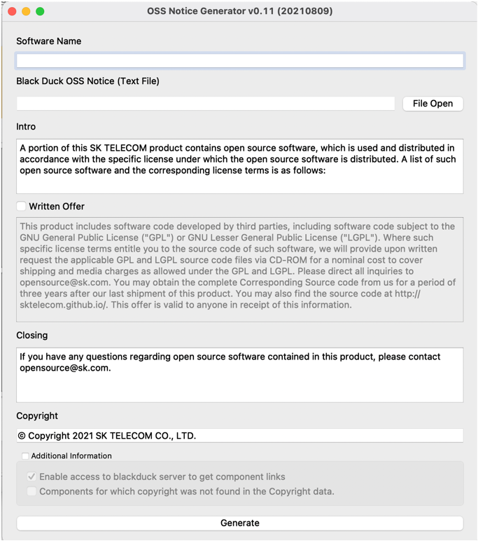
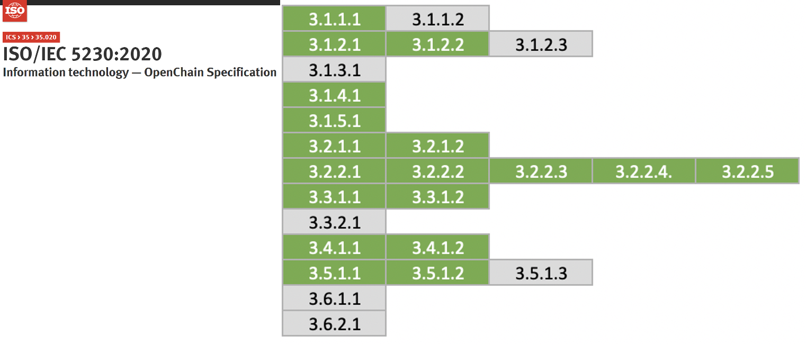

# 6. 도구

LLMS index: [llms.txt](/llms.txt)

---

## 소스 코드 스캔 도구

오픈소스 컴플라이언스 프로세스의 오픈소스 식별 및 검사 단계에서는 소스 코드 스캔 도구를 사용할 수 있다. 소스 코드 스캔 도구는 무료로 사용할 수 있는 오픈소스 기반 도구부터 상용 도구까지 다양하게 있는데, 각 도구는 특장점 들이 있지만 어떤 하나도 모든 문제를 해결할 수 있는 완벽한 기능을 제공하지 않는다. 따라서 기업은 제품의 특성과 요구사항에 맞는 적합한 도구를 선택해야 한다. 

많은 기업이 이러한 자동화된 소스 코드 스캔 도구와 수동 검토를 병행하여 이용한다. Linux Foundation의 [FOSSology](https://haksungjang.github.io/docs/openchain/#fn:24) 프로젝트는 오픈소스로 공개된 소스 코드 스캔 도구로서 기업들이 손쉽게 무료로 사용할 수 있다. 

<figure class="card rounded p-2 td-post-card mb-4 mt-4" style="max-width: 484px">

<figcaption class="card-body px-0 pt-2 pb-0">

<i>https://www.fossology.org/</i>

</figcaption>
</figure>

FOSSology의 설치 및 사용 방법은 [부록 3. 오픈소스 도구](https://haksungjang.github.io/docs/openchain/#1-fossology)를 참고한다.

<figure class="card rounded p-2 td-post-card mb-4 mt-4" style="max-width: 760px">

<figcaption class="card-body px-0 pt-2 pb-0">

<i>https://haksungjang.github.io/docs/openchain/#1-fossology</i>

</figcaption>
</figure>

## Dependency 분석 도구

근래의 소프트웨어 개발 시에는 Gradle, Maven 등 Package Manager를 지원하는 빌드 환경을 사용한다. 이런 빌드 환경에서는 소스 코드가 없어도 빌드 타임에 필요한 Dependency 라이브러리를 원격의 공간으로부터 받아와서 배포용 소프트웨어를 구성한다. 이때의 Dependency 라이브러리는 배포용 소프트웨어에는 포함되지만 소스 코드 스캔 도구로는 검출되지 않는다. 따라서 Dependency 분석을 위한 도구를 활용하는 것도 중요하다. 

오픈소스인 OSS Review Toolkit은 Analyzer라는 Dependency 분석 도구를 제공한다. 

<figure class="card rounded p-2 td-post-card mb-4 mt-4" style="max-width: 650px">

<figcaption class="card-body px-0 pt-2 pb-0">

<i>https://github.com/oss-review-toolkit/ort#analyzer</i>

</figcaption>
</figure>

또한 LG전자는 FOSSLight Dependency Scanner를 오픈소스로 공개하였다. FOSSLight Dependency Scanner는 Gradle, Maven, NPM, PIP, Pub, Cocoapods 등 다양한 Package Manager를 지원한다. 

<figure class="card rounded p-2 td-post-card mb-4 mt-4" style="max-width: 609px">

<figcaption class="card-body px-0 pt-2 pb-0">

<i>https://fosslight.org/ko/scanner/</i>

</figcaption>
</figure>

## 오픈소스 BOM 관리 도구

ISO/IEC 5230 규격의 3.3.1.2에서는 배포용 소프트웨어에 포함된 오픈소스 BOM 목록은 문서화하여 보관할 것을 요구한다. 오픈소스 BOM을 Excel과 같은 Spreadsheet 프로그램으로 관리할 수도 있다. 하지만, 배포용 소프트웨어의 개수와 버전이 수백개가 넘어갈 경우, 이를 수동으로 관리하는 것은 쉽지 않다. 이를 위한 오픈소스 자동화 도구를 도입하는 것이 좋다. 

Eclipse 재단에서 후원하는 오픈소스 프로젝트인 [SW360](https://projects.eclipse.org/proposals/sw360)은 배포용 소프트웨어별로 포함하고 있는 오픈소스 목록을 트래킹할 수 있는 기능을 제공한다. 

SW360의 설치 및 사용 방법은 [부록 3. 오픈소스 도구](https://haksungjang.github.io/docs/openchain/#%EB%B6%80%EB%A1%9D-3-%EC%98%A4%ED%94%88%EC%86%8C%EC%8A%A4-%EB%8F%84%EA%B5%AC)를 참고할 수 있다.

<figure class="card rounded p-2 td-post-card mb-4 mt-4" style="max-width: 910px">

<figcaption class="card-body px-0 pt-2 pb-0">

<i>https://haksungjang.github.io/docs/openchain/#부록-3-오픈소스-도구</i>

</figcaption>
</figure>

그리고 위에서 언급한 LG전자가 공개한 오픈소스인 FOSSLight도 오픈소스 BOM 관리를 위한 기능을 제공한다. 

<figure class="card rounded p-2 td-post-card mb-4 mt-4" style="max-width: 910px">

<figcaption class="card-body px-0 pt-2 pb-0">

<i>https://fosslight.org/fosslight-guide/started/2_try/4_project.html</i>

</figcaption>
</figure>

LG전자는 FOSSLight를 자체 개발하여 지난 수년간 전체 사업부의 배포용 소프트웨어에 대한 오픈소스 BOM을 관리해왔으며, 2021년 6월, 이를 누구나 사용할 수 있도록 오픈소스로 공개하였음을 발표하였다. 

자세한 설치 및 사용 방법을 한국어 가이드로 제공하고 있어서 국내 기업에게 큰 도움이 될 것으로 기대한다. 

<figure class="card rounded p-2 td-post-card mb-4 mt-4" style="max-width: 849px">

<figcaption class="card-body px-0 pt-2 pb-0">

<i>https://fosslight.org/</i>

</figcaption>
</figure>

이와 같은 도구를 도입한다면 ISO/IEC 5230에서 요구하는 다음 입증 자료를 준비할 수 있다.

ISO/IEC 5230

* <b>3.3.1.2 문서화된 절차가 적절히 준수되었음을 보여주는 배포용 소프트웨어에 대한 오픈소스 컴포넌트 기록</b>

| 자체 인증 3.b  | 문서화된 절차가 적절히 준수되었음을 보여주는 배포용 소프트웨어에 대한 오픈소스 컴포넌트 기록이 있습니까? |
|---|:---|
|  | Do you have open source component records for each Supplied Software release which demonstrates the documented procedure was properly followed? |

## 오픈소스 컴플라이언스 산출물 생성

오픈소스 컴플라이언스 산출물 중 오픈소스 고지문을 수작업으로 작성하기 보다는 자동으로 생성하는 도구를 활용하는 것이 좋다. 

FOSSLight에 오픈소스 BOM을 등록하면 자동으로 오픈소스 고지문을 생성할 수 있다. FOSSLight가 생성한 오픈소스 고지문에는 공개할 소스 코드에 대한 Written Offer (서면약정서)도 포함된다. 

<figure class="card rounded p-2 td-post-card mb-4 mt-4" style="max-width: 910px">

<figcaption class="card-body px-0 pt-2 pb-0">

<i>https://fosslight.org/fosslight-guide/started/2_try/4_project.html</i>

</figcaption>
</figure>

또한 SK텔레콤은 사내에서 사용하는 오픈소스 고지문 자동 생성 도구를 오픈소스로 공개할 예정이어서 추후 이를 활용하는 것도 좋은 방법이다. 

## 오픈소스 산출물 보관

기업은 오픈소스 웹사이트를 만들고, 오픈소스 컴플라이언스 산출물을 등록하여 외부 고객들이 배포용 소프트웨어에 대한 오픈소스 고지문과 공개할 소스 코드 패키지를 언제든지 다운받을 수 있도록 편의를 제공하는 것이 좋다. 

SK텔레콤의 오픈소스 웹사이트를 참고할 수 있다. 

<figure class="card rounded p-2 td-post-card mb-4 mt-4" style="max-width: 910px">

<figcaption class="card-body px-0 pt-2 pb-0">

<i>https://sktelecom.github.io/compliance/</i>

</figcaption>
</figure>

특히, 이 웹사이트는 오픈소스로 개발하였고, 소스 코드를 공개하고 있어서 다른 기업들도 쉽게 웹사이트를 구축할 수 있다. 

<figure class="card rounded p-2 td-post-card mb-4 mt-4" style="max-width: 910px">

<figcaption class="card-body px-0 pt-2 pb-0">

<i>https://github.com/sktelecom/sktelecom.github.io</i>

</figcaption>
</figure>

이와 같은 도구 환경을 구축하면 ISO/IEC 5230에서 요구하는 다음 입증 자료를 준비할 수 있다.

ISO/IEC 5230

* <b>3.4.1.2 배포용 소프트웨어의 컴플라이언스 산출물 사본을 보관하기 위한 문서화된 절차</b>
  - 산출물 사본은 배포용 소프트웨어의 마지막 배포 이후 합리적인 기간 동안 혹은 식별된 라이선스에서 요구하는 기간 동안 보관해야 한다(둘 중 더 긴 기간을 따름).
  - 이러한 절차가 올바르게 수행되었음을 입증하는 기록이 존재해야 한다.

| 자체 인증 4.b  | 배포용 소프트웨어의 컴플라이언스 산출물 사본을 보관합니까? |
|---|:---|
|  | Do you archive copies of the Compliance Artifacts of the Supplied Software? |
| <b>자체 인증 4.c</b>  | <b>컴플라이언스 결과물 사본은 적어도 배포용 소프트웨어가 제공되는 중이거나 식별된 라이선스가 요구하는 기간 중 더 긴 시간 동안 보관됩니까?</b> |
|  | Are the copies of the Compliance Artifacts archived for at least as long as the Supplied Software is offered or as required by the Identified Licenses (whichever is longer)? |

이렇게 도구 환경까지 구축하게 되면 ISO/IEC 5230 요구사항을 아래와 같이 준수하게 된다. 

