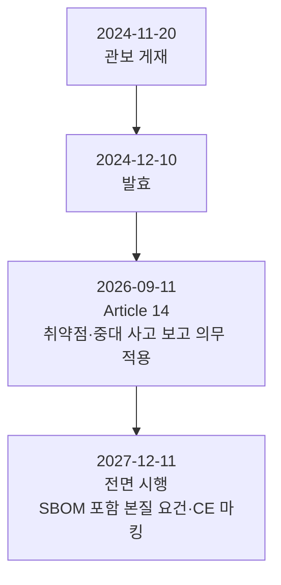

# EU 사이버 복원력법(CRA)

> SBOM을 법적 의무로 규정한 최초의 주요 입법인 EU 사이버 복원력법의 SBOM 요건과 시행 일정을 정리합니다.

---

LLMS index: [llms.txt](/llms.txt)

---

SBOM을 명시적 법적 의무로 규정한 최초의 주요 입법이 EU 사이버 복원력법(Cyber Resilience Act, CRA,
Regulation (EU) 2024/2847)입니다. 미국이 연방 조달이라는 시장을 통해 SBOM을 사실상 강제하는 데 비해,
CRA는 디지털 요소를 갖춘 제품 전반에 수평적으로 적용되는 직접 효력 법률입니다.

## SBOM 의무의 법적 위치

CRA에서 SBOM 의무는 Annex I Part II(취약점 처리 요건) 제(1)항에 있습니다. 제조자는 제품에 포함된
취약점과 구성요소를 식별·문서화해야 하며, 그 수단으로 "통용되는 기계 판독 가능 형식의, 최소한
제품의 최상위 의존성(top-level dependencies)을 포괄하는 소프트웨어 자재 명세서를 작성"할 것을
명시합니다.

실무에서 중요한 두 가지가 미국 경로와 다릅니다.

- **의무 범위가 최상위 의존성이다**: 전체 의존성 트리를 끝까지 펼칠 의무가 아니라, 최소한
  최상위 의존성을 포괄하면 됩니다. 다만 그 이상으로 깊이 작성하는 것이 권장 방향임은 분명합니다.
- 공개 의무가 아니라 보관·제출 의무다: SBOM을 일반 공중에 공개할 의무는 없습니다. 시장 감시
  당국(market surveillance authority)이 이유를 제시해 요청할 때 제출할 수 있도록 보관하면 됩니다.

SBOM 작성이 권고가 아니라 과징금 체계를 갖춘 법적 의무라는 점이 CRA의 핵심입니다.

## 시행 일정

**그림 1.** EU CRA 단계적 시행 일정 *(출처: Regulation (EU) 2024/2847. 수집일 2026-06-14)*

CRA는 2024년 11월 20일 관보에 게재되어 2024년 12월 10일 발효했습니다. 적용은 단계적입니다.
Article 14의 악용 취약점과 중대 사고 보고 의무가 2026년 9월 11일부터, SBOM을 포함한 본질적
사이버보안 요건의 전면 적용이 2027년 12월 11일부터입니다.

## 형식 시행규칙의 부재와 실무 참조점

CRA 차원의 공식 SBOM 형식 시행규칙은 2026년 6월 현재 발표되지 않았습니다. 어떤 스키마와 필드를
써야 CRA에 정합하는지를 EU 전역 구속 규범으로 정한 문서는 아직 없다는 뜻입니다.

현재 실무의 참조점은 독일 연방정보보안청(Bundesamt für Sicherheit in der Informationstechnik, BSI)이
2025년 8월 발간한 기술 가이드라인 TR-03183-2 v2.1.0입니다. 이 문서는 CycloneDX와 SPDX 양쪽에 대해
CRA 정합 SBOM의 구체적 필드 매핑을 제공합니다. 다만 이는 독일 가이드라인이지 EU 전역의 구속력 있는
규범은 아니라는 점에 유의해야 합니다.

## 오픈소스에 대한 고려

CRA는 상업적 활동을 적용 기준으로 삼아, 상업 활동 없이 무상으로 배포되는 비상업 오픈소스를 원칙적으로
제외합니다. 오픈소스 유지보수자에게 제조자 수준의 의무를 그대로 지우지 않으려는 장치입니다. 다만
오픈소스를 제품에 통합해 상업적으로 공급하는 제조자에게는 의무가 그대로 적용되므로, 오픈소스
구성요소의 SBOM을 확보하고 관리하는 일은 여전히 제조자의 몫입니다.

## 출처

European Parliament and Council (2024). *Regulation (EU) 2024/2847 — Cyber Resilience Act*. OJ L,
2024/2847, 20.11.2024. <https://eur-lex.europa.eu/eli/reg/2024/2847/oj/eng>. European Commission,
DG CNECT. *Cyber Resilience Act*. <https://digital-strategy.ec.europa.eu/en/policies/cyber-resilience-act>.
BSI. *Technical Guideline TR-03183-2*. (모두 접속: 2026-06-14)
