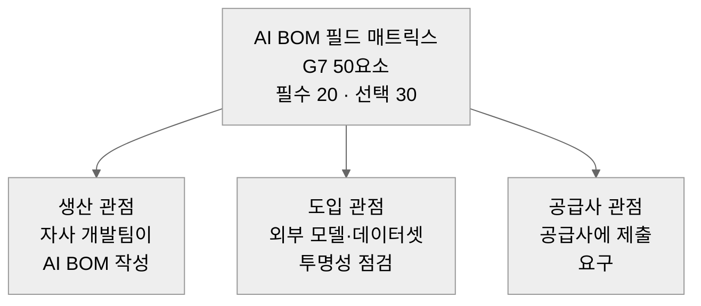

# 기업용 AI BOM 필드 요구사항 매트릭스 — 표준과 규제 근거로 정의한 필수/선택

> G7 「AI를 위한 SBOM 최소 요소」의 50개 요소를 SPDX 3.0.1, CycloneDX 1.6, NTIA 2021, OpenChain AI V1 등 권위 있는 표준과 CRA·AI Act·FDA 규제 근거로 대조해 AI BOM 필드의 필수와 선택을 판정합니다. 같은 매트릭스를 생산·도입·공급사 세 맥락에 적용하는 운영 문서와 도구 세트 전략까지 다섯 부분으로 정리한 시리즈입니다.

---

LLMS index: [llms.txt](/llms.txt)

---

이 글은 Claude Code를 이용해 작성했고, 인용한 핵심 사실은 1차 출처로 교차 검증했습니다.

## 1. 목적과 사용 맥락

기업의 오픈소스 관리 체계는 이미 공급사에 소프트웨어 부품 명세서(Software Bill of Materials, SBOM) 제출을 의무화하고 제출 요구사항을 운영하는 단계에 와 있습니다. AI 시스템은 같은 투명성 요구를 모델과 데이터셋 층위까지 확장해야 하지만, 기존 SBOM 요구사항은 소프트웨어 구성요소만 다루므로 AI 고유 정보를 담지 못합니다. 이 보고서는 AI를 위한 부품 명세서(이하 AI BOM)에 어떤 필드를 필수로, 어떤 필드를 선택으로 요구할지를 국제 표준과 규제 근거로 정의합니다.

판정 대상 필드는 G7 사이버보안 작업반이 발표한 「AI를 위한 SBOM 최소 요소」의 50개 요소입니다. 이 50개를 행으로 두고, 권위 있는 표준 다섯 곳의 요구 강도를 대조해 필수와 선택을 가립니다.

같은 매트릭스를 기업의 세 가지 사용 맥락에서 다르게 적용합니다.

- 생산: 자사 AI 모델 개발팀이 AI BOM을 직접 작성할 때 채워야 하는 필드입니다.
- 도입: 외부 모델이나 데이터셋을 가져와 활용할 때 투명성과 위험을 점검하기 위해 확인해야 하는 필드입니다.
- 공급사 요구: 자사에 AI 모델을 공급하는 공급사에게 제출을 요구할 필드입니다.

**그림 1.** 하나의 필드 매트릭스를 세 가지 사용 맥락에서 적용 *(조사 종합)*

## 2. 방법론

### 2.1 합의 카운트 대상 출처

필드별 필수 여부는 다음 다섯 출처의 요구 강도를 합산해 판정합니다.

- G7 「AI를 위한 SBOM 최소 요소」(BSI와 ACN 공동 주도 G7, 2026): 50개 요소를 모두 "최소 요소"로 권고합니다. 요소 단위로 필수와 선택을 구분하지 않으므로, 본 매트릭스에서 G7은 모든 요소에 "최소 요소로 지정됨" 1표를 부여합니다.
- SPDX 3.0.1: AI 프로파일의 `AIPackage`, Dataset 프로파일의 `DatasetPackage`, Core의 공통 클래스에서 각 속성의 카디널리티(필수 여부)를 명세가 직접 규정합니다.
- CycloneDX 1.6: JSON 스키마의 `required` 배열로 필수 필드를 규정합니다.
- NTIA 「소프트웨어 부품 명세서 최소 요소」(2021): 일반 소프트웨어 SBOM의 일곱 개 기준 데이터 필드를 규정합니다.
- OpenChain AI 적합성 가이드(Version 1, 2025): 프로세스 표준으로 데이터 필드를 규정하지 않으나, 라이선스 의무 절차가 모델과 데이터셋 라이선스의 식별·문서화를 강제합니다.

### 2.2 판정 규칙

필드의 존재 자체를 요구하는 출처가 두 곳 이상이면 필수, 그렇지 않으면 선택으로 판정합니다. G7이 모든 요소에 1표를 주므로, 실제 판정은 "다른 출처 한 곳 이상이 그 필드의 존재를 요구하는가"로 귀결됩니다.

존재를 요구한다는 것은 클래스 수준 필수 카디널리티(SPDX의 `AIPackage`/`DatasetPackage` 필수 속성), 문서 루트 필수(CycloneDX `bomFormat`/`specVersion`), NTIA의 일곱 기준 필드, OpenChain의 shall 수준 프로세스를 뜻합니다. 객체를 생성할 때만 강제되는 조건부 필수(예: 해시 객체 안의 알고리즘과 값, 구성요소 객체 안의 이름)는 "그 객체를 반드시 포함하라"는 요구가 아니므로 존재 요구로 세지 않았습니다. 다만 이런 조건부 필수나 무결성·보안상 가치가 큰 항목은 선택으로 두되 역할별 적용에서 권장으로 표시했습니다.

이 규칙을 적용한 결과, 50개 중 20개가 필수, 30개가 선택입니다.

### 2.3 규제 근거 플래그

구속력 있는 규제가 해당 필드를 건드리는지는 별도 축으로 표시합니다. 합의 카운트에는 넣지 않습니다. 어떤 규제도 AI BOM을 그 이름으로 강제하지 않기 때문입니다. 사이버 복원력법(Cyber Resilience Act, CRA)은 일반 소프트웨어 SBOM을, 인공지능법(AI Act)과 미국 식품의약국(Food and Drug Administration, FDA) 가이던스, 국내 제도는 문서화 의무를 요구합니다. `직접`은 규제가 그 항목을 명시 요구하는 경우, `간접`은 SBOM 항목은 아니나 문서화·취약점 처리 의무가 같은 정보를 사실상 요구하는 경우입니다.

## 3. 합의 결과 개관

클러스터별 필수와 선택 분포는 다음과 같습니다.

| 클러스터 | 요소 수 | 필수 | 선택 |
|---|---|---|---|
| 메타데이터 | 10 | 5 | 5 |
| 시스템 수준 속성 | 9 | 4 | 5 |
| 모델 | 13 | 6 | 7 |
| 데이터셋 속성 | 10 | 5 | 5 |
| 인프라 | 2 | 0 | 2 |
| 보안 속성 | 4 | 0 | 4 |
| 핵심성과지표 | 2 | 0 | 2 |
| 합계 | 50 | 20 | 30 |

필수로 판정된 20개는 모두 식별과 추적의 기반입니다. 누가 만들었고(작성자, 생산자), 무엇인지(이름, 식별자, 버전), 언제 만들었고(타임스탬프), 무엇으로 구성되며(구성요소, 종속 관계, 데이터셋 내용), 어떤 라이선스인지(모델·데이터셋 라이선스)에 해당합니다. 표준 두 곳 이상이 한결같이 이 정보의 존재를 요구합니다.

반면 모델의 상세 속성(아키텍처, 학습 기법, 입출력 특성), 데이터셋의 통계·민감도, 보안 통제, 핵심성과지표는 G7만 최소 요소로 들 뿐 다른 표준이 존재를 강제하지 않아 선택으로 갈립니다. 이 항목들은 합의로는 선택이지만, 도입과 공급사 요구 맥락에서는 투명성·위험 평가에 직접 쓰이므로 역할별로 다시 끌어올립니다.

한 가지 구조적 사실을 짚어 둘 필요가 있습니다. AI 고유 클러스터(모델, 데이터셋)의 필수 판정은 사실상 G7과 SPDX 3.0이 좌우합니다. NTIA는 일반 소프트웨어 SBOM이라 메타데이터와 식별 계통에만 기여하고, OpenChain은 라이선스 외에는 필드를 규정하지 않으며, CycloneDX는 루트 두 필드 외에는 모두 조건부 필수입니다. AI BOM의 필드 수준 표준은 아직 SPDX 3.0의 AI·Dataset 프로파일이 사실상 유일하게 촘촘합니다.

## 4. 필드 매트릭스

표기 약속은 다음과 같습니다. 출처 열은 `필수`(존재 요구), `조건부`(객체 생성 시 강제), `근사`(전용 필드 없이 관계나 일반 속성으로 우회), `선택`, `–`(대응 없음)입니다. OpenChain의 `필수(P)`는 데이터 필드가 아니라 프로세스 강제를 뜻합니다. 역할 열은 `필수`, `권장`, `선택`, `–`이며, 표 폭을 고려해 생산·도입·공급사 역할 열은 §4.6 역할별 적용 요약 표로 분리했습니다.

### 4.1 메타데이터 클러스터

| 요소 | SPDX 3.0 | CycloneDX | NTIA | OpenChain | 합의 판정 | 규제 근거 |
|---|---|---|---|---|---|---|
| SBOM 작성자 | 필수 | 근사 | 필수 | – | 필수 | FDA 직접 |
| SBOM 버전 | – | 선택 | – | – | 선택 | – |
| 데이터 형식 이름 | 암묵 | 필수 | 필수 | – | 필수 | CRA·FDA 간접 |
| 데이터 형식 버전 | 필수 | 필수 | 선택 | – | 필수 | – |
| 작성자 서명 | – | 선택 | – | – | 선택 | 국내 간접 |
| 도구 이름 | 선택 | 조건부 | – | – | 선택 | – |
| 도구 버전 | – | 선택 | – | – | 선택 | – |
| 생성 맥락 | 선택 | 선택 | – | – | 선택 | – |
| SBOM 타임스탬프 | 필수 | 선택 | 필수 | – | 필수 | FDA 직접 |
| 의존성 관계 | 조건부 | 조건부 | 필수 | – | 필수 | CRA·FDA 직접 |

### 4.2 시스템 수준 속성 클러스터

| 요소 | SPDX 3.0 | CycloneDX | NTIA | OpenChain | 합의 판정 | 규제 근거 |
|---|---|---|---|---|---|---|
| 시스템 이름 | 필수 | 조건부 | 필수 | 함의 | 필수 | AI Act·FDA 간접 |
| 시스템 구성요소 | 근사 | 조건부 | 필수 | 함의 | 필수 | FDA 직접, CRA 간접 |
| 시스템 생산자 | 선택 | 조건부 | 필수 | – | 필수 | FDA 직접, AI Act 간접 |
| 시스템 버전 | 선택 | 조건부 | 필수 | – | 필수 | FDA 직접, AI Act 간접 |
| 시스템 타임스탬프 | 선택 | 선택 | – | – | 선택 | – |
| 시스템 데이터 흐름 | – | 선택 | – | – | 선택 | AI Act 간접 |
| 시스템 데이터 사용 | 근사 | 근사 | – | 함의 | 선택 | AI Act·국내 간접 |
| 입출력 속성 | – | 근사 | – | – | 선택 | AI Act 간접 |
| 의도된 응용 분야 | 선택 | 근사 | – | 함의 | 선택 | AI Act·국내 간접 |

### 4.3 모델 클러스터

| 요소 | SPDX 3.0 | CycloneDX | NTIA | OpenChain | 합의 판정 | 규제 근거 |
|---|---|---|---|---|---|---|
| 모델 이름 | 필수 | 조건부 | – | 함의 | 필수 | AI Act 간접 |
| 모델 식별자 | 필수 | 선택 | – | 함의 | 필수 | – |
| 모델 버전 | 필수 | 선택 | – | – | 필수 | AI Act 간접 |
| 모델 타임스탬프 | 필수 | 선택 | – | – | 필수 | AI Act 간접 |
| 모델 생산자 | 필수 | 선택 | – | – | 필수 | AI Act 간접 |
| 모델 설명 | 선택 | 선택 | – | – | 선택 | AI Act·국내 간접 |
| 모델 해시 값 | 조건부 | 조건부 | – | – | 선택 | – |
| 모델 해시 알고리즘 | 조건부 | 조건부 | – | – | 선택 | – |
| 모델 속성 | 선택 | 선택 | – | – | 선택 | AI Act 간접 |
| 입출력 속성 | 근사 | 선택 | – | – | 선택 | AI Act 간접 |
| 학습 속성 | 선택 | 선택 | – | 함의 | 선택 | AI Act·국내 간접 |
| 모델 라이선스 | 근사 | 선택 | – | 필수(P) | 필수 | AI Act 간접 |
| 외부 참조 | 선택 | 조건부 | – | 함의 | 선택 | – |

### 4.4 데이터셋 속성 클러스터

| 요소 | SPDX 3.0 | CycloneDX | NTIA | OpenChain | 합의 판정 | 규제 근거 |
|---|---|---|---|---|---|---|
| 데이터셋 이름 | 필수 | 선택 | – | 함의 | 필수 | AI Act 간접 |
| 데이터셋 설명 | 선택 | 선택 | – | – | 선택 | AI Act·국내 간접 |
| 데이터셋 내용 | 필수 | 선택 | – | – | 필수 | AI Act 간접 |
| 데이터셋 식별자 | 필수 | 선택 | – | – | 필수 | – |
| 데이터셋 해시 | 조건부 | 조건부 | – | – | 선택 | – |
| 데이터셋 출처 | 필수 | 근사 | – | 함의 | 필수 | AI Act·국내 간접 |
| 통계적 속성 | 선택 | 선택 | – | – | 선택 | AI Act 간접 |
| 데이터셋 민감도 | 선택 | 선택 | – | 함의 | 선택 | AI Act·국내 간접 |
| 의존성 관계 | 조건부 | 조건부 | – | 함의 | 선택 | – |
| 데이터셋 라이선스 | 근사 | 선택 | – | 필수(P) | 필수 | – |

### 4.5 인프라, 보안, 핵심성과지표 클러스터

| 요소 | SPDX 3.0 | CycloneDX | NTIA | OpenChain | 합의 판정 | 규제 근거 |
|---|---|---|---|---|---|---|
| 인프라 소프트웨어 | 근사 | 선택 | – | – | 선택 | – |
| 인프라 하드웨어 | – | 선택 | – | – | 선택 | AI Act 간접 |
| 보안 통제 | – | 근사 | – | – | 선택 | CRA·AI Act·FDA 간접 |
| 보안 준수 | 선택 | 선택 | – | – | 선택 | 적합성 평가 간접 |
| 사이버보안 정책 정보 | – | 근사 | – | – | 선택 | CRA 직접 |
| 취약점 참조 | 근사 | 선택 | – | – | 선택 | CRA·FDA 직접 |
| 보안 지표 | 선택 | 선택 | – | – | 선택 | AI Act 간접 |
| 운영 성과 지표 | 선택 | 선택 | – | – | 선택 | AI Act 간접 |

보안 클러스터는 합의로는 전부 선택이지만, 취약점 참조와 사이버보안 정책 정보는 CRA와 FDA가 직접 요구하는 항목입니다. 합의 카운트가 표준의 데이터 필드 규정만 보는 데 비해, 규제는 같은 정보를 의무로 요구합니다. 그래서 이 두 항목은 도입과 공급사 맥락에서 필수나 권장으로 끌어올렸습니다. 규제 근거 플래그가 역할별 적용을 조정하는 대표 사례입니다.

### 4.6 역할별 적용 요약

§4.1~4.5의 합의 판정을 생산·도입·공급사 세 맥락에 적용한 결과를 50개 요소 전체에 대해 한 표로 모았습니다. 역할 열은 `필수`, `권장`, `선택`, `–`입니다.

| 요소 | 합의 판정 | 생산 | 도입 | 공급사 |
|---|---|---|---|---|
| **메타데이터** | | | | |
| SBOM 작성자 | 필수 | 필수 | 권장 | 필수 |
| SBOM 버전 | 선택 | 권장 | 선택 | 권장 |
| 데이터 형식 이름 | 필수 | 필수 | 권장 | 필수 |
| 데이터 형식 버전 | 필수 | 필수 | 권장 | 필수 |
| 작성자 서명 | 선택 | 권장 | 권장 | 권장 |
| 도구 이름 | 선택 | 권장 | 선택 | 권장 |
| 도구 버전 | 선택 | 권장 | 선택 | 선택 |
| 생성 맥락 | 선택 | 권장 | 선택 | 권장 |
| SBOM 타임스탬프 | 필수 | 필수 | 권장 | 필수 |
| 의존성 관계 | 필수 | 필수 | 필수 | 필수 |
| **시스템 수준 속성** | | | | |
| 시스템 이름 | 필수 | 필수 | 필수 | 필수 |
| 시스템 구성요소 | 필수 | 필수 | 필수 | 필수 |
| 시스템 생산자 | 필수 | 필수 | 권장 | 필수 |
| 시스템 버전 | 필수 | 필수 | 필수 | 필수 |
| 시스템 타임스탬프 | 선택 | 권장 | 선택 | 권장 |
| 시스템 데이터 흐름 | 선택 | 권장 | 권장 | 권장 |
| 시스템 데이터 사용 | 선택 | 권장 | 권장 | 권장 |
| 입출력 속성 | 선택 | 권장 | 권장 | 권장 |
| 의도된 응용 분야 | 선택 | 권장 | 권장 | 권장 |
| **모델** | | | | |
| 모델 이름 | 필수 | 필수 | 필수 | 필수 |
| 모델 식별자 | 필수 | 필수 | 필수 | 필수 |
| 모델 버전 | 필수 | 필수 | 필수 | 필수 |
| 모델 타임스탬프 | 필수 | 필수 | 권장 | 권장 |
| 모델 생산자 | 필수 | 필수 | 권장 | 필수 |
| 모델 설명 | 선택 | 권장 | 필수 | 권장 |
| 모델 해시 값 | 선택 | 권장 | 권장 | 권장 |
| 모델 해시 알고리즘 | 선택 | 권장 | 권장 | 권장 |
| 모델 속성 | 선택 | 권장 | 권장 | 권장 |
| 입출력 속성 | 선택 | 권장 | 권장 | 권장 |
| 학습 속성 | 선택 | 권장 | 권장 | 권장 |
| 모델 라이선스 | 필수 | 필수 | 필수 | 필수 |
| 외부 참조 | 선택 | 권장 | 권장 | 권장 |
| **데이터셋 속성** | | | | |
| 데이터셋 이름 | 필수 | 필수 | 필수 | 필수 |
| 데이터셋 설명 | 선택 | 권장 | 권장 | 권장 |
| 데이터셋 내용 | 필수 | 필수 | 권장 | 권장 |
| 데이터셋 식별자 | 필수 | 필수 | 필수 | 필수 |
| 데이터셋 해시 | 선택 | 권장 | 권장 | 권장 |
| 데이터셋 출처 | 필수 | 필수 | 필수 | 필수 |
| 통계적 속성 | 선택 | 권장 | 선택 | 선택 |
| 데이터셋 민감도 | 선택 | 권장 | 필수 | 필수 |
| 의존성 관계 | 선택 | 권장 | 선택 | 선택 |
| 데이터셋 라이선스 | 필수 | 필수 | 필수 | 필수 |
| **인프라·보안·핵심성과지표** | | | | |
| 인프라 소프트웨어 | 선택 | 권장 | 선택 | 권장 |
| 인프라 하드웨어 | 선택 | 선택 | 선택 | 선택 |
| 보안 통제 | 선택 | 권장 | 권장 | 권장 |
| 보안 준수 | 선택 | 권장 | 권장 | 권장 |
| 사이버보안 정책 정보 | 선택 | 권장 | 선택 | 권장 |
| 취약점 참조 | 선택 | 권장 | 필수 | 필수 |
| 보안 지표 | 선택 | 권장 | 권장 | 선택 |
| 운영 성과 지표 | 선택 | 권장 | 선택 | 선택 |

## 5. 역할별 적용 해설

### 5.1 생산 관점

자사 개발팀이 모델을 만들 때는 정보 접근성이 가장 좋으므로 요구 수준을 가장 높게 잡습니다. 합의 필수 20개는 그대로 필수입니다. 더해 모델과 데이터셋의 상세 속성, 해시, 학습 정보처럼 합의로는 선택인 항목도 생산 시에는 권장으로 작성하게 합니다. 생산자가 남기지 않으면 도입자와 공급망 하류가 영영 확보할 수 없는 정보이기 때문입니다.

### 5.2 도입 관점

외부 모델이나 데이터셋을 들여올 때는 투명성과 위험 평가에 직접 쓰이는 필드를 우선합니다. 식별 정보(이름, 식별자, 버전, 생산자)에 더해 모델 설명, 모델·데이터셋 라이선스, 데이터셋 출처, 데이터셋 민감도, 취약점 참조를 필수로 둡니다. 라이선스는 컴플라이언스 위험을, 출처와 민감도는 데이터 적법성과 개인정보 위험을, 취약점 참조는 보안 위험을 판단하는 근거입니다. 합의로는 선택이지만 도입 점검의 핵심이라 필수로 올렸습니다.

### 5.3 공급사 요구 관점

공급사에 제출을 요구하는 범위는 계약으로 강제 가능한 수준을 고려해 합의 필수 20개를 기본으로 합니다. 여기에 모델·데이터셋 라이선스, 데이터셋 출처와 민감도, 취약점 참조를 필수로 더합니다. 기존 소프트웨어 SBOM 공급사 요구사항이 식별과 의존성, 형식 준수를 강제하던 것과 같은 구조를, 모델과 데이터 층위로 확장한 형태입니다.

## 6. 한계와 검증 필요 사항

이 매트릭스의 합의 판정은 표준 명세의 카디널리티와 최소 요소 규정에 근거하며, 규제 근거 플래그는 별도 축입니다. 다음 항목은 1차 출처 접근 제약이 있어 별도 검증을 거쳐야 합니다.

NTIA 최소 요소의 1차 명세(ntia.gov)는 자동 조회가 차단되어 일곱 기준 필드를 공개 미러로 재확인했습니다. CRA Annex I와 AI Act 부속서, FDA 가이던스의 1차 원문(EUR-Lex, fda.gov)도 렌더링·차단 문제로 미러와 검색 집계로 교차 확인했습니다. 국내 AI 기본법의 학습데이터 관련 의무는 조항·항 단위까지 1차 조문으로 대조하지 못해 "간접(조문 미특정)"으로 표시했습니다. 이 항목들은 후속 검증 단계에서 1차 출처로 다시 확인합니다.

SPDX 3.0과 CycloneDX 1.6의 필드 카디널리티는 명세 클래스 정의와 JSON 스키마 원문에서 직접 확인했으므로 신뢰도가 높습니다.

## 7. 출처

주요 1차 출처는 다음과 같습니다.

**A1.** G7 Cybersecurity Working Group (2026). *Software Bill of Materials for AI — Minimum Elements*. BSI와 ACN이 공동 주도하고 그 외 G7 사이버보안 기관과 EU 집행위원회가 공동 발행. — *용도: 50요소 행 골격.*

**A2.** SPDX Project (2024). *System Package Data Exchange (SPDX) Specification, Version 3.0.1* — AI Profile, Dataset Profile, Core. <https://spdx.github.io/spdx-spec/v3.0.1/> — *용도: 모델·데이터셋 필드 카디널리티.*

**A3.** OWASP / ECMA International (2024). *CycloneDX Bill of Materials Specification 1.6* (ECMA-424), JSON 스키마. <https://cyclonedx.org/docs/1.6/json/> — *용도: 스키마 required 필드 판정.*

**A4.** NTIA, U.S. Department of Commerce (2021). *The Minimum Elements For a Software Bill of Materials (SBOM)*. <https://www.ntia.gov/report/2021/minimum-elements-software-bill-materials-sbom> — *용도: 일반 SBOM 최소 요소.*

**A5.** OpenChain Project AI Work Group (2025). *Artificial Intelligence System Bill of Materials — Compliance Management Guide, Version 1*. — *용도: 라이선스 의무 프로세스.*

**A6.** European Parliament and Council (2024). *Regulation (EU) 2024/2847 — Cyber Resilience Act*, Annex I. — *용도: SBOM·취약점 처리 규제 근거.*

**A7.** European Parliament and Council (2024). *Regulation (EU) 2024/1689 — AI Act*, Article 53, Annex IV, XI, XII. — *용도: 문서화와 투명성 규제 근거.*

**A8.** U.S. FDA (2023). *Cybersecurity in Medical Devices: Premarket Submissions*; FD&C Act §524B. — *용도: 의료기기 SBOM 규제 근거.*

**A9.** 과학기술정보통신부·국가정보원·KISA (2026). 「AI 일상화 시대를 준비하는 SW 공급망 보안 강화 로드맵」; 「인공지능 발전과 신뢰 기반 조성 등에 관한 기본법」. — *용도: 국내 제도 규제 근거.*

## 8. 이 시리즈의 구성

이 글은 다섯 부분으로 이어지는 시리즈의 출발점입니다. 위 매트릭스를 세 가지 사용 맥락의 운영 문서로 옮기고, 이를 떠받칠 도구 세트 전략과 검증 결과까지 함께 묶었습니다.

- [공급사 AI BOM 제출 요구사항](/research/2026-ai-bom-requirements/supplier-requirements/) — 공급사에 제출을 요구할 필드와 제출 규약
- [자사 개발팀 AI BOM 작성 지침](/research/2026-ai-bom-requirements/producer-guide/) — 자사 생산팀이 채워야 하는 필수·권장 항목
- [외부 모델과 데이터셋 도입 점검 체크리스트](/research/2026-ai-bom-requirements/ingestion-checklist/) — 외부 모델·데이터셋을 들여올 때의 위험 점검
- [AI BOM 도구 세트 설계 전략](/research/2026-ai-bom-requirements/toolset-strategy/) — 매트릭스를 정책으로 코드화하고 기존 도구와 엮는 전략
- [검증 보고서](/research/2026-ai-bom-requirements/verification/) — 1~3단계 사실 검증 기록

---

Section pages:

- [공급사 AI BOM 제출 요구사항](/research/2026-ai-bom-requirements/supplier-requirements/): 자사에 AI 모델이나 시스템을 공급하는 공급사가 제출해야 하는 AI BOM의 요구사항입니다. 표준 데이터 형식, 필수 포함 정보, 식별자 규칙, 라이선스·출처·민감도 요구를 규정합니다.
- [자사 개발팀 AI BOM 작성 지침](/research/2026-ai-bom-requirements/producer-guide/): 자사 개발팀이 AI 모델이나 시스템을 만들 때 작성해야 하는 AI BOM의 지침입니다. 생산 시점의 정보 접근성을 살려 필수·권장 작성 항목과 무결성·출처 기록 방법을 정리합니다.
- [외부 모델과 데이터셋 도입 점검 체크리스트](/research/2026-ai-bom-requirements/ingestion-checklist/): 외부 AI 모델이나 데이터셋을 가져와 활용할 때 AI BOM을 근거로 투명성과 위험을 점검하는 체크리스트입니다. 식별, 라이선스, 데이터 적법성, 보안 위험을 단계별로 확인합니다.
- [AI BOM 도구 세트 설계 전략](/research/2026-ai-bom-requirements/toolset-strategy/): 7개 도구 범주를 공식 리포지토리와 문서로 조사해, 무엇을 재사용·확장·신규 구축할지와 구축 순서, 매트릭스를 코드화할 정책 스키마, Dependency-Track 통합 아키텍처를 정리합니다.
- [검증 보고서](/research/2026-ai-bom-requirements/verification/): 기업용 AI BOM 필드 요구사항 매트릭스와 운영 문서, 도구 전략(1~3단계)의 사실 검증 기록입니다. 표준 근거, 합의 계산, 규제 축, 도구 단정의 1차 출처 확인 결과를 담습니다.
- [이 시리즈를 만든 과정](/research/2026-ai-bom-requirements/meta/): AI BOM 필드 요구사항 시리즈가 표준 합의 매트릭스, 운영 문서 3종, 도구 세트 전략, 검증과 red-team 검토를 거쳐 만들어진 과정을 정리합니다.
