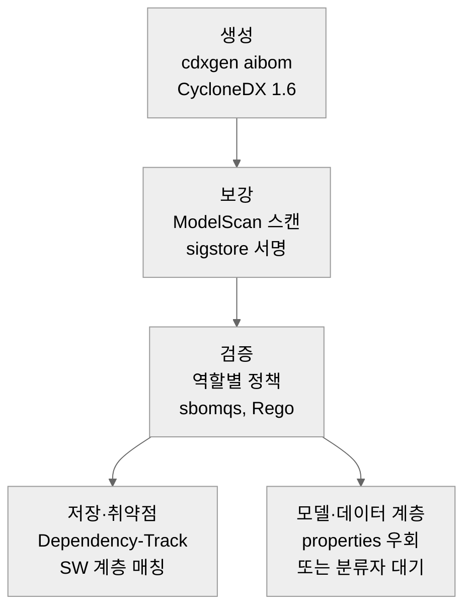

# AI BOM 도구 세트 설계 전략

> 7개 도구 범주를 공식 리포지토리와 문서로 조사해, 무엇을 재사용·확장·신규 구축할지와 구축 순서, 매트릭스를 코드화할 정책 스키마, Dependency-Track 통합 아키텍처를 정리합니다.

---

LLMS index: [llms.txt](/llms.txt)

---

<div class="alert alert-info" role="alert">


이 글은 Claude Code를 이용해 작성했고, 인용한 핵심 사실은 1차 출처로 교차 검증했습니다.
</div>


7개 도구 범주를 공식 리포지토리와 문서로 조사한 결과를 근거로, 무엇을 기존 도구로 재사용하고 무엇을 확장하거나 새로 만들지, 어떤 순서로 구축하며, 매트릭스를 어떤 정책 스키마로 정의할지를 정리합니다. 확보 전략은 미리 정하지 않고 조사 결과로 판단하며, 기존 SBOM 플랫폼(Dependency-Track)을 이미 운영 중이라는 전제를 둡니다.

## 1. 핵심 판단 세 가지

생성과 검증, 저장, 모델 스캔의 표준 경로는 이미 오픈소스로 작동합니다. cdxgen의 `aibom` 명령이 CycloneDX 1.6 AI BOM을 실제로 만들고, sbomqs와 OPA가 필드 적합성을 검사하며, Dependency-Track이 소프트웨어 계층을 받고, ModelScan과 sigstore model-signing이 모델 무결성을 보강합니다. 자체 구축을 처음부터 다 할 필요가 없습니다.

포맷은 CycloneDX 1.6으로 단일화하는 편이 현실적입니다. SPDX 3.0 AI 프로파일은 표현력이 더 풍부하지만 이를 실제로 생성하는 성숙한 도구가 없고, Dependency-Track이 SPDX를 인입하지 못합니다. SPDX 3.0은 표준 추종 대상으로 두되 운영 1차 포맷은 CycloneDX로 잡습니다.

신규 구축이 불가피한 곳은 좁고 분명합니다. AI 고유 필드를 검사하는 정책 계층, 모델과 데이터셋을 1급 객체로 다루는 인벤토리, 라이선스 사용 제한 판정입니다. 나머지는 재사용이나 확장으로 메워집니다.

## 2. 영역별 재사용 판정

| 기능 영역 | 대표 도구 | 판정 | 근거 |
|---|---|---|---|
| AI BOM 생성(CycloneDX) | cdxgen `aibom` | 재사용 | CycloneDX 1.6 AI BOM 자동 생성이 작동(조사 시점 기준 활발히 개발 중) |
| AI BOM 생성(SPDX 3.0) | spdx-tools | 불가 | 3.0이 실험적 쓰기 전용, AI 프로파일 생성 미지원 |
| 심층 필드 자동 추출 | 없음 | 신규 | 데이터셋 통계, 바이어스, 해시, 라이선스를 자동으로 못 채움 |
| 검증·적합성 엔진 | sbomqs, sbom-utility | 재사용 | 범용 필드 존재 검사와 점수화 제공 |
| AI·역할별 적합성 규칙 | 없음 | 신규 | G7 50요소와 역할별 필수 집합을 검사하는 기성 프로파일 부재 |
| 저장소·인벤토리(SW 계층) | Dependency-Track | 재사용 | 소프트웨어 의존성 인벤토리와 영향분석이 성숙 |
| 저장소·인벤토리(모델·데이터 계층) | Dependency-Track | 확장 대기 | `machine-learning-model`과 `data` 분류자, modelCard 미인입(이슈 #4361, 조사 시점 open) |
| 취약점 매칭(SW 의존성) | Dependency-Track, OSV | 재사용 | 이미 연결, ML 라이브러리도 일반 패키지로 매칭 |
| 위험 피드(모델 고유) | huntr, Insights | 확장 | huntr 발급 CVE는 NVD 경유 유입, 직접 커넥터는 없음 |
| 모델 직렬화 스캔 | ModelScan, Fickling | 재사용 | 성숙, JSON 리포트와 종료코드로 CI 삽입 |
| 무결성·서명 | sigstore model-signing | 재사용 | DSSE와 in-toto라 BOM 무결성·출처 필드에 매핑 |
| 데이터 오염 탐지 | 없음(연구 단계) | 추적성으로 대체 | production 도구 부재, 탐지 보증 대신 출처·무결성 기록 |
| 라이선스 식별·표기 | ScanCode, ORT + SPDX/HF 사전 | 재사용+확장 | 엔진은 재사용, AI 라이선스 사전 보강 필요 |
| 라이선스 사용 제한 판정 | 없음 | 신규 | RAIL 계열 행위 제한의 기계 판독·자동 판정 표준 부재 |
| 정책 코드화 | OPA/Rego, sbomqs YAML | 재사용 | 역할별 정책 파일 분리로 매트릭스 표현 |

요약하면 열세 영역 중 일곱은 재사용, 셋은 확장, 셋은 신규입니다. 신규 셋(AI·역할별 적합성 규칙, 모델·데이터 인벤토리, 라이선스 사용 제한 판정)이 이 프로젝트의 고유 가치가 모이는 지점입니다.

## 3. 구축 우선순위

### P0 — 작동하는 최소 파이프라인 (재사용 위주)

가장 먼저 기성 도구를 엮어 끝에서 끝까지 도는 파이프라인을 세웁니다. 생성은 cdxgen `aibom`으로 CycloneDX 1.6을 만들고, 모델 파일은 ModelScan으로 스캔하고 sigstore로 서명하며, 결과를 Dependency-Track에 올려 소프트웨어 계층 취약점과 영향분석을 얻습니다. 검증은 sbomqs custom policy로 필수 필드 존재를 점검합니다. 이 단계는 거의 전부 재사용이라 빠르게 가치를 냅니다.

### P1 — AI 고유 계층 확장

다음으로 신규 가치를 얹습니다. 매트릭스를 정책 스키마로 코드화해 역할별 적합성 검사를 구현하고(4절), 모델과 데이터셋을 CycloneDX `properties`나 외부 참조로 실어 인벤토리 추적성을 확보합니다. 라이선스 파이프라인에 AI 라이선스 사전(RAIL, OpenRAIL, Llama, Gemma, OpenMDW, CDLA)을 보강하고, 모델 위험은 huntr CVE를 NVD 경유로 받습니다.

### P2 — 신규·연구 영역

마지막은 표준과 연구가 더 익어야 하는 부분입니다. 데이터셋 통계나 바이어스 같은 심층 필드의 자동 추출, 라이선스 사용 제한의 자동 판정, 데이터 오염은 탐지 대신 출처와 무결성 추적성으로 다룹니다. SPDX 3.0 생성은 도구 생태계가 성숙하면 합류시키되 지금은 표준 추종 대상으로만 둡니다. Dependency-Track의 모델·데이터 분류자 지원(이슈 #4361)이 들어오면 P1의 우회책을 1급 인벤토리로 승격합니다.

## 4. 정책 스키마 설계

매트릭스의 "요소 × 필수/선택 × 역할"을 기계 판독 정책으로 정의하는 것이 이 도구 세트의 핵심입니다. 조사 결과 어떤 도구도 역할별 필수 집합을 1급 개념으로 갖지 않으므로, 직접 설계합니다. 두 계층으로 나눕니다.

### 4.1 필드 레지스트리

G7 50요소 각각을 CycloneDX 경로(그리고 장래 SPDX 경로)에 매핑하는 표를 한곳에 둡니다. [「AI BOM 필드 요구사항 매트릭스」](/research/2026-ai-bom-requirements/)가 이미 요소별 출처 매핑을 담고 있으므로, 이를 기계 판독용으로 옮기면 다음과 같은 모양입니다.

```yaml
# field-registry.yaml — G7 요소를 BOM 경로에 매핑
model_license:
  g7: 모델 라이선스
  cyclonedx: "components[?type=='machine-learning-model'].licenses"
  spdx: "Relationship(hasDeclaredLicense) from AIPackage"
dataset_provenance:
  g7: 데이터셋 출처
  cyclonedx: "components[?type=='data'].data[].governance"
  spdx: "DatasetPackage.originatedBy / dataCollectionProcess"
vulnerability_referencing:
  g7: 취약점 참조
  cyclonedx: "vulnerabilities[] 또는 externalReferences[?type=='vcs']"
  spdx: "VulnAssessmentRelationship"
```

### 4.2 역할별 정책 파일

생산, 도입, 공급사 각각의 필수 집합을 별도 정책 파일로 둡니다. 매트릭스의 역할 열을 그대로 옮기면 됩니다.

```yaml
# policy/supplier.yaml — 공급사 제출 시 필수 요소 (§4.6 공급사 필수 20개)
required:
  - sbom_author
  - sbom_data_format_name
  - sbom_data_format_version
  - sbom_timestamp
  - sbom_dependency_relationship
  - system_name
  - system_components
  - system_producer
  - system_version
  - model_name
  - model_identifier
  - model_version
  - model_producer
  - model_license
  - dataset_name
  - dataset_identifier
  - dataset_provenance
  - dataset_sensitivity
  - dataset_license
  - vulnerability_referencing
recommended:
  - model_timestamp
  - dataset_content
  - model_hash_value
```

### 4.3 판정 엔진

엔진은 두 가지를 함께 권합니다. 빠른 시작은 sbomqs custom policy(YAML)로, 별도 엔진 학습 없이 역할별 파일을 오늘 바로 운용하고 충족률을 점수로 환산합니다. 표현력이 필요한 곳은 OPA/Rego(conftest)로, 입력 BOM의 역할 값을 보고 필수 집합을 분기합니다. Rego는 필드 레지스트리의 경로를 따라가 존재 여부를 평가하므로 조건부 필수나 교차 필드 일관성까지 표현할 수 있습니다.

```rego
# policy/aibom.rego — 역할별 필수 필드 검사 골격
package aibom

deny[msg] {
    role := input.metadata.properties[_].value  # "supplier" 등
    req := data.policy[role].required[_]
    not field_present(req)
    msg := sprintf("필수 요소 누락: %s (역할: %s)", [req, role])
}
```

OSCAL은 보안 통제 표현용이라 SBOM 필드를 담기에는 과한 도구이고, 검증을 스스로 실행하지 않으므로 채택하지 않습니다. 다만 규제·감사용 상위 산출물(요구사항 카탈로그, 평가 결과 보고)을 연방 친화 포맷으로 남길 필요가 생기면 그때만 고려합니다.

## 5. 참조 아키텍처와 Dependency-Track 통합

AI 시스템의 BOM은 소프트웨어 의존성 계층과 모델·데이터셋 계층으로 갈립니다. Dependency-Track은 앞 계층을 지금 바로 처리하고, 뒤 계층은 아직 1급으로 받지 못합니다(이슈 #4361은 조사 시점에 open 상태이며 추후 변경될 수 있습니다). 그래서 계층을 나눠 통합합니다.



**그림 2.** AI BOM 도구 파이프라인과 계층 분리 *(조사 종합)*

소프트웨어 계층은 추가 작업이 거의 없습니다. cdxgen이 ML 프로젝트의 PyPI나 npm 의존성을 CycloneDX로 만들어 Dependency-Track에 올리면, OSV와 NVD로 취약점을 상관하고 "이 컴포넌트를 쓰는 프로젝트는?" 영향분석까지 제공합니다. huntr가 ML 라이브러리에 발급한 CVE도 NVD를 거쳐 잡힙니다.

모델·데이터셋 계층은 분류자 지원이 올 때까지 우회합니다. 단기로는 모델과 데이터셋을 일반 컴포넌트로 올리되 모델 카드 핵심 필드를 CycloneDX `properties`나 외부 참조로 실어 보존합니다. 검색성은 제한되지만 추적은 됩니다. 모델 파일 고유 위협(안전하지 않은 pickle, 백도어 가중치)은 CVE 매칭 모델에 맞지 않으므로 ModelScan으로 따로 점검하고 그 결과를 정책이나 티켓으로 연계합니다.

## 6. 한계와 검증 필요 사항

이 전략의 도구 사실은 각 프로젝트의 공식 리포지토리와 문서로 확인했습니다. 다음은 채택 전 재확인이 필요합니다.

라이선스 영역에는 표기와 실제의 불일치 위험이 있습니다. 플랫폼에 선언된 라이선스가 모델·데이터셋의 실제 구성요소 라이선스와 어긋나는 이른바 permissive-washing은 잘 알려진 위험이며, 기존 소프트웨어 라이선스 도구가 모델 카드나 데이터셋 카드를 파싱하고 학습 데이터 출처를 추적하지 못한다는 한계와 맞물립니다. 도구 세트는 이를 자동 탐지로 약속하지 않고 선언 라이선스와 산출물의 일치 검증을 신규 구축 대상으로 남겨 둡니다.

Dependency-Track의 모델·데이터 분류자 지원 시점(#4361)은 외부 일정이라 통제할 수 없습니다. P1의 모델·데이터 인벤토리는 이 일정에 의존하므로, 우회책(`properties` 보존)을 기본으로 두고 분류자 지원이 들어오면 승격하는 방식으로 설계해야 합니다.

GUAC의 AI 전용 처리, OSV의 모델 전용 레코드 체계, huntr Insights와 ModelScan 결과를 Dependency-Track이 직접 소비하는 커넥터는 모두 부재로 확인되거나 미확인(unverifiable)입니다. 모델 위험 피드와 SBOM 인벤토리를 잇는 표준은 아직 비어 있어, 이 연계는 자체 글루 코드로 메워야 합니다.

데이터 오염 탐지는 production 도구가 없습니다. 도구 세트에서 오염 자동 탐지를 약속하지 않고, 데이터 출처와 해시, 검증 통과 여부를 기록하는 추적성과 예방 통제로 한정합니다.

## 7. 참고문헌

본문의 도구 판정은 각 프로젝트의 공식 리포지토리와 문서를 1차 출처로 확인했습니다. 접속 시점은 모두 2026-06입니다.

**A1.** CycloneDX / cdxgen 프로젝트. *cdxgen — AI/ML BOM 생성과 `aibom` CLI, `--spec-version`*. <https://github.com/CycloneDX/cdxgen> (접속: 2026-06). — *용도: cdxgen `aibom`이 CycloneDX 1.6 AI BOM을 자동 생성한다는 근거.*

**A2.** CycloneDX. *Machine Learning Bill of Materials (ML-BOM) 역량 소개*. <https://cyclonedx.org/capabilities/mlbom/> (접속: 2026-06). — *용도: CycloneDX 1.6이 `machine-learning-model`과 modelCard를 정의한다는 표준 근거.*

**A3.** SPDX. *SPDX 3.0.1 — AI Profile 사양*. <https://spdx.github.io/spdx-spec/v3.0.1/model/AI/AI/> (접속: 2026-06). — *용도: SPDX 3.0 AI 프로파일이 사양 차원에서 존재한다는 근거(표현력 비교).*

**A4.** SPDX. *tools-python (spdx-tools) — 3.0 실험적 쓰기 전용, 프로덕션 비권장*. <https://github.com/spdx/tools-python> (접속: 2026-06). — *용도: SPDX 3.0 AI 프로파일을 생성하는 성숙한 도구가 부재하다는 근거.*

**A5.** interlynk-io. *sbomqs — 정책 가이드(custom policy, required 타입, feature 점수화)*. <https://github.com/interlynk-io/sbomqs/blob/main/docs/guides/policy.md> (접속: 2026-06). — *용도: sbomqs가 사용자 정의 정책으로 필드 존재를 강제하고 충족률을 점수화한다는 근거.*

**A6.** Open Policy Agent. *Conftest — 구성 파일에 대한 OPA/Rego 정책 평가*. <https://github.com/open-policy-agent/conftest> (접속: 2026-06). — *용도: CycloneDX/SPDX JSON을 Rego로 평가해 역할별 필수 집합을 분기한다는 근거.*

**A7.** OWASP Dependency-Track. *정책 컴플라이언스 문서(조건 종류, regex 값)*. <https://docs.dependencytrack.org/usage/policy-compliance/> (접속: 2026-06). — *용도: Dependency-Track 정책 엔진이 라이선스·취약점·컴포넌트 좌표 중심이며 프로젝트/태그 단위 정책이 가능하다는 근거.*

**A8.** DependencyTrack. *이슈 #4361 — CycloneDX 1.5/1.6 분류자(`machine-learning-model`·`data`) 지원 요청*. <https://github.com/DependencyTrack/dependency-track/issues/4361> (접속: 2026-06). — *용도: Dependency-Track이 모델·데이터 분류자와 modelCard를 아직 인입하지 못한다는 근거(조사 시점 open).*

**A9.** Protect AI. *ModelScan — 모델 직렬화 공격 정적 스캐너(JSON 리포트, 종료코드)*. <https://github.com/protectai/modelscan> (접속: 2026-06). — *용도: 모델 파일 직렬화 스캔이 CI 삽입 가능한 수준으로 성숙했다는 근거.*

**A10.** Sigstore / OpenSSF. *model-transparency (model-signing) — DSSE + in-toto 모델 서명*. <https://github.com/sigstore/model-transparency> (접속: 2026-06). — *용도: 모델 서명·출처 보증이 BOM 무결성·출처 필드에 매핑된다는 근거.*

**A11.** Z. Tian 외 (2025). *Data Poisoning in Deep Learning: A Survey*. <https://arxiv.org/html/2503.22759v1> (접속: 2026-06). — *용도: 데이터 오염 탐지가 여전히 연구 단계이며 범용 production 도구가 없다는 근거.*

**A12.** AboutCode. *ScanCode Toolkit — 라이선스·저작권 텍스트 매칭 엔진*. <https://github.com/aboutcode-org/scancode-toolkit/> (접속: 2026-06). — *용도: 라이선스 식별 엔진을 재사용하되 AI 라이선스 텍스트 보강이 필요하다는 근거.*

**A13.** Responsible AI Licenses (RAIL). *FAQ / BigScience OpenRAIL-M — 파생 전파되는 사용 기반 제한*. <https://www.licenses.ai/faq-2> (접속: 2026-06). — *용도: RAIL 계열의 행위 제한을 기계가 읽고 자동 판정하는 표준이 부재하다는 근거.*

**A14.** LF AI & Data. *Simplifying AI Model Licensing with OpenMDW*. <https://lfaidata.foundation/blog/2025/07/22/simplifying-ai-model-licensing-with-openmdw/> (접속: 2026-06). — *용도: OpenMDW가 모델과 데이터, 가중치를 묶는 허용형 라이선스로 SPDX에 등재됐다는 근거(AI 라이선스 사전 보강 대상).*

**A15.** Protect AI. *huntr — AI와 ML 대상 버그바운티이자 CNA*. <https://huntr.com/> (접속: 2026-06). — *용도: huntr가 발급한 CVE가 NVD를 거쳐 Dependency-Track 매칭에 유입된다는 근거.*

**A16.** Google와 OpenSSF. *OSV.dev — 오픈소스 취약점 데이터베이스*. <https://osv.dev/> (접속: 2026-06). — *용도: OSV가 ML 라이브러리 취약점을 포함하나 모델 가중치 자체 위험은 수록하지 않는다는 근거.*

**A17.** Trail of Bits. *Fickling — pickle 정적 분석 도구*. <https://github.com/trailofbits/fickling> (접속: 2026-06). — *용도: 고위험 pickle 정밀 검사 도구 근거.*

**A18.** OSS Review Toolkit. *ORT — 라이선스 컴플라이언스 오케스트레이션*. <https://github.com/oss-review-toolkit/ort> (접속: 2026-06). — *용도: 정책 룰 엔진과 SBOM 리포터를 재사용한다는 근거.*

**A19.** OpenSSF. *GUAC — SBOM 그래프와 영향분석*. <https://guac.sh/> (접속: 2026-06). — *용도: 영향분석을 보강하는 선택지이며 AI 전용 처리는 미확인이라는 근거.*
