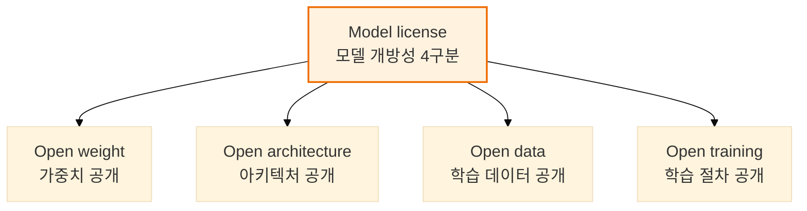
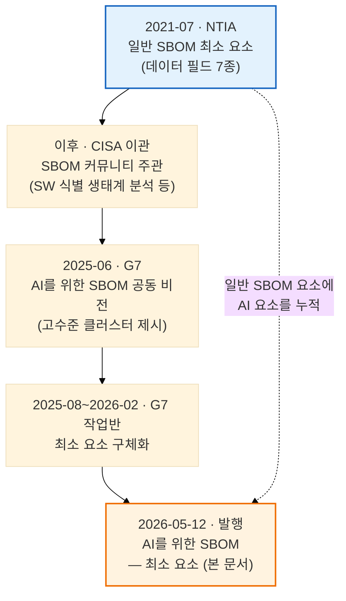

# G7 「AI를 위한 SBOM — 최소 요소」: 클러스터별 요소 단위로 본 AI 공급망 투명성 권고

> G7 사이버보안 작업반이 2026년 5월 12일 발행한 「AI를 위한 SBOM — 최소 요소」를 1차 출처로 분석한다. AI 시스템에 적용할 SBOM이 무엇을 담아야 하는지를 7개 클러스터, 50개 요소 단위로 처음 합의한 G7 공동 지침의 구조와 배경, 규제 정합성, 한국 기업 시사점을 다룬다.

---

LLMS index: [llms.txt](/llms.txt)

---

이 글은 Claude Code를 이용해 작성했고, 인용한 핵심 사실은 1차 출처로 교차 검증했습니다.

> **요약**
> G7 사이버보안 작업반(G7 Cybersecurity Working Group)이 2026년 5월 12일 발행한 「AI를 위한 소프트웨어 부품 명세서 — 최소 요소(Software Bill of Materials for AI — Minimum Elements)」는 AI 시스템에 적용할 SBOM이 무엇을 담아야 하는지를 7개 클러스터, 50개 요소 단위로 처음 합의한 G7 공동 지침입니다. 독일 BSI와 이탈리아 ACN이 공동 주도하고 프랑스 ANSSI, 캐나다 CSE, 미국 CISA, 영국 NCSC, 일본 NCO가 EU 집행위원회와 함께 발행했습니다. 문서는 의무가 아닌 권고이며 새 요건이나 표준, 법령을 만들지 않지만, AI 모델과 데이터셋, 인프라를 일반 SBOM 위에 1급 추적 대상으로 끌어올렸다는 점에서 각국 규제와 공공 조달의 참조점이 됩니다. AI를 도입하고 개발·배포하는 한국 기업과 공급자에게는 EU 인공지능법과 사이버 복원력법 대응 문서의 구성 기준으로 미리 검토할 가치가 있습니다.

## 1. 개요

이 문서는 AI를 위한 SBOM의 최소 요소를 항목 단위로 정의한 첫 번째 G7 합의 문서입니다. 발행 주체는 G7 사이버보안 작업반이며, 실제 공동 발행 기관은 독일 연방정보보안청(Federal Office for Information Security, BSI), 이탈리아 국가사이버보안청(National Cybersecurity Agency, ACN), 프랑스 국가정보시스템보안청(National Cybersecurity Agency, ANSSI), 캐나다 통신보안청(Communications Security Establishment, CSE), 미국 사이버보안·기반시설보안청(Cybersecurity and Infrastructure Security Agency, CISA), 영국 국가사이버보안센터(National Cyber Security Centre, NCSC), 일본 국가사이버통괄실(National Cybersecurity Office, NCO) 일곱 곳입니다. 여기에 유럽연합 집행위원회(European Commission)가 협력 주체로 참여했습니다[C1](#c1)·[C2](#c2). 발행일은 2026년 5월 12일이며, 미국 CISA는 같은 문서를 정보 공유 등급 TLP:CLEAR(자유 배포 가능)로 분류해 공동 발표했습니다[C1](#c1)·[C2](#c2).

작업 흐름은 캐나다(2025)와 프랑스(2026) G7 의장국의 지원 아래 이탈리아 ACN과 독일 BSI가 공동 주도했고, 본문이 밝힌 집필 기간은 2025년 8월부터 2026년 2월까지입니다[C1](#c1). 공식 게시본은 BSI 다운로드 페이지와 CISA 자료실에서 내려받을 수 있습니다[C1](#c1)·[C2](#c2).

문서의 위상은 분명히 권고입니다. 본문은 이 최소 요소가 의무 사항이 아니며 새로운 요건이나 표준, 법령을 만들지 않는다고 명시하고, 제안 목록이 전부를 망라하지 않는 비망라적(non-exhaustive) 기준선이라고 밝힙니다[C1](#c1). 구속력은 없지만 G7 일곱 나라의 사이버보안 당국과 EU 집행위가 합의했다는 점에서, 각국 규제와 공공 조달 요건이 참조할 무게를 가집니다. 적용 범위는 AI 시스템을 만들거나 배포하는 모든 개발자와 배포자이며, 산업과 부문, 관할권에 따라 추가 클러스터나 요소가 필요할 수 있다는 점을 문서 스스로 인정합니다[C1](#c1).

## 2. 핵심 내용: 7개 클러스터와 요소

AI 시스템도 소프트웨어 시스템이므로 SBOM은 AI에도 유효하며, AI를 위한 SBOM의 최소 요소는 일반 SBOM 최소 요소를 대체하지 않고 그 위에 더해집니다[C1](#c1). 문서가 새로 정의한 부분은 구조화된 기록을 일곱 묶음으로 나눈 클러스터(cluster) 체계입니다. 각 클러스터는 AI 시스템 구성요소의 고유한 특징을 포착하는 "요소(element)"를 담습니다. 메타데이터 클러스터는 SBOM 자체에 관한 정보이므로 가장 먼저 제시되고, 나머지 여섯 클러스터는 동등한 비중으로 이어집니다[C1](#c1).

| 클러스터 | 계층 | 요소 | 담는 정보 |
|---|---|---:|---|
| 메타데이터(Metadata) | SBOM 문서 자체 | 10 | 작성자, 버전, 서명, 타임스탬프 등 |
| 시스템 수준 속성(SLP) | AI 시스템 구성 | 9 | 시스템과 데이터 흐름 |
| 모델(Models) | AI 시스템 구성 | 13 | 식별, 가중치, 학습, 라이선스 |
| 데이터셋 속성(DP) | AI 시스템 구성 | 10 | 정체성, 출처, 민감도 |
| 인프라(Infrastructure) | AI 시스템 구성 | 2 | SW 의존성, HW(HBOM) |
| 보안 속성(SP) | AI 시스템 구성 | 4 | 통제, 준수, 취약점 |
| 핵심성과지표(KPI) | AI 시스템 구성 | 2 | 보안과 운영 지표 |
| **합계** | | **50** | 7개 클러스터 |

**표 1.** AI를 위한 SBOM의 7개 클러스터. 메타데이터는 SBOM 문서 자체를 기술하는 계층이고, 나머지 6개 클러스터는 AI 시스템을 구성하는 동등한 정보 영역입니다. 50개 요소가 7개 클러스터에 나뉩니다. *(G7 Software Bill of Materials for AI — Minimum Elements (2026-05-12); 수집 2026-06-22)*

### 2.1 메타데이터(Metadata): SBOM 그 자체의 기록

메타데이터 클러스터는 개별 구성요소가 아니라 AI를 위한 SBOM 자체를 기술합니다[C1](#c1). 작성자(SBOM author), 버전, 데이터 형식 이름과 버전, 작성자 서명, 도구 이름과 버전, 생성 맥락, 타임스탬프, 의존성 관계의 10개 요소로 구성됩니다. 작성자 요소는 SBOM을 생성한 주체를 가리키며, 구성요소를 만든 생산자(Producer)와 구별됩니다. 버전 요소는 시맨틱 버저닝(Semantic Versioning)을 쓸 수 있고, 이 경우 발행 SBOM의 메이저 버전은 1이어야 합니다[C1](#c1)·[B14](#b14). 작성자 서명은 NIST 디지털 서명 표준(Digital Signature Standard, DSS)이나 ISO/IEC 14888-4:2024, ENISA 합의 암호 메커니즘처럼 관련 기관이 승인한 알고리즘을 쓰도록 권고합니다[B1](#b1)·[B3](#b3). 타임스탬프는 RFC 9557을, 식별자 일련번호는 RFC 9562를 따릅니다[B5](#b5)·[B4](#b4).

생성 맥락(SBOM generation context)과 의존성 관계(SBOM dependency relationship) 두 요소가 실무에서 특히 유의할 항목입니다. 생성 맥락은 SBOM이 만들어진 소프트웨어 수명주기 단계를 "빌드 이전(before build)", "빌드(build)", "빌드 이후(after build)" 같은 참조로 표시합니다. 소스 코드에서 만든 SBOM은 빌드 이전, 바이너리 분석 도구가 만든 SBOM은 빌드 이후가 됩니다. 의존성 관계는 단순 포함("includes"/"included in")을 넘어, 특정 구성요소가 다른 소프트웨어에서 대부분 파생되었거나 후손(descendant)임을 표현해 백포팅·포크된 소프트웨어를 명시적으로 기록하게 합니다[C1](#c1).

### 2.2 시스템 수준 속성(SLP): 데이터가 어디로 흐르는가

시스템 수준 속성(System Level Properties, SLP) 클러스터는 AI 시스템 전체를 다룹니다. 분류기, 대규모 언어 모델(large language model, LLM), AI 에이전트 같은 여러 요소로 구성된 시스템의 내부 작동, 소프트웨어 의존성과 프레임워크, 그리고 시스템이 사용자 데이터를 어떻게 처리하고 상호작용하는지를 9개 요소로 포착합니다[C1](#c1). 시스템 이름과 구성요소, 생산자, 버전, 타임스탬프 같은 기본 식별 정보에 더해, 데이터 흐름과 데이터 사용, 입출력 속성, 의도된 응용 분야가 들어갑니다.

가장 특징적인 요소는 시스템 데이터 흐름(System data flow)입니다. 입력/출력 엔드포인트, 출발지에서 목적지로 가는 데이터 정보 흐름 설명, 외부 서비스 API에 더해 다중 에이전트 통신 프로토콜(multi-agent communication protocols)과 외부 서비스로 향하는 양방향 데이터 흐름인 웹 그라운딩(web grounding)을 예시로 명시합니다[C1](#c1). 에이전트 간 통신과 외부 웹 접근을 데이터 흐름 항목으로 끌어들인 점은, 단일 모델이 아니라 외부와 상호작용하는 복합 시스템을 추적 단위로 본다는 신호입니다. 시스템 데이터 사용(System data usage)은 데이터가 모델 성능 개선에 쓰이는지, API 호출이 데이터를 로깅하는지 같은 정보를 기술 문서 링크로 담도록 합니다.

### 2.3 모델(Models): 가중치는 어떻게 만들어졌는가

모델 클러스터는 가장 많은 13개 요소로, AI 시스템이 쓰는 모델을 식별하고 가중치가 어떻게 생성되었는지를 기술합니다[C1](#c1). 이름과 식별자, 버전, 타임스탬프, 생산자 같은 식별 정보, 해시 값과 해시 알고리즘으로 표현하는 무결성, 그리고 모델 속성과 입출력 속성, 학습 속성, 라이선스, 외부 참조로 모델의 성격을 담습니다. 식별자(Model identifier)는 공통 플랫폼 열거(Common Platform Enumeration, CPE)나 Package-URL(PURL)을 우선 식별자로 지정하고, UUID와 커밋 해시, OmniBOR, SWHID 같은 내재적 식별자(intrinsic identifier)도 허용합니다[B6](#b6)·[B7](#b7)·[B9](#b9)·[B10](#b10). 해시 알고리즘은 IANA 해시 함수 텍스트 명칭으로 식별하고 NIST 승인 알고리즘을 쓰도록 합니다[B12](#b12)·[B13](#b13).

모델 학습 속성(Model training properties)은 사전학습과 사후학습·미세조정·지속학습을 아우르며, 비지도/지도/자기지도 학습 유형과 인간 피드백 기반 강화학습, 지시 튜닝, 직접 선호 최적화(Direct Preference Optimization) 같은 강화학습 최적화 유형까지 모델 카드 링크로 기술합니다[C1](#c1).

모델 라이선스(Model license) 요소는 G7 문서의 고유한 기여입니다. 단순히 오픈소스 라이선스 종류를 가리키는 데 그치지 않고, 모델이 open weight, open architecture, open data, open training 중 무엇인지 구분해 명시하도록 요구합니다[C1](#c1).

**그림 1.** 모델 라이선스 요소의 4구분. G7 최소 요소는 모델 라이선스를 단일 표기가 아니라 가중치와 아키텍처, 데이터, 학습 절차 각각의 개방 여부로 명시하도록 요구합니다. *(G7 Software Bill of Materials for AI — Minimum Elements (2026-05-12); 수집 2026-06-22)*

"오픈 모델"이라는 한 단어로 뭉뚱그려지던 개방성을 네 축으로 분해한 것은, 가중치만 공개되고 학습 데이터나 절차는 비공개인 흔한 사례를 SBOM 차원에서 구별하기 위함입니다. 가중치 공개와 학습 데이터 공개는 라이선스와 재현성, 법적 책임 측면에서 전혀 다른 의미를 갖습니다.

### 2.4 데이터셋 속성(DP): 출처와 민감도

데이터셋 속성(Datasets Properties, DP) 클러스터는 모델 수명주기 전반에서 쓰인 데이터셋의 정체성과 출처(provenance)를 10개 요소로 문서화합니다[C1](#c1). 이름과 설명, 내용, 식별자, 해시 같은 기본 정보에, 출처와 통계적 속성, 민감도, 의존성 관계, 라이선스가 더해집니다. 데이터셋 출처(Dataset provenance)는 데이터를 누가 기여했는지, 웹 크롤링인지 상업적 계약인지 같은 수집 방법, 사후처리와 전처리, 라벨링 단계, 합성 데이터(synthetic data)라면 그 생성 방법까지 포착합니다. 데이터셋 민감도(Dataset sensitivity)는 개인식별정보(PII), 자유 접근 데이터, 저작권 보호 데이터, 금융이나 의료 같은 민감 데이터, 국가 안보 관련 데이터 중 무엇을 포함하는지를 표시합니다. 학습 데이터의 법적·윤리적 리스크를 SBOM 항목으로 추적하려는 설계입니다.

### 2.5 인프라(Infrastructure): HBOM으로의 연결

인프라 클러스터는 AI 시스템 운영에 필수적인 물리·가상 인프라를 두 요소로 담습니다[C1](#c1). 인프라 소프트웨어(Infrastructure software)는 펌웨어, 패키지 관리자, 서드파티 라이브러리, 프레임워크, 런타임 환경 같은 의존성을 나열합니다. 인프라 하드웨어(Infrastructure hardware)는 특화된 AI 하드웨어를 직접 기술하는 대신 기존 하드웨어 부품 명세서(Hardware Bill of Materials, HBOM)로의 링크를 의존성으로 연결합니다. 소프트웨어 SBOM이 하드웨어 명세를 직접 흡수하지 않고 HBOM을 참조로 끌어들이는 구조는, GPU 등 AI 가속 하드웨어 추적을 별도 표준에 위임하면서도 연결 고리를 남기는 절충입니다.

### 2.6 보안 속성(SP)과 핵심성과지표(KPI)

보안 속성(Security Properties, SP) 클러스터는 AI 모델·시스템에 적용된 사이버보안 조치를 4개 요소로 다룹니다[C1](#c1). 보안 통제(Security controls)는 암호화와 데이터 최소화, 차분 프라이버시, 접근 통제 같은 일반 통제와, 적대적 강건성 학습(adversarial robustness training), 프롬프트 인젝션(prompt injection) 통제, 학습 데이터 큐레이션 같은 AI 특화 통제를 구분해 나열합니다. 보안 준수(Security compliance)는 취득한 인증과 표준을, 사이버보안 정책 정보는 security.txt 링크를, 취약점 참조(Vulnerability referencing)는 알려진 취약점의 악용 가능성 데이터베이스 링크를 담습니다.

핵심성과지표(Key Performance Indicators, KPI) 클러스터는 일반 SBOM에는 없는 G7 고유 묶음입니다. 보안 지표(Security metrics)는 서드파티 조작에 대한 복원력 같은 보안 벤치마크를, 운영 성과 KPI(Operational performance KPIs)는 시스템 가동시간, 사고 해결 시간, 지연시간, 요청 처리량, 부하 분산을 다룹니다[C1](#c1). 정적인 구성 목록을 넘어 운영 상태와 위협 지표까지 SBOM에 담으려는 시도이며, 동시에 뒤(4장)에서 보듯 측정 일관성 면에서 가장 많은 비판을 받는 영역이기도 합니다.

## 3. 배경과 맥락

이 문서가 지금 나온 이유는 두 갈래 계보가 한 지점에서 만났기 때문입니다. 하나는 미국에서 제도화된 일반 SBOM 최소 요소이고, 다른 하나는 G7이 2025년에 그린 AI를 위한 SBOM 비전입니다.

**그림 2.** AI를 위한 SBOM 최소 요소의 계보. 2021년 일반 SBOM 최소 요소(NTIA, 파란색)를 토대로 AI 고유 요소를 더해 2026년 발행 문서(주황색)에 이른 누적 과정입니다. 점선은 일반 SBOM 요소가 최종 문서에 그대로 포함됨을 나타냅니다. *(NTIA(2021), CISA, G7(2025, 2026) 종합; 2026-06-22)*

일반 SBOM 최소 요소의 기준점은 미국 상무부 통신정보관리청(National Telecommunications and Information Administration, NTIA)이 행정명령 14028의 지시로 2021년 7월 발행한 「The Minimum Elements for a Software Bill of Materials」입니다. 이 문서는 공급자명과 구성요소명, 버전, 고유 식별자, 의존 관계, SBOM 작성자, 타임스탬프의 일곱 데이터 필드를 제시했고, 이후 SBOM 커뮤니티 작업의 주관은 CISA로 이관되었습니다[C7](#c7). G7 문서가 이 계보를 직접 잇고 있다는 증거는 메타데이터 클러스터의 정의 방식에서 드러납니다. 작성자와 버전, 데이터 형식, 타임스탬프, 의존성 관계는 NTIA 데이터 필드를 거의 그대로 AI 맥락에 옮긴 것이고, 모델 식별자가 CPE와 PURL을 우선 식별자로 지정하며 CISA의 「Software Identification Ecosystem Option Analysis」(2023)를 인용하는 대목도 같은 뿌리를 보여줍니다[C6](#c6)·[C7](#c7).

직접적 출발점은 2025년 비전 문서입니다. 「AI를 위한 SBOM에 관한 G7 공동 비전(A shared G7 vision on Software Bill of Materials for AI)」은 2025년 6월 BSI와 ACN이 발행하고 오타와 G7 회의에서 추인되었으며, AI를 위한 SBOM의 개념과 목표, 이점, 속성을 정의하고 일곱 클러스터를 고수준 예시로 제시하는 데 그쳤습니다[C3](#c3). 동시에 전문가들이 각 클러스터를 정교하게 정의하라고 권고했고, 2026년 최소 요소 문서가 그 후속입니다. 비전이 "무엇을 담아야 하는가"의 윤곽이라면, 이번 문서는 "각 클러스터에 어떤 요소를 어떤 정의로 담는가"의 세부입니다[C1](#c1)·[C3](#c3).

차이는 AI 고유 구성요소를 1급 추적 대상으로 끌어들인 데 있습니다. 일반 SBOM이 소프트웨어 구성요소 식별을 겨냥한다면, G7 문서는 모델과 데이터셋, 인프라, 보안 속성, 핵심성과지표 다섯 묶음을 추가합니다. 코드만으로는 학습 과정과 데이터, 모델 거동을 표현할 수 없다는 한계가 이 확장의 이유입니다. 모델 라이선스를 네 축으로 구분하고, 데이터셋 출처가 수집 방법과 합성 데이터 생성 방법까지 포착하도록 한 점이 일반 SBOM에는 없던 항목입니다.

구현 면에서 문서는 형식 중립적입니다. 메타데이터 클러스터에 데이터 형식 이름·버전 요소를 둔 것이 그 증거이며, 실제 구현은 기존 두 BOM 표준이 떠받칩니다. SPDX(System Package Data Exchange)는 리눅스 재단 프로젝트로 3.0(2024년 4월)부터 AI 프로파일과 데이터셋 프로파일을 도입했고, 모델 유형과 아키텍처, 하이퍼파라미터, 자율성 유형, 민감 정보 사용 여부 등을 정의합니다[B15](#b15). CycloneDX(OWASP)는 1.5부터 머신러닝 부품 명세서(Machine Learning Bill of Materials, ML-BOM)를 지원하며 모델 카드(modelCard) 객체로 학습 접근법과 아키텍처, 성능, 윤리적 고려를 담습니다[B16](#b16). G7 문서가 모델 라이선스 예시에서 "SPDX/CDX 파일의 대응 필드를 가리킬 수 있다"고 적은 것은 이 두 포맷을 구현 매개로 전제했음을 보여줍니다[C1](#c1).

## 4. 최신 동향과 검증 과제

발표 직후 한 달여의 반응을 보면, 일곱 클러스터의 방향성에는 대체로 동의가 모였지만 측정과 검증 가능성에서 격차가 드러났습니다. 발표는 BSI, CISA, ANSSI, ACN, CSE, NCSC, NCO가 EU 집행위와 함께 동시 게시하는 형태였고, ANSSI는 2026년 5월 13일 영문 게시에서 이 문서를 "AI를 위한 SBOM에 합리적으로 기대할 수 있는 바에 관한 구체적 지침"으로 소개하며 향후 조정 가능성을 밝혔습니다[A4](#a4). 전문 매체 보도는 5월 13~14일에 집중되었고, 법무법인 Morgan Lewis는 6월 분석에서 이 지침이 자발적·비구속적이라는 점을 강조했습니다[E1](#e1).

측정 가능성에 대한 의문이 논평의 공통 초점이었습니다. CISA의 전 SBOM 책임자 앨런 프리드먼(Allan Friedman)은 일곱 클러스터의 상당 부분을 긍정하면서도 다수가 "구체적이고 조직 간 일관된 방식으로 측정하거나 정의하기조차 어렵다"고 지적했습니다[A6](#a6). Greyhound Research의 Sanchit Vir Gogia는 "최소 요소는 가시성을 만들지만 보증(assurance)을 만들지는 않는다"고 요약했고, Cloudsmith의 Nigel Douglas는 문서가 올바른 요건을 제기하면서도 일곱 데이터 클러스터를 조직 간에 일관되게 측정하기 어렵다는 한계를 함께 짚었습니다[A10](#a10)·[A8](#a8). 보안 위협 분류 프레임워크 TLCTC는 발표 당일 보안 속성(SP) 클러스터를 정면으로 비판하며, 통제 항목을 나열하면서도 각 통제가 어떤 위협에 대응하는지 말하지 않아 감사 가능성이 떨어진다고 지적했습니다[A11](#a11).

표준과 도구 구현은 G7의 일곱 클러스터를 아직 완전히 채우지 못합니다. SPDX 데이터셋 프로파일의 `hasSensitivePersonalInformation`과 `confidentialityLevel`은 G7의 데이터셋 민감도에, `dataCollectionProcess`는 데이터셋 출처에 매핑됩니다[B15](#b15)·[A13](#a13). 반면 메타데이터 클러스터의 작성자 서명과 생성 맥락, KPI 클러스터의 운영 성과 지표(가동시간, 지연시간, 처리량)는 두 표준 어디에도 정형화된 전용 필드가 분명하지 않아 외부 참조나 자유 텍스트로 우회해야 합니다[A13](#a13)·[A16](#a16). SP 클러스터의 AI 특화 통제도 마찬가지로 정형 필드가 미흡합니다.

에이전틱 AI를 둘러싼 G7의 판단과 표준계의 움직임이 엇갈린 점은 특히 주목할 만합니다. 문서의 논의(Discussion) 절은 AI 시스템의 의사결정 수준 또는 자율성(autonomy)을 별도 요소로 넣을지 명시적으로 다뤘습니다. 작업반은 에이전틱 AI(agentic AI)의 빠른 발전으로 이 요소의 중요성이 커질 수 있고 침해(compromise)의 영향 평가에 도움이 될 수 있음을 인정하면서도, 자율성을 별도 요소로 명시하지 않기로 결정했습니다. 이 요소가 관할권마다 안전 요건(safety requirements) 등을 통해 다르게 다뤄질 수 있다는 것이 이유였습니다[C1](#c1)·[A7](#a7). 같은 시기 표준계는 반대로 움직였습니다. 2026년 2월 FOSDEM에서 공개된 SPDX 3.1은 AI 에이전트와 검색 증강 생성(RAG)을 1급 개념으로 추가해, 정책적 합의가 보류한 영역을 데이터 형식이 먼저 어휘로 마련했습니다[A14](#a14). 향후 G7 정교화 작업이 이 표준 어휘를 어떻게 흡수할지가 관전 지점입니다.

규제 정합성은 열린 문제로 남아 있습니다. 발행일에 관해서는 1차 출처인 BSI 게시 페이지가 5월 12일을 명시하며, 일부 매체의 5월 13일 표기는 시간대·게시 시점 차이에서 비롯된 것으로 보입니다[A3](#a3)·[A4](#a4). 자발적 G7 권고와 곧 구속력을 갖는 EU 의무 사이의 필드 매핑이 기업 실무의 다음 과제입니다.

## 5. 한국 독자를 위한 시사점

가장 먼저 확인할 것은 보고 의무가 아니라 문서 구조의 표준화 신호입니다. G7 최소 요소 자체는 어느 나라에서도 직접적인 법적 의무를 부과하지 않습니다[C1](#c1). 그러나 EU 인공지능법(Artificial Intelligence Act)이 고위험 AI 시스템에 Article 11과 Annex IV의 기술문서를 요구하고, 그 의무가 부속서 III 고위험 시스템에 대해 2026년 8월 2일부터 적용됩니다[A1](#a1). Annex IV가 요구하는 구성요소와 데이터, 성능 문서는 G7의 시스템 수준 속성과 모델, 데이터셋 클러스터와 상당 부분 겹칩니다. EU에 AI 제품을 공급하는 한국 기업이라면, G7 클러스터를 기술문서 항목의 점검표로 삼아 누락을 미리 메우는 것이 현실적입니다.

사이버 복원력법(Cyber Resilience Act, CRA)은 SBOM을 직접 명령합니다. Annex I, Part II(1)은 디지털 요소를 가진 제품의 구성요소를 기계 판독 가능한 형식의 SBOM으로 작성하도록 요구하고, 취약점·사고 신고 의무(Article 14)는 2026년 9월 11일부터, 나머지 핵심 요건은 2027년 12월 11일부터 적용됩니다[A2](#a2). G7 문서가 일반 SBOM 위에 AI 요소를 쌓는 구조를 택한 것은 CRA가 만들어 둔 SBOM 의무 기반과 자연스럽게 맞물립니다. AI를 탑재한 제품을 EU에 출시하는 기업은 일반 SBOM(CRA 의무)에 G7 AI 요소를 더하는 2층 구조로 준비하는 편이 효율적입니다.

준비 측면에서 우선순위가 높은 항목은 데이터셋과 모델 라이선스입니다. 데이터셋 출처와 민감도(PII, 저작권, 국가 안보)는 학습 데이터의 법적 리스크와 직결되므로, 외부 모델과 데이터를 가져다 쓰는 조직일수록 공급자에게 이 정보를 요구하는 절차를 갖춰야 합니다. 모델 라이선스의 네 축 구분(가중치, 아키텍처, 데이터, 학습 절차)은 "오픈 모델"을 도입할 때 실제로 무엇이 공개되어 있는지, 재배포와 미세조정, 상업 이용에 어떤 제약이 따르는지를 가르는 기준이 됩니다. 시스템 수준 속성의 데이터 흐름 요소는 에이전트 간 통신과 웹 그라운딩까지 포함하므로, 외부 API와 다중 에이전트를 쓰는 시스템에서는 데이터가 어디로 나가는지 명시하는 일이 곧 규제 대응이자 보안 점검이 됩니다.

리스크와 기회는 같은 자리에 있습니다. 최소 요소가 측정과 검증을 보증하지 않는다는 비판은, 단순히 항목을 채우는 것만으로는 실제 시스템과의 일치가 담보되지 않는다는 경고입니다[A8](#a8)·[A10](#a10). SBOM을 취약점 스캐닝·관리 도구, 보안 권고와 연결하지 않으면 종이 문서에 그친다는 점은 G7 문서 스스로도 강조합니다[C1](#c1). 반대로 이 클러스터 체계를 자산 인벤토리와 공급망 점검에 일찍 접목하면, 이후 EU와 미국 규제가 구체화될 때 전환 비용을 낮추고 공급망 투명성을 차별화 요소로 삼을 수 있습니다.

## 6. 워크스페이스 내 다른 보고서와의 관계

이 보고서는 같은 워크스페이스의 AI BOM 일반론, OpenChain 보고서와 다른 층위를 다룹니다. AI BOM 보고서(reports/ai-bom)는 SBOM의 역사와 AI BOM 일반론, EU 규제 매핑을 폭넓게 다루는 개론과 규제 매핑 층위입니다. OpenChain AI SBOM 보고서(reports/openchain-ai-sbom)는 ISO 5230을 AI로 확장한 컴플라이언스 프로세스, 즉 조직이 SBOM을 어떻게 생성하고 관리할지의 프로세스와 컴플라이언스 층위를 다룹니다. 이 G7 보고서의 고유 가치는 그 사이에 있는 데이터 정의 층위, 곧 SBOM에 정확히 어떤 요소를 어떤 정의로 담아야 하는지의 항목 단위 명세입니다. 세 보고서는 일반론(왜·무엇을), 프로세스(어떻게 관리), 요소 정의(무엇을 정확히 기록)로 서로 보완합니다. AI BOM 도입을 실제로 설계한다면 일반론으로 맥락을 잡고, OpenChain으로 운영 프로세스를 세우며, G7 클러스터로 기록 항목을 채우는 식의 조합이 자연스럽습니다.

## 7. 참고 자료

본문에서 인용한 출처만 정리합니다. 모든 URL은 2026-06-22에 접속해 확인했습니다.

### 법령·규제 (1차)

**A1.** European Parliament and Council (2024). *Regulation (EU) 2024/1689 (Artificial Intelligence Act)*. OJ L, 2024/1689, 12.7.2024. <https://eur-lex.europa.eu/eli/reg/2024/1689/oj/eng> (접속: 2026-06-22; ELI 영구 링크. 고위험 시스템 적용 2026-08-02은 EU 집행위 정책 페이지에서 교차 확인). — *용도: 고위험 AI 기술문서 의무와 G7 클러스터 대응.* <a href="#a1-ref-1" onclick="event.preventDefault(); history.back(); return false;" title="본문으로 돌아가기">↩</a>

**A2.** European Parliament and Council (2024). *Regulation (EU) 2024/2847 (Cyber Resilience Act, CRA)*. OJ L, 2024/2847, 20.11.2024. <https://eur-lex.europa.eu/eli/reg/2024/2847/oj/eng> (접속: 2026-06-22; ELI 영구 링크). Anchore의 CRA SBOM 요건 해설로 Annex I Part II(1) 및 Article 14(2026-09-11)·Annex I(2027-12-11) 적용 일정 보강: <https://anchore.com/sbom/eu-cra/> (접속: 2026-06-22). — *용도: SBOM 작성 의무의 법적 근거와 적용 일정.*

### 표준·규격 (1차) <a href="#a2-ref-1" onclick="event.preventDefault(); history.back(); return false;" title="본문으로 돌아가기">↩</a>

**B1.** National Institute of Standards and Technology (2023). *FIPS 186-5: Digital Signature Standard (DSS)*. February 2023. <https://nvlpubs.nist.gov/nistpubs/FIPS/NIST.FIPS.186-5.pdf> (접속: 2026-06-22). — *용도: 작성자 서명 요소의 승인 알고리즘 근거(원문 각주 4).* <a href="#b1-ref-1" onclick="event.preventDefault(); history.back(); return false;" title="본문으로 돌아가기">↩</a>

**B3.** ISO/IEC (2024). *ISO/IEC 14888-4:2024, Information security — Digital signatures with appendix — Part 4: Stateful hash-based mechanisms*. <https://www.iso.org/standard/80492.html> (접속: 2026-06-22; ISO 페이지는 자동 도구에 403 반환, 표준 번호·표제는 ISO 검색 결과로 확인). — *용도: 작성자 서명 요소의 승인 서명 메커니즘 근거.* <a href="#b3-ref-1" onclick="event.preventDefault(); history.back(); return false;" title="본문으로 돌아가기">↩</a>

**B4.** Internet Engineering Task Force (2024). Davis, K., Peabody, B., Leach, P. *RFC 9562: Universally Unique IDentifiers (UUIDs)*. May 2024. <https://www.rfc-editor.org/rfc/rfc9562.html> (접속: 2026-06-22). — *용도: SBOM version 일련번호 식별자 표준(원문 각주 3).* <a href="#b4-ref-1" onclick="event.preventDefault(); history.back(); return false;" title="본문으로 돌아가기">↩</a>

**B5.** Internet Engineering Task Force (2024). Sharma, U., Bormann, C. *RFC 9557: Date and Time on the Internet: Timestamps with Additional Information*. April 2024. <https://www.rfc-editor.org/rfc/rfc9557.html> (접속: 2026-06-22). — *용도: SBOM timestamp 형식(원문 각주 6).* <a href="#b5-ref-1" onclick="event.preventDefault(); history.back(); return false;" title="본문으로 돌아가기">↩</a>

**B6.** NIST, National Vulnerability Database. *Official Common Platform Enumeration (CPE) Dictionary*. <https://nvd.nist.gov/products/cpe> (접속: 2026-06-22). — *용도: Model identifier 권고 식별자 CPE(원문 각주 8).* <a href="#b6-ref-1" onclick="event.preventDefault(); history.back(); return false;" title="본문으로 돌아가기">↩</a>

**B7.** Ecma International (2025). *ECMA-427: Package-URL (PURL) Specification, 1st Edition*. December 2025. <https://ecma-international.org/publications-and-standards/standards/ecma-427/> (접속: 2026-06-22). — *용도: Model identifier 권고 식별자 PURL(원문 각주 9).* <a href="#b7-ref-1" onclick="event.preventDefault(); history.back(); return false;" title="본문으로 돌아가기">↩</a>

**B9.** OmniBOR Project. *OmniBOR Specification*. <https://omnibor.io/> (접속: 2026-06-22). — *용도: Model identifier 내재적 식별자 예시 OmniBOR(원문 각주 10).* <a href="#b9-ref-1" onclick="event.preventDefault(); history.back(); return false;" title="본문으로 돌아가기">↩</a>

**B10.** SWHID Project. *The SWHID Specification Version 1.2*. <https://www.swhid.org/specification/v1.2/> (접속: 2026-06-22). — *용도: Model identifier 내재적 식별자 예시 SWHID(원문 각주 11).* <a href="#b10-ref-1" onclick="event.preventDefault(); history.back(); return false;" title="본문으로 돌아가기">↩</a>

**B12.** Internet Assigned Numbers Authority. *Named Information Hash Algorithm Registry (Hash Function Textual Names)*. <https://www.iana.org/assignments/named-information/named-information.xhtml> (접속: 2026-06-22). — *용도: Model hash algorithm 식별 권고(원문 각주 12).* <a href="#b12-ref-1" onclick="event.preventDefault(); history.back(); return false;" title="본문으로 돌아가기">↩</a>

**B13.** NIST, Computer Security Resource Center. *Hash Functions (project)*. <https://csrc.nist.gov/projects/hash-functions> (접속: 2026-06-22). — *용도: Model hash algorithm의 NIST 승인 알고리즘 근거(원문 각주 13).* <a href="#b13-ref-1" onclick="event.preventDefault(); history.back(); return false;" title="본문으로 돌아가기">↩</a>

**B14.** Preston-Werner, T. and the SemVer Team (2013). *Semantic Versioning 2.0.0*. <https://semver.org/> (접속: 2026-06-22). — *용도: SBOM version 시맨틱 버저닝(원문 각주 2).* <a href="#b14-ref-1" onclick="event.preventDefault(); history.back(); return false;" title="본문으로 돌아가기">↩</a>

**B15.** SPDX Project. *SPDX 3.0.1 Specification — AI Profile*. Linux Foundation. <https://spdx.github.io/spdx-spec/v3.0.1/model/AI/AI/> (접속: 2026-06-22). — *용도: AI를 위한 SBOM의 데이터 형식 구현, 클러스터 대응.* <a href="#b15-ref-1" onclick="event.preventDefault(); history.back(); return false;" title="본문으로 돌아가기">↩</a>

**B16.** OWASP CycloneDX. *Machine Learning Bill of Materials (ML-BOM / AI-BOM) capabilities*. <https://cyclonedx.org/capabilities/mlbom/> (접속: 2026-06-22). — *용도: AI를 위한 SBOM의 또 다른 구현(ML-BOM·modelCard).*

### 정부·기관 가이던스 및 공식 게시처 (1차) <a href="#b16-ref-1" onclick="event.preventDefault(); history.back(); return false;" title="본문으로 돌아가기">↩</a>

**C1.** G7 Cybersecurity Working Group (2026). *Software Bill of Materials for AI — Minimum Elements* (BSI 공식 게시본). 발행 2026-05-12. <https://www.bsi.bund.de/SharedDocs/Downloads/EN/BSI/KI/SBOM-for-AI_minimum-elements.html> (접속: 2026-06-22; PDF 직접 링크 <https://www.bsi.bund.de/SharedDocs/Downloads/EN/BSI/KI/SBOM-for-AI_minimum-elements.pdf>). — *용도: 보고서 원본. 모든 클러스터·요소 정의의 1차 근거.* <a href="#c1-ref-1" onclick="event.preventDefault(); history.back(); return false;" title="본문으로 돌아가기">↩</a>

**C2.** G7 Cybersecurity Working Group / CISA et al. (2026). *Software Bill of Materials for AI — Minimum Elements* (TLP:CLEAR, CISA 공동 게시본). 발행 2026-05-12. <https://www.cisa.gov/resources-tools/resources/software-bill-materials-ai-minimum-elements> (접속: 2026-06-22; CISA 페이지는 자동 도구에 403 반환, 게시 사실과 날짜, TLP:CLEAR 분류, 7개 클러스터는 검색 결과와 WaterISAC 공지로 교차 확인). — *용도: 미국 공식 게시본, TLP:CLEAR 배포 사실, 공동 발행 기관 확인.* <a href="#c2-ref-1" onclick="event.preventDefault(); history.back(); return false;" title="본문으로 돌아가기">↩</a>

**C3.** G7 Cybersecurity Working Group (2025). *A shared G7 vision on Software Bill of Materials for AI* (Shared G7 Vision, 2025-06). ACN 게시. <https://www.acn.gov.it/portale/documents/d/guest/paper_sbom-for-ai_19may2025_-clean-2> (접속: 2026-06-22). — *용도: 선행 비전 문서, 7개 클러스터 최초 제안(원문 각주 1).* <a href="#c3-ref-1" onclick="event.preventDefault(); history.back(); return false;" title="본문으로 돌아가기">↩</a>

**C6.** Cybersecurity and Infrastructure Security Agency (2023). *Software Identification Ecosystem Option Analysis*. 2023-10-26. <https://www.cisa.gov/sites/default/files/2023-10/Software-Identification-Ecosystem-Option-Analysis-508c.pdf> (접속: 2026-06-22; CISA 사이트는 자동 도구에 403 반환, 문서 존재·날짜는 원문 각주 7과 일치). — *용도: Model identifier 소프트웨어 식별 생태계 근거(원문 각주 7).* <a href="#c6-ref-1" onclick="event.preventDefault(); history.back(); return false;" title="본문으로 돌아가기">↩</a>

**C7.** National Telecommunications and Information Administration (2021). *The Minimum Elements for a Software Bill of Materials (SBOM)*. 2021-07-12. <https://www.ntia.gov/sites/default/files/publications/sbom_minimum_elements_report_0.pdf> (접속: 2026-06-22; 자동 도구 접속 시 인증서 오류, 대체 게시처 <https://www.ntia.doc.gov/report/2021/minimum-elements-software-bill-materials-sbom>). — *용도: AI를 위한 SBOM이 토대로 삼는 일반 SBOM 최소 요소.*

### 업계·법무법인 분석 및 언론 (보조, 1차 교차 확인 전제) <a href="#c7-ref-1" onclick="event.preventDefault(); history.back(); return false;" title="본문으로 돌아가기">↩</a>

**A3.** BSI (2026). *Software Bill of Materials (SBOM) for Artificial Intelligence — Minimum Elements* (게시 페이지). 발행일 2026-05-12 명시. <https://www.bsi.bund.de/SharedDocs/Downloads/EN/BSI/KI/SBOM-for-AI_minimum-elements.html> (접속: 2026-06-22). — *용도: 발행일 1차 확인.* <a href="#a3-ref-1" onclick="event.preventDefault(); history.back(); return false;" title="본문으로 돌아가기">↩</a>

**A4.** ANSSI (2026). *Software bill of materials (SBOM) for artificial intelligence* (영문 게시, 2026-05-13). <https://cyber.gouv.fr/en/publications/jointly-led-international-publications/software-bill-of-materials-sbom-for-artificial-intelligence/> (접속: 2026-06-22). — *용도: 발행 기관 1차 논평.* <a href="#a4-ref-1" onclick="event.preventDefault(); history.back(); return false;" title="본문으로 돌아가기">↩</a>

**A6.** Infosecurity Magazine (2026-05-13). *Global Cyber Agencies Issue New SBOMs for AI Guidance*. <https://www.infosecurity-magazine.com/news/new-sboms-for-ai-guidance-2026/> (접속: 2026-06-22). — *용도: 프리드먼 논평 인용.* <a href="#a6-ref-1" onclick="event.preventDefault(); history.back(); return false;" title="본문으로 돌아가기">↩</a>

**A7.** Industrial Cyber (2026-05-13). *CISA, G7 partners release SBOM for AI guidance...* <https://industrialcyber.co/sbom/cisa-g7-partners-release-sbom-for-ai-guidance-to-boost-ai-supply-chain-transparency-and-cybersecurity-resilience/> (접속: 2026-06-22). — *용도: 클러스터·자율성 논의 보도.* <a href="#a7-ref-1" onclick="event.preventDefault(); history.back(); return false;" title="본문으로 돌아가기">↩</a>

**A8.** SecurityWeek (2026-05-14). *G7 Countries Release AI SBOM Guidance*. <https://www.securityweek.com/g7-countries-release-ai-sbom-guidance/> (접속: 2026-06-22). — *용도: Douglas(Cloudsmith) 논평.* <a href="#a8-ref-1" onclick="event.preventDefault(); history.back(); return false;" title="본문으로 돌아가기">↩</a>

**A10.** CIO (2026-05-13). *CISA's AI SBOM guidance pushes software supply-chain oversight into new territory*. <https://www.cio.com/article/4170711/cisas-ai-sbom-guidance-pushes-software-supply-chain-oversight-into-new-territory-2.html> (접속: 2026-06-22). — *용도: 측정·검증 격차 전문가 인용(Gogia 등).* <a href="#a10-ref-1" onclick="event.preventDefault(); history.back(); return false;" title="본문으로 돌아가기">↩</a>

**A11.** TLCTC (2026-05-12). *The Control Fixation in the Security Properties — A TLCTC critique of G7 SBOM-for-AI*. <https://www.tlctc.net/sbom-for-ai-control-fixation.html> (접속: 2026-06-22; WebFetch 403, 검색 캐시로 확인). — *용도: SP 클러스터 비판.* <a href="#a11-ref-1" onclick="event.preventDefault(); history.back(); return false;" title="본문으로 돌아가기">↩</a>

**A13.** Bennet, K., Rajbahadur, G., Suriyawongkul, A., Stewart, K. (2024-10). *Implementing AI Bill of Materials (AI BOM) with SPDX 3.0*. Linux Foundation. DOI 10.70828/RNED4427. <https://www.linuxfoundation.org/hubfs/LF%20Research/lfr_spdx_aibom_102524a.pdf> (접속: 2026-06-22). — *용도: SPDX 필드 선별·격차 분석.* <a href="#a13-ref-1" onclick="event.preventDefault(); history.back(); return false;" title="본문으로 돌아가기">↩</a>

**A14.** SPDX AI Working Group (2026). *Publications* — FOSDEM 2026(2026-02-01) SPDX 3.1 발표. <https://fosdem.org/2026/schedule/event/9Q9EEL-what_is_new_in_spdx_3_1_which_is_now_a_living_knowledge_graph/> (접속: 2026-06-22). — *용도: SPDX 3.1 AI Agent·Prompt·RAG 추가.* <a href="#a14-ref-1" onclick="event.preventDefault(); history.back(); return false;" title="본문으로 돌아가기">↩</a>

**A16.** OWASP CycloneDX. *Inventory Management Use Case: AI Models and Model Cards*. <https://cyclonedx.org/use-cases/ai-models-and-model-cards/> (접속: 2026-06-22). — *용도: ML-BOM·model-card 필드 격차.* <a href="#a16-ref-1" onclick="event.preventDefault(); history.back(); return false;" title="본문으로 돌아가기">↩</a>

**E1.** Morgan Lewis (2026-06-16). *US CISA, G7 Partners ... Release Minimum Elements for AI Software Bills of Materials*. <https://www.morganlewis.com/pubs/2026/06/us-cisa-g7-partners-in-europe-and-asia-release-minimum-elements-for-ai-software-bills-of-materials> (접속: 2026-06-22; 핵심 사실은 C1/C2로 교차 확인). — *용도: 규제 정합성 분석.* <a href="#e1-ref-1" onclick="event.preventDefault(); history.back(); return false;" title="본문으로 돌아가기">↩</a>
