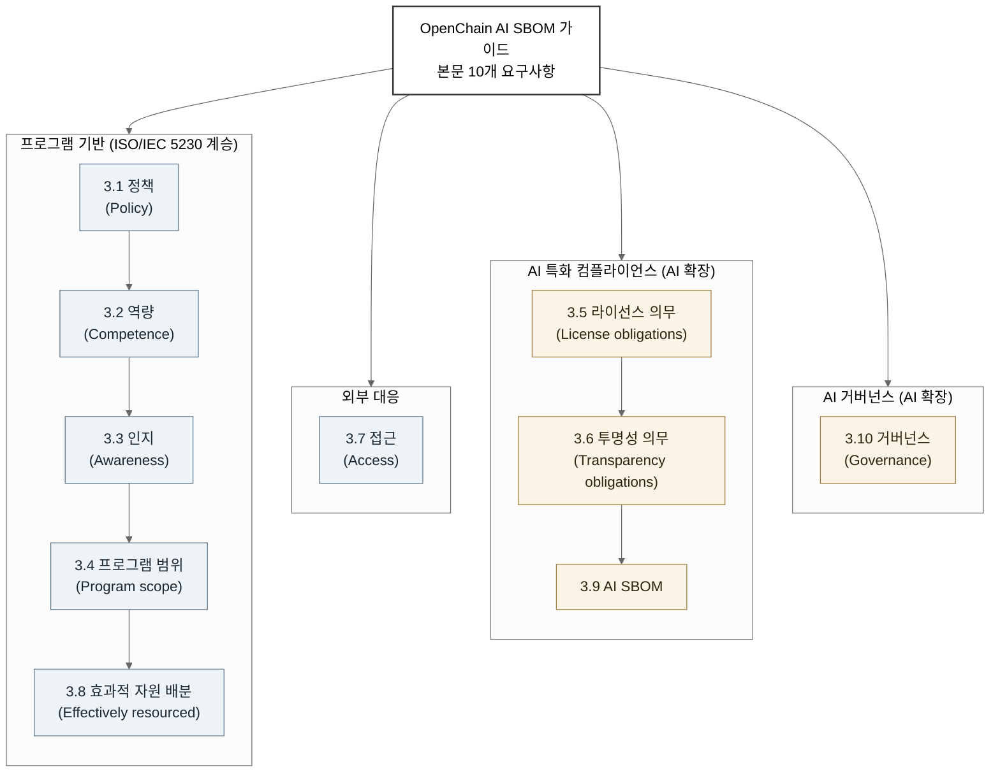

# OpenChain AI SBOM 컴플라이언스 관리 가이드: AI 공급망 컴플라이언스 프로그램의 최소 요구사항

> 리눅스 재단 산하 오픈체인 프로젝트의 AI 워크그룹이 작성한 AI SBOM 컴플라이언스 관리 가이드를 1차 출처로 분석한다. ISO/IEC 5230 방법론을 AI 공급망으로 확장해 컴플라이언스 프로그램이 갖춰야 할 최소 요구사항을 정의한 문서의 구조와 요구사항, 규제 동향, 의의와 한계를 다룬다.

---

LLMS index: [llms.txt](/llms.txt)

---

이 글은 Claude Code를 이용해 작성했고, 인용한 핵심 사실은 1차 출처로 교차 검증했습니다.

> **요약**
> 이 보고서는 리눅스 재단(Linux Foundation) 산하 오픈체인 프로젝트의 인공지능 워크그룹(OpenChain AI Work Group)이 작성한 *Artificial Intelligence System Bill of Materials — Compliance Management Guide for the Supply Chain*를 분석합니다. 이 가이드는 소프트웨어 라이선스 컴플라이언스의 국제표준 ISO/IEC 5230의 방법론을 인공지능(AI) 공급망으로 옮겨, 양질의 AI SBOM 컴플라이언스 프로그램이 갖춰야 할 핵심 요구사항을 정의합니다. AI 솔루션을 주고받는 조직 사이의 신뢰를 위한 기준점을 제시하는 것이 목적이며, 코드뿐 아니라 모델 가중치, 학습 데이터셋, 모델 트리(Model Tree)의 라이선스와 투명성 의무까지 추적 대상으로 끌어들여 전통적 SBOM 컴플라이언스를 확장합니다. AI 공급망 거버넌스를 준비하는 한국 기업과 실무자에게는 "무엇을 문서화하고 입증해야 하는가"를 묻는 점검표 역할을 합니다.

> 이 보고서가 분석한 텍스트는 깃허브(GitHub) `OpenChain-Project/AI-WG` 저장소 `/docs` 디렉토리의 작업 사본(RFC 초안)입니다. 동향 조사에서 확인된 바로, 같은 문서는 6주간의 공개 의견 수렴을 거쳐 2025년 10월 20일 OpenChain AI SBOM 컴플라이언스 가이드 Version 1으로 정식 발표되었습니다[A9](#a9). 따라서 이 보고서는 정식 Version 1이 아니라 그 이전의 초안 스냅샷을 대상으로 하며, 본문의 절 번호나 일부 표현은 정식본과 다를 수 있습니다. 인용 가능한 정식본은 OpenChain Reference-Material 저장소에 PDF와 마크다운으로 공개되어 있습니다[A9](#a9)·[A12](#a12).

## 1. 문서 개요

이 가이드는 양질의 AI SBOM 컴플라이언스 프로그램이 갖춰야 할 핵심 요구사항을 정의합니다. 발행 주체는 리눅스 재단 산하 오픈체인 프로젝트의 인공지능 워크그룹이며, 누구나 무료로 참여하는 메일링 리스트와 정기 워크숍을 통해 운영되는 개방형 작업 그룹의 산물입니다[A1](#a1)·[A2](#a2). 문서가 명시한 라이선스는 크리에이티브 커먼즈 저작자표시 4.0(Creative Commons Attribution 4.0, CC-BY-4.0)입니다[A1](#a1).

가이드의 설계 의도는 개요에 분명히 드러납니다. 프로그램의 "방법(how)"과 "시점(when)"이 아니라 "무엇(what)"과 "왜(why)"에 초점을 두어, 서로 다른 시장에서 활동하는 다양한 규모의 조직이 자신의 규모와 목표, 범위에 맞는 구체적 정책과 절차를 직접 선택하도록 유연성을 남깁니다[A1](#a1). 가이드는 오픈체인 ISO/IEC 5230에서 영감을 얻었다고 스스로 밝히며, 그 교훈을 공급망의 AI SBOM 관리라는 시장 요구에 적용했습니다. 준비 과정에서 ISO/IEC 5230:2020, ISO/IEC 42001:2023, ISO/IEC 5962:2021을 참조 표준으로 들었습니다[A1](#a1).

문서의 위상은 RFC(Request for Comments) 초안입니다. 첫머리의 고지(NOTICE)는 이것이 프로덕션 릴리스가 아니라 "관심 있는 당사자들이 아이디어를 공유하기 위한 작업 문서"이자 "살아있는 문서(living document)"라고 명시합니다[A1](#a1). 초안과 정식본의 관계는 시점으로 정리됩니다. 오픈체인 AI 워크그룹은 초안을 검토한 뒤 2025년 7월 7일 공개 의견 수렴 기간을 열었고, 2025년 8월 18일 마감해 의견을 검토했으며, 거버닝 보드(Governing Board)의 결정을 거쳐 2025년 10월 20일 Version 1을 정식 발표했습니다[A10](#a10)·[A11](#a11)·[A9](#a9). 이 보고서가 다루는 `AI-WG/docs`의 RFC.docx는 그 작업 사본이고, 외부 인용용 정식본은 Reference-Material 저장소에 별도로 공개되어 있습니다[A12](#a12). 두 텍스트의 라이선스 표기가 다른 것(작업 사본은 문서 NOTICE상 CC-BY-4.0)은 배포 단계 차이에서 비롯합니다.

## 2. 배경: 오픈체인 방법론을 AI로 확장하다

오픈체인 사양은 양질의 오픈소스 라이선스 컴플라이언스 프로그램이 갖춰야 할 요건을 정의하는 프로세스 관리 표준입니다. 2014~2016년 100여 명의 기여자가 개발해 2016년 10월 버전 1.0으로 출범했고, 2020년 4월 ISO/IEC JTC 1의 공개 사양 전환(PAS Transposition) 절차를 거쳐 같은 해 12월 ISO/IEC 5230:2020으로 국제표준이 되었습니다[A14](#a14)·[A3](#a3). 오픈체인은 같은 골격을 보안 영역으로도 확장해, 공개된 보안 취약점 점검에 초점을 둔 오픈소스 보안 보증 사양을 ISO/IEC 18974:2023으로 표준화했습니다[A13](#a13).

5230 방법론의 핵심은 요구사항을 기술하는 구조입니다. 각 요구사항은 그 요구를 충족했음을 입증하는 검증 자료(Verification Materials), 즉 산출되어야 할 기록과, 그 요구가 왜 필요한지를 설명하는 근거(Rationale)로 구성됩니다[A14](#a14). 결과물과 목적만 고정하고 구현 방식을 열어두는 이 설계가, 규모와 시장이 다른 조직이 각자에게 맞게 프로그램을 구성하도록 허용하는 비규범적(non-prescriptive) 성격의 바탕입니다. AI SBOM 가이드가 모든 절을 "검증 자료 + 근거"로 반복 구성한 것은 이 방법론을 그대로 옮긴 결과입니다.

AI 시스템에서는 추적해야 할 대상이 코드를 넘어섭니다. 모델 가중치(weights), 학습과 테스트와 검증에 쓰인 데이터셋, 그리고 한 AI 시스템이 다른 여러 AI 시스템에서 파생되는 관계를 나타내는 모델 트리까지 각자 고유한 라이선스를 가질 수 있습니다. 가이드의 라이선스 의무(3.5)와 투명성 의무(3.6)가 코드와 가중치, 데이터셋을 함께 거론하는 이유입니다. 오픈소스 컴플라이언스가 "어떤 구성요소가 어떤 라이선스로 들어왔는가"를 묻는다면, AI에서는 같은 질문을 모델과 데이터에까지 확장해야 합니다. 5230의 프로세스 중심적이고 비규정적인 철학은 이 확장에 잘 맞습니다. 규제 환경이 관할 구역마다 빠르게 갈라지는 상황에서, 구체적 절차를 못 박는 대신 "무엇을 입증해야 하는가"만 고정하면 유럽연합·미국·중국처럼 서로 다른 체제의 조직이 같은 기준점을 공유할 수 있습니다.

소프트웨어 자재 명세서(Software Bill of Materials, SBOM)는 소프트웨어를 구성하는 구성요소와 공급망 관계를 담은 공식 기록입니다. 미국에서는 2021년 5월 국가 사이버보안 개선에 관한 행정명령 14028(Executive Order 14028)이 SBOM 최소 요소 정의를 지시했고, 국가통신정보청(National Telecommunications and Information Administration, NTIA)이 2021년 7월 12일 *Minimum Elements for a Software Bill of Materials*를 발표했습니다[D4](#d4)·[D1](#d1). 전통적 SBOM은 소프트웨어 구성요소를 식별·추적하도록 설계되어, 학습 과정과 데이터, 모델의 거동을 그대로 표현하기는 어렵습니다. 가이드가 정의하는 AI SBOM은 "AI 시스템의 일부 또는 전체를 구성하는 구성요소와 그에 관한 관련 정보의 목록"으로, 모델과 데이터셋을 명시적으로 포함합니다. 같은 개념을 업계에서는 AI BOM 또는 기계학습 자재 명세서(Machine Learning Bill of Materials, ML-BOM)로도 부릅니다.

형식 측면에서 가이드는 SPDX, CycloneDX, 그 밖의 어떤 형식이든 무방하다고 열어 둡니다. SPDX(System Package Data Exchange)는 ISO/IEC 5962:2021로 국제표준화된 교환 표준으로, 2024년 4월 16일 공개된 SPDX 3.0이 AI 프로파일(AI Profile)과 데이터셋 프로파일(Dataset Profile)을 도입해 모델 유형, 하이퍼파라미터, 학습 데이터 전처리, 에너지 소비, 안전 위험 평가 같은 정보를 표현하도록 했습니다[A5](#a5)·[B6](#b6)·[B2](#b2). CycloneDX는 OWASP가 주관하는 풀스택 BOM 표준으로, 버전 1.5에서 ML-BOM을 도입해 데이터셋과 모델, 구성과 학습 데이터 출처, 윤리적 고려사항, 편향, 모델 보안 위험을 문서화하도록 했습니다[B5](#b5). 두 포맷은 표현 모델이 다르지만 모델과 데이터셋을 1급 구성요소로 다뤄 같은 문제를 겨냥합니다.

가이드 각주가 ISO/IEC 42001:2023을 반복 참조하는 것도 짚어 둘 부분입니다. 42001은 AI 경영시스템(AI Management System, AIMS)을 수립·운영·개선하기 위한 요구사항을 규정한 최초의 AI 경영시스템 국제표준으로, 부속서 B(Annex B)가 통제를 AI 수명주기 단계별로 구현하는 방법을 설명합니다[A4](#a4). 오픈체인 방법론이 "무엇을 입증해야 하는가"를 정의한다면, 42001 Annex B는 "그 입증을 위해 무엇을 문서화하고 운영해야 하는가"에 대한 구체적 통제 항목을 제공합니다. 가이드는 42001을 대체하지 않고, 역량, 인지, 자원, 거버넌스, SBOM 절의 근거로 Annex B의 특정 절(B.2.2, B.3, B.4.2, B.4.6, B.5.3, B.6.2, B.8.5, B.9.3 등)과 본문 7.3을 호출합니다[A4](#a4).

## 3. 가이드의 구조와 요구사항

가이드 본문(3장 Guidance)은 열 개의 요구사항 절로 이뤄집니다. 모든 절이 5230 방식대로 요구사항 진술, 검증 자료, 근거의 세 부분을 반복합니다. 각주가 명시하듯 명세서라면 "Requirements"라 부를 자리를 이 문서는 "Guidance(지침)"로 부르는데, 항목들이 규범적 강제가 아니라 권고임을 분명히 하기 위해서입니다[A1](#a1).

요구사항을 의미별로 묶으면 두 계열로 나뉩니다. 하나는 ISO/IEC 5230에서 그대로 물려받은 프로그램 거버넌스 골격(정책, 역량, 인지, 범위, 자원, 접근)이고, 다른 하나는 AI 때문에 새로 확장된 영역(라이선스 의무, 투명성 의무, AI SBOM, AI 거버넌스)입니다. 그림 1이 이 군집 구조를 보여줍니다.

**그림 1.** OpenChain AI SBOM 가이드의 요구사항 군집 구조 *(OpenChain AI SBOM Compliance Guide 본문 3.1~3.10 기준, 작성일 2026-06-12)*

각 요구사항의 핵심은 표 1과 같습니다. 표의 "강제 수준"은 가이드 본문이 쓴 RFC 2119 키워드(shall, should 등)를 옮긴 것으로, 정의는 가이드 2장이 IETF RFC 2119에서 가져왔습니다[A1](#a1)·[A6](#a6).

**표 1.** 가이드 본문 10개 요구사항 요약 *(OpenChain AI SBOM Compliance Guide 본문 3.1~3.10 기준, 2026-06-12)*

| 절 | 요구사항 | 핵심 요지 | 강제 수준 |
|---|---|---|---|
| 3.1 | 정책(Policy) | AI SBOM 컴플라이언스를 규율하는 성문 정책이 존재하고 내부에 전달되어야 하며, 사업 전략·관할 구역 법적 요구·위험 수준을 반영 | shall |
| 3.2 | 역량(Competence) | 거버넌스·보안·안전·프라이버시·개발·공급자 관리 기능에 필요한 역량을 역할별로 식별하고 증거를 보존 | shall / must |
| 3.3 | 인지(Awareness) | 참여자가 정책·사업 목표·자신의 기여·부적합 영향을 인지하도록 보장 | shall |
| 3.4 | 프로그램 범위(Program scope) | 프로그램의 적용 범위와 한계를 성문으로 선언(제품 라인·부서·조직 전체 등) | (선언 요구) |
| 3.5 | 라이선스 의무(License obligations) | 코드·가중치·데이터셋·AI 시스템 자체의 라이선스를 검토해 의무·제한·권리를 판단하는 절차 존재. 모델 트리의 개별 라이선스 유의 | shall |
| 3.6 | 투명성 의무(Transparency obligations) | 규제가 부과하는 투명성 의무(예: 다운스트림 공개 의무)를 검토하는 절차 존재, 위험 완화 조치 | shall / should |
| 3.7 | 접근(Access) | 제3자가 AI SBOM 컴플라이언스 문의를 할 공개 수단을 명시하고 내부 대응 절차 유지 | (절차 요구) |
| 3.8 | 효과적 자원 배분(Effectively resourced) | 프로그램 과제에 책임·시간·재원을 배정, 법률 전문성 접근, 부적합 시정 절차 | (자원 요구) |
| 3.9 | AI SBOM | AI SBOM을 생성·관리하는 절차 존재. 형식은 SPDX·CycloneDX 등 무방, 인바운드 자재 반영 | shall |
| 3.10 | 거버넌스(Governance) | AI 거버넌스 프레임워크·정책·관행을 갖추고, 신흥 AI 법령(EU 인공지능법·히로시마 AI 프로세스·중국 이니셔티브) 준수와 수명주기 모니터링 | shall |

라이선스 의무(3.5) 절은 AI 확장의 성격을 가장 잘 드러냅니다. 검토 대상에 코드뿐 아니라 가중치와 학습·테스트·검증 데이터셋, 그리고 AI 시스템 자체의 라이선스가 모두 들어가고, 모델 트리상에서 상류와 하류에 걸린 의무, 제한, 권리를 검토하고 문서화하라고 요구합니다[A1](#a1). 이 절은 5230:2020 Section 3.3.2를 근거로 명시하고, 42001 Annex B.2.2를 예시로 참조합니다. AI SBOM(3.9) 절은 형식을 SPDX나 CycloneDX 등으로 열어두되 인바운드 자재(제3자에게서 유입되는 모델과 데이터셋 등)를 반영할 것을 shall 수준으로 요구합니다[A1](#a1)·[B2](#b2). 거버넌스(3.10) 절은 EU 인공지능법(EU AI Act), 히로시마 AI 프로세스(Hiroshima AI Process), 중국 글로벌 AI 거버넌스 이니셔티브(Global AI Governance Initiative)를 신흥 규제의 예로 직접 거명하며, 윤리적 고려와 위험 관리, 투명성과 함께 AI 시스템 수명주기 모니터링 능력을 다룹니다[A1](#a1).

## 4. 규제·거버넌스 동향

가이드 거버넌스 절이 거명한 세 축은 조사 기준일(2026-06-12)을 전후로 모두 의미 있는 진전이 있었습니다. 무엇보다 가이드 자체가 2025년 10월 20일 Version 1으로 발표되었습니다[A9](#a9).

EU 인공지능법(Regulation (EU) 2024/1689)이 첫 번째 축입니다. 단계적으로 적용되며, 조사 기준일 현재 일부 조항만 시행되었습니다. 표 2가 적용 일정을 정리합니다.

**표 2.** EU 인공지능법 단계적 적용 일정 *(출처: Regulation (EU) 2024/1689 Article 113 / EUR-Lex, European Commission, 접속: 2026-06-12)*

| 적용일 | 적용 대상 | 기준일 현재 상태 |
|---|---|---|
| 2025-02-02 | 금지된 AI 관행(Chapter II), AI 리터러시(Chapter I) | 시행됨 [C1](#c1)·[C6](#c6) |
| 2025-08-02 | 범용 AI 모델(GPAI) 의무, 거버넌스, 벌칙 조항 | 시행됨 [C1](#c1)·[C6](#c6) |
| 2026-08-02 | 일반 적용일. Annex III 고위험 의무, 투명성 의무, GPAI 집행 권한 | 미시행(약 2개월 후) [C1](#c1)·[C6](#c6) |
| 2027-08-02 | Article 6(1) 고위험 분류, 기존 GPAI 모델 준수 마감 | 미시행 [C1](#c1) |

범용 AI 모델(General-Purpose AI, GPAI) 제공자 의무는 2025년 8월 2일부터 적용되기 시작했으나, 집행위원회(European Commission)가 과징금을 포함한 집행 권한을 실제로 행사할 수 있는 시점은 2026년 8월 2일입니다[C1](#c1)·[C6](#c6). 같은 날 부속서 III 고위험 AI 시스템 의무와 투명성 의무도 적용됩니다. 가이드 3.6절이 "규제로부터 부과되는 투명성 의무"를 검토하라고 요구하는 배경에 이 2026년 8월 적용일이 있습니다. AI SBOM과의 접점은 인공지능법 Article 11과 부속서 IV가 요구하는 기술 문서화로, 2026년 8월부터 적용되는 이 요구사항이 AI BOM을 선택적 보안 산출물에서 사실상의 조달 요건으로 밀어 올리는 동력으로 거론됩니다[C1](#c1).

두 번째 축인 히로시마 AI 프로세스는 2023년 일본의 G7 의장국 시기에 시작되어 첨단 AI 개발 조직을 위한 국제 행동강령(International Code of Conduct)을 산출했고, 이행 점검 수단으로 경제협력개발기구(OECD)가 보고 프레임워크(HAIP Reporting Framework)를 운영합니다[C4](#c4). 2025년 2월 7일 1.0이 출범했고, 2026년 5월 28일 파리 G7 디지털·기술 장관회의 계기에 OECD가 보고 프레임워크 2.0을 발표했습니다[C4](#c4)·[C7](#c7). 2.0은 중소기업 참여를 넓히기 위해 절차를 간소화하고 모델 개발자, 애플리케이션 개발자, 배포자를 구분하는 역할 기반 구조를 도입했으며, 50개 이상의 조직이 새 프레임워크로 보고하겠다고 표명했습니다(차기 분석 리뷰 제출 마감 2026-09-01)[C7](#c7). 가이드가 말한 "히로시마 AI 프로세스 준수"는 이 자발적 보고 프레임워크 참여를 가리킵니다.

세 번째 축인 중국 글로벌 AI 거버넌스 이니셔티브는 2023년 10월 베이징의 일대일로 국제협력 정상포럼 계기에 발표된 정책 선언입니다. EU 인공지능법이나 히로시마 프로세스와 달리 구체적 보고 양식이나 컴플라이언스 산출물을 정의하지 않아, AI SBOM 관점에서 직접 대응되는 의무 항목은 현재 없습니다. 가이드는 이를 신흥 AI 규제의 한 사례로 병렬 언급하는 수준입니다.

형식 표준도 움직였습니다. SPDX는 2024년 4월 SPDX 3.0으로 AI·데이터셋 프로파일을 도입했고, CycloneDX는 2023년 6월 v1.5에서 ML-BOM을 도입한 뒤 2025년 10월 v1.7(ECMA-424 2판)을 1.x 계열의 마지막 릴리스로 냈습니다[B6](#b6)·[B5](#b5). 생성 도구도 등장했습니다. OWASP는 2025년 AIBOM 생성기(OWASP AIBOM Generator)를 공개해 허깅페이스(Hugging Face) 모델에서 CycloneDX 형식의 AI SBOM을 자동 생성하고 완전성 점수를 매기며[B7](#b7), CycloneDX의 cdxgen도 AI BOM 전용 모드를 지원합니다[B8](#b8). 다만 이들은 모델 카드에 적힌 라이선스를 옮겨 담을 뿐, 그 정확성까지 보장하지는 못해, OWASP AIBOM 프로젝트는 SPDX·CycloneDX가 AI 고유 사용 사례를 충분히 다루지 못하는 공백을 함께 평가하고 있습니다[E6](#e6).

## 5. 의의와 한계

이 가이드의 가치는 "AI 공급망 컴플라이언스 프로그램이 갖춰야 할 최소 요구사항"을 ISO 국제표준으로 검증된 방법론 위에 명시했다는 점에 있습니다. 검증 자료와 근거를 모든 절에 붙이는 5230식 구조 덕분에, 조직은 각 요구사항을 자체 점검표로 바꿔 "우리에게 이 산출물이 있는가"를 직접 확인할 수 있습니다. 형식을 SPDX·CycloneDX 등으로 열어두고 절차의 구체를 조직에 위임한 비규범적 설계는, 규제가 관할 구역마다 갈라지는 환경에서 공통 기준점을 제공하는 실용적 선택입니다.

한계도 분명합니다. 가이드가 요구하는 라이선스와 투명성 추적이 현실에서 어렵다는 점입니다. 모델이 다운스트림으로 전파되며 의무가 탈락하는 라이선스 드리프트(license drift)를 정량화한 한 연구는, 모델에서 애플리케이션으로 넘어가는 전이의 약 35.5%가 제한 조항을 잃고 허용 라이선스로 재지정되며, 머신러닝 고유의 의무는 다운스트림 통합 이후 0.4%만 보존된다고 보고합니다[E4](#e4). 책임 있는 AI 라이선스(Responsible AI License, RAIL) 계열과 Llama 커뮤니티 라이선스는 행동 사용 제한(behavioral use clause)을 담아 오픈소스 이니셔티브(Open Source Initiative, OSI)의 오픈소스 정의를 충족하지 못하며, 이런 비표준 라이선스의 준수 여부를 추적할 도구가 아직 부족합니다[E8](#e8)·[E5](#e5). 가이드 3.5절이 코드를 넘어 가중치·데이터셋 라이선스까지 검토하도록 요구한 것은 이 현실을 반영한 설계입니다. AI SBOM을 자동으로 생성하는 도구는 이미 여럿 나왔지만, 생성된 명세서의 라이선스가 정확한지, 비표준 라이선스의 사용 제한을 지키는지 검증하는 일은 아직 사람과 정책의 몫입니다. 2026년 현재 요구와 실행 가능성 사이에 남은 것은 생성의 간극이 아니라 검증의 간극입니다.

가이드가 스스로를 살아있는 문서로 규정하고 Version 1이라는 번호로 후속 개정을 전제한 점도 한계이자 특징입니다. 규제와 형식 표준이 빠르게 바뀌는 영역인 만큼 가이드 역시 고정된 명세가 아니며, 조사 기준일 현재 차기 개정 일정은 공개되지 않았습니다.

## 6. 프로세스 요구와 데이터 항목 요구

이 가이드가 정의하는 것은 컴플라이언스의 프로세스 층위입니다. 정책이 존재하는가, 역량과 자원이 배정되어 있는가, AI SBOM을 생성하고 관리하는 절차가 있는가처럼 프로그램이 갖춰야 할 최소 요구사항에 초점을 둡니다. 이와 구별되는 또 다른 층위가 데이터 항목입니다. EU 인공지능법 Article 11과 부속서 IV가 요구하는 기술 문서처럼, 규제가 실제로 어떤 항목을 AI BOM에 담으라고 요구하는가는 별도의 매핑 작업으로 풀어야 합니다[C1](#c1). 가이드 3.5절(라이선스 의무), 3.6절(투명성 의무), 3.9절(AI SBOM)이 추상적으로 요구하는 절차에 규제 조문별 기재 항목을 결합해야, 프로세스 요구와 데이터 항목 요구가 한 체계로 이어집니다.

---

## 참고문헌

본문에서 인용한 출처만 03-references.md의 통합 라벨 체계에 맞춰 단락 형식으로 정리합니다. 전체 출처 목록과 자동 확인 메모는 같은 폴더의 03-references.md를 참조하십시오.

### A. 원본 및 OpenChain·표준

**A1.** OpenChain Project AI Work Group (2024). *Artificial Intelligence System Bill of Materials — Compliance Management Guide for the Supply Chain* (RFC Draft, 문서 NOTICE상 CC-BY-4.0). GitHub `OpenChain-Project/AI-WG`, `/docs` 디렉토리. <https://github.com/OpenChain-Project/AI-WG/tree/main/docs> (접속: 2026-06-12). — 본 보고서의 원본 문서. <a href="#a1-ref-1" onclick="event.preventDefault(); history.back(); return false;" title="본문으로 돌아가기">↩</a>

**A2.** OpenChain Project AI Work Group. *AI-WG 저장소(워크그룹 홈)*. <https://github.com/OpenChain-Project/AI-WG> (접속: 2026-06-12). — 가이드의 발행 맥락과 워크그룹 운영 근거. <a href="#a2-ref-1" onclick="event.preventDefault(); history.back(); return false;" title="본문으로 돌아가기">↩</a>

**A3.** ISO/IEC (2020). *ISO/IEC 5230:2020 — Information technology — OpenChain Specification*. <https://www.iso.org/standard/81039.html> (접속: 2026-06-12, 자동 확인 제한: iso.org 봇 차단). — 가이드가 영감을 얻은 모체 표준. 3.5 라이선스 의무 절의 Section 3.3.2 참조 기반. <a href="#a3-ref-1" onclick="event.preventDefault(); history.back(); return false;" title="본문으로 돌아가기">↩</a>

**A4.** ISO/IEC (2023). *ISO/IEC 42001:2023 — Information technology — Artificial intelligence — Management system*. <https://www.iso.org/standard/81230.html> (접속: 2026-06-12, 자동 확인 제한: iso.org 봇 차단). — 가이드 각주가 반복 참조하는 표준(Annex B, Section 7.3). <a href="#a4-ref-1" onclick="event.preventDefault(); history.back(); return false;" title="본문으로 돌아가기">↩</a>

**A5.** ISO/IEC (2021). *ISO/IEC 5962:2021 — Information technology — SPDX Specification V2.2.1*. <https://www.iso.org/standard/81870.html> (접속: 2026-06-12, 자동 확인 제한: iso.org 봇 차단). — 개요에서 직접 참조한 SBOM 형식 표준. <a href="#a5-ref-1" onclick="event.preventDefault(); history.back(); return false;" title="본문으로 돌아가기">↩</a>

**A6.** Bradner, S. (1997). *RFC 2119 — Key words for use in RFCs to Indicate Requirement Levels*. IETF, BCP 14. <https://www.ietf.org/rfc/rfc2119.txt> (접속: 2026-06-12). — 2장 용어·정의의 MUST/SHOULD/MAY 해석 출처. <a href="#a6-ref-1" onclick="event.preventDefault(); history.back(); return false;" title="본문으로 돌아가기">↩</a>

**A9.** OpenChain Project (2025-10-20). *Welcoming the OpenChain AI System Bill of Materials Compliance Guide*. <https://openchainproject.org/news/2025/10/20/welcoming-the-openchain-ai-system-bill-of-materials-compliance-guide> (접속: 2026-06-12). — Version 1 정식 발표일(2025-10-20), 문서 성격(참조 가이드), 배포 형식(PDF·마크다운)의 1차 근거. <a href="#a9-ref-1" onclick="event.preventDefault(); history.back(); return false;" title="본문으로 돌아가기">↩</a>

**A10.** OpenChain Project (2025-07-07). *Public Comment Period Announced: Artificial Intelligence System Bill of Materials – Compliance Management Guide for the Supply Chain*. <https://openchainproject.org/news/2025/07/07/public-comments-ai-system-bill-of-materials> (접속: 2026-06-12). — 6주 공개 의견 수렴 개시(2025-07-07)·마감(2025-08-18) 1차 확인. <a href="#a10-ref-1" onclick="event.preventDefault(); history.back(); return false;" title="본문으로 돌아가기">↩</a>

**A11.** OpenChain Project (2025-08-20). *Review of Public Comments and Next Steps: Artificial Intelligence System Bill of Materials – Compliance Management Guide for the Supply Chain*. <https://openchainproject.org/news/2025/08/20/ai-bom-next-steps> (접속: 2026-06-12). — 의견 검토 결과와 거버닝 보드의 발표 결정 과정. <a href="#a11-ref-1" onclick="event.preventDefault(); history.back(); return false;" title="본문으로 돌아가기">↩</a>

**A12.** OpenChain Project. *Reference-Material 저장소 — AI-SBOM-Compliance/en (정식본 배포 위치)*. <https://github.com/OpenChain-Project/Reference-Material/tree/master/AI-SBOM-Compliance/en> (접속: 2026-06-12). — 인용 가능한 정식 발표본의 실제 배포 위치. <a href="#a12-ref-1" onclick="event.preventDefault(); history.back(); return false;" title="본문으로 돌아가기">↩</a>

**A13.** OpenChain Project (2023-12-19). *OpenChain Welcomes ISO/IEC 18974:2023, The International Standard For Open Source Security Assurance*. <https://openchainproject.org/news/2023/12/19/openchain-welcomes-iso-iec-18974> (접속: 2026-06-12). 표준 원문: <https://www.iso.org/standard/86450.html>. — OpenChain의 보안 영역 확장(ISO/IEC 18974:2023) 근거. <a href="#a13-ref-1" onclick="event.preventDefault(); history.back(); return false;" title="본문으로 돌아가기">↩</a>

**A14.** OpenChain Project (2020). *OpenChain ISO/IEC 5230:2020 Specification (en)*. GitHub License-Compliance-Specification. <https://github.com/OpenChain-Project/License-Compliance-Specification/blob/master/Official/en/ISO-5230-2020/ISO-5230-2020.md> (접속: 2026-06-12). — "검증 자료 + 근거" 구조와 "무엇·왜에 집중, 어떻게·언제는 비규정" 진술의 1차 근거. <a href="#a14-ref-1" onclick="event.preventDefault(); history.back(); return false;" title="본문으로 돌아가기">↩</a>

### B. AI BOM 포맷

**B2.** SPDX Project. *SPDX 3.0.1 Specification — AI Profile*. <https://spdx.github.io/spdx-spec/v3.0.1/model/AI/AI/> (접속: 2026-06-12). — AI SBOM에 들어가는 구체 데이터 요소의 1차 규격. <a href="#b2-ref-1" onclick="event.preventDefault(); history.back(); return false;" title="본문으로 돌아가기">↩</a>

**B5.** CycloneDX. *Capabilities — Machine Learning Bill of Materials (ML-BOM)*. <https://cyclonedx.org/capabilities/mlbom/> (접속: 2026-06-12). — ML-BOM 규격. v1.5(2023-06) 도입부터 v1.7(2025-10, ECMA-424 2판)까지의 이력. <a href="#b5-ref-1" onclick="event.preventDefault(); history.back(); return false;" title="본문으로 돌아가기">↩</a>

**B6.** The Linux Foundation (2024-04-16). *SPDX 3.0 Revolutionizes Software Management in Systems with Enhanced Functionality and Streamlined Use Cases* (보도자료, Seattle). <https://www.linuxfoundation.org/press/spdx-3-revolutionizes-software-management-in-systems-with-enhanced-functionality-and-streamlined-use-cases> (접속: 2026-06-12). — SPDX 3.0 발표일(2024-04-16)과 AI 프로파일 신규 사용 사례의 1차 근거. <a href="#b6-ref-1" onclick="event.preventDefault(); history.back(); return false;" title="본문으로 돌아가기">↩</a>

**B7.** OWASP Gen AI Security Project. *OWASP AIBOM Generator*. <https://genai.owasp.org/resource/owasp-aibom-generator/> (접속: 2026-06-12). — 허깅페이스 모델에서 CycloneDX 형식 AI SBOM을 자동 생성하고 완전성 점수를 매기는 공개 도구의 1차 근거. <a href="#b7-ref-1" onclick="event.preventDefault(); history.back(); return false;" title="본문으로 돌아가기">↩</a>

**B8.** cdxgen Project (OWASP CycloneDX). *AI/ML-BOM generation (AI_BOM.md)*. GitHub `cdxgen/cdxgen`. <https://github.com/cdxgen/cdxgen/blob/master/docs/AI_BOM.md> (접속: 2026-06-12). — cdxgen의 AI BOM 전용 모드(허깅페이스 URL·Modelfile·GGUF 입력) 사용법의 1차 근거. <a href="#b8-ref-1" onclick="event.preventDefault(); history.back(); return false;" title="본문으로 돌아가기">↩</a>

### C. 규제·거버넌스

**C1.** European Parliament and Council (2024). *Regulation (EU) 2024/1689 — Artificial Intelligence Act*. Official Journal of the EU, 2024/1689, 13.6.2024(관보 게재 2024-07-12, 발효 2024-08-01). <https://eur-lex.europa.eu/eli/reg/2024/1689/oj> (접속: 2026-06-12). — 3.10 거버넌스 절이 명시한 EU AI Act 원문. Article 113의 단계적 적용일·투명성·위험관리 의무의 1차 규제 근거. <a href="#c1-ref-1" onclick="event.preventDefault(); history.back(); return false;" title="본문으로 돌아가기">↩</a>

**C4.** OECD. *Hiroshima AI Process (HAIP) Reporting Framework (transparency.oecd.org)*. <https://transparency.oecd.org/> (접속: 2026-06-12, 자동 확인 제한: 연결 거부/봇 차단). — HAIP 기업 보고 프레임워크의 제출 플랫폼. 1.0 단계 근거. <a href="#c4-ref-1" onclick="event.preventDefault(); history.back(); return false;" title="본문으로 돌아가기">↩</a>

**C6.** European Commission. *AI Act | Shaping Europe's digital future (Regulatory framework for AI)*. <https://digital-strategy.ec.europa.eu/en/policies/regulatory-framework-ai> (접속: 2026-06-12). — GPAI 의무가 2025-08-02부터 적용됨을 1차 확인. EUR-Lex 원문(C1)과 함께 적용일·의무 범위 교차 근거. <a href="#c6-ref-1" onclick="event.preventDefault(); history.back(); return false;" title="본문으로 돌아가기">↩</a>

**C7.** OECD.AI (2026-05-28). *OECD launches Hiroshima AI Process Reporting Framework 2.0*. <https://oecd.ai/en/haip-2-launch> (접속: 2026-06-12). 보도자료: <https://www.oecd.org/en/about/news/press-releases/2026/05/oecd-launches-streamlined-hiroshima-ai-process-reporting-framework-to-help-small-and-medium-sized-enterprises-participate.html> (자동 확인 제한: oecd.org 봇 차단). — HAIP 보고 프레임워크 2.0 출범일(2026-05-28, 파리 G7 디지털·기술 장관회의), 중소기업 초점, 역할 기반 구조, 50개 이상 조직 참여, 차기 리뷰 마감(2026-09-01) 근거. <a href="#c7-ref-1" onclick="event.preventDefault(); history.back(); return false;" title="본문으로 돌아가기">↩</a>

### D. SBOM 정책 배경

**D1.** NTIA, U.S. Department of Commerce (2021). *The Minimum Elements For a Software Bill of Materials (SBOM)* (행정명령 14028 §10(j) 이행, 2021-07-12). <https://www.ntia.gov/files/ntia/publications/sbom_minimum_elements_report.pdf> (접속: 2026-06-12, 자동 확인 제한: .gov 봇 차단). — AI SBOM의 모태인 SBOM 최소 요소 정책 기준. <a href="#d1-ref-1" onclick="event.preventDefault(); history.back(); return false;" title="본문으로 돌아가기">↩</a>

**D4.** NIST. *Software Security in Supply Chains: Software Bill of Materials (SBOM) — Executive Order 14028*. Information Technology Laboratory. <https://www.nist.gov/itl/executive-order-14028-improving-nations-cybersecurity/software-security-supply-chains-software-1> (접속: 2026-06-12). — 행정명령 14028의 SBOM 정의를 담고 SPDX·CycloneDX·SWID 준수와 NTIA 최소 요소 충족을 권고하는 NIST 1차 페이지. <a href="#d4-ref-1" onclick="event.preventDefault(); history.back(); return false;" title="본문으로 돌아가기">↩</a>

### E. 보조(학술·업계)

**E4.** Jewitt, J., Li, H., Adams, B., Rajbahadur, G. K., Hassan, A. E. (2025). *From Hugging Face to GitHub: Tracing License Drift in the Open-Source AI Ecosystem*. arXiv:2509.09873. <https://arxiv.org/abs/2509.09873> (접속: 2026-06-12). — 라이선스 드리프트를 정량화한 학술 근거(모델에서 애플리케이션으로의 전이에서 제한 조항 35.5% 상실, ML 고유 의무 0.4% 보존). <a href="#e4-ref-1" onclick="event.preventDefault(); history.back(); return false;" title="본문으로 돌아가기">↩</a>

**E5.** arXiv (2025). *New Tools are Needed for Tracking Adherence to AI Model Behavioral Use Clauses*. arXiv:2505.22287. <https://arxiv.org/abs/2505.22287> (접속: 2026-06-12). — RAIL/OpenRAIL·Llama 커뮤니티 라이선스의 행동 사용 제한 준수를 추적할 도구가 부족하다는 지적. <a href="#e5-ref-1" onclick="event.preventDefault(); history.back(); return false;" title="본문으로 돌아가기">↩</a>

**E6.** Jin, S. et al. (2025). *Building an Open AIBOM Standard in the Wild*. arXiv:2510.07070 (ICSE 2026 SEIP 채택). <https://arxiv.org/abs/2510.07070> (접속: 2026-06-12). — OWASP AIBOM 프로젝트의 표준화 접근과 AI 데이터셋·학습 산출물 표현 공백 논의. <a href="#e6-ref-1" onclick="event.preventDefault(); history.back(); return false;" title="본문으로 돌아가기">↩</a>

**E8.** JUN Legal (2025-03-18). *Responsible AI Licenses (RAIL)*. <https://jun.legal/en/2025/03/18/responsible-ai-licenses-rail-verantwortungsvolle-ki-nutzung-durch-lizenzierung/> (접속: 2026-06-12). — RAIL/OpenRAIL과 Llama 커뮤니티 라이선스가 행동 사용 제한 때문에 OSI 오픈소스 정의를 충족하지 못한다는 업계·법무 해설. <a href="#e8-ref-1" onclick="event.preventDefault(); history.back(); return false;" title="본문으로 돌아가기">↩</a>
